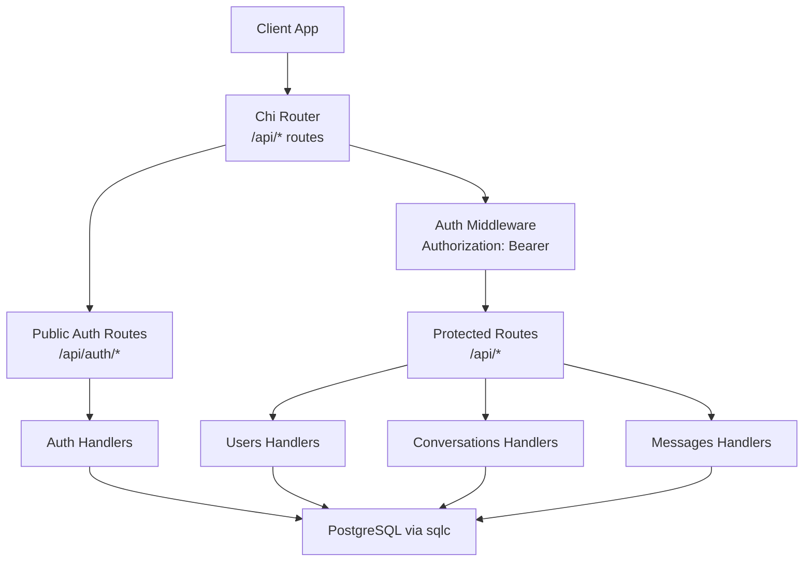
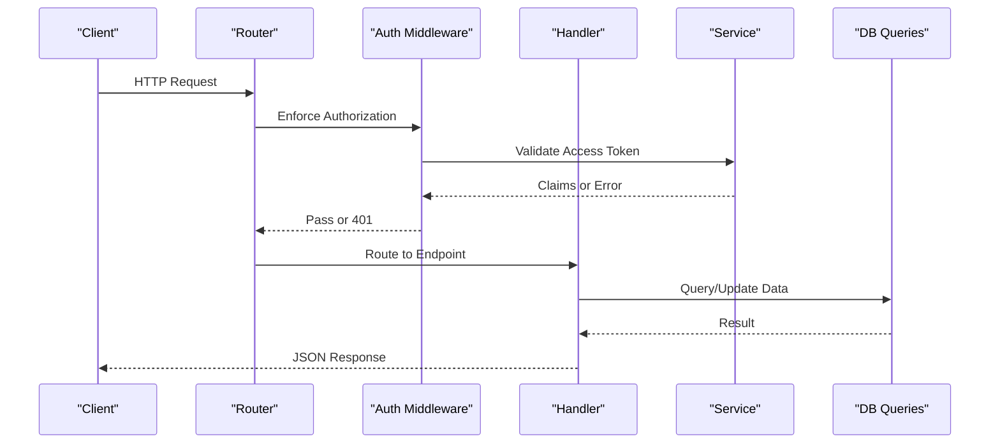
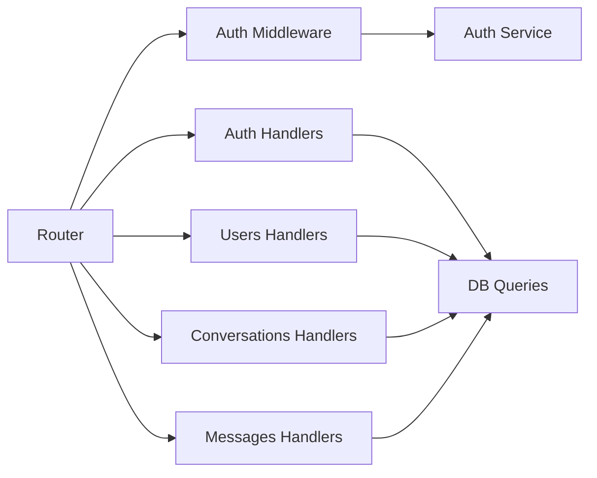
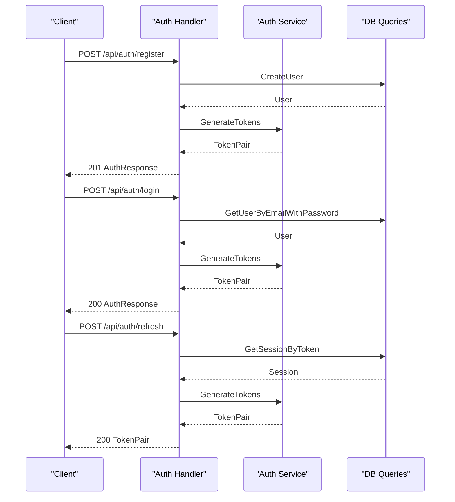
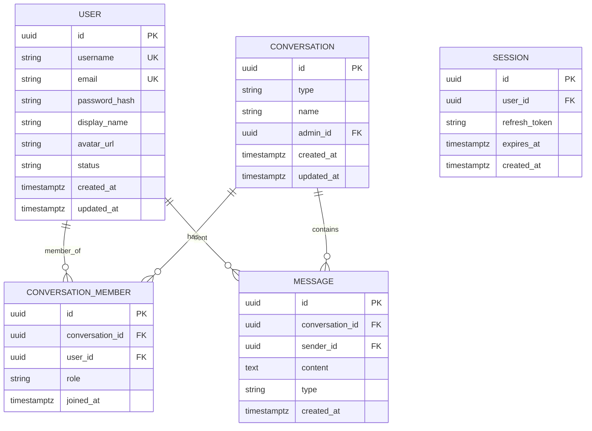

# API Reference

<cite>
**Referenced Files in This Document**
- [main.go](file://backend/cmd/server/main.go)
- [auth_handler.go](file://backend/internal/auth/handler.go)
- [auth_service.go](file://backend/internal/auth/service.go)
- [users_handler.go](file://backend/internal/users/handler.go)
- [conversations_handler.go](file://backend/internal/conversations/handler.go)
- [messages_handler.go](file://backend/internal/messages/handler.go)
- [auth_middleware.go](file://backend/internal/middleware/auth.go)
- [config.go](file://backend/internal/config/config.go)
- [models.go](file://backend/internal/database/models.go)
- [001_users.sql](file://backend/sql/schema/001_users.sql)
- [002_conversations.sql](file://backend/sql/schema/002_conversations.sql)
- [003_messages.sql](file://backend/sql/schema/003_messages.sql)
- [api.ts](file://frontend/src/lib/api.ts)
- [auth.ts](file://frontend/src/lib/auth.ts)
- [index.ts](file://frontend/src/types/index.ts)
</cite>

## Table of Contents
1. [Introduction](#introduction)
2. [Project Structure](#project-structure)
3. [Core Components](#core-components)
4. [Architecture Overview](#architecture-overview)
5. [Detailed Component Analysis](#detailed-component-analysis)
6. [Dependency Analysis](#dependency-analysis)
7. [Performance Considerations](#performance-considerations)
8. [Troubleshooting Guide](#troubleshooting-guide)
9. [Conclusion](#conclusion)
10. [Appendices](#appendices)

## Introduction
This document provides a comprehensive API reference for the Go-Chatsync REST endpoints. It covers HTTP methods, URL patterns, request/response schemas, authentication requirements, validation rules, error responses, and practical examples for clients. It also documents CORS, security, rate limiting posture, API versioning, backward compatibility, deprecation policy, common use cases, integration patterns, and performance optimization tips.

## Project Structure
The API is implemented in Go with Chi router, JWT-based authentication, and PostgreSQL persistence. The frontend demonstrates client usage patterns and token storage.

**Diagram sources**
- [main.go:57-114](file://backend/cmd/server/main.go#L57-L114)
- [auth_middleware.go:18-44](file://backend/internal/middleware/auth.go#L18-L44)

**Section sources**
- [main.go:57-114](file://backend/cmd/server/main.go#L57-L114)

## Core Components
- Authentication service: generates and validates JWT access tokens and manages refresh tokens.
- Handlers: implement REST endpoints for auth, users, conversations, and messages.
- Middleware: enforces Authorization header and injects user context.
- Database models: typed models generated by sqlc for users, conversations, messages, sessions, and related entities.

**Section sources**
- [auth_service.go:11-35](file://backend/internal/auth/service.go#L11-L35)
- [auth_handler.go:15-56](file://backend/internal/auth/handler.go#L15-L56)
- [users_handler.go:12-18](file://backend/internal/users/handler.go#L12-L18)
- [conversations_handler.go:13-19](file://backend/internal/conversations/handler.go#L13-L19)
- [messages_handler.go:13-19](file://backend/internal/messages/handler.go#L13-L19)
- [auth_middleware.go:18-44](file://backend/internal/middleware/auth.go#L18-L44)
- [models.go:24-100](file://backend/internal/database/models.go#L24-L100)

## Architecture Overview
The server exposes REST endpoints under /api and a WebSocket endpoint for real-time messaging. CORS is configured broadly to support development and common SPA setups.

**Diagram sources**
- [main.go:57-114](file://backend/cmd/server/main.go#L57-L114)
- [auth_middleware.go:18-44](file://backend/internal/middleware/auth.go#L18-L44)
- [auth_service.go:75-93](file://backend/internal/auth/service.go#L75-L93)

## Detailed Component Analysis

### Authentication Endpoints
- Base Path: /api/auth
- Authentication: Not required for registration and login; required for logout and profile retrieval.

#### POST /api/auth/register
- Description: Registers a new user account.
- Authentication: None
- Request JSON:
  - username: string (required)
  - email: string (required)
  - password: string (min length 6)
- Response JSON:
  - user: UserResponse
  - token: TokenPair
- Success: 201 Created
- Errors:
  - 400 Bad Request: invalid JSON, missing fields, short password
  - 409 Conflict: email or username already exists
  - 500 Internal Server Error: server failure during creation
- Example curl:
  - curl -X POST "$BASE/api/auth/register" -H "Content-Type: application/json" -d '{"username":"alice","email":"alice@example.com","password":"pass"}'

**Section sources**
- [main.go:80-85](file://backend/cmd/server/main.go#L80-L85)
- [auth_handler.go:58-139](file://backend/internal/auth/handler.go#L58-L139)

#### POST /api/auth/login
- Description: Logs in an existing user.
- Authentication: None
- Request JSON:
  - email: string (required)
  - password: string (required)
- Response JSON:
  - user: UserResponse
  - token: TokenPair
- Success: 200 OK
- Errors:
  - 400 Bad Request: invalid JSON, missing fields
  - 401 Unauthorized: invalid credentials
  - 500 Internal Server Error: server failure
- Example curl:
  - curl -X POST "$BASE/api/auth/login" -H "Content-Type: application/json" -d '{"email":"alice@example.com","password":"pass"}'

**Section sources**
- [main.go:80-85](file://backend/cmd/server/main.go#L80-L85)
- [auth_handler.go:141-194](file://backend/internal/auth/handler.go#L141-L194)

#### POST /api/auth/refresh
- Description: Issues a new access token using a valid refresh token.
- Authentication: None
- Request JSON:
  - refresh_token: string (required)
- Response JSON:
  - token: TokenPair
- Success: 200 OK
- Errors:
  - 400 Bad Request: missing refresh token
  - 401 Unauthorized: invalid or expired refresh token
  - 500 Internal Server Error: server failure
- Example curl:
  - curl -X POST "$BASE/api/auth/refresh" -H "Content-Type: application/json" -d '{"refresh_token":"<your-refresh-token>"}'

**Section sources**
- [main.go:80-85](file://backend/cmd/server/main.go#L80-L85)
- [auth_handler.go:196-249](file://backend/internal/auth/handler.go#L196-L249)

#### POST /api/auth/logout
- Description: Logs out the current user by clearing sessions.
- Authentication: Required (Bearer)
- Request: None
- Response JSON:
  - message: string
- Success: 200 OK
- Errors:
  - 401 Unauthorized: missing/invalid token
  - 500 Internal Server Error: server failure
- Example curl:
  - curl -X POST "$BASE/api/auth/logout" -H "Authorization: Bearer $ACCESS_TOKEN"

**Section sources**
- [main.go:87-111](file://backend/cmd/server/main.go#L87-L111)
- [auth_handler.go:251-259](file://backend/internal/auth/handler.go#L251-L259)

#### GET /api/auth/me
- Description: Retrieves the authenticated user’s profile.
- Authentication: Required (Bearer)
- Request: None
- Response JSON: UserResponse
- Success: 200 OK
- Errors:
  - 401 Unauthorized: missing/invalid token
  - 404 Not Found: user disappeared
- Example curl:
  - curl "$BASE/api/auth/me" -H "Authorization: Bearer $ACCESS_TOKEN"

**Section sources**
- [main.go:87-111](file://backend/cmd/server/main.go#L87-L111)
- [auth_handler.go:261-278](file://backend/internal/auth/handler.go#L261-L278)

### User Management Endpoints
- Base Path: /api/users

#### GET /api/users
- Description: Lists all users.
- Authentication: Required (Bearer)
- Request: None
- Response JSON: array of UserResponse
- Success: 200 OK
- Errors:
  - 500 Internal Server Error: server failure
- Example curl:
  - curl "$BASE/api/users" -H "Authorization: Bearer $ACCESS_TOKEN"

**Section sources**
- [main.go:95-99](file://backend/cmd/server/main.go#L95-L99)
- [users_handler.go:20-41](file://backend/internal/users/handler.go#L20-L41)

#### GET /api/users/{id}
- Description: Retrieves a user by ID.
- Authentication: Required (Bearer)
- Path Parameters:
  - id: string (UUID)
- Response JSON: UserResponse
- Success: 200 OK
- Errors:
  - 400 Bad Request: invalid UUID
  - 404 Not Found: user not found
  - 500 Internal Server Error: server failure
- Example curl:
  - curl "$BASE/api/users/<uuid>" -H "Authorization: Bearer $ACCESS_TOKEN"

**Section sources**
- [main.go:95-99](file://backend/cmd/server/main.go#L95-L99)
- [users_handler.go:43-65](file://backend/internal/users/handler.go#L43-L65)

#### PUT /api/users/me
- Description: Updates the authenticated user’s profile.
- Authentication: Required (Bearer)
- Request JSON:
  - display_name: string (optional)
  - avatar_url: string (optional)
  - status: string (optional)
- Response JSON: UserResponse
- Success: 200 OK
- Errors:
  - 400 Bad Request: invalid JSON
  - 500 Internal Server Error: server failure
- Example curl:
  - curl -X PUT "$BASE/api/users/me" -H "Authorization: Bearer $ACCESS_TOKEN" -H "Content-Type: application/json" -d '{"display_name":"Alice M."}'

**Section sources**
- [main.go:95-99](file://backend/cmd/server/main.go#L95-L99)
- [users_handler.go:67-100](file://backend/internal/users/handler.go#L67-L100)

### Conversation CRUD Endpoints
- Base Path: /api/conversations

#### GET /api/conversations
- Description: Lists conversations for the authenticated user.
- Authentication: Required (Bearer)
- Request: None
- Response JSON: array of Conversation
- Success: 200 OK
- Errors:
  - 500 Internal Server Error: server failure
- Example curl:
  - curl "$BASE/api/conversations" -H "Authorization: Bearer $ACCESS_TOKEN"

**Section sources**
- [main.go:100-106](file://backend/cmd/server/main.go#L100-L106)
- [conversations_handler.go:21-32](file://backend/internal/conversations/handler.go#L21-L32)

#### POST /api/conversations
- Description: Creates a new conversation.
- Authentication: Required (Bearer)
- Request JSON:
  - type: string ("private" or "group")
  - name: string (required for group)
  - members: string[] (exactly one for private; at least one for group)
- Response JSON: Conversation
- Success: 201 Created (private) or 201 Created (group)
- Errors:
  - 400 Bad Request: invalid type, missing name for group, wrong member count, invalid JSON
  - 404 Not Found: user not found for private
  - 500 Internal Server Error: server failure
- Example curl:
  - Private: curl -X POST "$BASE/api/conversations" -H "Authorization: Bearer $ACCESS_TOKEN" -H "Content-Type: application/json" -d '{"type":"private","members":["bob"]}'
  - Group: curl -X POST "$BASE/api/conversations" -H "Authorization: Bearer $ACCESS_TOKEN" -H "Content-Type: application/json" -d '{"type":"group","name":"Team","members":["bob","charlie"]}'

**Section sources**
- [main.go:100-106](file://backend/cmd/server/main.go#L100-L106)
- [conversations_handler.go:34-144](file://backend/internal/conversations/handler.go#L34-L144)

#### GET /api/conversations/{id}
- Description: Retrieves a conversation by ID.
- Authentication: Required (Bearer)
- Path Parameters:
  - id: string (UUID)
- Response JSON: Conversation
- Success: 200 OK
- Errors:
  - 400 Bad Request: invalid UUID
  - 404 Not Found: conversation not found
  - 500 Internal Server Error: server failure
- Example curl:
  - curl "$BASE/api/conversations/<uuid>" -H "Authorization: Bearer $ACCESS_TOKEN"

**Section sources**
- [main.go:100-106](file://backend/cmd/server/main.go#L100-L106)
- [conversations_handler.go:209-224](file://backend/internal/conversations/handler.go#L209-L224)

#### POST /api/conversations/{id}/members
- Description: Adds a member to a conversation by username.
- Authentication: Required (Bearer)
- Path Parameters:
  - id: string (UUID)
- Request JSON:
  - username: string (required)
- Response JSON: object with message
- Success: 200 OK
- Errors:
  - 400 Bad Request: invalid UUID, invalid JSON
  - 404 Not Found: user not found
  - 500 Internal Server Error: server failure
- Example curl:
  - curl -X POST "$BASE/api/conversations/<conv-id>/members" -H "Authorization: Bearer $ACCESS_TOKEN" -H "Content-Type: application/json" -d '{"username":"eve"}'

**Section sources**
- [main.go:100-106](file://backend/cmd/server/main.go#L100-L106)
- [conversations_handler.go:146-180](file://backend/internal/conversations/handler.go#L146-L180)

#### DELETE /api/conversations/{id}/members/{userId}
- Description: Removes a member from a conversation.
- Authentication: Required (Bearer)
- Path Parameters:
  - id: string (UUID)
  - userId: string (UUID)
- Response JSON: object with message
- Success: 200 OK
- Errors:
  - 400 Bad Request: invalid UUIDs
  - 500 Internal Server Error: server failure
- Example curl:
  - curl -X DELETE "$BASE/api/conversations/<conv-id>/members/<user-id>" -H "Authorization: Bearer $ACCESS_TOKEN"

**Section sources**
- [main.go:100-106](file://backend/cmd/server/main.go#L100-L106)
- [conversations_handler.go:182-207](file://backend/internal/conversations/handler.go#L182-L207)

### Message Handling Endpoints
- Base Path: /api/conversations/{id}/messages and /api/messages/{id}

#### GET /api/conversations/{id}/messages
- Description: Lists messages in a conversation with pagination support.
- Authentication: Required (Bearer)
- Path Parameters:
  - id: string (UUID)
- Query Parameters:
  - limit: integer (default 50, max 100)
  - cursor: string (UUID)
- Response JSON: array of Message
- Success: 200 OK
- Errors:
  - 400 Bad Request: invalid UUID
  - 500 Internal Server Error: server failure
- Example curl:
  - curl "$BASE/api/conversations/<conv-id>/messages?limit=50&cursor=<uuid>" -H "Authorization: Bearer $ACCESS_TOKEN"

**Section sources**
- [main.go:107-111](file://backend/cmd/server/main.go#L107-L111)
- [messages_handler.go:21-58](file://backend/internal/messages/handler.go#L21-L58)

#### POST /api/conversations/{id}/messages
- Description: Sends a message to a conversation.
- Authentication: Required (Bearer)
- Path Parameters:
  - id: string (UUID)
- Request JSON:
  - content: string (required)
  - type: string (default "text")
- Response JSON: Message
- Success: 201 Created
- Errors:
  - 400 Bad Request: invalid UUID, missing content, invalid JSON
  - 500 Internal Server Error: server failure
- Example curl:
  - curl -X POST "$BASE/api/conversations/<conv-id>/messages" -H "Authorization: Bearer $ACCESS_TOKEN" -H "Content-Type: application/json" -d '{"content":"Hello","type":"text"}'

**Section sources**
- [main.go:107-111](file://backend/cmd/server/main.go#L107-L111)
- [messages_handler.go:60-102](file://backend/internal/messages/handler.go#L60-L102)

#### DELETE /api/messages/{id}
- Description: Deletes a message sent by the authenticated user.
- Authentication: Required (Bearer)
- Path Parameters:
  - id: string (UUID)
- Response JSON: object with message
- Success: 200 OK
- Errors:
  - 400 Bad Request: invalid UUID
  - 500 Internal Server Error: server failure
- Example curl:
  - curl -X DELETE "$BASE/api/messages/<msg-id>" -H "Authorization: Bearer $ACCESS_TOKEN"

**Section sources**
- [main.go:107-111](file://backend/cmd/server/main.go#L107-L111)
- [messages_handler.go:104-124](file://backend/internal/messages/handler.go#L104-L124)

### WebSocket Endpoint
- Path: /ws
- Description: Upgrades to WebSocket for real-time messaging.
- Authentication: Handled by the WebSocket handler using the Authorization header.
- Example curl (with appropriate client):
  - curl -i -N -H "Connection: Upgrade" -H "Upgrade: websocket" -H "Authorization: Bearer $ACCESS_TOKEN" "$BASE/ws"

**Section sources**
- [main.go:113-114](file://backend/cmd/server/main.go#L113-L114)

## Dependency Analysis
- Router mounts public and protected route groups and applies CORS middleware.
- Protected routes depend on Auth Middleware to validate Bearer tokens.
- Handlers depend on database queries generated by sqlc.
- Authentication service signs and verifies JWT tokens.

**Diagram sources**
- [main.go:57-114](file://backend/cmd/server/main.go#L57-L114)
- [auth_middleware.go:18-44](file://backend/internal/middleware/auth.go#L18-L44)
- [auth_service.go:37-73](file://backend/internal/auth/service.go#L37-L73)

**Section sources**
- [main.go:57-114](file://backend/cmd/server/main.go#L57-L114)
- [auth_middleware.go:18-44](file://backend/internal/middleware/auth.go#L18-L44)

## Performance Considerations
- Pagination: Use limit and cursor query parameters for message listing to control payload size.
- Indexes: Database schema includes indexes on frequently queried columns (users, conversations, messages).
- Timeouts: Server sets read/write/idle timeouts suitable for interactive web apps.
- Recommendations:
  - Cache user profiles and small metadata on the client.
  - Batch message requests and apply optimistic updates for responsive UX.
  - Use cursor-based pagination to avoid skipping records across pages.

[No sources needed since this section provides general guidance]

## Troubleshooting Guide
- Authentication errors:
  - Missing or malformed Authorization header: 401 Unauthorized
  - Invalid/expired access token: 401 Unauthorized
  - Invalid refresh token: 401 Unauthorized
- Validation errors:
  - Missing/invalid JSON: 400 Bad Request
  - Invalid UUIDs: 400 Bad Request
  - Business rule violations (e.g., private conversation member count): 400 Bad Request
- Resource not found:
  - User not found: 404 Not Found
  - Conversation not found: 404 Not Found
- Server errors:
  - Internal failures: 500 Internal Server Error

**Section sources**
- [auth_middleware.go:20-41](file://backend/internal/middleware/auth.go#L20-L41)
- [auth_handler.go:196-249](file://backend/internal/auth/handler.go#L196-L249)
- [users_handler.go:43-65](file://backend/internal/users/handler.go#L43-L65)
- [conversations_handler.go:52-72](file://backend/internal/conversations/handler.go#L52-L72)
- [messages_handler.go:21-58](file://backend/internal/messages/handler.go#L21-L58)

## Conclusion
The Go-Chatsync API provides a clear set of endpoints for authentication, user management, conversation CRUD, and message handling. It uses JWT for stateless authentication, supports cursor-based pagination, and includes CORS configuration suitable for modern web clients. Clients should handle token lifecycle (access/refresh), manage authorization headers, and implement robust error handling.

[No sources needed since this section summarizes without analyzing specific files]

## Appendices

### Authentication Flow

**Diagram sources**
- [auth_handler.go:58-139](file://backend/internal/auth/handler.go#L58-L139)
- [auth_handler.go:141-194](file://backend/internal/auth/handler.go#L141-L194)
- [auth_handler.go:196-249](file://backend/internal/auth/handler.go#L196-L249)
- [auth_service.go:37-73](file://backend/internal/auth/service.go#L37-L73)

### Data Models Overview

**Diagram sources**
- [models.go:24-100](file://backend/internal/database/models.go#L24-L100)
- [001_users.sql:3-18](file://backend/sql/schema/001_users.sql#L3-L18)
- [002_conversations.sql:1-25](file://backend/sql/schema/002_conversations.sql#L1-L25)
- [003_messages.sql:1-36](file://backend/sql/schema/003_messages.sql#L1-L36)

### CORS Configuration
- Allowed Origins: wildcard (supports development and SPA)
- Allowed Methods: GET, POST, PUT, DELETE, OPTIONS
- Allowed Headers: Accept, Authorization, Content-Type, X-Request-ID
- Exposed Headers: Link
- Allow Credentials: true
- Max Age: 300 seconds

**Section sources**
- [main.go:64-71](file://backend/cmd/server/main.go#L64-L71)

### Security Considerations
- Transport: Use HTTPS in production.
- Secrets: Configure JWT_SECRET and database credentials via environment variables.
- Tokens: Store refresh tokens securely; rotate tokens periodically.
- Rate Limiting: No built-in rate limiter; consider deploying a reverse proxy or gateway for rate limiting and DDoS protection.
- CSRF: Stateless JWT eliminates CSRF risks for token-based APIs.

**Section sources**
- [config.go:23-60](file://backend/internal/config/config.go#L23-L60)
- [auth_service.go:37-73](file://backend/internal/auth/service.go#L37-L73)

### API Versioning, Compatibility, and Deprecation
- Versioning: No explicit version prefix in URLs; consider adding /api/v1 for future-proofing.
- Backward Compatibility: New endpoints should preserve existing response shapes; avoid breaking changes to current fields.
- Deprecation: Introduce a deprecation header or field with timeline; maintain old endpoints for a migration period.

[No sources needed since this section provides general guidance]

### Client Implementation Guidelines
- Base URL: NEXT_PUBLIC_API_URL or http://localhost:8080
- Authorization: Attach Bearer token from localStorage for protected endpoints
- Token Storage: Store access_token and refresh_token; clear on logout
- Error Handling: Parse JSON error messages and surface user-friendly feedback
- Examples:
  - Frontend API module demonstrates request composition and error handling
  - Frontend auth module manages token lifecycle

**Section sources**
- [api.ts:1-118](file://frontend/src/lib/api.ts#L1-L118)
- [auth.ts:1-29](file://frontend/src/lib/auth.ts#L1-L29)
- [index.ts:1-72](file://frontend/src/types/index.ts#L1-L72)