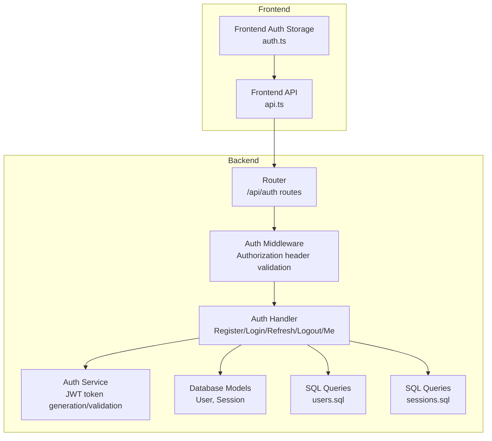
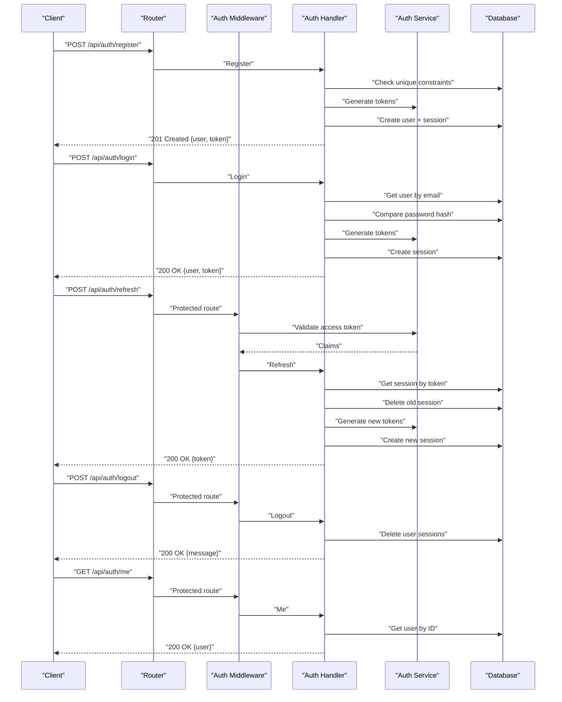
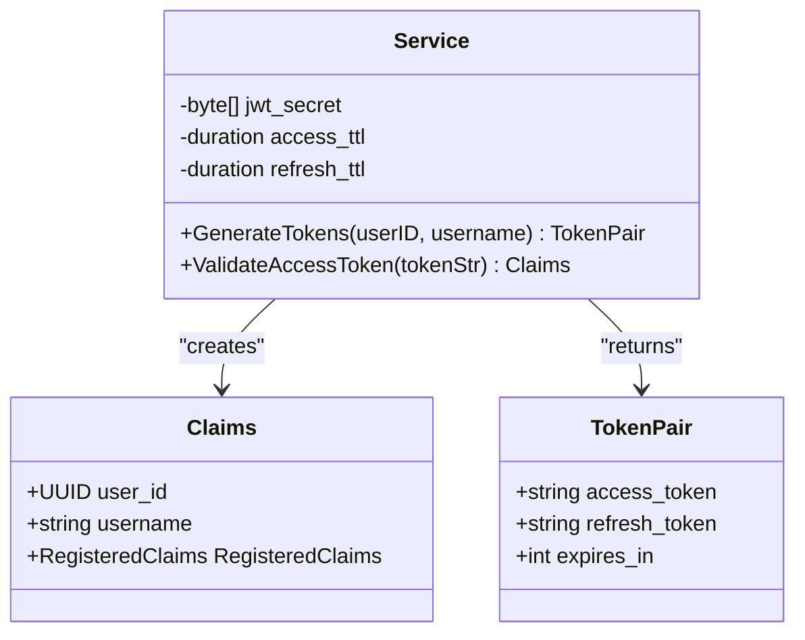
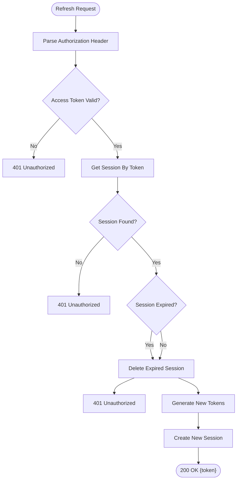
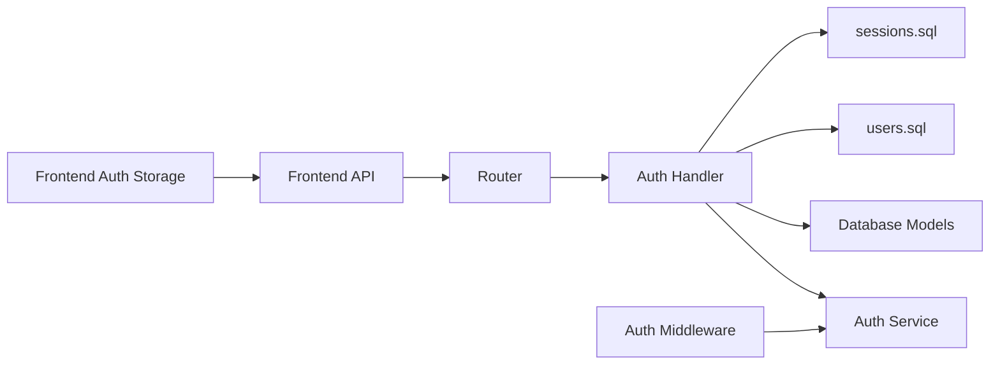

# Authentication Endpoints

<cite>
**Referenced Files in This Document**
- [main.go](file://backend/cmd/server/main.go)
- [handler.go](file://backend/internal/auth/handler.go)
- [service.go](file://backend/internal/auth/service.go)
- [auth.go](file://backend/internal/middleware/auth.go)
- [models.go](file://backend/internal/database/models.go)
- [users.sql](file://backend/sql/queries/users.sql)
- [sessions.sql](file://backend/sql/queries/sessions.sql)
- [001_users.sql](file://backend/sql/schema/001_users.sql)
- [005_sessions.sql](file://backend/sql/schema/005_sessions.sql)
- [config.go](file://backend/internal/config/config.go)
- [api.ts](file://frontend/src/lib/api.ts)
- [auth.ts](file://frontend/src/lib/auth.ts)
- [index.ts](file://frontend/src/types/index.ts)
- [auth_service_test.go](file://backend/tests/auth_service_test.go)
- [handlers_test.go](file://backend/tests/handlers_test.go)
</cite>

## Table of Contents
1. [Introduction](#introduction)
2. [Project Structure](#project-structure)
3. [Core Components](#core-components)
4. [Architecture Overview](#architecture-overview)
5. [Detailed Component Analysis](#detailed-component-analysis)
6. [Dependency Analysis](#dependency-analysis)
7. [Performance Considerations](#performance-considerations)
8. [Troubleshooting Guide](#troubleshooting-guide)
9. [Conclusion](#conclusion)

## Introduction
This document provides comprehensive API documentation for the authentication endpoints in the Go-Chatsync application. It covers registration, login, token refresh, logout, and user profile retrieval. The documentation includes HTTP methods, request/response schemas, authentication requirements using JWT tokens, error handling patterns, token expiration handling, session management, and security considerations such as password hashing and validation rules.

## Project Structure
The authentication system spans several backend packages and integrates with the frontend via HTTP requests. Key components include:
- HTTP routing and middleware setup
- Authentication handler implementing endpoints
- JWT service for token generation and validation
- Database models and SQL queries for user and session persistence
- Frontend API utilities for making authenticated requests

**Diagram sources**
- [main.go:80-111](file://backend/cmd/server/main.go#L80-L111)
- [auth.go:11-37](file://backend/internal/middleware/auth.go#L11-L37)
- [handler.go:23-243](file://backend/internal/auth/handler.go#L23-L243)
- [service.go:29-93](file://backend/internal/auth/service.go#L29-L93)
- [models.go:90-100](file://backend/internal/database/models.go#L90-L100)
- [users.sql:1-52](file://backend/sql/queries/users.sql#L1-L52)
- [sessions.sql:1-20](file://backend/sql/queries/sessions.sql#L1-L20)
- [api.ts:39-64](file://frontend/src/lib/api.ts#L39-L64)
- [auth.ts:1-29](file://frontend/src/lib/auth.ts#L1-L29)

**Section sources**
- [main.go:80-111](file://backend/cmd/server/main.go#L80-L111)
- [handler.go:23-243](file://backend/internal/auth/handler.go#L23-L243)
- [service.go:29-93](file://backend/internal/auth/service.go#L29-L93)
- [auth.go:11-37](file://backend/internal/middleware/auth.go#L11-L37)
- [models.go:90-100](file://backend/internal/database/models.go#L90-L100)
- [users.sql:1-52](file://backend/sql/queries/users.sql#L1-L52)
- [sessions.sql:1-20](file://backend/sql/queries/sessions.sql#L1-L20)
- [api.ts:39-64](file://frontend/src/lib/api.ts#L39-L64)
- [auth.ts:1-29](file://frontend/src/lib/auth.ts#L1-L29)

## Core Components
This section outlines the primary components involved in authentication and their roles:
- Router: Defines public and protected routes for authentication endpoints.
- Auth Middleware: Validates Authorization headers and injects user context.
- Auth Handler: Implements registration, login, refresh, logout, and profile retrieval.
- Auth Service: Generates and validates JWT tokens with configurable TTLs.
- Database Models and Queries: Persist users and sessions, manage refresh tokens.
- Frontend API Utilities: Send authenticated requests and manage tokens.

Key responsibilities:
- Token lifecycle management (issue, validate, refresh, revoke)
- User credential validation and secure storage
- Session persistence for refresh tokens
- Consistent error responses and HTTP status codes

**Section sources**
- [main.go:80-111](file://backend/cmd/server/main.go#L80-L111)
- [auth.go:11-37](file://backend/internal/middleware/auth.go#L11-L37)
- [handler.go:23-243](file://backend/internal/auth/handler.go#L23-L243)
- [service.go:29-93](file://backend/internal/auth/service.go#L29-L93)
- [models.go:90-100](file://backend/internal/database/models.go#L90-L100)
- [users.sql:1-52](file://backend/sql/queries/users.sql#L1-L52)
- [sessions.sql:1-20](file://backend/sql/queries/sessions.sql#L1-L20)
- [api.ts:39-64](file://frontend/src/lib/api.ts#L39-L64)
- [auth.ts:1-29](file://frontend/src/lib/auth.ts#L1-L29)

## Architecture Overview
The authentication architecture follows a layered pattern:
- HTTP layer: Routes and middleware
- Application layer: Handlers and services
- Persistence layer: Database models and SQL queries
- Client layer: Frontend utilities

**Diagram sources**
- [main.go:80-111](file://backend/cmd/server/main.go#L80-L111)
- [auth.go:11-37](file://backend/internal/middleware/auth.go#L11-L37)
- [handler.go:23-243](file://backend/internal/auth/handler.go#L23-L243)
- [service.go:37-93](file://backend/internal/auth/service.go#L37-L93)
- [users.sql:1-52](file://backend/sql/queries/users.sql#L1-L52)
- [sessions.sql:1-20](file://backend/sql/queries/sessions.sql#L1-L20)

## Detailed Component Analysis

### Endpoint Definitions and Schemas

#### POST /api/auth/register
- Purpose: Creates a new user account.
- Authentication: Not required.
- Request body fields:
  - username: string (required)
  - email: string (required)
  - password: string (required, minimum length 6)
- Response body fields:
  - user: object containing user details
  - token: object with access_token, refresh_token, expires_in
- Example request:
  - curl -X POST https://example.com/api/auth/register -H "Content-Type: application/json" -d '{"username":"alice","email":"alice@example.com","password":"securepass"}'
- Example response:
  - 201 Created with user and token pair

Validation and error handling:
- Trims whitespace from username and email.
- Rejects empty fields with 400 Bad Request.
- Enforces minimum password length (>=6) with 400 Bad Request.
- Checks uniqueness of email and username; returns 409 Conflict if duplicates exist.
- Hashes password using bcrypt before storing.
- Stores refresh token in sessions table with expiry.

Security considerations:
- Passwords are hashed using bcrypt.
- Unique constraints enforced at database level for username and email.

**Section sources**
- [handler.go:23-104](file://backend/internal/auth/handler.go#L23-L104)
- [users.sql:16-24](file://backend/sql/queries/users.sql#L16-L24)
- [001_users.sql:3-13](file://backend/sql/schema/001_users.sql#L3-L13)

#### POST /api/auth/login
- Purpose: Authenticates an existing user.
- Authentication: Not required.
- Request body fields:
  - email: string (required)
  - password: string (required)
- Response body fields:
  - user: object containing user details
  - token: object with access_token, refresh_token, expires_in
- Example request:
  - curl -X POST https://example.com/api/auth/login -H "Content-Type: application/json" -d '{"email":"alice@example.com","password":"securepass"}'
- Example response:
  - 200 OK with user and token pair

Validation and error handling:
- Trims and lowercases email.
- Returns 400 Bad Request for missing fields.
- Retrieves user by email with password hash.
- Compares provided password against stored hash; rejects with 401 Unauthorized if mismatch.
- Issues new token pair and stores refresh token with expiry.

Security considerations:
- Uses bcrypt for password verification.
- Stores refresh token in sessions table.

**Section sources**
- [handler.go:106-159](file://backend/internal/auth/handler.go#L106-L159)
- [users.sql:21-24](file://backend/sql/queries/users.sql#L21-L24)
- [001_users.sql:3-13](file://backend/sql/schema/001_users.sql#L3-L13)

#### POST /api/auth/refresh
- Purpose: Issues a new access token using a valid refresh token.
- Authentication: Requires a valid access token in Authorization header.
- Request body fields:
  - refresh_token: string (required)
- Response body fields:
  - token: object with access_token, refresh_token, expires_in
- Example request:
  - curl -X POST https://example.com/api/auth/refresh -H "Content-Type: application/json" -d '{"refresh_token":"<your-refresh-token>"}'
- Example response:
  - 200 OK with new token pair

Validation and error handling:
- Parses Authorization header; rejects missing or malformed headers with 401 Unauthorized.
- Validates access token; rejects invalid/expired tokens with 401 Unauthorized.
- Retrieves session by refresh_token; rejects if not found with 401 Unauthorized.
- Checks session expiry; deletes expired sessions and rejects with 401 Unauthorized.
- Deletes the old session and issues a new token pair.
- Stores the new refresh token with expiry.

Security considerations:
- Access token validated before allowing refresh.
- Session records cleaned up after successful refresh.

**Section sources**
- [handler.go:161-214](file://backend/internal/auth/handler.go#L161-L214)
- [auth.go:11-37](file://backend/internal/middleware/auth.go#L11-L37)
- [sessions.sql:6-16](file://backend/sql/queries/sessions.sql#L6-L16)
- [005_sessions.sql:1-12](file://backend/sql/schema/005_sessions.sql#L1-L12)

#### POST /api/auth/logout
- Purpose: Logs out the current user by revoking active sessions.
- Authentication: Required (access token).
- Request body: None.
- Response body fields:
  - message: string indicating success
- Example request:
  - curl -X POST https://example.com/api/auth/logout -H "Authorization: Bearer <access-token>"
- Example response:
  - 200 OK with success message

Validation and error handling:
- Extracts user_id from access token claims.
- Deletes all sessions for the user.
- Returns success regardless of whether sessions existed.

Security considerations:
- Requires a valid access token to prevent unauthorized logout.

**Section sources**
- [handler.go:216-224](file://backend/internal/auth/handler.go#L216-L224)
- [auth.go:11-37](file://backend/internal/middleware/auth.go#L11-L37)
- [sessions.sql:15-16](file://backend/sql/queries/sessions.sql#L15-L16)

#### GET /api/auth/me
- Purpose: Retrieves the authenticated user's profile.
- Authentication: Required (access token).
- Request body: None.
- Response body fields:
  - id: string (UUID)
  - username: string
  - email: string
  - display_name: string
  - avatar_url: string
  - status: string
- Example request:
  - curl -X GET https://example.com/api/auth/me -H "Authorization: Bearer <access-token>"
- Example response:
  - 200 OK with user object

Validation and error handling:
- Extracts user_id from access token claims.
- Fetches user by ID; returns 404 Not Found if not present.
- Returns user details excluding sensitive fields.

Security considerations:
- Requires a valid access token to access profile data.

**Section sources**
- [handler.go:226-243](file://backend/internal/auth/handler.go#L226-L243)
- [auth.go:11-37](file://backend/internal/middleware/auth.go#L11-L37)
- [users.sql:6-9](file://backend/sql/queries/users.sql#L6-L9)

### JWT Token Model and Validation
- Token pair structure:
  - access_token: string (signed JWT)
  - refresh_token: string (signed JWT)
  - expires_in: integer (seconds)
- Access token claims:
  - user_id: UUID
  - username: string
  - issuer: string
  - issued at: numeric date
  - expires at: numeric date
- Refresh token claims:
  - issuer: string
  - issued at: numeric date
  - expires at: numeric date
- Token generation:
  - Uses HMAC SHA-256 with a shared secret.
  - Access token TTL configured via environment variable (minutes).
  - Refresh token TTL configured via environment variable (days).
- Token validation:
  - Verifies signature and claims.
  - Rejects invalid or expired tokens.

**Diagram sources**
- [service.go:17-27](file://backend/internal/auth/service.go#L17-L27)
- [service.go:29-93](file://backend/internal/auth/service.go#L29-L93)

**Section sources**
- [service.go:17-27](file://backend/internal/auth/service.go#L17-L27)
- [service.go:29-93](file://backend/internal/auth/service.go#L29-L93)
- [config.go:23-36](file://backend/internal/config/config.go#L23-L36)

### Session Management
- Sessions table stores refresh tokens linked to users.
- On successful registration or login, a refresh token is created with an expiry.
- On refresh, the old session is deleted and a new one is created.
- On logout, all sessions for the user are deleted.
- Expiration checks ensure stale sessions are rejected.

**Diagram sources**
- [handler.go:161-214](file://backend/internal/auth/handler.go#L161-L214)
- [sessions.sql:6-16](file://backend/sql/queries/sessions.sql#L6-L16)

**Section sources**
- [handler.go:84-91](file://backend/internal/auth/handler.go#L84-L91)
- [handler.go:139-146](file://backend/internal/auth/handler.go#L139-L146)
- [handler.go:185-209](file://backend/internal/auth/handler.go#L185-L209)
- [sessions.sql:1-20](file://backend/sql/queries/sessions.sql#L1-L20)
- [005_sessions.sql:1-12](file://backend/sql/schema/005_sessions.sql#L1-L12)

### Frontend Integration
- The frontend stores access_token and refresh_token in localStorage.
- All authenticated requests include an Authorization header with Bearer token.
- Utility functions handle registration, login, refresh, logout, and profile retrieval.

Example usage patterns:
- Set tokens after successful registration/login.
- Clear tokens on logout.
- Use refresh endpoint to renew access token when needed.

**Section sources**
- [auth.ts:1-29](file://frontend/src/lib/auth.ts#L1-L29)
- [api.ts:39-64](file://frontend/src/lib/api.ts#L39-L64)
- [index.ts:10-19](file://frontend/src/types/index.ts#L10-L19)

## Dependency Analysis
The authentication system exhibits clear separation of concerns:
- Router depends on Auth Handler for endpoint logic.
- Auth Handler depends on Auth Service for token operations and on Database for persistence.
- Auth Middleware depends on Auth Service for token validation.
- Database models and queries encapsulate persistence logic.
- Frontend utilities depend on backend endpoints and local storage.

**Diagram sources**
- [main.go:80-111](file://backend/cmd/server/main.go#L80-L111)
- [handler.go:23-243](file://backend/internal/auth/handler.go#L23-L243)
- [service.go:29-93](file://backend/internal/auth/service.go#L29-L93)
- [auth.go:11-37](file://backend/internal/middleware/auth.go#L11-L37)
- [models.go:90-100](file://backend/internal/database/models.go#L90-L100)
- [users.sql:1-52](file://backend/sql/queries/users.sql#L1-L52)
- [sessions.sql:1-20](file://backend/sql/queries/sessions.sql#L1-L20)
- [api.ts:39-64](file://frontend/src/lib/api.ts#L39-L64)
- [auth.ts:1-29](file://frontend/src/lib/auth.ts#L1-L29)

**Section sources**
- [main.go:80-111](file://backend/cmd/server/main.go#L80-L111)
- [handler.go:23-243](file://backend/internal/auth/handler.go#L23-L243)
- [service.go:29-93](file://backend/internal/auth/service.go#L29-L93)
- [auth.go:11-37](file://backend/internal/middleware/auth.go#L11-L37)
- [models.go:90-100](file://backend/internal/database/models.go#L90-L100)
- [users.sql:1-52](file://backend/sql/queries/users.sql#L1-L52)
- [sessions.sql:1-20](file://backend/sql/queries/sessions.sql#L1-L20)
- [api.ts:39-64](file://frontend/src/lib/api.ts#L39-L64)
- [auth.ts:1-29](file://frontend/src/lib/auth.ts#L1-L29)

## Performance Considerations
- Token generation uses symmetric signing; keep secret short-lived and rotate periodically.
- Database indexes on users (username, email) and sessions (refresh_token) improve lookup performance.
- Consider background cleanup of expired sessions to maintain optimal performance.
- Minimize payload sizes in responses to reduce bandwidth usage.

## Troubleshooting Guide
Common issues and resolutions:
- Missing or invalid Authorization header:
  - Symptom: 401 Unauthorized on protected endpoints.
  - Resolution: Ensure Authorization header is present and formatted as "Bearer <token>".
- Invalid or expired access token:
  - Symptom: 401 Unauthorized during refresh or protected calls.
  - Resolution: Use the refresh endpoint with a valid refresh_token to obtain a new access token.
- Invalid refresh token:
  - Symptom: 401 Unauthorized on refresh.
  - Resolution: Re-authenticate the user to obtain new tokens.
- Refresh token expired:
  - Symptom: 401 Unauthorized with expired refresh token.
  - Resolution: Log in again to acquire fresh tokens.
- Duplicate email or username:
  - Symptom: 409 Conflict on registration.
  - Resolution: Use unique values for email and username.
- Short password:
  - Symptom: 400 Bad Request on registration.
  - Resolution: Provide a password with at least 6 characters.
- User not found:
  - Symptom: 404 Not Found on profile retrieval.
  - Resolution: Verify the access token corresponds to an existing user.

Validation and error handling patterns are demonstrated in tests:
- Token generation and validation behavior
- Error scenarios for invalid, expired, and mismatched secrets
- Handler validation for registration inputs and duplicate entries

**Section sources**
- [auth.go:11-37](file://backend/internal/middleware/auth.go#L11-L37)
- [handler.go:161-214](file://backend/internal/auth/handler.go#L161-L214)
- [handlers_test.go:153-206](file://backend/tests/handlers_test.go#L153-L206)
- [auth_service_test.go:11-104](file://backend/tests/auth_service_test.go#L11-L104)

## Conclusion
The authentication system provides robust endpoints for user registration, login, token refresh, logout, and profile retrieval. It leverages JWT for stateless authentication, bcrypt for secure password storage, and database-backed sessions for refresh token management. The frontend utilities integrate seamlessly with these endpoints, ensuring consistent authentication behavior across the application.