# Conversation Endpoints

<cite>
**Referenced Files in This Document**
- [main.go](file://backend/cmd/server/main.go)
- [handler.go](file://backend/internal/conversations/handler.go)
- [conversations.sql.go](file://backend/internal/database/conversations.sql.go)
- [models.go](file://backend/internal/database/models.go)
- [conversations.sql](file://backend/sql/queries/conversations.sql)
- [002_conversations.sql](file://backend/sql/schema/002_conversations.sql)
- [auth.go](file://backend/internal/middleware/auth.go)
- [api.ts](file://frontend/src/lib/api.ts)
</cite>

## Table of Contents
1. [Introduction](#introduction)
2. [Project Structure](#project-structure)
3. [Core Components](#core-components)
4. [Architecture Overview](#architecture-overview)
5. [Detailed Component Analysis](#detailed-component-analysis)
6. [Dependency Analysis](#dependency-analysis)
7. [Performance Considerations](#performance-considerations)
8. [Troubleshooting Guide](#troubleshooting-guide)
9. [Conclusion](#conclusion)

## Introduction
This document provides comprehensive API documentation for conversation management endpoints. It covers:
- Creating conversations (POST /api/conversations)
- Retrieving conversations (GET /api/conversations)
- Getting a specific conversation (GET /api/conversations/{id})
- Managing members (POST /api/conversations/{id}/members and DELETE /api/conversations/{id}/members/{userId})
- Request/response schemas, filtering options, and error handling
- Examples of conversation data structures and member role management

## Project Structure
The conversation endpoints are implemented in the Go backend and exposed via HTTP routes. The frontend client consumes these endpoints using a typed API wrapper.

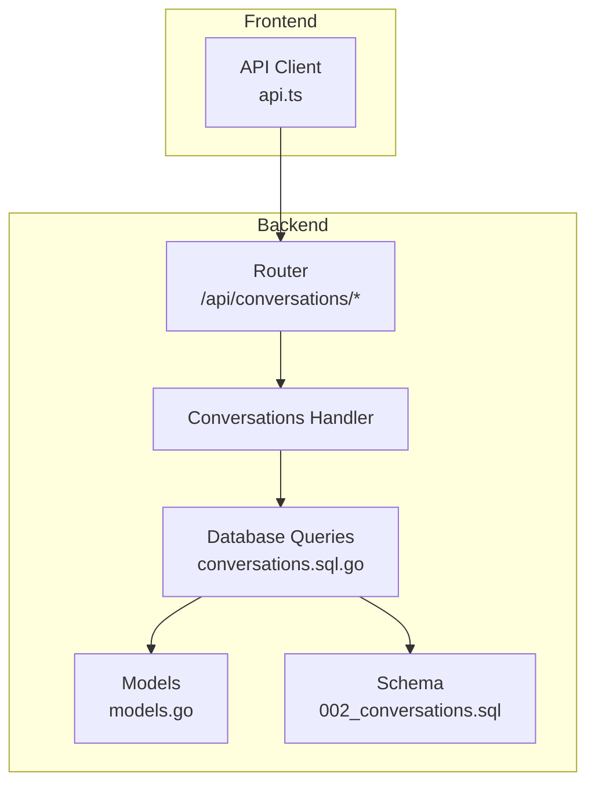

**Diagram sources**
- [main.go:103-108](file://backend/cmd/server/main.go#L103-L108)
- [handler.go:13-161](file://backend/internal/conversations/handler.go#L13-L161)
- [conversations.sql.go:16-69](file://backend/internal/database/conversations.sql.go#L16-L69)
- [models.go:24-39](file://backend/internal/database/models.go#L24-L39)
- [002_conversations.sql:1-25](file://backend/sql/schema/002_conversations.sql#L1-L25)

**Section sources**
- [main.go:103-108](file://backend/cmd/server/main.go#L103-L108)
- [handler.go:13-161](file://backend/internal/conversations/handler.go#L13-L161)

## Core Components
- Router registration defines protected routes under /api/conversations with Bearer token authentication.
- Handler functions implement CRUD operations and member management.
- Database layer provides strongly-typed queries and models for conversations and members.
- Frontend API client encapsulates requests and response parsing.

**Section sources**
- [main.go:103-108](file://backend/cmd/server/main.go#L103-L108)
- [handler.go:13-161](file://backend/internal/conversations/handler.go#L13-L161)
- [conversations.sql.go:16-69](file://backend/internal/database/conversations.sql.go#L16-L69)
- [models.go:24-39](file://backend/internal/database/models.go#L24-L39)
- [api.ts:78-100](file://frontend/src/lib/api.ts#L78-L100)

## Architecture Overview
The conversation endpoints follow a clean architecture:
- HTTP routes are registered in main.go
- Handlers validate requests, enforce authentication, and delegate to database queries
- Queries return strongly-typed models and map to JSON responses
- Member roles are enforced by database constraints and handler logic

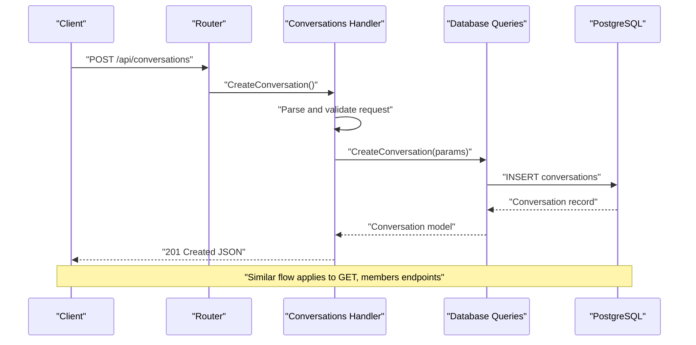

**Diagram sources**
- [main.go:103-108](file://backend/cmd/server/main.go#L103-L108)
- [handler.go:51-161](file://backend/internal/conversations/handler.go#L51-L161)
- [conversations.sql.go:36-60](file://backend/internal/database/conversations.sql.go#L36-L60)

## Detailed Component Analysis

### Authentication and Authorization
- All conversation endpoints are protected by Bearer token authentication middleware.
- The middleware extracts the token from the Authorization header and validates it, attaching user identity to the request context.

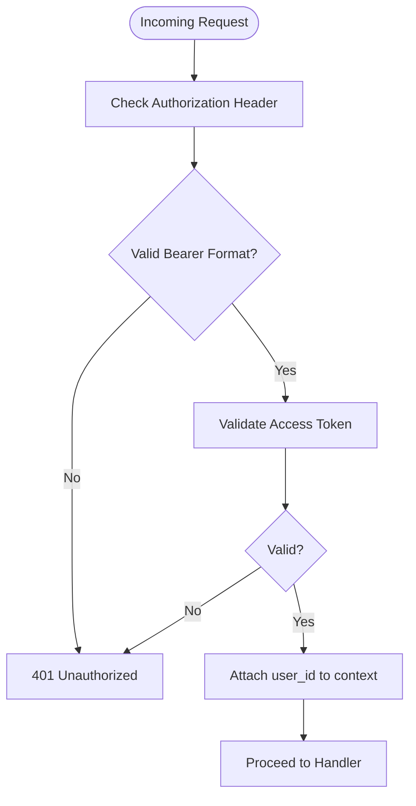

**Diagram sources**
- [auth.go:11-37](file://backend/internal/middleware/auth.go#L11-L37)

**Section sources**
- [auth.go:11-37](file://backend/internal/middleware/auth.go#L11-L37)
- [main.go:91-114](file://backend/cmd/server/main.go#L91-L114)

### Endpoint: Create Conversation (POST /api/conversations)
Purpose: Create a new private or group conversation.

- Request body:
  - type: "private" | "group"
  - name: string (required for group)
  - members: array of usernames (required for group; exactly one for private)
- Responses:
  - 201 Created: Conversation object
  - 400 Bad Request: Validation errors
  - 500 Internal Server Error: Database errors

Behavior highlights:
- Private conversation:
  - Validates exactly one member
  - Checks for existing private conversation with the other user
  - Creates conversation and adds both members as "member"
- Group conversation:
  - Requires name and at least one member
  - Sets current user as admin (role "admin")

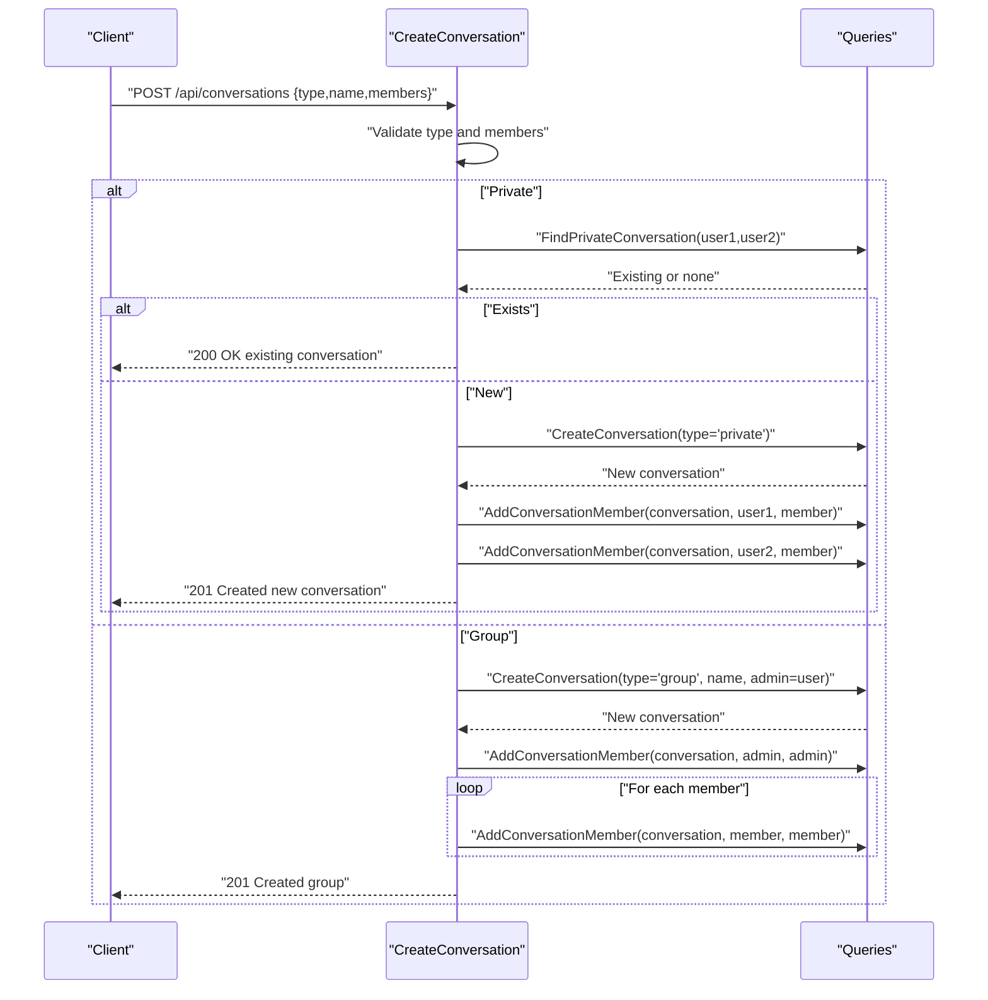

**Diagram sources**
- [handler.go:51-161](file://backend/internal/conversations/handler.go#L51-L161)
- [conversations.sql.go:36-60](file://backend/internal/database/conversations.sql.go#L36-L60)
- [conversations.sql.go:16-34](file://backend/internal/database/conversations.sql.go#L16-L34)

**Section sources**
- [handler.go:51-161](file://backend/internal/conversations/handler.go#L51-L161)
- [conversations.sql.go:36-60](file://backend/internal/database/conversations.sql.go#L36-L60)
- [conversations.sql.go:16-34](file://backend/internal/database/conversations.sql.go#L16-L34)

### Endpoint: List Conversations (GET /api/conversations)
Purpose: Retrieve all conversations for the authenticated user.

- Response: Array of Conversation objects with embedded members and last message metadata.

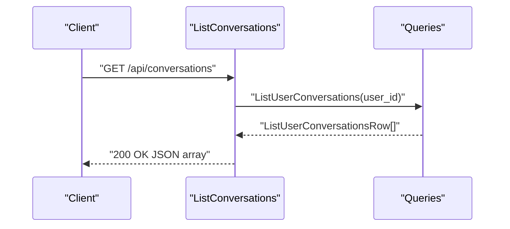

**Diagram sources**
- [handler.go:27-38](file://backend/internal/conversations/handler.go#L27-L38)
- [conversations.sql.go:234-262](file://backend/internal/database/conversations.sql.go#L234-L262)

**Section sources**
- [handler.go:27-38](file://backend/internal/conversations/handler.go#L27-L38)
- [conversations.sql.go:234-262](file://backend/internal/database/conversations.sql.go#L234-L262)

### Endpoint: Get Conversation by ID (GET /api/conversations/{id})
Purpose: Retrieve a specific conversation by ID.

- Path parameter: id (UUID)
- Response: Conversation object with members array
- Errors: 400 for invalid UUID, 404 for not found

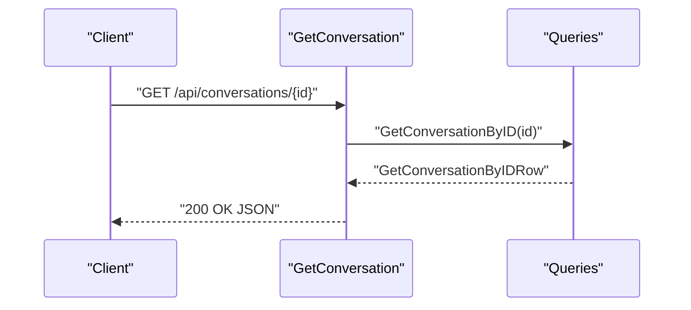

**Diagram sources**
- [handler.go:264-279](file://backend/internal/conversations/handler.go#L264-L279)
- [conversations.sql.go:130-143](file://backend/internal/database/conversations.sql.go#L130-L143)

**Section sources**
- [handler.go:264-279](file://backend/internal/conversations/handler.go#L264-L279)
- [conversations.sql.go:130-143](file://backend/internal/database/conversations.sql.go#L130-L143)

### Endpoint: Add Member (POST /api/conversations/{id}/members)
Purpose: Add a user to a group conversation.

- Path parameters: id (UUID), username (string)
- Request body: { username: string }
- Response: 200 with message
- Errors: 400 for invalid ID, 404 for user not found, 500 for database errors

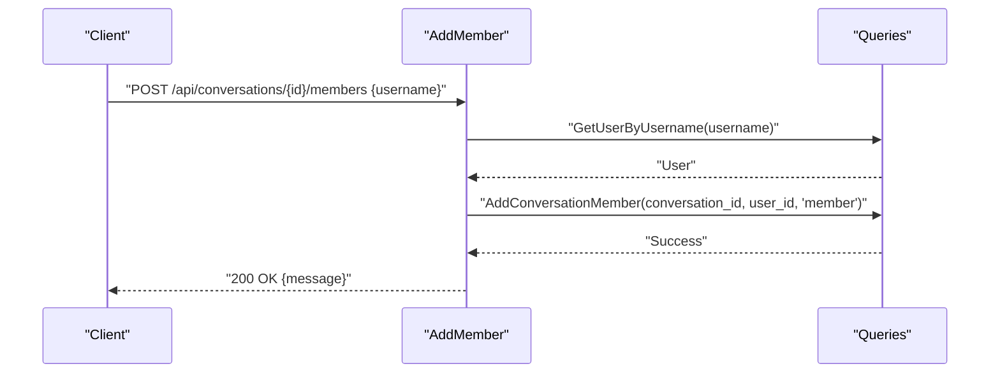

**Diagram sources**
- [handler.go:176-210](file://backend/internal/conversations/handler.go#L176-L210)
- [conversations.sql.go:16-34](file://backend/internal/database/conversations.sql.go#L16-L34)

**Section sources**
- [handler.go:176-210](file://backend/internal/conversations/handler.go#L176-L210)
- [conversations.sql.go:16-34](file://backend/internal/database/conversations.sql.go#L16-L34)

### Endpoint: Remove Member (DELETE /api/conversations/{id}/members/{userId})
Purpose: Remove a user from a group conversation.

- Path parameters: id (UUID), userId (UUID)
- Response: 200 with message
- Errors: 400 for invalid IDs, 500 for database errors

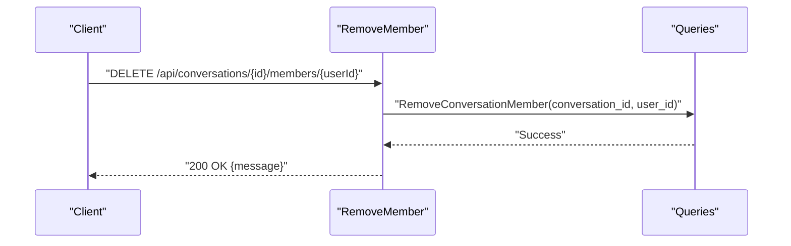

**Diagram sources**
- [handler.go:225-250](file://backend/internal/conversations/handler.go#L225-L250)
- [conversations.sql.go:264-277](file://backend/internal/database/conversations.sql.go#L264-L277)

**Section sources**
- [handler.go:225-250](file://backend/internal/conversations/handler.go#L225-L250)
- [conversations.sql.go:264-277](file://backend/internal/database/conversations.sql.go#L264-L277)

### Data Models and Schemas

#### Conversation Model
- Fields: id, type, name, admin_id, created_at, updated_at
- Type constraint: "private" | "group"
- Admin relationship: optional reference to users table

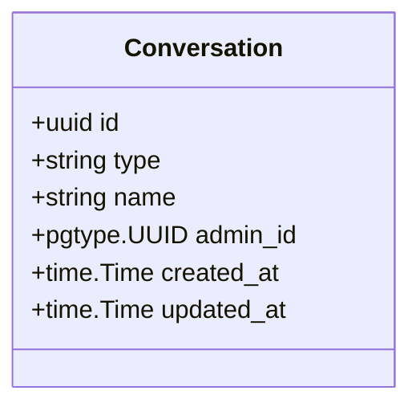

**Diagram sources**
- [models.go:24-31](file://backend/internal/database/models.go#L24-L31)

**Section sources**
- [models.go:24-31](file://backend/internal/database/models.go#L24-L31)
- [002_conversations.sql:1-9](file://backend/sql/schema/002_conversations.sql#L1-L9)

#### ConversationMember Model
- Fields: id, conversation_id, user_id, role, joined_at
- Role constraint: "admin" | "member"

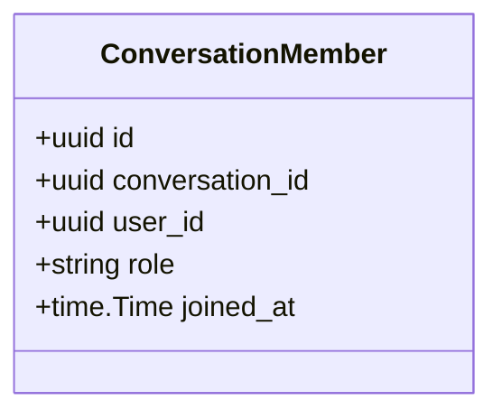

**Diagram sources**
- [models.go:33-39](file://backend/internal/database/models.go#L33-L39)

**Section sources**
- [models.go:33-39](file://backend/internal/database/models.go#L33-L39)
- [002_conversations.sql:13-21](file://backend/sql/schema/002_conversations.sql#L13-L21)

#### Database Queries and Relationships
- CreateConversation: inserts a new conversation and returns the model
- GetConversationByID: returns conversation with aggregated members as JSON array
- ListUserConversations: returns conversations for a user with members and last message metadata
- AddConversationMember: inserts a membership with role "member" (or "admin" in handler logic)
- RemoveConversationMember: deletes a membership

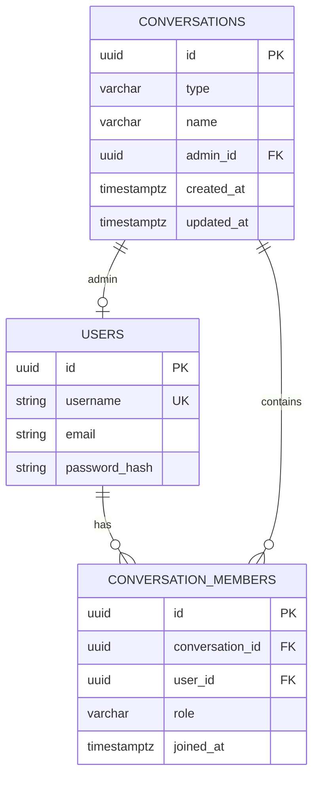

**Diagram sources**
- [002_conversations.sql:1-25](file://backend/sql/schema/002_conversations.sql#L1-L25)
- [conversations.sql.go:36-60](file://backend/internal/database/conversations.sql.go#L36-L60)
- [conversations.sql.go:130-143](file://backend/internal/database/conversations.sql.go#L130-L143)
- [conversations.sql.go:234-262](file://backend/internal/database/conversations.sql.go#L234-L262)

**Section sources**
- [conversations.sql.go:36-60](file://backend/internal/database/conversations.sql.go#L36-L60)
- [conversations.sql.go:130-143](file://backend/internal/database/conversations.sql.go#L130-L143)
- [conversations.sql.go:234-262](file://backend/internal/database/conversations.sql.go#L234-L262)
- [conversations.sql.go:16-34](file://backend/internal/database/conversations.sql.go#L16-L34)
- [conversations.sql.go:264-277](file://backend/internal/database/conversations.sql.go#L264-L277)

### Filtering Options
- List conversations endpoint supports ordering by last message timestamp or creation date when no messages exist.
- The query joins conversation_members and users to include member details in the response.

**Section sources**
- [conversations.sql.go:203-220](file://backend/internal/database/conversations.sql.go#L203-L220)

### Examples

#### Example: Create a Private Conversation
- Request:
  - Method: POST
  - Body: { "type": "private", "members": ["alice"] }
- Response:
  - Status: 201 Created
  - Body: Conversation object with type "private", empty name, admin_id null

#### Example: Create a Group Conversation
- Request:
  - Method: POST
  - Body: { "type": "group", "name": "Team Alpha", "members": ["alice", "bob"] }
- Response:
  - Status: 201 Created
  - Body: Conversation object with type "group", name "Team Alpha", admin_id set to creator

#### Example: Add a Member to a Group
- Request:
  - Method: POST
  - Path: /api/conversations/{conversationId}/members
  - Body: { "username": "charlie" }
- Response:
  - Status: 200 OK
  - Body: { "message": "Member added" }

#### Example: Remove a Member from a Group
- Request:
  - Method: DELETE
  - Path: /api/conversations/{conversationId}/members/{userId}
- Response:
  - Status: 200 OK
  - Body: { "message": "Member removed" }

**Section sources**
- [handler.go:51-161](file://backend/internal/conversations/handler.go#L51-L161)
- [handler.go:176-210](file://backend/internal/conversations/handler.go#L176-L210)
- [handler.go:225-250](file://backend/internal/conversations/handler.go#L225-L250)

### Error Handling
Common error responses:
- 400 Bad Request: Invalid request body, invalid UUID, missing fields
- 404 Not Found: User not found, conversation not found
- 500 Internal Server Error: Database failures

The handler responds consistently with JSON objects containing an "error" field.

**Section sources**
- [handler.go:281-289](file://backend/internal/conversations/handler.go#L281-L289)
- [handler.go:59-62](file://backend/internal/conversations/handler.go#L59-L62)
- [handler.go:179-182](file://backend/internal/conversations/handler.go#L179-L182)
- [handler.go:235-238](file://backend/internal/conversations/handler.go#L235-L238)

## Dependency Analysis
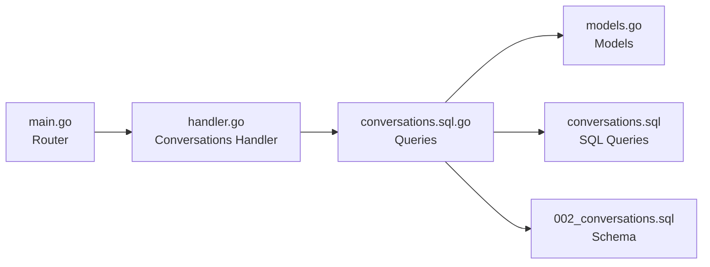

**Diagram sources**
- [main.go:103-108](file://backend/cmd/server/main.go#L103-L108)
- [handler.go:13-161](file://backend/internal/conversations/handler.go#L13-L161)
- [conversations.sql.go:16-69](file://backend/internal/database/conversations.sql.go#L16-L69)
- [models.go:24-39](file://backend/internal/database/models.go#L24-L39)
- [conversations.sql:1-76](file://backend/sql/queries/conversations.sql#L1-L76)
- [002_conversations.sql:1-25](file://backend/sql/schema/002_conversations.sql#L1-L25)

**Section sources**
- [main.go:103-108](file://backend/cmd/server/main.go#L103-L108)
- [handler.go:13-161](file://backend/internal/conversations/handler.go#L13-L161)
- [conversations.sql.go:16-69](file://backend/internal/database/conversations.sql.go#L16-L69)

## Performance Considerations
- Indexes on conversations(admin_id) and conversation_members(conversation_id, user_id) support efficient lookups.
- Aggregated members are returned via JSON aggregation in SQL to minimize round trips.
- Ordering by last_message_at reduces UI sorting overhead.

[No sources needed since this section provides general guidance]

## Troubleshooting Guide
- Authentication failures:
  - Ensure Authorization header is present and formatted as "Bearer <token>"
  - Verify token validity and expiration
- Validation errors:
  - Check request body fields: type must be "private" or "group"
  - For private: exactly one member
  - For group: name and at least one member
- Database errors:
  - Inspect logs for SQL errors
  - Confirm user existence and conversation membership constraints

**Section sources**
- [auth.go:11-37](file://backend/internal/middleware/auth.go#L11-L37)
- [handler.go:64-67](file://backend/internal/conversations/handler.go#L64-L67)
- [handler.go:119-122](file://backend/internal/conversations/handler.go#L119-L122)
- [handler.go:124-127](file://backend/internal/conversations/handler.go#L124-L127)

## Conclusion
The conversation management endpoints provide a robust foundation for chat functionality with clear separation of concerns, strong typing, and consistent error handling. The design supports both private and group conversations, member management, and efficient retrieval with metadata.