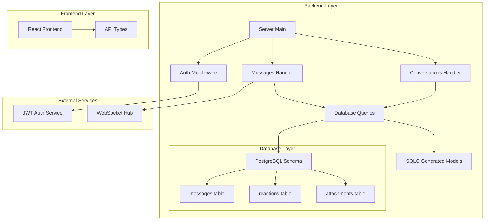
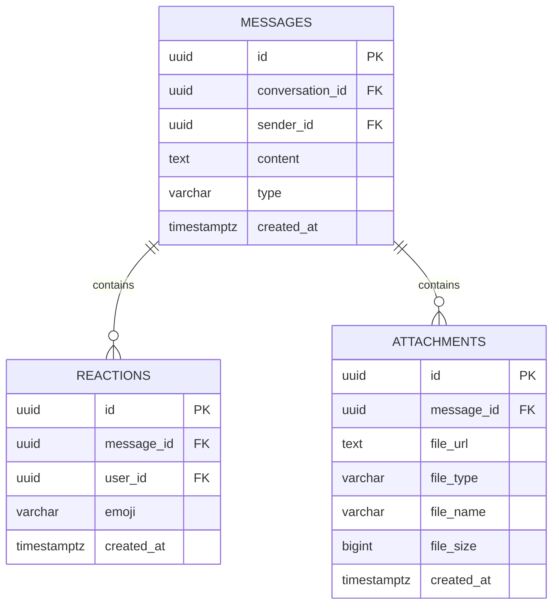
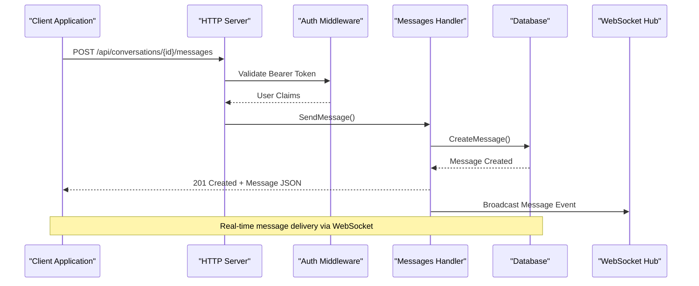
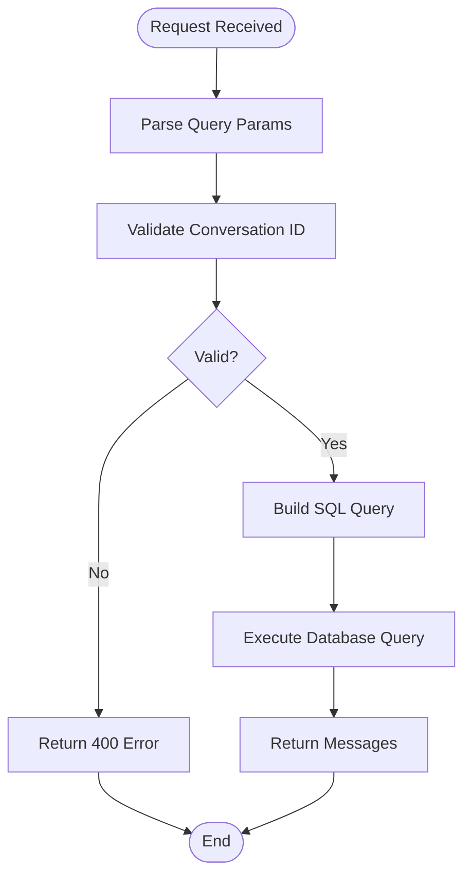
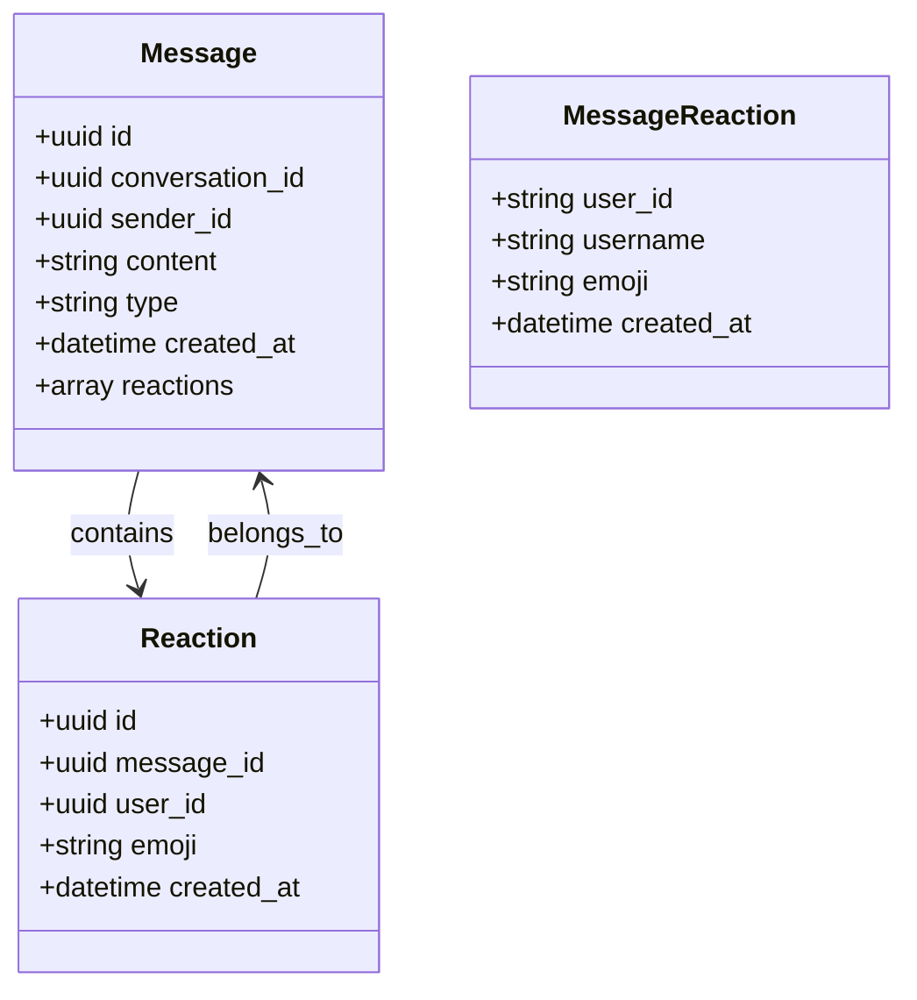
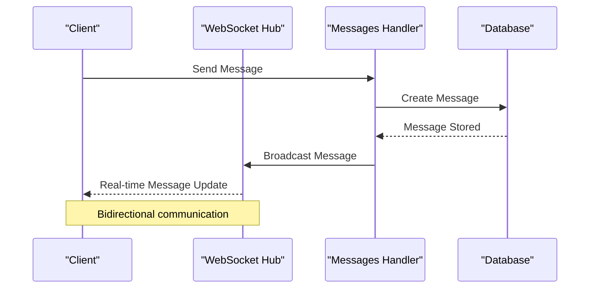
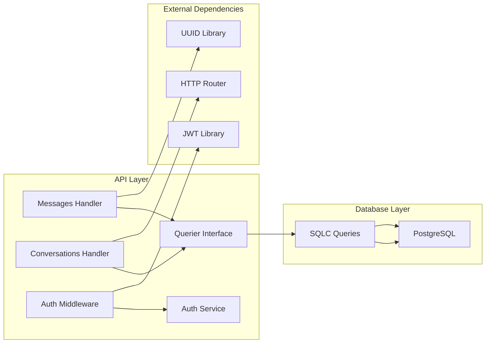

# Message Endpoints

<cite>
**Referenced Files in This Document**
- [main.go](file://backend/cmd/server/main.go)
- [handler.go](file://backend/internal/messages/handler.go)
- [messages.sql.go](file://backend/internal/database/messages.sql.go)
- [messages.sql](file://backend/sql/queries/messages.sql)
- [models.go](file://backend/internal/database/models.go)
- [auth.go](file://backend/internal/middleware/auth.go)
- [index.ts](file://frontend/src/types/index.ts)
</cite>

## Table of Contents
1. [Introduction](#introduction)
2. [Project Structure](#project-structure)
3. [Core Components](#core-components)
4. [Architecture Overview](#architecture-overview)
5. [Detailed Component Analysis](#detailed-component-analysis)
6. [Dependency Analysis](#dependency-analysis)
7. [Performance Considerations](#performance-considerations)
8. [Troubleshooting Guide](#troubleshooting-guide)
9. [Conclusion](#conclusion)

## Introduction
This document provides comprehensive API documentation for message handling endpoints in the Go-Chatsync application. It covers message CRUD operations, pagination, reactions, and attachment management. The system implements secure REST APIs with JWT authentication and provides real-time messaging capabilities through WebSocket integration.

## Project Structure
The message handling functionality is organized within the backend architecture:



**Diagram sources**
- [main.go:29-156](file://backend/cmd/server/main.go#L29-L156)
- [handler.go:1-169](file://backend/internal/messages/handler.go#L1-L169)

**Section sources**
- [main.go:29-156](file://backend/cmd/server/main.go#L29-L156)

## Core Components

### Authentication Middleware
The system uses JWT-based authentication with bearer tokens:

- **Header**: Authorization: Bearer {token}
- **Validation**: Token verification through auth service
- **Context**: User ID and username injected into request context

### Message Data Model
The message system consists of three core tables:



**Diagram sources**
- [003_messages.sql:1-36](file://backend/sql/schema/003_messages.sql#L1-L36)

**Section sources**
- [models.go:41-72](file://backend/internal/database/models.go#L41-L72)
- [003_messages.sql:1-36](file://backend/sql/schema/003_messages.sql#L1-L36)

## Architecture Overview



**Diagram sources**
- [main.go:110-114](file://backend/cmd/server/main.go#L110-L114)
- [handler.go:82-124](file://backend/internal/messages/handler.go#L82-L124)

## Detailed Component Analysis

### Message CRUD Operations

#### Send Message Endpoint
**Endpoint**: `POST /api/conversations/{id}/messages`

**Request Schema**:
```typescript
interface SendMessageRequest {
  content: string;  // Required
  type: string;     // Optional, defaults to "text"
}
```

**Response Schema**:
```typescript
interface MessageResponse {
  id: string;
  conversation_id: string;
  sender_id: string;
  sender_username: string;
  content: string;
  type: string;
  created_at: string;
  reactions?: MessageReaction[];
}
```

**Processing Logic**:
1. Parse conversation ID from path parameter
2. Extract user ID from JWT context
3. Validate request body (non-empty content)
4. Insert message into database
5. Return created message with reactions field

**Error Handling**:
- 400: Invalid conversation ID or request body
- 500: Database errors during creation

#### Retrieve Message History
**Endpoint**: `GET /api/conversations/{id}/messages`

**Query Parameters**:
- `limit`: Number of messages (1-100, default: 50)
- `cursor`: Message ID for pagination

**Response Schema**: Array of MessageResponse objects

**Pagination Logic**:


**Diagram sources**
- [handler.go:31-68](file://backend/internal/messages/handler.go#L31-L68)

**Error Handling**:
- 400: Invalid conversation ID or cursor
- 500: Database query failures

#### Delete Message
**Endpoint**: `DELETE /api/messages/{id}`

**Authorization**: Only the original sender can delete messages

**Response**: `{ message: "Message deleted" }`

**Processing Logic**:
1. Parse message ID from path
2. Extract user ID from context
3. Verify ownership before deletion
4. Soft delete (message remains but becomes inaccessible)

**Error Handling**:
- 400: Invalid message ID
- 500: Deletion errors

**Section sources**
- [handler.go:70-158](file://backend/internal/messages/handler.go#L70-L158)

### Message Reactions Management

#### Reaction Data Model


**Diagram sources**
- [models.go:41-72](file://backend/internal/database/models.go#L41-L72)

**Reactions Query Logic**:
The database query automatically includes reactions in the message response using JSON aggregation:

```sql
SELECT m.id, m.conversation_id, m.sender_id, u.username, m.content, m.type, m.created_at,
       COALESCE(
         (SELECT json_agg(json_build_object(
           'user_id', r.user_id,
           'username', ru.username,
           'emoji', r.emoji,
           'created_at', r.created_at
         )) FROM reactions r JOIN users ru ON r.user_id = ru.id WHERE r.message_id = m.id),
         '[]'::json
       ) AS reactions
FROM messages m
JOIN users u ON m.sender_id = u.id
WHERE m.conversation_id = $1
  AND ($2::uuid IS NULL OR m.id < $2::uuid)
ORDER BY m.created_at DESC
LIMIT $3;
```

**Section sources**
- [messages.sql.go:113-176](file://backend/internal/database/messages.sql.go#L113-L176)
- [messages.sql:12-28](file://backend/sql/queries/messages.sql#L12-L28)

### Attachment Management

#### Attachment Data Model
Attachments are stored separately from messages with foreign key relationships:

**Attachment Schema**:
```typescript
interface Attachment {
  id: string;
  message_id: string;
  file_url: string;
  file_type: string;
  file_name: string;
  file_size: number;
  created_at: string;
}
```

**Database Constraints**:
- Foreign key to messages table with cascade delete
- Index on message_id for efficient queries
- Unique constraints prevent duplicate attachments

**Section sources**
- [models.go:14-22](file://backend/internal/database/models.go#L14-L22)
- [003_messages.sql:25-36](file://backend/sql/schema/003_messages.sql#L25-L36)

### WebSocket Integration

The message system integrates with WebSocket for real-time updates:



**Diagram sources**
- [main.go:55-59](file://backend/cmd/server/main.go#L55-L59)

**Section sources**
- [main.go:121-122](file://backend/cmd/server/main.go#L121-L122)

## Dependency Analysis



**Diagram sources**
- [handler.go:13-15](file://backend/internal/messages/handler.go#L13-L15)
- [auth.go:11-37](file://backend/internal/middleware/auth.go#L11-L37)

**Section sources**
- [querier.go:13-50](file://backend/internal/database/querier.go#L13-L50)

## Performance Considerations

### Database Optimization
- **Indexes**: Composite indexes on `(conversation_id, created_at DESC)` for efficient pagination
- **Query Optimization**: Single query returns messages with aggregated reactions
- **Limit Controls**: Maximum 100 messages per request to prevent large payloads

### Caching Strategy
- **Pagination Cursors**: UUID-based cursors prevent offset-based pagination issues
- **Connection Pooling**: Database connections managed through connection pooling
- **Memory Efficiency**: JSON aggregation performed server-side to minimize client processing

### Scalability Considerations
- **Horizontal Scaling**: Stateless message handlers support load balancing
- **Database Scaling**: Separate tables for messages, reactions, and attachments
- **Real-time Scaling**: WebSocket hub designed for distributed deployment

## Troubleshooting Guide

### Common Error Scenarios

**Authentication Issues**:
- Missing Authorization header: 401 Unauthorized
- Invalid token format: 401 Unauthorized  
- Expired token: 401 Unauthorized

**Validation Errors**:
- Invalid UUID format: 400 Bad Request
- Empty content field: 400 Bad Request
- Insufficient permissions: 403 Forbidden

**Database Errors**:
- Constraint violations: 409 Conflict
- Deadlocks: 500 Internal Server Error
- Connection failures: 503 Service Unavailable

### Debugging Tips
1. **Enable Logging**: Check server logs for detailed error messages
2. **Validate JWT**: Use JWT debugger to verify token claims
3. **Test Pagination**: Verify cursor parameter format and UUID validity
4. **Monitor Database**: Check query execution plans for performance issues

**Section sources**
- [auth.go:14-30](file://backend/internal/middleware/auth.go#L14-L30)
- [handler.go:166-168](file://backend/internal/messages/handler.go#L166-L168)

## Conclusion

The message handling system provides a robust foundation for real-time chat applications with comprehensive CRUD operations, efficient pagination, reaction management, and attachment support. The architecture emphasizes scalability, security through JWT authentication, and real-time communication via WebSocket integration. The modular design allows for easy extension and maintenance while providing clear separation of concerns between API endpoints, database operations, and presentation logic.