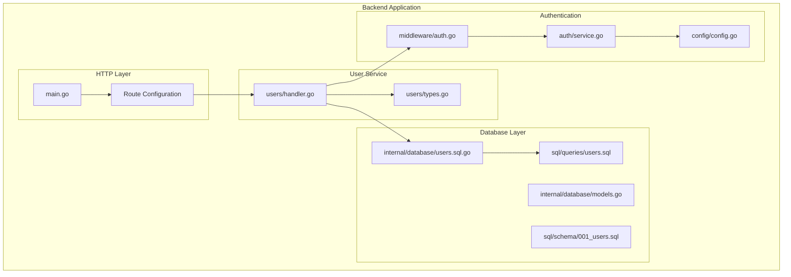
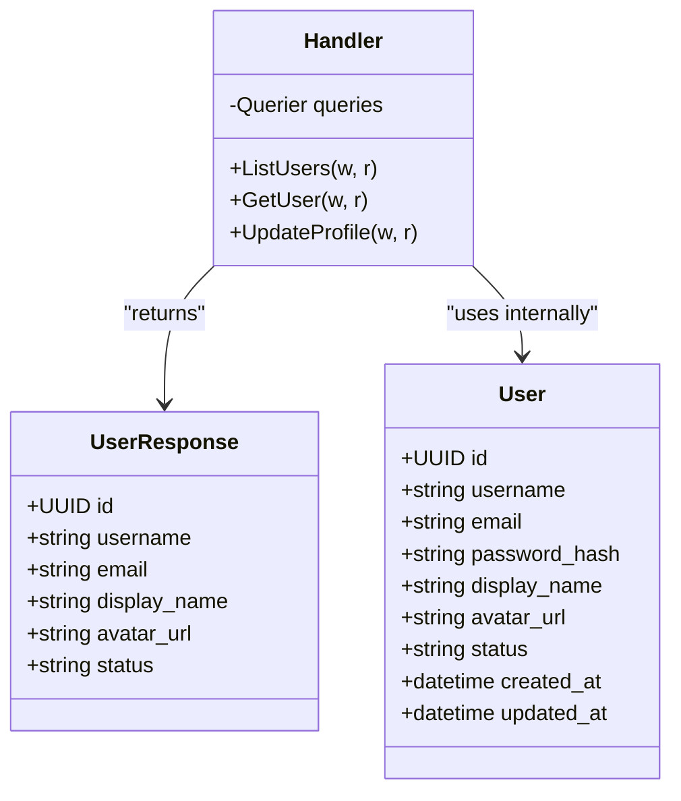
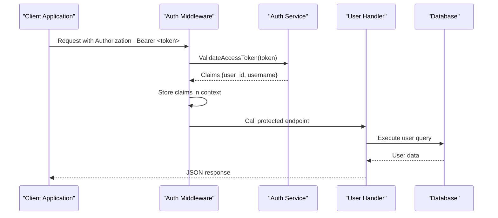
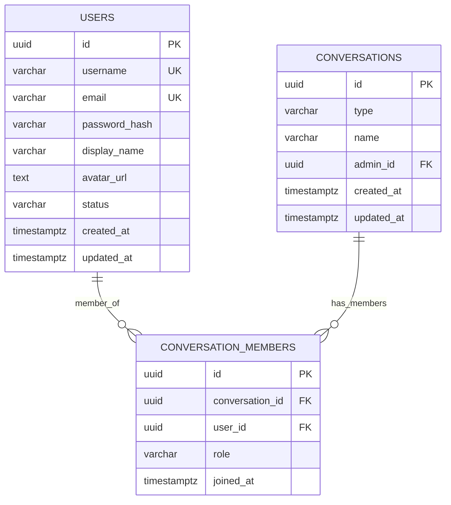
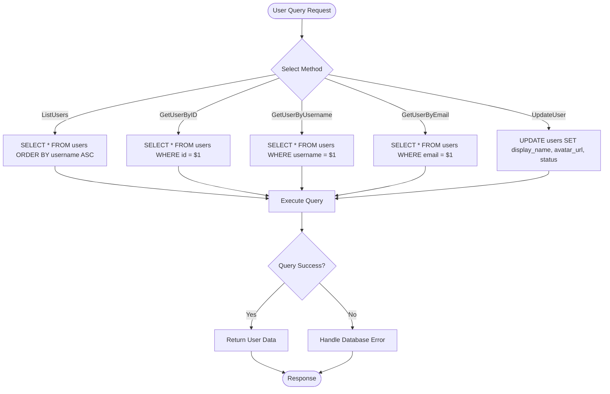
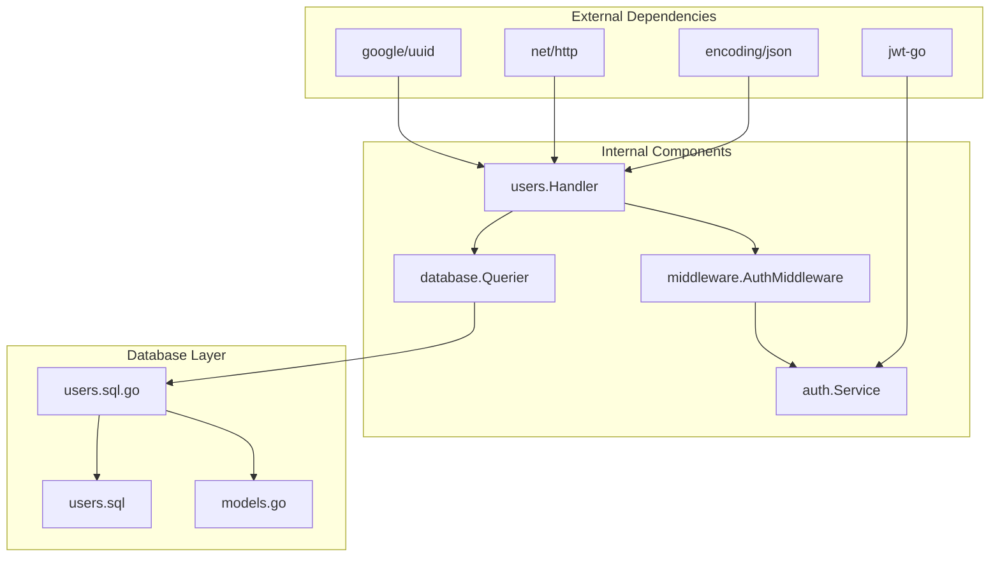
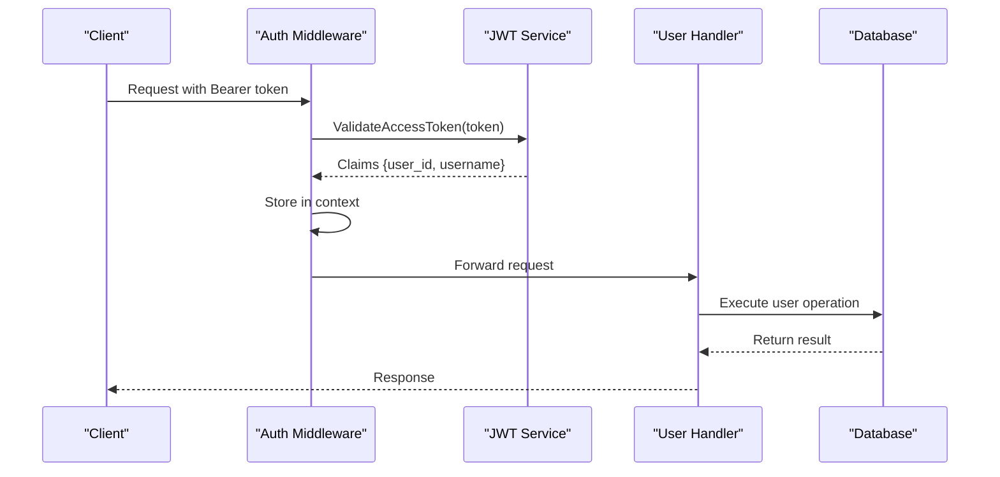

# User Management Endpoints

<cite>
**Referenced Files in This Document**
- [main.go](file://backend/cmd/server/main.go)
- [handler.go](file://backend/internal/users/handler.go)
- [types.go](file://backend/internal/users/types.go)
- [users.sql](file://backend/sql/queries/users.sql)
- [users.sql.go](file://backend/internal/database/users.sql.go)
- [models.go](file://backend/internal/database/models.go)
- [auth.go](file://backend/internal/middleware/auth.go)
- [service.go](file://backend/internal/auth/service.go)
- [config.go](file://backend/internal/config/config.go)
- [001_users.sql](file://backend/sql/schema/001_users.sql)
</cite>

## Table of Contents
1. [Introduction](#introduction)
2. [Project Structure](#project-structure)
3. [Core Components](#core-components)
4. [Architecture Overview](#architecture-overview)
5. [Detailed Component Analysis](#detailed-component-analysis)
6. [Dependency Analysis](#dependency-analysis)
7. [Performance Considerations](#performance-considerations)
8. [Troubleshooting Guide](#troubleshooting-guide)
9. [Conclusion](#conclusion)

## Introduction
This document provides comprehensive API documentation for user management endpoints in the Go-Chatsync application. The user management system enables authenticated users to retrieve profiles, discover other users, and update their own profile information. The API follows REST conventions with JSON payloads and JWT-based authentication.

## Project Structure
The user management functionality is organized within the backend service structure:



**Diagram sources**
- [main.go:90-114](file://backend/cmd/server/main.go#L90-L114)
- [handler.go:12-140](file://backend/internal/users/handler.go#L12-L140)
- [auth.go:11-37](file://backend/internal/middleware/auth.go#L11-L37)

**Section sources**
- [main.go:29-156](file://backend/cmd/server/main.go#L29-L156)
- [handler.go:1-140](file://backend/internal/users/handler.go#L1-L140)

## Core Components

### User Data Model
The user data model defines the structure for user information across the application:



**Diagram sources**
- [types.go:14-21](file://backend/internal/users/types.go#L14-L21)
- [models.go:90-100](file://backend/internal/database/models.go#L90-L100)
- [handler.go:8-11](file://backend/internal/users/handler.go#L8-L11)

### Authentication Integration
The user management endpoints require JWT-based authentication through a bearer token scheme:



**Diagram sources**
- [auth.go:11-37](file://backend/internal/middleware/auth.go#L11-L37)
- [service.go:75-93](file://backend/internal/auth/service.go#L75-L93)
- [handler.go:96-129](file://backend/internal/users/handler.go#L96-L129)

**Section sources**
- [types.go:1-22](file://backend/internal/users/types.go#L1-L22)
- [models.go:90-100](file://backend/internal/database/models.go#L90-L100)
- [auth.go:1-38](file://backend/internal/middleware/auth.go#L1-L38)
- [service.go:1-94](file://backend/internal/auth/service.go#L1-L94)

## Architecture Overview

### Endpoint Routing Configuration
The user management endpoints are configured within the main application router:

```mermaid
graph LR
subgraph "Protected Routes (/api)"
Users[User Management]
Conversations[Conversation Management]
Messages[Message Management]
end
subgraph "Public Routes"
Auth[Authentication]
end
Auth --> Users
Users --> Conversations
Users --> Messages
subgraph "Endpoints"
ListUsers[/api/users GET]
GetUser[/api/users/{id} GET]
UpdateProfile[/api/users/me PUT]
end
Users --> ListUsers
Users --> GetUser
Users --> UpdateProfile
```

**Diagram sources**
- [main.go:90-114](file://backend/cmd/server/main.go#L90-L114)

### Database Schema and Relationships
The user table structure supports efficient user management operations:



**Diagram sources**
- [001_users.sql:3-13](file://backend/sql/schema/001_users.sql#L3-L13)

**Section sources**
- [main.go:90-114](file://backend/cmd/server/main.go#L90-L114)
- [001_users.sql:1-18](file://backend/sql/schema/001_users.sql#L1-L18)

## Detailed Component Analysis

### User Retrieval Endpoints

#### List All Users
The `/api/users` endpoint provides access to all registered users:

**Endpoint**: `GET /api/users`
**Authentication**: Required (Bearer Token)
**Response**: Array of UserResponse objects

**Request Headers**:
- Authorization: Bearer {jwt_token}
- Content-Type: application/json

**Response Body**:
```json
[
  {
    "id": "123e4567-e89b-12d3-a456-426614174000",
    "username": "john_doe",
    "email": "john@example.com",
    "display_name": "John Doe",
    "avatar_url": "https://example.com/avatar.jpg",
    "status": "online"
  }
]
```

**Response Codes**:
- 200: Success - Returns array of users
- 500: Internal Server Error - Database query failed

#### Get Specific User
The `/api/users/{id}` endpoint retrieves a user by their unique identifier:

**Endpoint**: `GET /api/users/{id}`
**Authentication**: Required (Bearer Token)
**Path Parameters**:
- id: UUID of the target user

**Response Body**:
```json
{
  "id": "123e4567-e89b-12d3-a456-426614174000",
  "username": "john_doe",
  "email": "john@example.com",
  "display_name": "John Doe",
  "avatar_url": "https://example.com/avatar.jpg",
  "status": "online"
}
```

**Response Codes**:
- 200: Success - Returns user details
- 400: Bad Request - Invalid UUID format
- 404: Not Found - User does not exist

**Section sources**
- [handler.go:16-47](file://backend/internal/users/handler.go#L16-L47)
- [handler.go:49-83](file://backend/internal/users/handler.go#L49-L83)
- [users.sql:26-29](file://backend/sql/queries/users.sql#L26-L29)
- [users.sql:6-9](file://backend/sql/queries/users.sql#L6-L9)

### Profile Update Operations

#### Update Current User Profile
The `/api/users/me` endpoint allows authenticated users to update their own profile information:

**Endpoint**: `PUT /api/users/me`
**Authentication**: Required (Bearer Token)
**Request Body**:
```json
{
  "display_name": "Updated Name",
  "avatar_url": "https://example.com/new-avatar.jpg",
  "status": "away"
}
```

**Response Body**:
```json
{
  "id": "123e4567-e89b-12d3-a456-426614174000",
  "username": "john_doe",
  "email": "john@example.com",
  "display_name": "Updated Name",
  "avatar_url": "https://example.com/new-avatar.jpg",
  "status": "away"
}
```

**Response Codes**:
- 200: Success - Profile updated
- 400: Bad Request - Invalid request body format
- 500: Internal Server Error - Database update failed

**Section sources**
- [handler.go:85-129](file://backend/internal/users/handler.go#L85-L129)
- [users.sql:31-38](file://backend/sql/queries/users.sql#L31-L38)

### Database Operations

#### User Query Methods
The database layer provides comprehensive user query capabilities:



**Diagram sources**
- [users.sql.go:191-235](file://backend/internal/database/users.sql.go#L191-L235)
- [users.sql.go:265-284](file://backend/internal/database/users.sql.go#L265-L284)

**Section sources**
- [users.sql.go:15-58](file://backend/internal/database/users.sql.go#L15-L58)
- [users.sql.go:142-156](file://backend/internal/database/users.sql.go#L142-L156)
- [users.sql.go:175-189](file://backend/internal/database/users.sql.go#L175-L189)
- [users.sql.go:265-284](file://backend/internal/database/users.sql.go#L265-L284)

## Dependency Analysis

### Component Relationships
The user management system demonstrates clear separation of concerns:



**Diagram sources**
- [handler.go:3-10](file://backend/internal/users/handler.go#L3-L10)
- [auth.go:3-9](file://backend/internal/middleware/auth.go#L3-L9)
- [service.go:3-9](file://backend/internal/auth/service.go#L3-L9)

### Authentication Flow
The authentication system integrates seamlessly with user management:



**Diagram sources**
- [auth.go:11-37](file://backend/internal/middleware/auth.go#L11-L37)
- [service.go:75-93](file://backend/internal/auth/service.go#L75-L93)
- [handler.go:96-129](file://backend/internal/users/handler.go#L96-L129)

**Section sources**
- [handler.go:1-140](file://backend/internal/users/handler.go#L1-L140)
- [auth.go:1-38](file://backend/internal/middleware/auth.go#L1-L38)
- [service.go:1-94](file://backend/internal/auth/service.go#L1-L94)

## Performance Considerations

### Database Indexing Strategy
The user table includes strategic indexes for optimal query performance:

- **Primary Key**: UUID `id` for fast primary key lookups
- **Username Index**: Unique index on `username` for efficient username-based queries
- **Email Index**: Unique index on `email` for secure user identification
- **Status Index**: Standard index on `status` for presence and filtering operations

### Query Optimization
The current implementation uses straightforward queries suitable for small to medium-scale applications. For production environments with large user bases, consider:

- **Pagination**: Implement cursor-based pagination for large user lists
- **Filtering**: Add support for filtering by status, creation date ranges
- **Indexing**: Consider composite indexes for common query patterns
- **Caching**: Implement Redis caching for frequently accessed user profiles

### Response Time Expectations
- Single user lookup: Sub-50ms for indexed queries
- Complete user list: Scales linearly with user count (consider pagination)
- Profile updates: Sub-100ms for typical updates

## Troubleshooting Guide

### Authentication Issues
Common authentication problems and solutions:

**Missing Authorization Header**
- **Symptom**: 401 Unauthorized with "Missing authorization header"
- **Cause**: Client did not include Authorization header
- **Solution**: Include `Authorization: Bearer {token}` header

**Invalid Token Format**
- **Symptom**: 401 Unauthorized with "Invalid authorization header format"
- **Cause**: Header format incorrect (missing "Bearer " prefix)
- **Solution**: Ensure header format is "Bearer {token}"

**Expired or Invalid Token**
- **Symptom**: 401 Unauthorized with "Invalid or expired token"
- **Cause**: JWT token validation failed
- **Solution**: Obtain new token via refresh endpoint or re-authenticate

### User Management Errors

**Invalid User ID Format**
- **Symptom**: 400 Bad Request with "Invalid user ID"
- **Cause**: UUID parsing failure
- **Solution**: Ensure ID is a valid UUID format

**User Not Found**
- **Symptom**: 404 Not Found with "User not found"
- **Cause**: Non-existent user ID
- **Solution**: Verify user exists or use existing user ID

**Database Operation Failures**
- **Symptom**: 500 Internal Server Error
- **Cause**: Database connectivity or query execution errors
- **Solution**: Check database connection and retry operation

**Section sources**
- [auth.go:14-30](file://backend/internal/middleware/auth.go#L14-L30)
- [handler.go:63-72](file://backend/internal/users/handler.go#L63-L72)
- [handler.go:104-107](file://backend/internal/users/handler.go#L104-L107)

## Conclusion
The user management system provides a robust foundation for user profile operations with clear authentication requirements and well-defined API endpoints. The implementation follows modern Go practices with proper separation of concerns, structured error handling, and comprehensive database integration. While the current implementation focuses on essential user operations, future enhancements could include advanced search capabilities, pagination support, and additional filtering options to support larger-scale deployments.

The system's modular design facilitates easy extension for additional user-related features while maintaining security through JWT-based authentication and proper input validation.