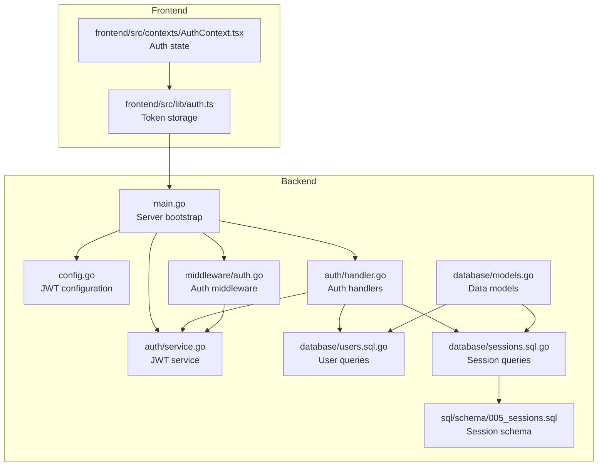
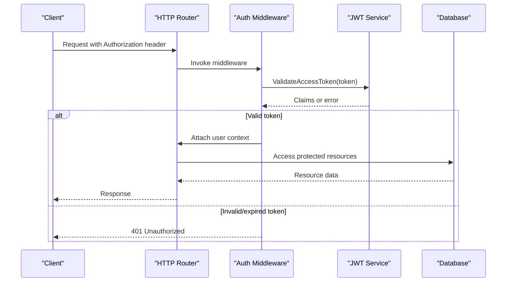
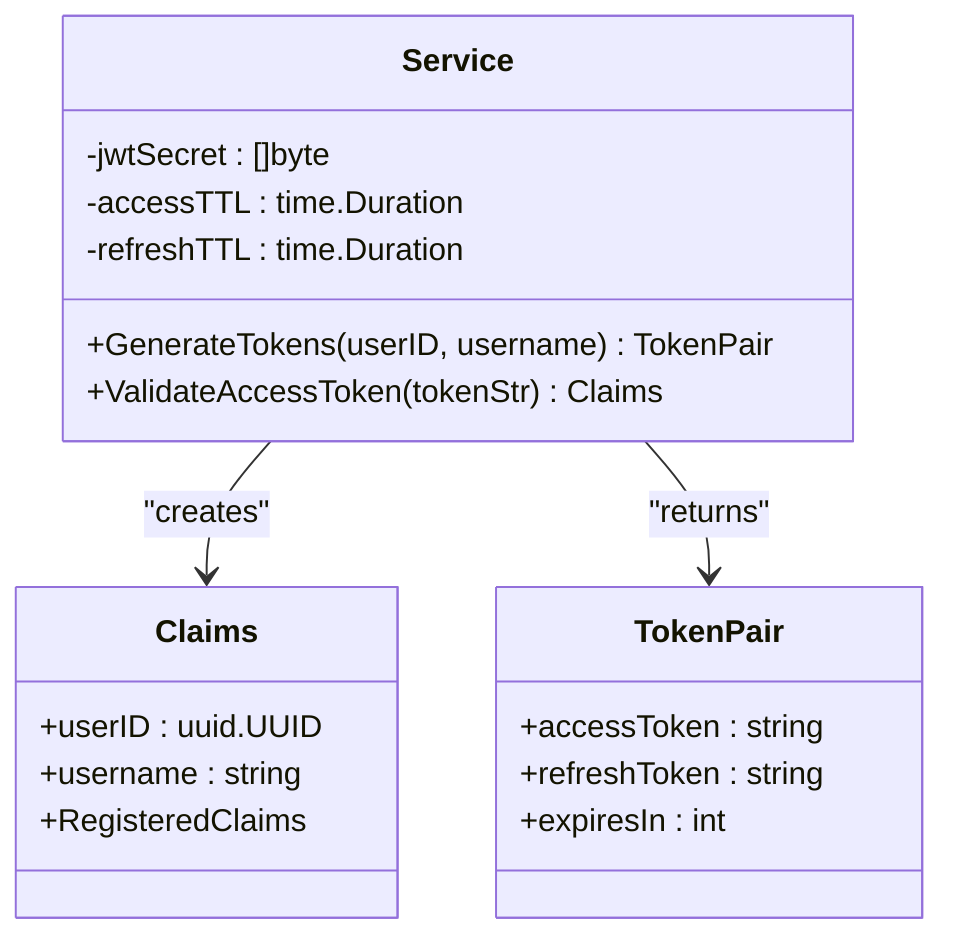
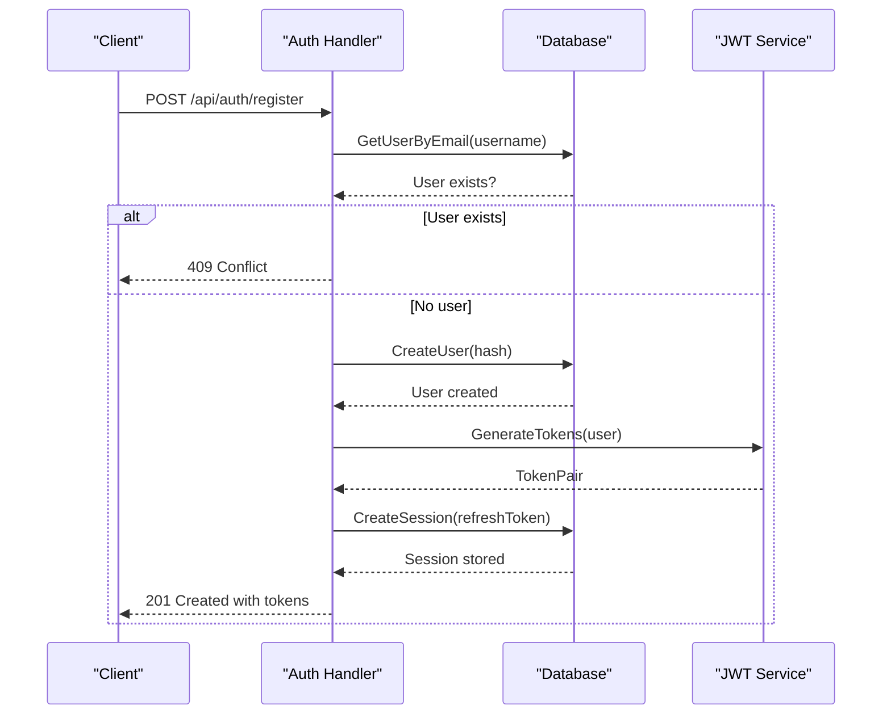
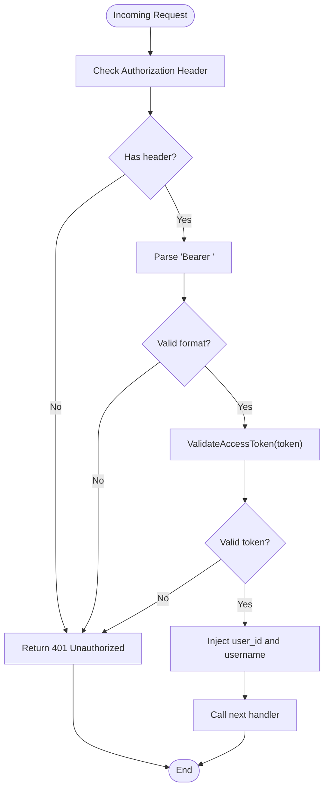
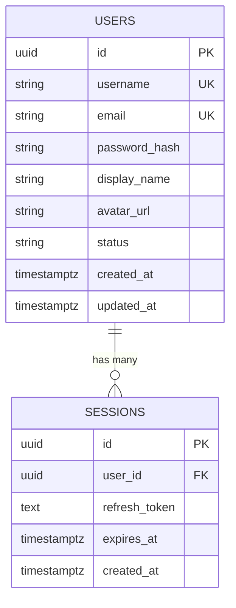
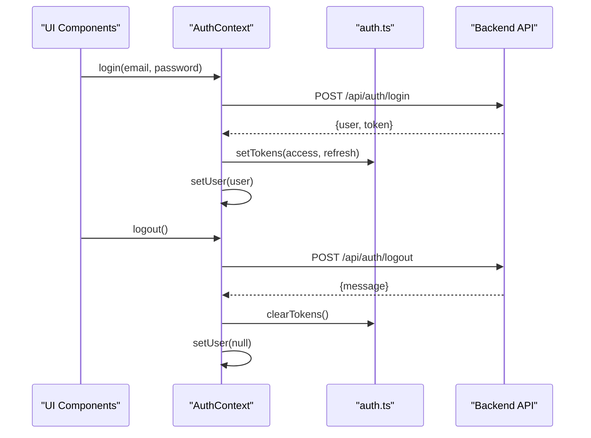
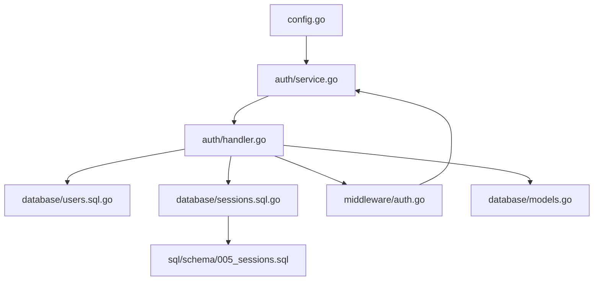

# Authentication System

<cite>
**Referenced Files in This Document**
- [main.go](file://backend/cmd/server/main.go)
- [config.go](file://backend/internal/config/config.go)
- [service.go](file://backend/internal/auth/service.go)
- [handler.go](file://backend/internal/auth/handler.go)
- [auth.go](file://backend/internal/middleware/auth.go)
- [users.sql.go](file://backend/internal/database/users.sql.go)
- [sessions.sql.go](file://backend/internal/database/sessions.sql.go)
- [models.go](file://backend/internal/database/models.go)
- [005_sessions.sql](file://backend/sql/schema/005_sessions.sql)
- [auth.ts](file://frontend/src/lib/auth.ts)
- [AuthContext.tsx](file://frontend/src/contexts/AuthContext.tsx)
- [auth_service_test.go](file://backend/tests/auth_service_test.go)
- [handlers_test.go](file://backend/tests/handlers_test.go)
</cite>

## Table of Contents
1. [Introduction](#introduction)
2. [Project Structure](#project-structure)
3. [Core Components](#core-components)
4. [Architecture Overview](#architecture-overview)
5. [Detailed Component Analysis](#detailed-component-analysis)
6. [Dependency Analysis](#dependency-analysis)
7. [Performance Considerations](#performance-considerations)
8. [Security Considerations](#security-considerations)
9. [Troubleshooting Guide](#troubleshooting-guide)
10. [Conclusion](#conclusion)

## Introduction
This document provides comprehensive documentation for the authentication system in the Go-Chatsync project. It covers JWT token implementation, user registration and login flows, token refresh mechanisms, and session management. The authentication service architecture includes password hashing, token generation and validation processes. We also document configuration options for JWT expiration, refresh tokens, and security headers, along with the relationships between the authentication layer and the database layer for user validation and session persistence. Finally, we address common security concerns such as token theft prevention, session fixation protection, and proper error handling.

## Project Structure
The authentication system spans several backend packages and integrates with the frontend authentication helpers:

- Backend authentication components:
  - Service layer for JWT token generation and validation
  - HTTP handlers for registration, login, refresh, logout, and profile retrieval
  - Middleware for protecting routes using bearer tokens
  - Database layer for user validation and session persistence
- Frontend authentication helpers:
  - Local storage management for access and refresh tokens
  - Context provider for global authentication state

**Diagram sources**
- [main.go:26-148](file://backend/cmd/server/main.go#L26-L148)
- [config.go:9-61](file://backend/internal/config/config.go#L9-L61)
- [service.go:11-94](file://backend/internal/auth/service.go#L11-L94)
- [handler.go:15-294](file://backend/internal/auth/handler.go#L15-L294)
- [auth.go:18-44](file://backend/internal/middleware/auth.go#L18-L44)
- [users.sql.go:15-317](file://backend/internal/database/users.sql.go#L15-L317)
- [sessions.sql.go:15-98](file://backend/internal/database/sessions.sql.go#L15-L98)
- [models.go:74-101](file://backend/internal/database/models.go#L74-L101)
- [005_sessions.sql:1-12](file://backend/sql/schema/005_sessions.sql#L1-L12)
- [auth.ts:1-29](file://frontend/src/lib/auth.ts#L1-L29)
- [AuthContext.tsx:1-95](file://frontend/src/contexts/AuthContext.tsx#L1-L95)

**Section sources**
- [main.go:26-148](file://backend/cmd/server/main.go#L26-L148)
- [config.go:9-61](file://backend/internal/config/config.go#L9-L61)

## Core Components
This section outlines the primary components of the authentication system and their responsibilities:

- JWT Service: Generates access and refresh tokens with configurable TTLs and validates access tokens.
- Auth Handlers: Implements registration, login, refresh, logout, and profile retrieval endpoints.
- Auth Middleware: Protects routes by validating bearer tokens and injecting user context.
- Database Layer: Provides user validation and session persistence for refresh tokens.
- Frontend Helpers: Manage token storage and authentication state in the browser.

Key responsibilities:
- Password hashing: Uses bcrypt for secure password storage during registration.
- Token generation: Creates JWT access tokens with short TTLs and refresh tokens with longer TTLs.
- Token validation: Validates access tokens using HMAC signature verification.
- Session management: Stores refresh tokens in the database with expiration tracking.

**Section sources**
- [service.go:11-94](file://backend/internal/auth/service.go#L11-L94)
- [handler.go:15-294](file://backend/internal/auth/handler.go#L15-L294)
- [auth.go:18-44](file://backend/internal/middleware/auth.go#L18-L44)
- [users.sql.go:15-317](file://backend/internal/database/users.sql.go#L15-L317)
- [sessions.sql.go:15-98](file://backend/internal/database/sessions.sql.go#L15-L98)

## Architecture Overview
The authentication system follows a layered architecture with clear separation of concerns:

**Diagram sources**
- [auth.go:18-44](file://backend/internal/middleware/auth.go#L18-L44)
- [service.go:75-93](file://backend/internal/auth/service.go#L75-L93)

**Section sources**
- [main.go:80-111](file://backend/cmd/server/main.go#L80-L111)
- [auth.go:18-44](file://backend/internal/middleware/auth.go#L18-L44)

## Detailed Component Analysis

### JWT Service
The JWT service encapsulates token generation and validation logic:

**Diagram sources**
- [service.go:11-94](file://backend/internal/auth/service.go#L11-L94)

Implementation highlights:
- Token generation uses HMAC SHA-256 with issuer identification.
- Access tokens have configurable short TTLs (default 15 minutes).
- Refresh tokens have configurable long TTLs (default 7 days).
- Validation ensures correct signing method and verifies signatures against the configured secret.

**Section sources**
- [service.go:11-94](file://backend/internal/auth/service.go#L11-L94)
- [config.go:18-34](file://backend/internal/config/config.go#L18-L34)

### Auth Handlers
The authentication handlers implement the core endpoints:

**Diagram sources**
- [handler.go:58-139](file://backend/internal/auth/handler.go#L58-L139)
- [users.sql.go:15-58](file://backend/internal/database/users.sql.go#L15-L58)
- [sessions.sql.go:24-47](file://backend/internal/database/sessions.sql.go#L24-L47)
- [service.go:37-73](file://backend/internal/auth/service.go#L37-L73)

Key endpoints:
- Registration: Validates input, checks uniqueness, hashes password, creates user, generates tokens, stores refresh session.
- Login: Validates credentials, compares hashed passwords, generates tokens, stores refresh session.
- Refresh: Validates refresh token, deletes old session, issues new tokens, stores new refresh session.
- Logout: Deletes user sessions.
- Profile: Retrieves user information using injected user context.

**Section sources**
- [handler.go:58-278](file://backend/internal/auth/handler.go#L58-L278)
- [users.sql.go:102-123](file://backend/internal/database/users.sql.go#L102-L123)
- [sessions.sql.go:67-97](file://backend/internal/database/sessions.sql.go#L67-L97)

### Auth Middleware
The authentication middleware enforces bearer token validation:

**Diagram sources**
- [auth.go:18-44](file://backend/internal/middleware/auth.go#L18-L44)
- [service.go:75-93](file://backend/internal/auth/service.go#L75-L93)

Behavior:
- Extracts Authorization header and validates Bearer scheme.
- Calls JWT service to validate access tokens.
- Injects user identity into request context for downstream handlers.

**Section sources**
- [auth.go:18-44](file://backend/internal/middleware/auth.go#L18-L44)

### Database Integration
The database layer supports user validation and session persistence:

**Diagram sources**
- [models.go:74-101](file://backend/internal/database/models.go#L74-L101)
- [005_sessions.sql:1-12](file://backend/sql/schema/005_sessions.sql#L1-L12)

Key operations:
- User queries: Create, get by email with password, get by email/username, get by ID.
- Session queries: Create, get by token, delete by ID, delete user sessions, cleanup expired sessions.

**Section sources**
- [users.sql.go:15-317](file://backend/internal/database/users.sql.go#L15-L317)
- [sessions.sql.go:15-98](file://backend/internal/database/sessions.sql.go#L15-L98)
- [models.go:74-101](file://backend/internal/database/models.go#L74-L101)

### Frontend Authentication Integration
The frontend manages tokens and authentication state:

**Diagram sources**
- [AuthContext.tsx:44-75](file://frontend/src/contexts/AuthContext.tsx#L44-L75)
- [auth.ts:15-23](file://frontend/src/lib/auth.ts#L15-L23)

**Section sources**
- [AuthContext.tsx:1-95](file://frontend/src/contexts/AuthContext.tsx#L1-95)
- [auth.ts:1-29](file://frontend/src/lib/auth.ts#L1-L29)

## Dependency Analysis
The authentication system exhibits clear dependency relationships:

**Diagram sources**
- [config.go:23-36](file://backend/internal/config/config.go#L23-L36)
- [service.go:29-35](file://backend/internal/auth/service.go#L29-L35)
- [handler.go:50-56](file://backend/internal/auth/handler.go#L50-L56)
- [auth.go:18-19](file://backend/internal/middleware/auth.go#L18-L19)
- [sessions.sql.go:24-47](file://backend/internal/database/sessions.sql.go#L24-L47)
- [005_sessions.sql:1-12](file://backend/sql/schema/005_sessions.sql#L1-L12)
- [models.go:74-101](file://backend/internal/database/models.go#L74-L101)

Key observations:
- Low coupling between components; each module has a single responsibility.
- Clear separation between service, handler, middleware, and database layers.
- Environment-driven configuration for JWT secrets and TTLs.

**Section sources**
- [main.go:44-55](file://backend/cmd/server/main.go#L44-L55)
- [config.go:23-36](file://backend/internal/config/config.go#L23-L36)

## Performance Considerations
- Token generation is CPU-bound but lightweight; concurrent token creation is safe and tested.
- Database queries for user validation and session management are indexed appropriately.
- Access token TTLs are short to minimize risk exposure; refresh tokens provide persistent sessions.
- Consider rate limiting for authentication endpoints to prevent brute force attacks.

[No sources needed since this section provides general guidance]

## Security Considerations
The authentication system implements several security measures:

- Password hashing: Uses bcrypt with default cost for secure password storage.
- Token validation: Validates HMAC signatures and ensures correct signing method.
- Secret management: JWT secret loaded from environment variables with sensible defaults.
- Session persistence: Refresh tokens stored in database with expiration tracking.
- CORS configuration: Allows Authorization header for cross-origin requests.

Common security issues and mitigations:
- Token theft prevention:
  - Short access token TTLs reduce impact window.
  - Use HTTPS in production to protect tokens in transit.
  - Consider adding token binding or device fingerprinting for advanced protection.
- Session fixation protection:
  - Refresh tokens are rotated on each refresh; old sessions are deleted.
  - Sessions are bound to user IDs and cleaned up on logout.
- Proper error handling:
  - Consistent JSON error responses with appropriate HTTP status codes.
  - Avoid leaking sensitive information in error messages.

**Section sources**
- [handler.go:92-97](file://backend/internal/auth/handler.go#L92-L97)
- [handler.go:214-218](file://backend/internal/auth/handler.go#L214-L218)
- [auth_service_test.go:48-89](file://backend/tests/auth_service_test.go#L48-L89)
- [main.go:64-71](file://backend/cmd/server/main.go#L64-L71)

## Troubleshooting Guide
Common issues and resolutions:

- Invalid or expired access tokens:
  - Verify token format and ensure Bearer scheme is used.
  - Check JWT secret consistency across deployments.
  - Confirm access token TTL configuration.
- Invalid refresh tokens:
  - Ensure refresh token is present and not expired.
  - Verify session exists in database and belongs to the correct user.
- Authentication failures:
  - Check email/password combination and ensure user exists.
  - Confirm bcrypt password comparison succeeds.
- CORS errors:
  - Verify AllowedHeaders includes Authorization.
  - Ensure AllowCredentials is enabled for cross-origin requests.

Testing references:
- Token generation and validation tests demonstrate expected behavior.
- Handler tests validate request validation and error responses.

**Section sources**
- [auth_service_test.go:11-125](file://backend/tests/auth_service_test.go#L11-L125)
- [handlers_test.go:153-206](file://backend/tests/handlers_test.go#L153-L206)
- [auth.go:21-41](file://backend/internal/middleware/auth.go#L21-L41)

## Conclusion
The Go-Chatsync authentication system provides a robust foundation for secure user authentication using JWT tokens. It implements proper password hashing, token generation and validation, refresh mechanisms, and session management backed by a relational database. The architecture is modular, testable, and configurable, enabling secure deployment with minimal friction. By following the security recommendations and leveraging the provided error handling patterns, developers can confidently extend and maintain the authentication system.