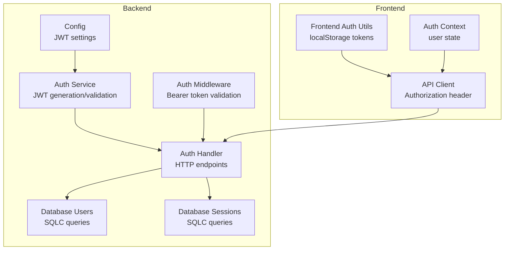
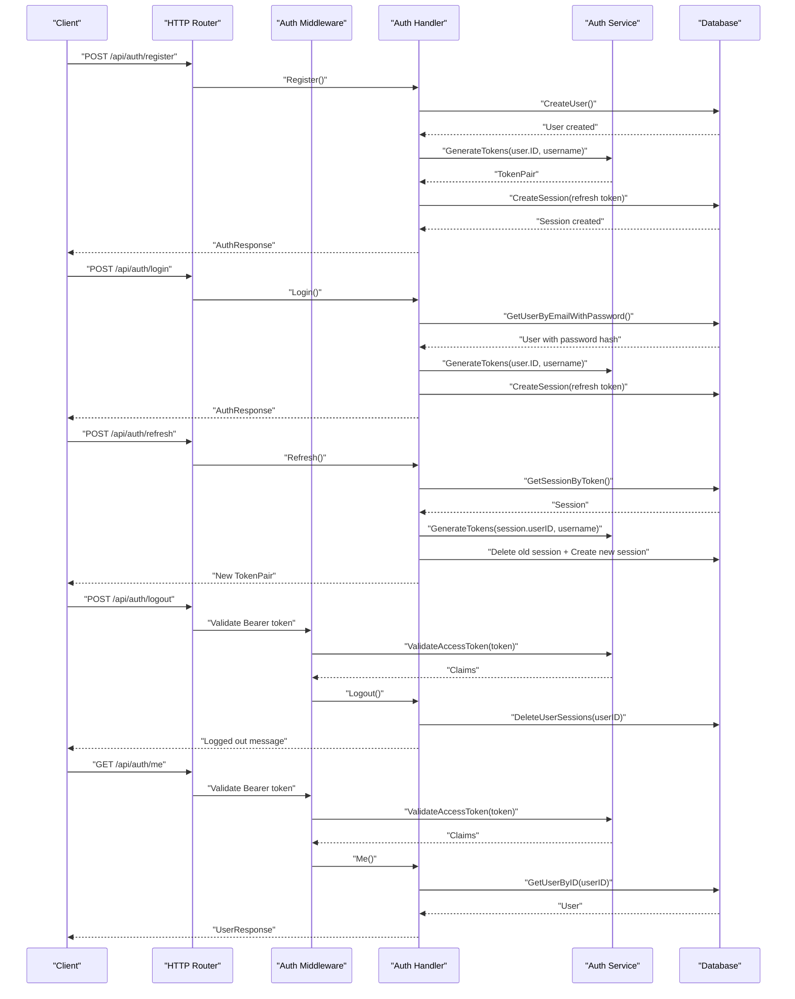
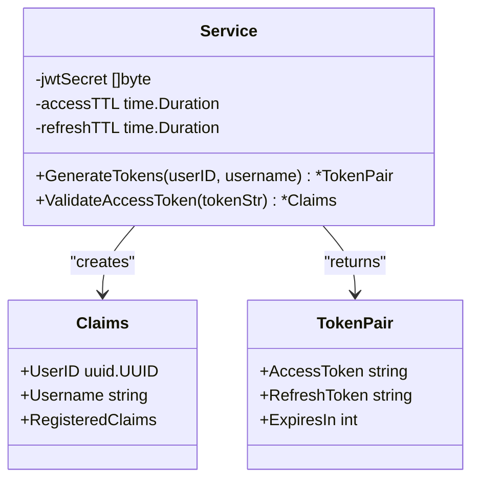
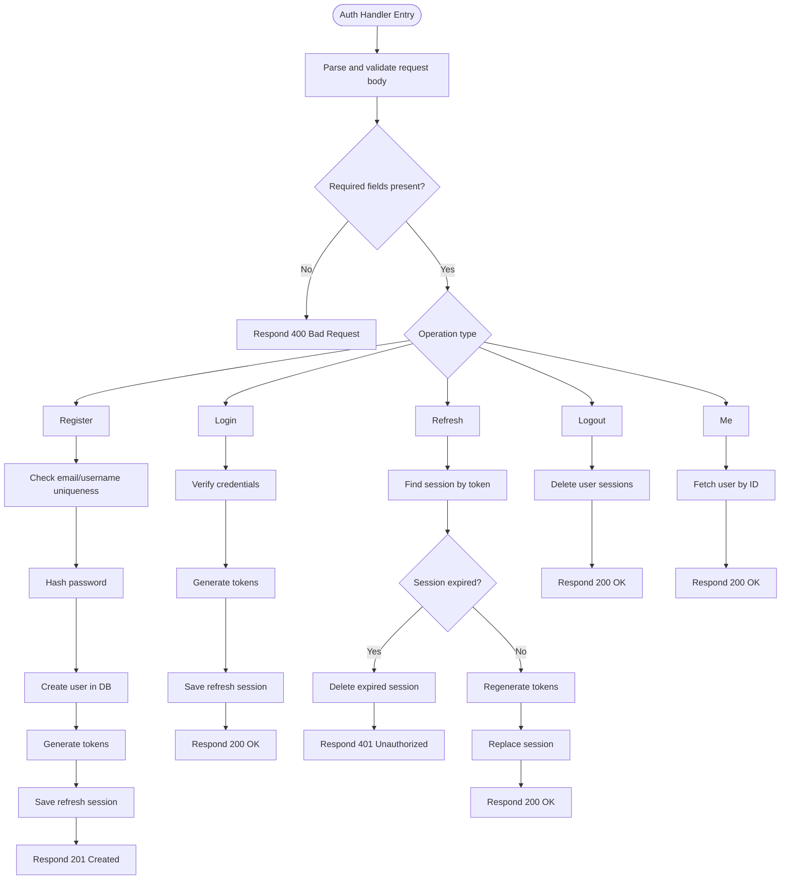
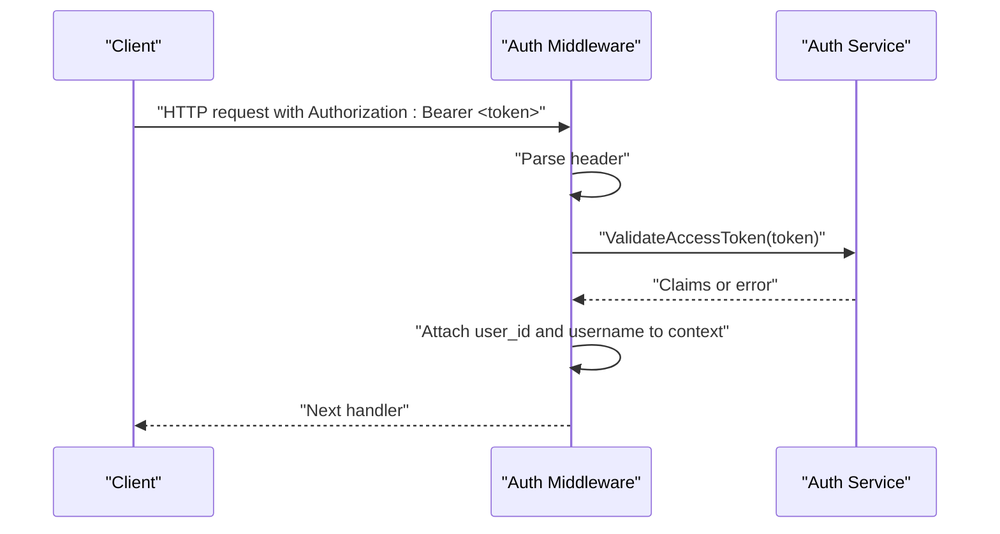
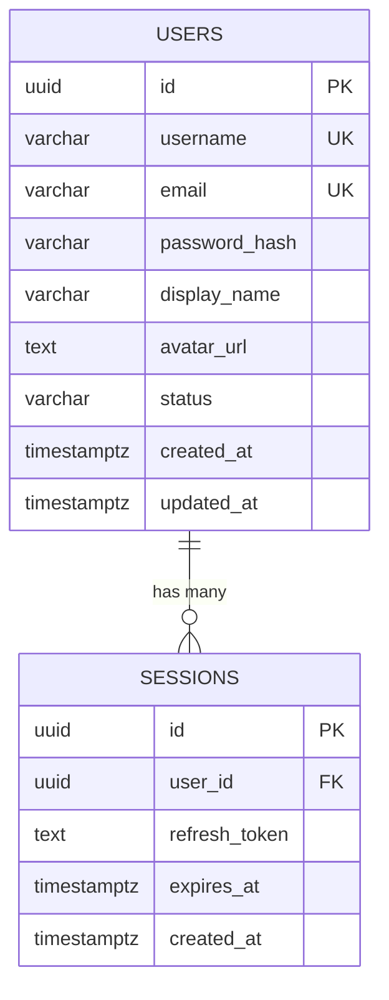
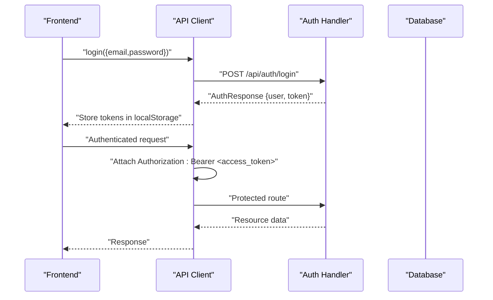
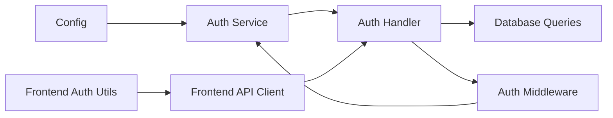

# Authentication System

<cite>
**Referenced Files in This Document**
- [service.go](file://backend/internal/auth/service.go)
- [handler.go](file://backend/internal/auth/handler.go)
- [auth.go](file://backend/internal/middleware/auth.go)
- [users.sql.go](file://backend/internal/database/users.sql.go)
- [sessions.sql.go](file://backend/internal/database/sessions.sql.go)
- [models.go](file://backend/internal/database/models.go)
- [config.go](file://backend/internal/config/config.go)
- [main.go](file://backend/cmd/server/main.go)
- [005_sessions.sql](file://backend/sql/schema/005_sessions.sql)
- [001_users.sql](file://backend/sql/schema/001_users.sql)
- [auth.ts](file://frontend/src/lib/auth.ts)
- [AuthContext.tsx](file://frontend/src/contexts/AuthContext.tsx)
- [api.ts](file://frontend/src/lib/api.ts)
</cite>

## Table of Contents
1. [Introduction](#introduction)
2. [Project Structure](#project-structure)
3. [Core Components](#core-components)
4. [Architecture Overview](#architecture-overview)
5. [Detailed Component Analysis](#detailed-component-analysis)
6. [Dependency Analysis](#dependency-analysis)
7. [Performance Considerations](#performance-considerations)
8. [Troubleshooting Guide](#troubleshooting-guide)
9. [Conclusion](#conclusion)

## Introduction
This document provides comprehensive documentation for the authentication system in the Go-Chatsync project. It covers JWT token generation, validation, and refresh mechanisms, the authentication flow (registration, login, token refresh, and logout), token structure and expiration handling, security measures, authentication handler methods, request validation, response formatting, database integration for user management and session handling, and practical examples of token usage in protected routes.

## Project Structure
The authentication system spans backend services, middleware, database layer, and frontend integration:

- Backend services: auth service for JWT operations, auth handler for HTTP endpoints, middleware for bearer token validation
- Database layer: user and session management via SQLC-generated queries
- Frontend: token storage and Authorization header injection for protected requests

**Diagram sources**
- [config.go:1-61](file://backend/internal/config/config.go#L1-L61)
- [service.go:1-94](file://backend/internal/auth/service.go#L1-L94)
- [handler.go:1-311](file://backend/internal/auth/handler.go#L1-L311)
- [auth.go:1-38](file://backend/internal/middleware/auth.go#L1-L38)
- [users.sql.go:1-317](file://backend/internal/database/users.sql.go#L1-L317)
- [sessions.sql.go:1-98](file://backend/internal/database/sessions.sql.go#L1-L98)
- [auth.ts:1-29](file://frontend/src/lib/auth.ts#L1-L29)
- [AuthContext.tsx:1-95](file://frontend/src/contexts/AuthContext.tsx#L1-L95)
- [api.ts:1-118](file://frontend/src/lib/api.ts#L1-L118)

**Section sources**
- [main.go:29-156](file://backend/cmd/server/main.go#L29-L156)
- [config.go:23-61](file://backend/internal/config/config.go#L23-L61)

## Core Components
- Auth Service: Generates access and refresh tokens with configurable TTLs, validates access tokens
- Auth Handler: Implements registration, login, refresh, logout, and profile retrieval endpoints
- Auth Middleware: Extracts Bearer token from Authorization header and validates it
- Database Layer: Manages users and sessions with SQLC-generated queries
- Frontend Integration: Stores tokens and attaches Authorization headers to requests

**Section sources**
- [service.go:11-94](file://backend/internal/auth/service.go#L11-L94)
- [handler.go:15-311](file://backend/internal/auth/handler.go#L15-L311)
- [auth.go:11-38](file://backend/internal/middleware/auth.go#L11-L38)
- [users.sql.go:15-317](file://backend/internal/database/users.sql.go#L15-L317)
- [sessions.sql.go:15-98](file://backend/internal/database/sessions.sql.go#L15-L98)

## Architecture Overview
The authentication flow integrates HTTP endpoints, middleware validation, JWT operations, and database persistence:

**Diagram sources**
- [handler.go:34-295](file://backend/internal/auth/handler.go#L34-L295)
- [service.go:37-93](file://backend/internal/auth/service.go#L37-L93)
- [auth.go:11-38](file://backend/internal/middleware/auth.go#L11-L38)
- [users.sql.go:102-123](file://backend/internal/database/users.sql.go#L102-L123)
- [sessions.sql.go:67-97](file://backend/internal/database/sessions.sql.go#L67-L97)

## Detailed Component Analysis

### Auth Service
The Auth Service encapsulates JWT operations:
- Token pair generation with access and refresh tokens
- Access token validation with HMAC signature verification
- Configurable TTLs for access and refresh tokens

**Diagram sources**
- [service.go:11-35](file://backend/internal/auth/service.go#L11-L35)
- [service.go:17-27](file://backend/internal/auth/service.go#L17-L27)
- [service.go:37-93](file://backend/internal/auth/service.go#L37-L93)

Key implementation details:
- Access token includes user identity and standard claims with issuer and issue time
- Refresh token is a standard JWT claim set without user-specific fields
- Validation enforces HMAC signing method and checks token validity

**Section sources**
- [service.go:11-35](file://backend/internal/auth/service.go#L11-L35)
- [service.go:37-93](file://backend/internal/auth/service.go#L37-L93)

### Auth Handler Methods
The Auth Handler implements all authentication endpoints with request validation and response formatting:

- Register: Validates input, checks uniqueness, hashes password, creates user, generates tokens, stores refresh session
- Login: Validates credentials, compares password hash, generates tokens, stores refresh session
- Refresh: Validates refresh token existence and expiry, regenerates tokens, replaces session
- Logout: Deletes all user sessions
- Me: Returns authenticated user profile

**Diagram sources**
- [handler.go:34-295](file://backend/internal/auth/handler.go#L34-L295)
- [users.sql.go:15-58](file://backend/internal/database/users.sql.go#L15-L58)
- [sessions.sql.go:24-65](file://backend/internal/database/sessions.sql.go#L24-L65)

**Section sources**
- [handler.go:34-115](file://backend/internal/auth/handler.go#L34-L115)
- [handler.go:128-181](file://backend/internal/auth/handler.go#L128-L181)
- [handler.go:194-247](file://backend/internal/auth/handler.go#L194-L247)
- [handler.go:258-266](file://backend/internal/auth/handler.go#L258-L266)
- [handler.go:278-295](file://backend/internal/auth/handler.go#L278-L295)

### Auth Middleware
The Auth Middleware extracts the Bearer token from the Authorization header, validates it via the Auth Service, and injects user identity into the request context.

**Diagram sources**
- [auth.go:11-38](file://backend/internal/middleware/auth.go#L11-L38)
- [service.go:75-93](file://backend/internal/auth/service.go#L75-L93)

**Section sources**
- [auth.go:11-38](file://backend/internal/middleware/auth.go#L11-L38)

### Database Integration
The database layer manages users and sessions:

- Users table: stores user identity, credentials, and metadata
- Sessions table: stores refresh tokens linked to users with expiry timestamps
- SQLC-generated queries: CreateUser, GetUserByEmail, GetUserByID, GetSessionByToken, CreateSession, DeleteSession, DeleteUserSessions

**Diagram sources**
- [001_users.sql:1-18](file://backend/sql/schema/001_users.sql#L1-L18)
- [005_sessions.sql:1-12](file://backend/sql/schema/005_sessions.sql#L1-L12)
- [models.go:90-101](file://backend/internal/database/models.go#L90-L101)

**Section sources**
- [users.sql.go:15-123](file://backend/internal/database/users.sql.go#L15-L123)
- [sessions.sql.go:15-98](file://backend/internal/database/sessions.sql.go#L15-L98)
- [models.go:74-80](file://backend/internal/database/models.go#L74-L80)

### Frontend Integration
The frontend handles token lifecycle:
- Storage: access and refresh tokens stored in localStorage
- Authentication: Authorization header automatically attached to requests
- Context: maintains user state and clears tokens on errors

**Diagram sources**
- [auth.ts:1-29](file://frontend/src/lib/auth.ts#L1-L29)
- [AuthContext.tsx:44-75](file://frontend/src/contexts/AuthContext.tsx#L44-L75)
- [api.ts:11-37](file://frontend/src/lib/api.ts#L11-L37)
- [handler.go:128-181](file://backend/internal/auth/handler.go#L128-L181)

**Section sources**
- [auth.ts:1-29](file://frontend/src/lib/auth.ts#L1-L29)
- [AuthContext.tsx:27-88](file://frontend/src/contexts/AuthContext.tsx#L27-L88)
- [api.ts:11-37](file://frontend/src/lib/api.ts#L11-L37)

## Dependency Analysis
The authentication system exhibits clear separation of concerns with minimal coupling:

**Diagram sources**
- [config.go:23-36](file://backend/internal/config/config.go#L23-L36)
- [service.go:29-35](file://backend/internal/auth/service.go#L29-L35)
- [handler.go:15-21](file://backend/internal/auth/handler.go#L15-L21)
- [auth.go:11-12](file://backend/internal/middleware/auth.go#L11-L12)
- [main.go:47-58](file://backend/cmd/server/main.go#L47-L58)

**Section sources**
- [main.go:47-58](file://backend/cmd/server/main.go#L47-L58)
- [config.go:23-36](file://backend/internal/config/config.go#L23-L36)

## Performance Considerations
- Token TTLs: Access tokens are short-lived (default 15 minutes) to minimize exposure; refresh tokens last longer (default 7 days)
- Database indexing: Sessions table includes indexes on user_id, refresh_token, and expires_at for efficient lookups
- Password hashing: bcrypt cost defaults are appropriate for production; consider tuning based on hardware
- Middleware overhead: Single HMAC signature verification per protected request; negligible compared to database operations
- Concurrency: Token generation is safe under concurrent load; ensure database connection pooling is configured appropriately

[No sources needed since this section provides general guidance]

## Troubleshooting Guide
Common issues and resolutions:
- Invalid or expired token: Ensure access token is within TTL; use refresh endpoint to obtain a new access token
- Missing authorization header: Include Authorization: Bearer <access_token> in request headers
- Invalid refresh token: Refresh token may be expired or revoked; re-authenticate to obtain new tokens
- User not found: Verify user ID in claims matches existing user record
- Database connectivity: Confirm DSN configuration and migrations executed successfully

**Section sources**
- [auth.go:14-30](file://backend/internal/middleware/auth.go#L14-L30)
- [handler.go:196-216](file://backend/internal/auth/handler.go#L196-L216)
- [config.go:39-44](file://backend/internal/config/config.go#L39-L44)

## Conclusion
The authentication system provides a robust, layered approach to secure user management:
- JWT-based access tokens with short TTLs and refresh tokens for seamless sessions
- Strong request validation and error handling across all endpoints
- Secure middleware enforcement of bearer token requirements
- Efficient database design with proper indexing for session management
- Frontend integration that cleanly handles token storage and Authorization headers

This design balances security, usability, and maintainability while supporting scalable growth.