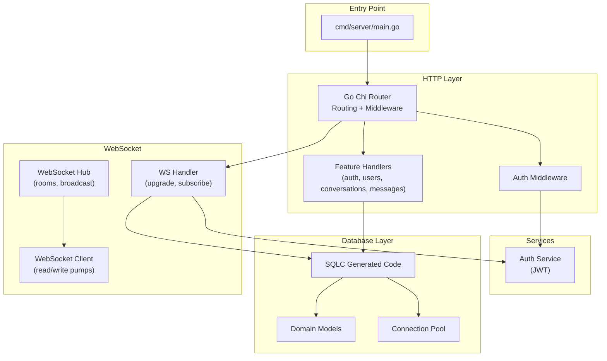
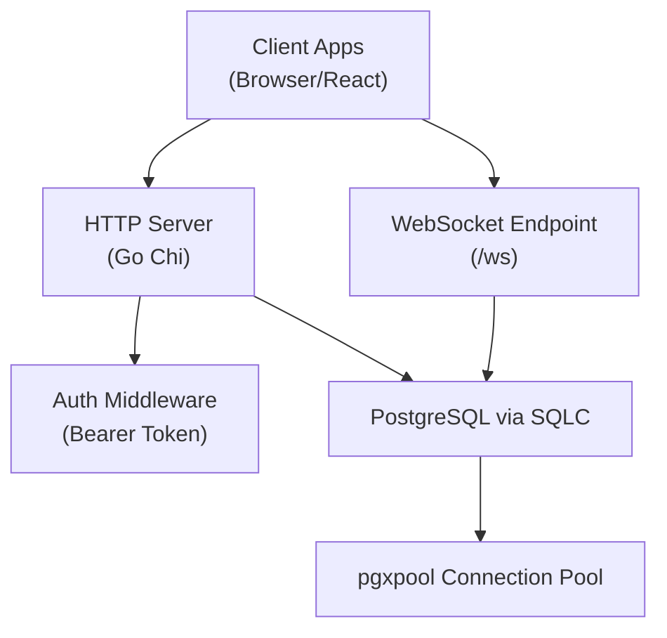
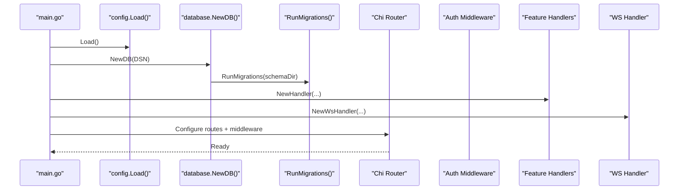
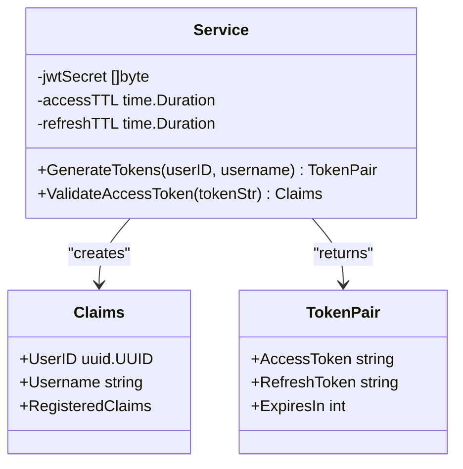
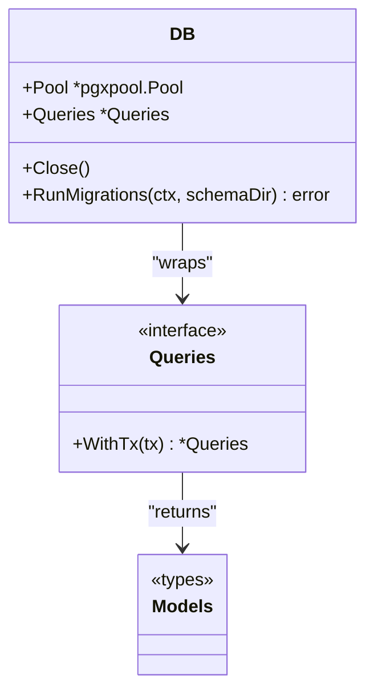
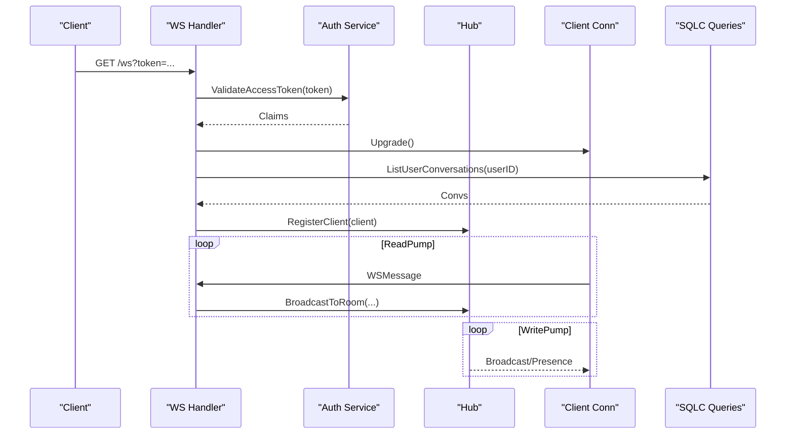
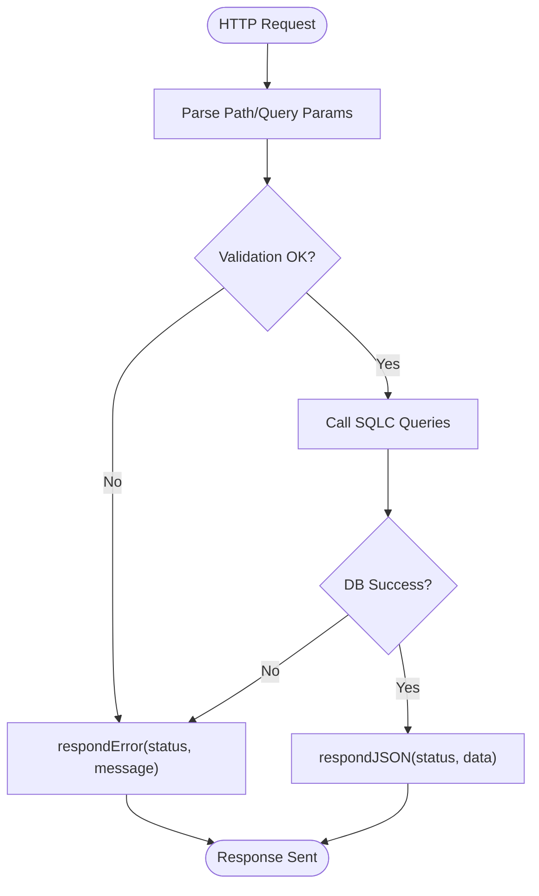
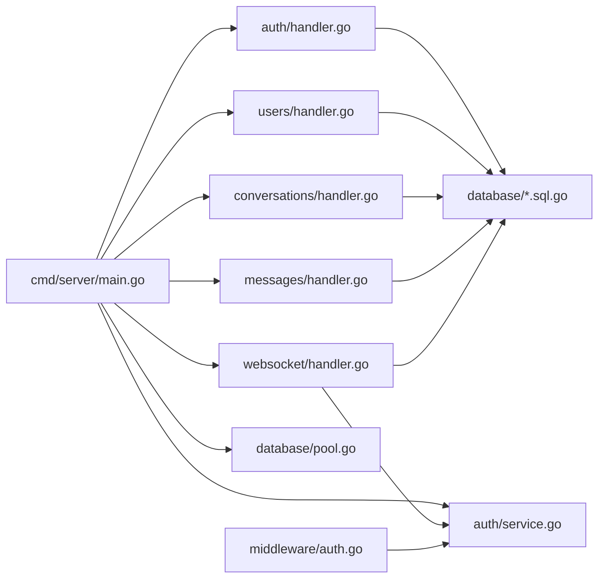

# Backend Architecture

<cite>
**Referenced Files in This Document**
- [main.go](file://backend/cmd/server/main.go)
- [go.mod](file://backend/go.mod)
- [sqlc.yaml](file://backend/sqlc.yaml)
- [config.go](file://backend/internal/config/config.go)
- [db.go](file://backend/internal/database/db.go)
- [pool.go](file://backend/internal/database/pool.go)
- [models.go](file://backend/internal/database/models.go)
- [auth_handler.go](file://backend/internal/auth/handler.go)
- [auth_service.go](file://backend/internal/auth/service.go)
- [auth_middleware.go](file://backend/internal/middleware/auth.go)
- [ws_hub.go](file://backend/internal/websocket/hub.go)
- [ws_client.go](file://backend/internal/websocket/client.go)
- [ws_handler.go](file://backend/internal/websocket/handler.go)
- [conversations_handler.go](file://backend/internal/conversations/handler.go)
- [messages_handler.go](file://backend/internal/messages/handler.go)
- [users_handler.go](file://backend/internal/users/handler.go)
</cite>

## Table of Contents
1. [Introduction](#introduction)
2. [Project Structure](#project-structure)
3. [Core Components](#core-components)
4. [Architecture Overview](#architecture-overview)
5. [Detailed Component Analysis](#detailed-component-analysis)
6. [Dependency Analysis](#dependency-analysis)
7. [Performance Considerations](#performance-considerations)
8. [Troubleshooting Guide](#troubleshooting-guide)
9. [Conclusion](#conclusion)
10. [Appendices](#appendices)

## Introduction
This document describes the backend architecture of a real-time chat application built with Go. The system uses:
- Go Chi router for HTTP routing and middleware
- Gorilla WebSocket for real-time messaging
- SQLC for type-safe database access
- JWT-based authentication with refresh tokens
- Single-port serving for simplicity and operational ease

The backend organizes features into modular packages (auth, users, conversations, messages, websocket), each exposing handlers that depend on a shared database layer and a lightweight service layer for authentication. Cross-cutting concerns include CORS, logging, graceful shutdown, and error handling.

## Project Structure
The backend follows a layered, feature-based organization:
- Entry point initializes configuration, database, services, handlers, and the HTTP server
- Feature packages expose HTTP handlers that delegate to database queries via SQLC-generated interfaces
- Authentication middleware enforces bearer token validation
- WebSocket hub manages connections and rooms, integrating with the database for user and conversation metadata

**Diagram sources**
- [main.go:26-147](file://backend/cmd/server/main.go#L26-L147)
- [auth_middleware.go:18-44](file://backend/internal/middleware/auth.go#L18-L44)
- [auth_handler.go:50-56](file://backend/internal/auth/handler.go#L50-L56)
- [ws_handler.go:17-23](file://backend/internal/websocket/handler.go#L17-L23)
- [ws_hub.go:56-63](file://backend/internal/websocket/hub.go#L56-L63)
- [ws_client.go:20-24](file://backend/internal/websocket/client.go#L20-L24)
- [pool.go:20-42](file://backend/internal/database/pool.go#L20-L42)
- [models.go:14-101](file://backend/internal/database/models.go#L14-L101)

**Section sources**
- [main.go:26-147](file://backend/cmd/server/main.go#L26-L147)
- [go.mod:1-22](file://backend/go.mod#L1-L22)

## Core Components
- HTTP Server and Router: Initializes middleware, routes, and starts the server with graceful shutdown
- Configuration: Loads environment variables for database and server settings
- Database Layer: Connection pooling via pgxpool, migrations, and SQLC-generated queries
- Authentication: JWT access/refresh tokens, middleware to enforce protected routes
- WebSocket: Hub for managing clients and rooms, handlers for upgrades and subscriptions
- Feature Handlers: CRUD endpoints for users, conversations, and messages

**Section sources**
- [main.go:26-147](file://backend/cmd/server/main.go#L26-L147)
- [config.go:23-61](file://backend/internal/config/config.go#L23-L61)
- [pool.go:20-42](file://backend/internal/database/pool.go#L20-L42)
- [auth_service.go:29-35](file://backend/internal/auth/service.go#L29-L35)
- [auth_middleware.go:18-44](file://backend/internal/middleware/auth.go#L18-L44)
- [ws_hub.go:56-63](file://backend/internal/websocket/hub.go#L56-L63)
- [conversations_handler.go:17-19](file://backend/internal/conversations/handler.go#L17-L19)
- [messages_handler.go:17-19](file://backend/internal/messages/handler.go#L17-L19)
- [users_handler.go:16-18](file://backend/internal/users/handler.go#L16-L18)

## Architecture Overview
The system employs a single-port serving architecture:
- All HTTP endpoints and WebSocket upgrade share the same port
- CORS middleware allows cross-origin requests
- Protected routes are gated by authentication middleware
- WebSocket connections are validated via JWT query parameter and upgraded to ws://

**Diagram sources**
- [main.go:58-114](file://backend/cmd/server/main.go#L58-L114)
- [auth_middleware.go:18-44](file://backend/internal/middleware/auth.go#L18-L44)
- [ws_handler.go:25-61](file://backend/internal/websocket/handler.go#L25-L61)
- [pool.go:20-42](file://backend/internal/database/pool.go#L20-L42)

## Detailed Component Analysis

### HTTP Server and Routing
- Initializes configuration, connects to the database, runs migrations, and constructs services
- Registers health check, public auth endpoints, protected routes, and WebSocket endpoint
- Applies logging, recovery, request ID, and CORS middleware
- Starts HTTP server with timeouts and graceful shutdown

**Diagram sources**
- [main.go:26-147](file://backend/cmd/server/main.go#L26-L147)
- [config.go:23-61](file://backend/internal/config/config.go#L23-L61)
- [pool.go:48-76](file://backend/internal/database/pool.go#L48-L76)

**Section sources**
- [main.go:26-147](file://backend/cmd/server/main.go#L26-L147)

### Authentication Service and Middleware
- Service generates and validates JWT tokens with configurable TTLs
- Middleware extracts Bearer token, validates it, and injects user identity into request context
- Handlers read user identity from context for protected operations

**Diagram sources**
- [auth_service.go:11-35](file://backend/internal/auth/service.go#L11-L35)
- [auth_service.go:17-27](file://backend/internal/auth/service.go#L17-L27)
- [auth_service.go:37-73](file://backend/internal/auth/service.go#L37-L73)
- [auth_service.go:75-93](file://backend/internal/auth/service.go#L75-L93)

**Section sources**
- [auth_service.go:11-94](file://backend/internal/auth/service.go#L11-L94)
- [auth_middleware.go:18-44](file://backend/internal/middleware/auth.go#L18-L44)

### Database Layer and SQLC Integration
- Connection pooling with fixed max connections
- Automatic migrations executed from schema directory
- SQLC-generated queries provide type-safe access to PostgreSQL models

**Diagram sources**
- [pool.go:15-42](file://backend/internal/database/pool.go#L15-L42)
- [db.go:14-33](file://backend/internal/database/db.go#L14-L33)
- [models.go:14-101](file://backend/internal/database/models.go#L14-L101)

**Section sources**
- [pool.go:20-76](file://backend/internal/database/pool.go#L20-L76)
- [db.go:14-33](file://backend/internal/database/db.go#L14-L33)
- [sqlc.yaml:1-25](file://backend/sqlc.yaml#L1-L25)

### WebSocket Hub and Client Management
- Hub maintains online users and conversation rooms
- Client handles read/write pumps, ping/pong, and message routing
- WS handler validates token, upgrades connection, subscribes to user conversations, and registers client

**Diagram sources**
- [ws_handler.go:25-61](file://backend/internal/websocket/handler.go#L25-L61)
- [ws_handler.go:63-73](file://backend/internal/websocket/handler.go#L63-L73)
- [auth_service.go:75-93](file://backend/internal/auth/service.go#L75-L93)
- [ws_hub.go:65-86](file://backend/internal/websocket/hub.go#L65-L86)
- [ws_client.go:26-56](file://backend/internal/websocket/client.go#L26-L56)
- [ws_client.go:58-85](file://backend/internal/websocket/client.go#L58-L85)

**Section sources**
- [ws_hub.go:48-170](file://backend/internal/websocket/hub.go#L48-L170)
- [ws_client.go:13-125](file://backend/internal/websocket/client.go#L13-L125)
- [ws_handler.go:17-74](file://backend/internal/websocket/handler.go#L17-L74)

### Feature Handlers (Users, Conversations, Messages)
- Users: list, fetch, and update profile
- Conversations: list, create (private/group), add/remove members, fetch details
- Messages: list with pagination and cursor, send, delete

**Diagram sources**
- [users_handler.go:20-100](file://backend/internal/users/handler.go#L20-L100)
- [conversations_handler.go:21-144](file://backend/internal/conversations/handler.go#L21-L144)
- [messages_handler.go:21-124](file://backend/internal/messages/handler.go#L21-L124)

**Section sources**
- [users_handler.go:12-120](file://backend/internal/users/handler.go#L12-L120)
- [conversations_handler.go:13-235](file://backend/internal/conversations/handler.go#L13-L235)
- [messages_handler.go:13-135](file://backend/internal/messages/handler.go#L13-L135)

## Dependency Analysis
The system exhibits clean separation of concerns:
- Entry point composes dependencies and wires them into handlers and middleware
- Handlers depend on SQLC-generated interfaces, not raw drivers
- Authentication middleware depends on the auth service
- WebSocket handler depends on auth service and database queries

**Diagram sources**
- [main.go:44-55](file://backend/cmd/server/main.go#L44-L55)
- [auth_handler.go:50-56](file://backend/internal/auth/handler.go#L50-L56)
- [users_handler.go:16-18](file://backend/internal/users/handler.go#L16-L18)
- [conversations_handler.go:17-19](file://backend/internal/conversations/handler.go#L17-L19)
- [messages_handler.go:17-19](file://backend/internal/messages/handler.go#L17-L19)
- [ws_handler.go:17-23](file://backend/internal/websocket/handler.go#L17-L23)
- [auth_service.go:29-35](file://backend/internal/auth/service.go#L29-L35)
- [pool.go:20-42](file://backend/internal/database/pool.go#L20-L42)

**Section sources**
- [main.go:44-55](file://backend/cmd/server/main.go#L44-L55)

## Performance Considerations
- Connection Pooling: The database pool is configured with a fixed maximum number of connections suitable for moderate concurrency. Monitor pool utilization under load and adjust MaxConns accordingly.
- WebSocket Backpressure: Client send channels have bounded buffers; ensure consumers keep up to prevent dropped messages.
- Pagination and Limits: Message listing supports limit and cursor parameters to control payload sizes.
- Timeouts: HTTP server applies read/write/idle timeouts to prevent resource exhaustion.

[No sources needed since this section provides general guidance]

## Troubleshooting Guide
- Authentication Failures: Verify Authorization header format and token validity; check JWT secret and TTL configuration.
- Database Connectivity: Confirm DSN correctness and network reachability; inspect pool ping and migration logs.
- WebSocket Issues: Validate token query parameter and origin policy; review read/write pump logs for protocol errors.
- CORS Problems: Ensure AllowedOrigins and exposed headers match client expectations.

**Section sources**
- [auth_middleware.go:21-42](file://backend/internal/middleware/auth.go#L21-L42)
- [ws_handler.go:26-42](file://backend/internal/websocket/handler.go#L26-L42)
- [pool.go:33-35](file://backend/internal/database/pool.go#L33-L35)

## Conclusion
The backend leverages modern Go libraries to deliver a robust, modular, and maintainable chat platform. The single-port architecture simplifies deployment, while SQLC ensures type safety and rapid iteration. Authentication, WebSocket, and HTTP handlers are cleanly separated, enabling independent testing and scaling.

[No sources needed since this section summarizes without analyzing specific files]

## Appendices

### Technology Stack and Compatibility
- Go: 1.23
- Web Framework: Go Chi v5.3.0
- CORS: go-chi/cors v1.2.2
- JWT: golang-jwt/jwt/v5 v5.2.1
- UUID: google/uuid v1.6.0
- WebSocket: gorilla/websocket v1.5.3
- PostgreSQL Driver: jackc/pgx/v5 v5.5.5
- SQLC: v2 configuration with PostgreSQL

**Section sources**
- [go.mod:3-13](file://backend/go.mod#L3-L13)
- [sqlc.yaml:1-25](file://backend/sqlc.yaml#L1-L25)

### Infrastructure Requirements
- PostgreSQL database with schema located under sql/schema
- Environment variables for database credentials and server port
- Optional: Reverse proxy or containerization for production deployment

**Section sources**
- [config.go:23-61](file://backend/internal/config/config.go#L23-L61)
- [pool.go:48-76](file://backend/internal/database/pool.go#L48-L76)

### Security and Middleware Highlights
- CORS: Configured with AllowCredentials and broad allowed methods/headers
- Logging: Logger middleware enabled
- Recovery: Recoverer middleware enabled
- Request IDs: RequestID middleware enabled
- Authentication: Bearer token validation middleware for protected routes

**Section sources**
- [main.go:61-71](file://backend/cmd/server/main.go#L61-L71)
- [auth_middleware.go:18-44](file://backend/internal/middleware/auth.go#L18-L44)