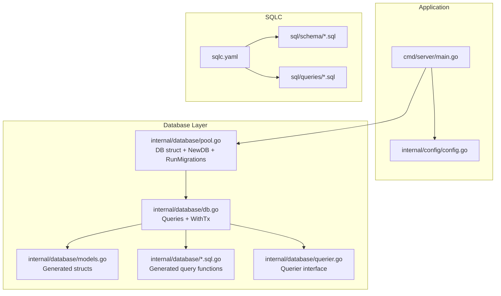
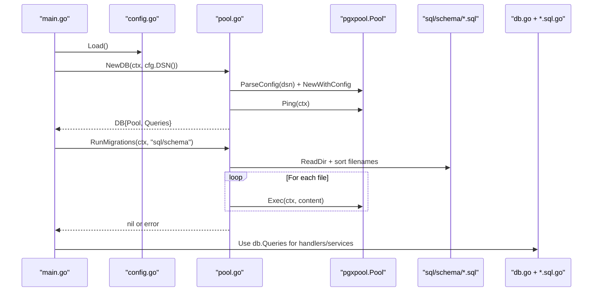
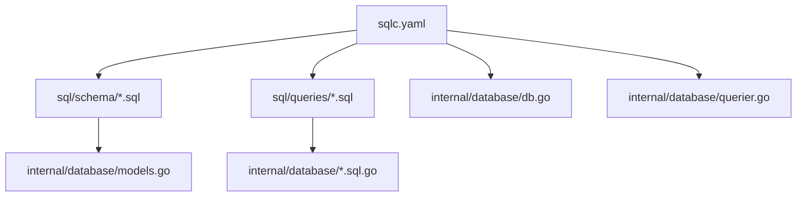
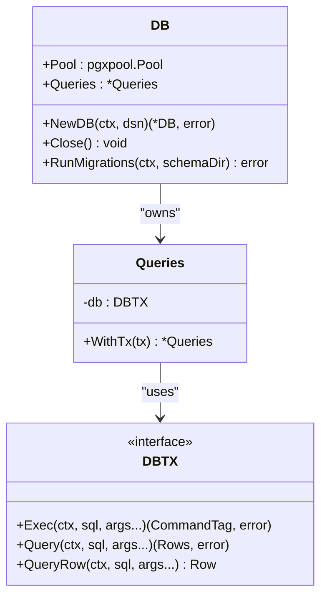
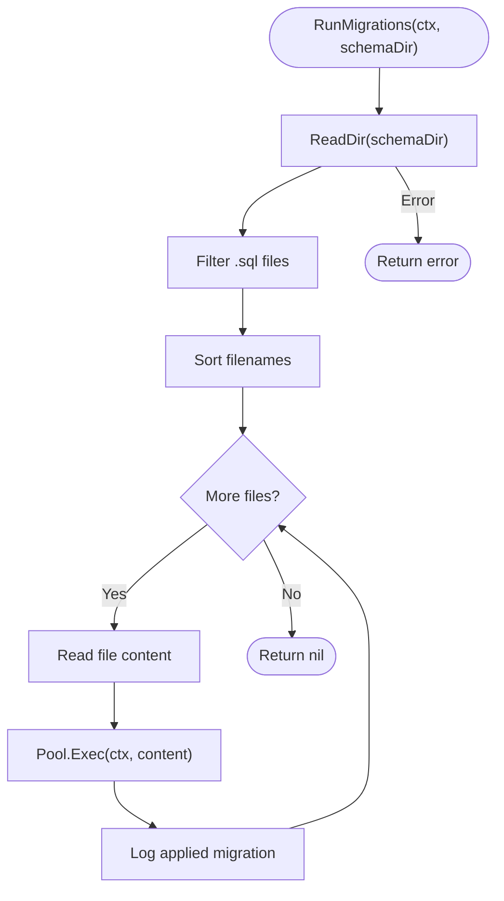
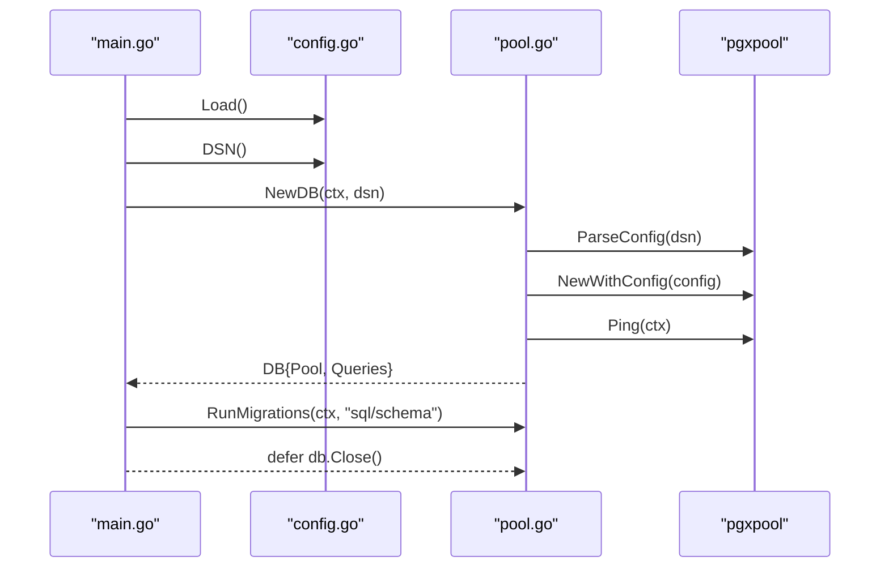
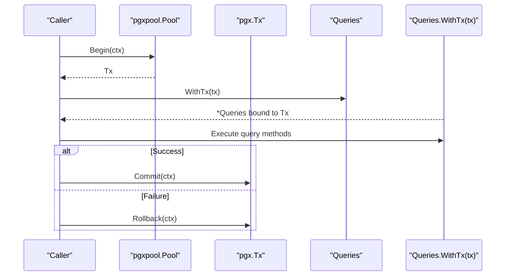
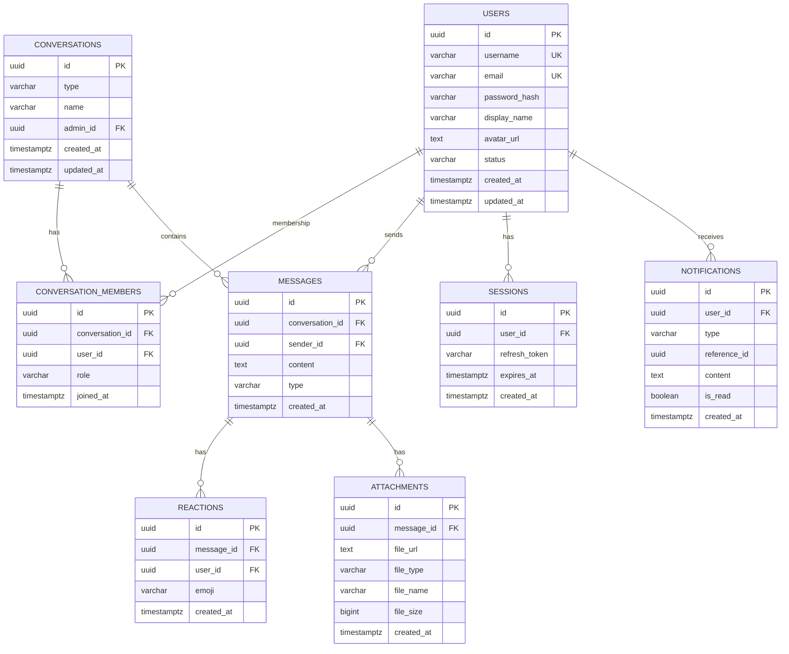
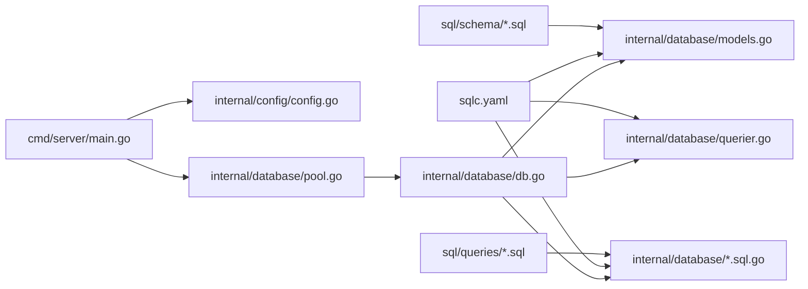

# Database Layer

<cite>
**Referenced Files in This Document**
- [main.go](file://backend/cmd/server/main.go)
- [config.go](file://backend/internal/config/config.go)
- [sqlc.yaml](file://backend/sqlc.yaml)
- [pool.go](file://backend/internal/database/pool.go)
- [db.go](file://backend/internal/database/db.go)
- [models.go](file://backend/internal/database/models.go)
- [querier.go](file://backend/internal/database/querier.go)
- [users.sql.go](file://backend/internal/database/users.sql.go)
- [conversations.sql.go](file://backend/internal/database/conversations.sql.go)
- [messages.sql.go](file://backend/internal/database/messages.sql.go)
- [notifications.sql.go](file://backend/internal/database/notifications.sql.go)
- [sessions.sql.go](file://backend/internal/database/sessions.sql.go)
- [001_users.sql](file://backend/sql/schema/001_users.sql)
- [002_conversations.sql](file://backend/sql/schema/002_conversations.sql)
- [003_messages.sql](file://backend/sql/schema/003_messages.sql)
</cite>

## Table of Contents
1. [Introduction](#introduction)
2. [Project Structure](#project-structure)
3. [Core Components](#core-components)
4. [Architecture Overview](#architecture-overview)
5. [Detailed Component Analysis](#detailed-component-analysis)
6. [Dependency Analysis](#dependency-analysis)
7. [Performance Considerations](#performance-considerations)
8. [Troubleshooting Guide](#troubleshooting-guide)
9. [Conclusion](#conclusion)

## Introduction
This document explains the database layer architecture of the backend, focusing on:
- SQLC code generation workflow and generated artifacts
- Database connection pooling and lifecycle management
- Migration system using SQL schema files and the RunMigrations() function
- DB struct implementation and connection lifecycle
- Transaction handling patterns via the generated Queries interface
- Relationship between generated models, query functions, and the PostgreSQL database
- Examples of database operations, error handling patterns, and performance optimization techniques

## Project Structure
The database layer is organized around:
- SQLC configuration defining schema and query locations and Go code generation settings
- Generated Go models and query functions under internal/database
- A lightweight DB wrapper that owns a connection pool and exposes a Queries instance
- SQL schema files under sql/schema defining the database structure and indexes
- SQL query files under sql/queries implementing CRUD and business logic

**Diagram sources**
- [main.go:29-44](file://backend/cmd/server/main.go#L29-L44)
- [config.go:23-44](file://backend/internal/config/config.go#L23-L44)
- [pool.go:15-46](file://backend/internal/database/pool.go#L15-L46)
- [db.go:14-32](file://backend/internal/database/db.go#L14-L32)
- [models.go:14-100](file://backend/internal/database/models.go#L14-L100)
- [querier.go:13-52](file://backend/internal/database/querier.go#L13-L52)
- [sqlc.yaml:1-25](file://backend/sqlc.yaml#L1-L25)

**Section sources**
- [main.go:29-44](file://backend/cmd/server/main.go#L29-L44)
- [sqlc.yaml:1-25](file://backend/sqlc.yaml#L1-L25)

## Core Components
- DB struct: Wraps a pgx/v5 connection pool and a Queries instance. It provides NewDB for initialization and RunMigrations for applying schema files.
- Queries: Holds a DBTX interface and exposes methods for each SQL query. It supports transactional execution via WithTx.
- Querier interface: Defines the contract for all generated query functions, enabling dependency injection and testing.
- Generated models: Strongly typed structs mapped from database columns and custom types.
- SQLC configuration: Declares schema and query directories, Go package output, and type overrides for UUID and timestamptz.

Key behaviors:
- Connection pool sizing is configured programmatically during pool creation.
- Health checks are performed via pool.Ping after pool creation.
- Migrations are applied sequentially from the schema directory, sorted lexicographically.

**Section sources**
- [pool.go:15-46](file://backend/internal/database/pool.go#L15-L46)
- [db.go:14-32](file://backend/internal/database/db.go#L14-L32)
- [querier.go:13-52](file://backend/internal/database/querier.go#L13-L52)
- [models.go:14-100](file://backend/internal/database/models.go#L14-L100)
- [sqlc.yaml:1-25](file://backend/sqlc.yaml#L1-L25)

## Architecture Overview
The runtime flow connects the application entrypoint to the database layer and SQLC-generated code.

**Diagram sources**
- [main.go:29-44](file://backend/cmd/server/main.go#L29-L44)
- [config.go:23-44](file://backend/internal/config/config.go#L23-L44)
- [pool.go:20-76](file://backend/internal/database/pool.go#L20-L76)
- [db.go:20-32](file://backend/internal/database/db.go#L20-L32)

## Detailed Component Analysis

### SQLC Code Generation Workflow
- Configuration: sqlc.yaml defines:
  - Engine: postgresql
  - Schema: sql/schema/
  - Queries: sql/queries/
  - Output: internal/database
  - Go-specific options: package name, pgx/v5 SQL package, JSON tags, interface emission, type overrides for UUID and timestamptz
- Generated artifacts:
  - Models: Structs representing database rows (e.g., User, Conversation, Message)
  - Queries: Methods on Queries wrapping prepared SQL statements
  - Interface: Querier interface listing all generated methods
  - DBTX wrapper: New and WithTx helpers to support transactions

**Diagram sources**
- [sqlc.yaml:1-25](file://backend/sqlc.yaml#L1-L25)
- [models.go:14-100](file://backend/internal/database/models.go#L14-L100)
- [db.go:14-32](file://backend/internal/database/db.go#L14-L32)
- [querier.go:13-52](file://backend/internal/database/querier.go#L13-L52)

**Section sources**
- [sqlc.yaml:1-25](file://backend/sqlc.yaml#L1-L25)
- [models.go:14-100](file://backend/internal/database/models.go#L14-L100)
- [db.go:14-32](file://backend/internal/database/db.go#L14-L32)
- [querier.go:13-52](file://backend/internal/database/querier.go#L13-L52)

### Database Connection Pooling and Lifecycle
- Creation: NewDB parses the DSN, sets MaxConns to 25, creates the pool, pings it, and returns a DB wrapper with a Queries instance bound to the pool.
- Health checks: pool.Ping(ctx) ensures connectivity immediately after pool creation.
- Closing: db.Close invokes pool.Close to release connections gracefully.
- Usage: Handlers receive db.Queries and operate against the shared pool.

**Diagram sources**
- [pool.go:15-46](file://backend/internal/database/pool.go#L15-L46)
- [db.go:14-32](file://backend/internal/database/db.go#L14-L32)

**Section sources**
- [pool.go:20-46](file://backend/internal/database/pool.go#L20-L46)
- [db.go:20-32](file://backend/internal/database/db.go#L20-L32)

### Migration Management System
- Discovery: ReadDir on the schema directory collects .sql files and sorts them lexicographically.
- Execution: Each file’s content is executed via db.Pool.Exec; errors abort the process with a descriptive message.
- Logging: Successful migrations are logged.

**Diagram sources**
- [pool.go:48-76](file://backend/internal/database/pool.go#L48-L76)

**Section sources**
- [pool.go:48-76](file://backend/internal/database/pool.go#L48-L76)

### DB Struct Implementation and Connection Lifecycle
- Initialization: NewDB constructs a pgxpool.Config from DSN, sets MaxConns, creates the pool, pings it, and binds a Queries instance.
- Shutdown: db.Close delegates to pool.Close.
- Configuration: The DSN is built from environment variables via Config.DSN.

**Diagram sources**
- [main.go:29-44](file://backend/cmd/server/main.go#L29-L44)
- [config.go:39-44](file://backend/internal/config/config.go#L39-L44)
- [pool.go:20-46](file://backend/internal/database/pool.go#L20-L46)

**Section sources**
- [main.go:29-44](file://backend/cmd/server/main.go#L29-L44)
- [config.go:23-44](file://backend/internal/config/config.go#L23-L44)
- [pool.go:20-46](file://backend/internal/database/pool.go#L20-L46)

### Transaction Handling Patterns
- WithTx: Queries.WithTx returns a new Queries bound to a pgx.Tx, enabling transactional execution of generated methods.
- Typical pattern: Acquire a Tx from the pool, execute multiple operations via Queries.WithTx(tx), commit or rollback based on outcome.

**Diagram sources**
- [db.go:28-32](file://backend/internal/database/db.go#L28-L32)

**Section sources**
- [db.go:28-32](file://backend/internal/database/db.go#L28-L32)

### Relationship Between Generated Models, Query Functions, and PostgreSQL
- Models: Generated structs mirror database tables and columns, including custom types (UUID, timestamptz).
- Queries: Each SQL statement becomes a method on Queries returning model structs or slices.
- Interface: Querier defines the contract for all generated methods, enabling test doubles and DI.
- Schema: SQL schema files define tables, constraints, and indexes that underpin the generated models and queries.

**Diagram sources**
- [001_users.sql:3-13](file://backend/sql/schema/001_users.sql#L3-L13)
- [002_conversations.sql:1-21](file://backend/sql/schema/002_conversations.sql#L1-L21)
- [003_messages.sql:1-33](file://backend/sql/schema/003_messages.sql#L1-L33)
- [models.go:14-100](file://backend/internal/database/models.go#L14-L100)

**Section sources**
- [models.go:14-100](file://backend/internal/database/models.go#L14-L100)
- [001_users.sql:1-18](file://backend/sql/schema/001_users.sql#L1-L18)
- [002_conversations.sql:1-25](file://backend/sql/schema/002_conversations.sql#L1-L25)
- [003_messages.sql:1-36](file://backend/sql/schema/003_messages.sql#L1-L36)

### Example Database Operations
- Create a user:
  - Use the generated CreateUser method from users.sql.go via db.Queries.
  - The method executes a RETURNING statement and scans into a generated row struct.
- List messages for a conversation:
  - Use ListMessagesByConversation from messages.sql.go.
  - The method queries with pagination parameters and aggregates reactions per message.
- Add a conversation member:
  - Use AddConversationMember from conversations.sql.go.
  - The method inserts with conflict handling and returns the member ID.

These operations demonstrate:
- Strong typing via generated models and params
- Proper resource management (rows.Close) in multi-row queries
- Aggregation in SQL (JSON building) exposed as interface{} fields in generated rows

**Section sources**
- [users.sql.go:15-58](file://backend/internal/database/users.sql.go#L15-L58)
- [messages.sql.go:113-176](file://backend/internal/database/messages.sql.go#L113-L176)
- [conversations.sql.go:16-60](file://backend/internal/database/conversations.sql.go#L16-L60)

### Error Handling Patterns
- Initialization failures: NewDB wraps parsing, pool creation, and ping errors with context.
- Migration failures: RunMigrations wraps directory read, file read, and exec errors with the failing filename.
- Query execution: Generated methods return error on failure; callers should propagate or wrap errors with context.
- Resource safety: Multi-row queries close rows and check rows.Err().

Best practices:
- Always check and log errors early
- Use context-aware operations (ctx passed to Exec/Query/QueryRow/Ping)
- Prefer returning errors with fmt.Errorf("...: %w", err) to preserve chain

**Section sources**
- [pool.go:20-41](file://backend/internal/database/pool.go#L20-L41)
- [pool.go:48-76](file://backend/internal/database/pool.go#L48-L76)
- [users.sql.go:39-57](file://backend/internal/database/users.sql.go#L39-L57)
- [messages.sql.go:149-175](file://backend/internal/database/messages.sql.go#L149-L175)

## Dependency Analysis
- Application entrypoint depends on config and database layer.
- Database layer depends on pgxpool and SQLC-generated code.
- Generated code depends on sqlc.yaml configuration and SQL schema/query files.

**Diagram sources**
- [main.go:29-44](file://backend/cmd/server/main.go#L29-L44)
- [config.go:23-44](file://backend/internal/config/config.go#L23-L44)
- [pool.go:15-46](file://backend/internal/database/pool.go#L15-L46)
- [db.go:14-32](file://backend/internal/database/db.go#L14-L32)
- [models.go:14-100](file://backend/internal/database/models.go#L14-L100)
- [querier.go:13-52](file://backend/internal/database/querier.go#L13-L52)
- [sqlc.yaml:1-25](file://backend/sqlc.yaml#L1-L25)

**Section sources**
- [main.go:29-44](file://backend/cmd/server/main.go#L29-L44)
- [sqlc.yaml:1-25](file://backend/sqlc.yaml#L1-L25)

## Performance Considerations
- Connection pool sizing: MaxConns is set to 25 during pool creation. Adjust based on workload and database capacity.
- Prepared statements: SQLC emits non-prepared queries by default; enabling prepared queries can reduce planning overhead for frequently executed statements.
- Indexes: Schema files define indexes on hot columns (e.g., users(username), messages(conversation_id)). Ensure appropriate indexing for query patterns.
- Pagination: ListMessagesByConversation uses LIMIT and cursor-like filtering; tune limit and filters to balance latency and throughput.
- JSON aggregation: Queries aggregate related data (e.g., members, reactions) in SQL. Consider caching or denormalization for high-read scenarios.
- Health checks: Use pool.Ping during startup to fail fast on connectivity issues.

[No sources needed since this section provides general guidance]

## Troubleshooting Guide
Common issues and resolutions:
- Connection failures during NewDB:
  - Verify DSN correctness and network connectivity
  - Check MaxConns and database limits
- Migration errors:
  - Inspect the failing file name and content
  - Ensure schema directory path is correct
- Query errors:
  - Wrap returned errors with context for stack traces
  - Confirm parameter types match generated params and models
- Resource leaks:
  - Ensure rows are closed and rows.Err() checked in multi-row queries

**Section sources**
- [pool.go:20-41](file://backend/internal/database/pool.go#L20-L41)
- [pool.go:48-76](file://backend/internal/database/pool.go#L48-L76)
- [users.sql.go:209-234](file://backend/internal/database/users.sql.go#L209-L234)

## Conclusion
The database layer leverages SQLC to generate strongly typed models and query functions, pgx/v5 for robust connection pooling and transactions, and a straightforward migration system. The DB wrapper centralizes pool lifecycle and migration execution, while the Queries interface enables clean dependency injection and testing. By following the documented patterns and performance recommendations, developers can maintain a reliable, scalable, and maintainable database layer.