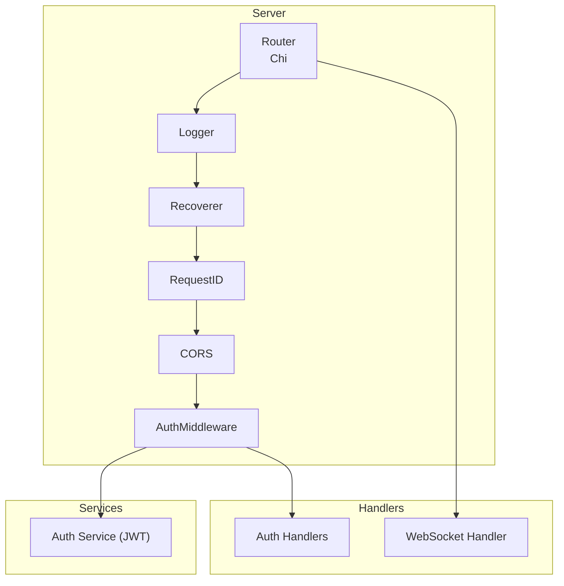
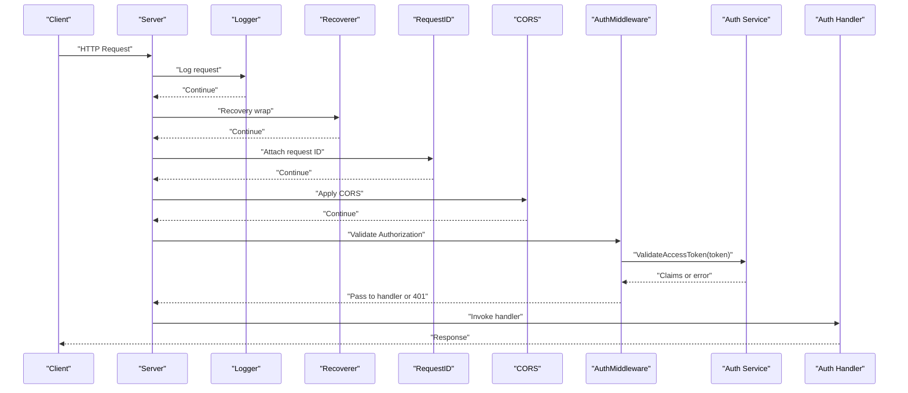
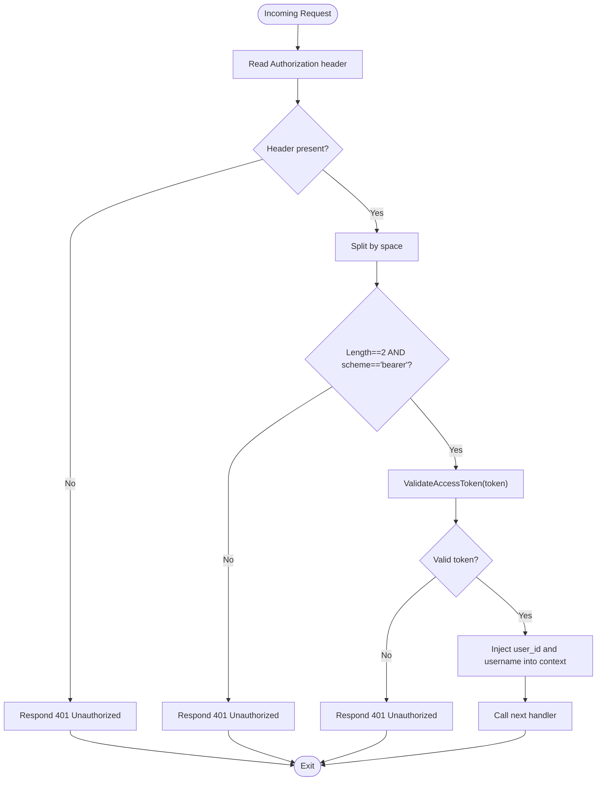
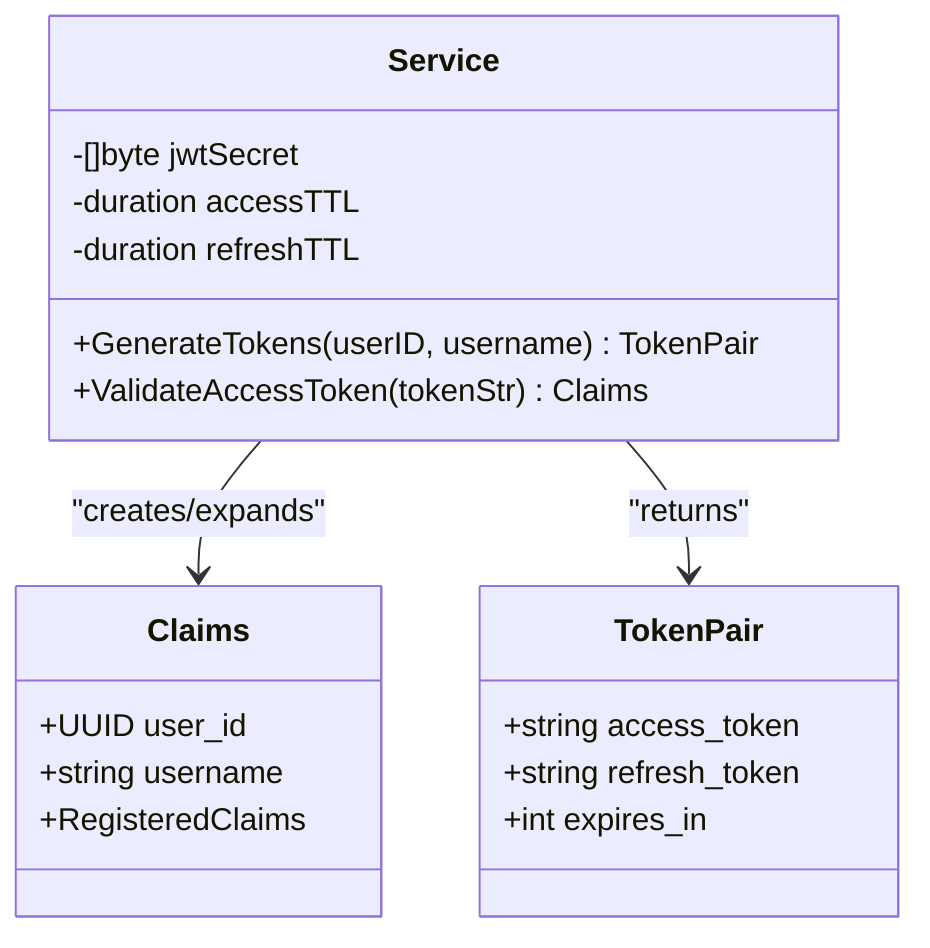
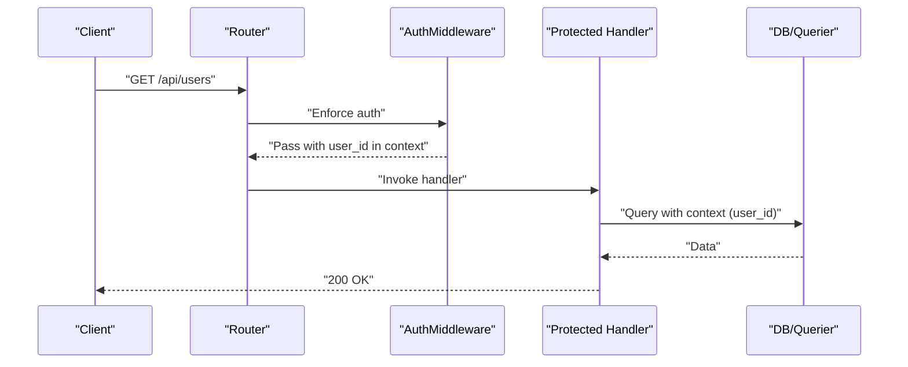
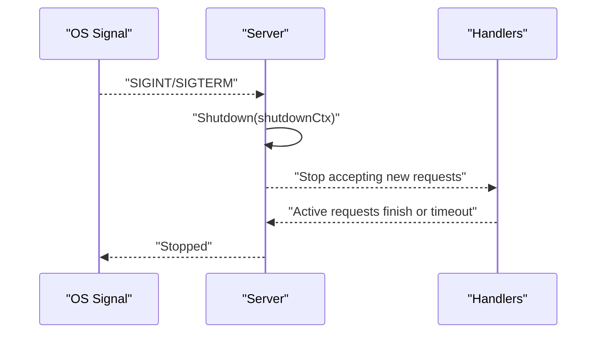
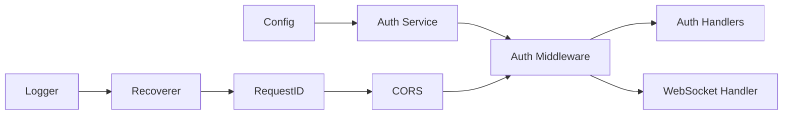

# Middleware and Security

<cite>
**Referenced Files in This Document**
- [main.go](file://backend/cmd/server/main.go)
- [auth.go](file://backend/internal/middleware/auth.go)
- [types.go](file://backend/internal/middleware/types.go)
- [service.go](file://backend/internal/auth/service.go)
- [handler.go](file://backend/internal/auth/handler.go)
- [config.go](file://backend/internal/config/config.go)
- [handler.go](file://backend/internal/websocket/handler.go)
- [middleware_test.go](file://backend/tests/middleware_test.go)
</cite>

## Table of Contents
1. [Introduction](#introduction)
2. [Project Structure](#project-structure)
3. [Core Components](#core-components)
4. [Architecture Overview](#architecture-overview)
5. [Detailed Component Analysis](#detailed-component-analysis)
6. [Dependency Analysis](#dependency-analysis)
7. [Performance Considerations](#performance-considerations)
8. [Troubleshooting Guide](#troubleshooting-guide)
9. [Conclusion](#conclusion)
10. [Appendices](#appendices)

## Introduction
This document explains the middleware and security layer of the backend server. It covers:
- Authentication middleware using JWT tokens
- Request validation and authorization patterns
- CORS configuration
- Request logging, recovery, and request ID tracking
- Middleware chain setup, execution order, and security considerations
- Error handling, panic recovery, and graceful shutdown
- Practical examples, custom middleware development guidelines, and security best practices

## Project Structure
The security and middleware concerns are primarily implemented in:
- Router and middleware chain setup in the server entrypoint
- JWT authentication service and middleware
- Handler implementations that rely on authenticated context
- Configuration for secrets and timeouts
- WebSocket handler that validates tokens via query parameters

**Diagram sources**
- [main.go:61-122](file://backend/cmd/server/main.go#L61-L122)
- [auth.go:11-37](file://backend/internal/middleware/auth.go#L11-L37)
- [service.go:29-93](file://backend/internal/auth/service.go#L29-L93)

**Section sources**
- [main.go:61-122](file://backend/cmd/server/main.go#L61-L122)

## Core Components
- Authentication middleware: extracts Authorization header, validates Bearer token, decodes JWT claims, and injects user identity into the request context.
- JWT service: generates access and refresh tokens with configured TTLs and validates access tokens.
- Protected route groups: apply the authentication middleware to all protected endpoints.
- CORS: configured to allow credentials and specific headers.
- Logging, recovery, request ID: global middleware applied before routing.
- Graceful shutdown: signal handling and controlled server shutdown.

**Section sources**
- [auth.go:11-37](file://backend/internal/middleware/auth.go#L11-L37)
- [service.go:29-93](file://backend/internal/auth/service.go#L29-L93)
- [main.go:63-122](file://backend/cmd/server/main.go#L63-L122)

## Architecture Overview
The middleware chain runs before handlers. Authentication occurs inside a protected route group. WebSocket connections also validate tokens, but via a query parameter.

**Diagram sources**
- [main.go:63-122](file://backend/cmd/server/main.go#L63-L122)
- [auth.go:11-37](file://backend/internal/middleware/auth.go#L11-L37)
- [service.go:75-93](file://backend/internal/auth/service.go#L75-L93)
- [handler.go:249-295](file://backend/internal/auth/handler.go#L249-L295)

## Detailed Component Analysis

### Authentication Middleware
The middleware enforces bearer token authentication:
- Extracts Authorization header
- Validates scheme ("Bearer") and presence
- Calls the JWT service to validate the access token
- Injects user identity into the request context for downstream handlers

**Diagram sources**
- [auth.go:11-37](file://backend/internal/middleware/auth.go#L11-L37)
- [service.go:75-93](file://backend/internal/auth/service.go#L75-L93)

**Section sources**
- [auth.go:11-37](file://backend/internal/middleware/auth.go#L11-L37)
- [types.go:6-15](file://backend/internal/middleware/types.go#L6-L15)
- [middleware_test.go:27-136](file://backend/tests/middleware_test.go#L27-L136)

### JWT Service
Responsibilities:
- Generate access and refresh tokens with issuer and exp/iat claims
- Validate access tokens using HMAC signature verification
- Enforce signing method and secret correctness

**Diagram sources**
- [service.go:11-27](file://backend/internal/auth/service.go#L11-L27)
- [service.go:29-93](file://backend/internal/auth/service.go#L29-L93)

**Section sources**
- [service.go:29-93](file://backend/internal/auth/service.go#L29-L93)
- [config.go:23-36](file://backend/internal/config/config.go#L23-L36)

### Protected Routes and Authorization Pattern
Protected routes are grouped under a middleware that injects user identity into the request context. Handlers read the identity from context and implement resource-level checks as needed.

**Diagram sources**
- [main.go:90-114](file://backend/cmd/server/main.go#L90-L114)
- [handler.go:258-295](file://backend/internal/auth/handler.go#L258-L295)

**Section sources**
- [main.go:90-114](file://backend/cmd/server/main.go#L90-L114)
- [handler.go:258-295](file://backend/internal/auth/handler.go#L258-L295)

### CORS Configuration
The server applies CORS allowing credentials and specific headers. This enables browsers to send cookies and custom headers (including the request ID) while maintaining cross-origin safety.

**Section sources**
- [main.go:67-74](file://backend/cmd/server/main.go#L67-L74)

### Request Logging, Recovery, and Request ID Tracking
Global middleware stack:
- Logger: logs requests/responses
- Recoverer: catches panics and prevents server crashes
- RequestID: attaches a unique identifier per request for tracing

Order of execution is preserved in the server setup.

**Section sources**
- [main.go:63-66](file://backend/cmd/server/main.go#L63-L66)

### Error Handling and Panic Recovery
- Authentication middleware responds with structured JSON errors and appropriate HTTP status codes.
- Global recoverer middleware ensures panics are handled gracefully.
- Handlers consistently return JSON error responses for invalid inputs and unauthorized access.

**Section sources**
- [auth.go:15-29](file://backend/internal/middleware/auth.go#L15-L29)
- [handler.go:297-305](file://backend/internal/auth/handler.go#L297-L305)
- [main.go:65](file://backend/cmd/server/main.go#L65)

### Graceful Shutdown
The server starts in a goroutine, listens for OS signals (SIGINT/SIGTERM), and performs a controlled shutdown with a timeout. This minimizes disruption during redeployments or maintenance.

**Diagram sources**
- [main.go:134-155](file://backend/cmd/server/main.go#L134-L155)

**Section sources**
- [main.go:134-155](file://backend/cmd/server/main.go#L134-L155)

### WebSocket Token Validation
Unlike HTTP endpoints, WebSocket upgrades validate tokens via a query parameter. The handler validates the token against the same JWT service and proceeds with the upgrade.

**Section sources**
- [handler.go:25-41](file://backend/internal/websocket/handler.go#L25-L41)
- [service.go:75-93](file://backend/internal/auth/service.go#L75-L93)

## Dependency Analysis
- The router composes middleware in a strict order: logging → recovery → request ID → CORS → auth → handlers.
- Auth middleware depends on the JWT service for token validation.
- Handlers depend on the request context populated by the auth middleware for user identity.
- Configuration drives JWT TTLs and secrets.

**Diagram sources**
- [main.go:63-122](file://backend/cmd/server/main.go#L63-L122)
- [service.go:29-93](file://backend/internal/auth/service.go#L29-L93)
- [auth.go:11-37](file://backend/internal/middleware/auth.go#L11-L37)

**Section sources**
- [main.go:63-122](file://backend/cmd/server/main.go#L63-L122)
- [service.go:29-93](file://backend/internal/auth/service.go#L29-L93)

## Performance Considerations
- Keep JWT secret and signing method consistent across instances.
- Use reasonable AccessTTL to balance security and UX; refresh tokens mitigate frequent re-authentication.
- Avoid heavy work in middleware; delegate to handlers or services.
- Monitor request volume and adjust timeouts (read/write/idle) as needed.

## Troubleshooting Guide
Common issues and resolutions:
- 401 Unauthorized from AuthMiddleware
  - Missing Authorization header
  - Invalid header format (missing "Bearer " or wrong scheme)
  - Expired or invalid token
  - Verify token generation and signing secret
- CORS failures
  - Ensure AllowedOrigins and AllowCredentials match client expectations
  - Confirm exposed headers and preflight OPTIONS handling
- Panics and crashes
  - Recoverer should prevent crashes; check logs for root cause
- Graceful shutdown hangs
  - Investigate long-running requests exceeding shutdown timeout

**Section sources**
- [auth.go:15-29](file://backend/internal/middleware/auth.go#L15-L29)
- [main.go:67-74](file://backend/cmd/server/main.go#L67-L74)
- [main.go:147-152](file://backend/cmd/server/main.go#L147-L152)

## Conclusion
The middleware and security layer follows a clean separation of concerns:
- Global middleware handles logging, recovery, request IDs, and CORS.
- Authentication middleware enforces bearer token validation and injects user identity.
- Handlers consume the authenticated context and implement domain logic.
- Robust configuration and graceful shutdown ensure reliability and operability.

## Appendices

### Middleware Chain Setup and Execution Order
- Logger → Recoverer → RequestID → CORS → AuthMiddleware → Handlers
- Protected routes are wrapped with AuthMiddleware
- WebSocket handler validates tokens via query parameter

**Section sources**
- [main.go:63-122](file://backend/cmd/server/main.go#L63-L122)
- [handler.go:25-41](file://backend/internal/websocket/handler.go#L25-L41)

### Examples and Best Practices
- Example: Using AuthMiddleware in a route group
  - Apply the middleware around protected endpoints to enforce authentication automatically.
- Example: Custom middleware development
  - Wrap http.Handler, validate inputs, mutate context, and short-circuit with proper HTTP status codes.
- Security best practices
  - Rotate JWT_SECRET regularly
  - Use HTTPS in production
  - Limit AccessTTL and refresh token reuse
  - Validate all inputs in handlers and middleware
  - Log and monitor authentication failures and token validation errors

**Section sources**
- [main.go:90-114](file://backend/cmd/server/main.go#L90-L114)
- [config.go:23-36](file://backend/internal/config/config.go#L23-L36)
- [auth.go:11-37](file://backend/internal/middleware/auth.go#L11-L37)