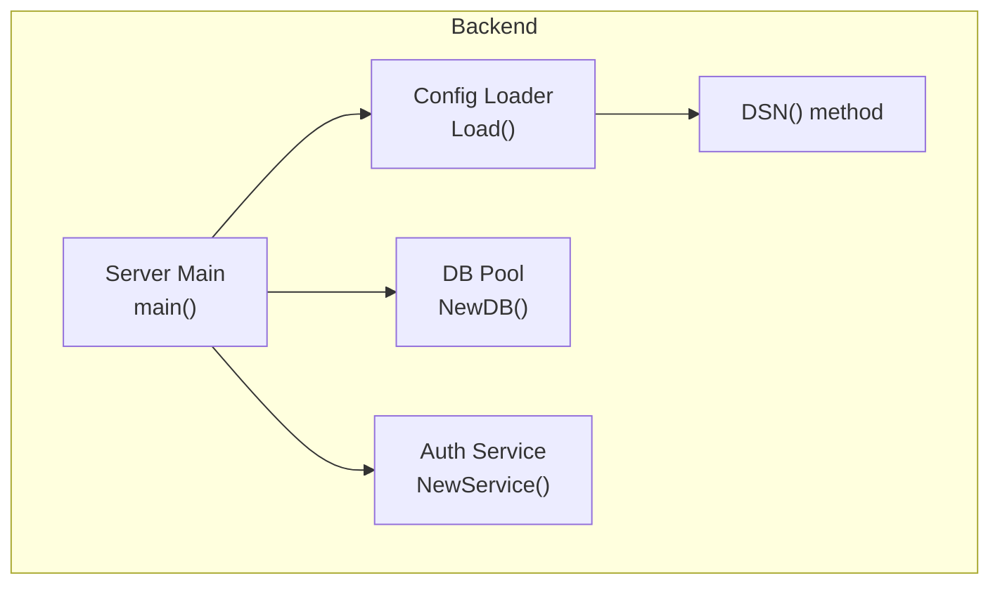
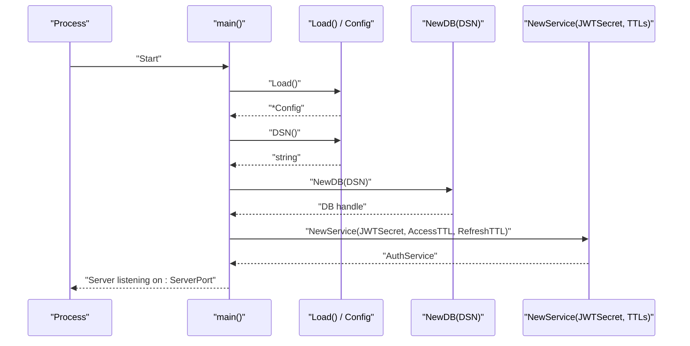
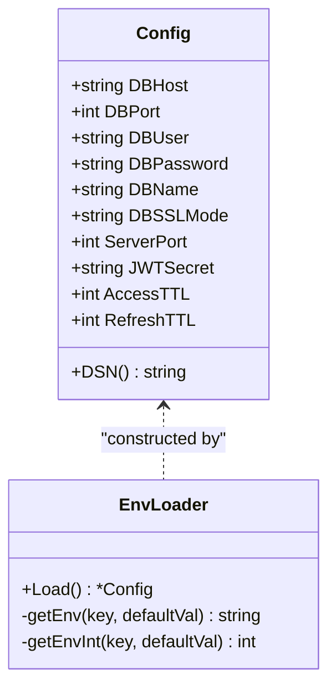
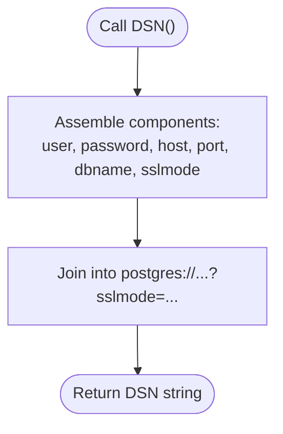
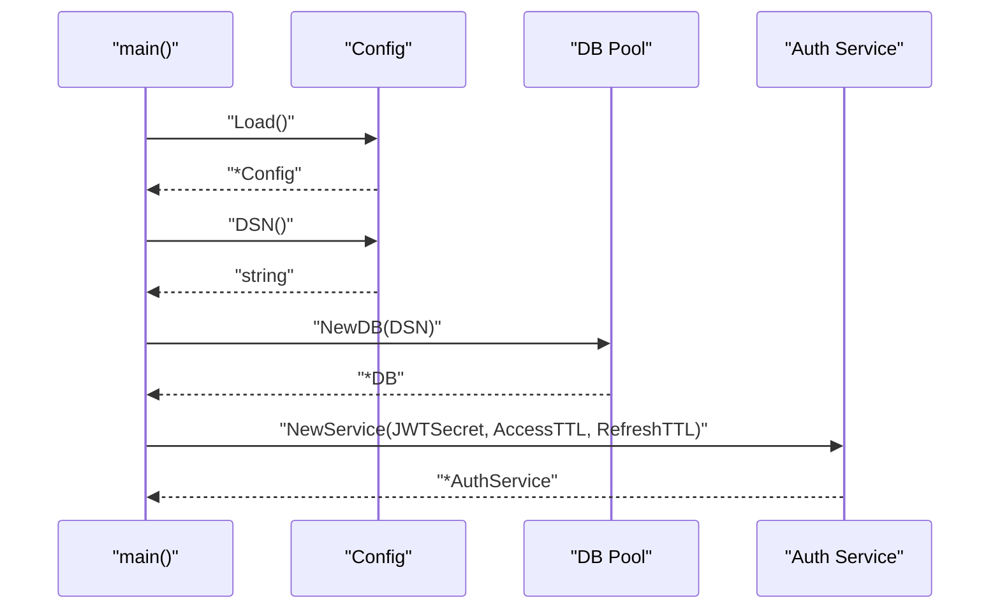
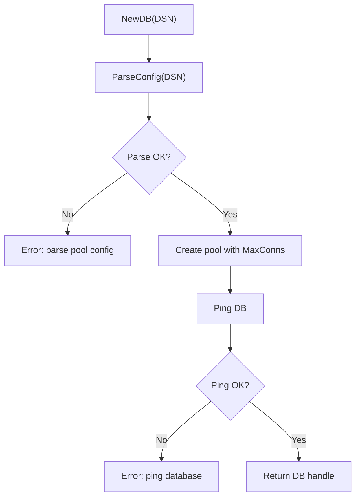
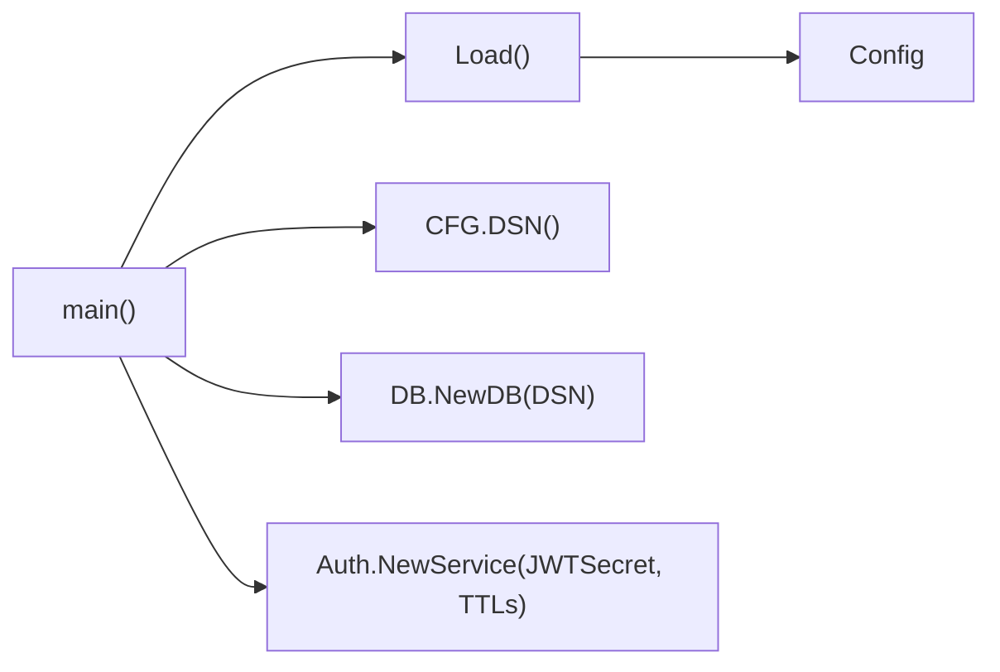

# Server Configuration

<cite>
**Referenced Files in This Document**
- [config.go](file://backend/internal/config/config.go)
- [main.go](file://backend/cmd/server/main.go)
- [pool.go](file://backend/internal/database/pool.go)
- [service.go](file://backend/internal/auth/service.go)
- [README.md](file://README.md)
- [run.sh](file://run.sh)
</cite>

## Table of Contents
1. [Introduction](#introduction)
2. [Project Structure](#project-structure)
3. [Core Components](#core-components)
4. [Architecture Overview](#architecture-overview)
5. [Detailed Component Analysis](#detailed-component-analysis)
6. [Dependency Analysis](#dependency-analysis)
7. [Performance Considerations](#performance-considerations)
8. [Troubleshooting Guide](#troubleshooting-guide)
9. [Conclusion](#conclusion)
10. [Appendices](#appendices)

## Introduction
This document explains the server configuration system used by the backend. It covers how configuration is loaded from environment variables with sensible defaults, the structure of the configuration object, and how the configuration is consumed by the server startup, authentication service, and database connection. It also provides guidance on validating configuration, securing sensitive values, and configuring the server for development, staging, and production environments.

## Project Structure
The configuration system resides in the backend module and is consumed by the server entry point and supporting subsystems:
- Configuration definition and loader live in the config package.
- The server entry point loads configuration and passes it to services and database initialization.
- The authentication service consumes JWT-related configuration.
- The database pool consumes the generated DSN string.

**Diagram sources**
- [config.go:23-44](file://backend/internal/config/config.go#L23-L44)
- [main.go:29-48](file://backend/cmd/server/main.go#L29-L48)
- [pool.go:20-42](file://backend/internal/database/pool.go#L20-L42)
- [service.go:29-35](file://backend/internal/auth/service.go#L29-L35)

**Section sources**
- [config.go:9-44](file://backend/internal/config/config.go#L9-L44)
- [main.go:29-48](file://backend/cmd/server/main.go#L29-L48)

## Core Components
This section documents the configuration model, environment variable loading, and the DSN generation method.

- Config struct fields
  - Database host, port, user, password, database name, SSL mode
  - Server port
  - JWT secret
  - Access token TTL (minutes)
  - Refresh token TTL (days)

- Environment variable loading
  - Load() initializes a Config with environment-backed values and defaults.
  - Helper functions convert strings to integers safely, falling back to defaults when conversion fails.

- DSN generation
  - DSN() produces a PostgreSQL connection string using configured credentials and parameters.

- Consumption
  - Server entry point loads configuration, generates the DSN, connects to the database, and initializes services with JWT-related configuration.

**Section sources**
- [config.go:9-44](file://backend/internal/config/config.go#L9-L44)
- [config.go:23-60](file://backend/internal/config/config.go#L23-L60)
- [main.go:29-48](file://backend/cmd/server/main.go#L29-L48)

## Architecture Overview
The configuration system integrates with the server lifecycle as follows:
- On startup, main() calls Load() to obtain runtime configuration.
- The Config DSN() method is used to construct the PostgreSQL connection string.
- The database pool is initialized with the DSN and pings the database to confirm connectivity.
- The authentication service is constructed with JWT secret and TTL values.
- The HTTP server is started on the configured port.

**Diagram sources**
- [main.go:29-48](file://backend/cmd/server/main.go#L29-L48)
- [config.go:23-44](file://backend/internal/config/config.go#L23-L44)
- [pool.go:20-42](file://backend/internal/database/pool.go#L20-L42)
- [service.go:29-35](file://backend/internal/auth/service.go#L29-L35)

## Detailed Component Analysis

### Config struct and environment loading
- Purpose: Encapsulate all runtime configuration values required by the server.
- Fields: Database connection parameters, server port, JWT secret, and token TTLs.
- Loading behavior:
  - Load() reads environment variables and applies defaults when keys are missing or empty.
  - Numeric values are parsed safely; invalid values fall back to defaults.
- Defaults:
  - Database: localhost host, standard PostgreSQL port, common user/password, default database name, disabled SSL by default.
  - Server: port 8080.
  - JWT: a development secret and short-lived tokens by default.

**Diagram sources**
- [config.go:9-60](file://backend/internal/config/config.go#L9-L60)

**Section sources**
- [config.go:9-60](file://backend/internal/config/config.go#L9-L60)

### DSN generation for PostgreSQL
- Purpose: Produce a connection string suitable for the PostgreSQL driver.
- Inputs: User, password, host, port, database name, SSL mode.
- Output: A formatted DSN string.

**Diagram sources**
- [config.go:39-44](file://backend/internal/config/config.go#L39-L44)

**Section sources**
- [config.go:39-44](file://backend/internal/config/config.go#L39-L44)

### Server startup and configuration consumption
- main() loads configuration, connects to the database using the DSN, runs migrations, initializes services, sets up routes, and starts the HTTP server on the configured port.
- The authentication service receives the JWT secret and TTLs to sign and validate tokens.

**Diagram sources**
- [main.go:29-48](file://backend/cmd/server/main.go#L29-L48)
- [service.go:29-35](file://backend/internal/auth/service.go#L29-L35)
- [pool.go:20-42](file://backend/internal/database/pool.go#L20-L42)

**Section sources**
- [main.go:29-48](file://backend/cmd/server/main.go#L29-L48)

### Database connection and migrations
- The database pool is created from the DSN, with a fixed maximum connection count.
- A ping verifies connectivity.
- Migrations are applied from the schema directory.

**Diagram sources**
- [pool.go:20-42](file://backend/internal/database/pool.go#L20-L42)

**Section sources**
- [pool.go:20-42](file://backend/internal/database/pool.go#L20-L42)

## Dependency Analysis
- main() depends on:
  - Config.Load() for runtime values.
  - Config.DSN() to create the database connection string.
  - DB.NewDB() to establish a connection pool and run migrations.
  - Auth.NewService() to initialize JWT handling with secret and TTLs.

**Diagram sources**
- [main.go:29-48](file://backend/cmd/server/main.go#L29-L48)
- [config.go:23-44](file://backend/internal/config/config.go#L23-L44)
- [pool.go:20-42](file://backend/internal/database/pool.go#L20-L42)
- [service.go:29-35](file://backend/internal/auth/service.go#L29-L35)

**Section sources**
- [main.go:29-48](file://backend/cmd/server/main.go#L29-L48)
- [config.go:23-44](file://backend/internal/config/config.go#L23-L44)
- [pool.go:20-42](file://backend/internal/database/pool.go#L20-L42)
- [service.go:29-35](file://backend/internal/auth/service.go#L29-L35)

## Performance Considerations
- Connection pooling: The database pool enforces a maximum number of connections. Tune this value according to workload and database capacity.
- TTL sizing: Short access tokens reduce risk but increase refresh frequency. Longer refresh windows improve UX but raise exposure windows.
- Port selection: The server listens on a single port; ensure firewall and reverse proxy configurations align with deployment topology.

[No sources needed since this section provides general guidance]

## Troubleshooting Guide
- Database connection failures
  - Verify the DSN is correctly formed and reachable.
  - Confirm the database is accepting connections and credentials are valid.
  - Check that the schema directory exists and contains SQL migration files.

- Authentication errors
  - Ensure the JWT secret is set consistently across deployments.
  - Validate that TTL values are reasonable for your environment.

- Startup issues
  - Confirm environment variables are exported before starting the server.
  - Review logs for explicit error messages during DSN parsing, pool creation, or ping failure.

**Section sources**
- [pool.go:20-42](file://backend/internal/database/pool.go#L20-L42)
- [service.go:29-35](file://backend/internal/auth/service.go#L29-L35)
- [main.go:29-48](file://backend/cmd/server/main.go#L29-L48)

## Conclusion
The configuration system is minimal, explicit, and environment-driven. It centralizes all runtime settings, constructs a PostgreSQL DSN, and feeds values into the database and authentication layers. By setting environment variables appropriately, operators can tailor the server for development, staging, and production while maintaining consistent behavior and strong defaults.

[No sources needed since this section summarizes without analyzing specific files]

## Appendices

### Environment variables and defaults
- Database
  - DB_HOST: default host
  - DB_PORT: default port
  - DB_USER: default user
  - DB_PASSWORD: default password
  - DB_NAME: default database name
  - DB_SSLMODE: default SSL mode
- Server
  - SERVER_PORT: default port
- JWT
  - JWT_SECRET: default secret
  - JWT_ACCESS_TTL: default access token TTL (minutes)
  - JWT_REFRESH_TTL: default refresh token TTL (days)

**Section sources**
- [config.go:23-35](file://backend/internal/config/config.go#L23-L35)

### Practical deployment scenarios
- Development
  - Use local defaults for quick iteration.
  - Keep SERVER_PORT at the default for simplicity.
  - Consider short JWT TTLs for frequent refresh during testing.

- Staging
  - Point DB_* variables to a staging database.
  - Set JWT_SECRET to a secure value.
  - Adjust TTLs to balance usability and security.

- Production
  - Use a dedicated database with enforced SSL mode.
  - Provide a strong, unique JWT_SECRET.
  - Set conservative TTLs and monitor token rotation.

[No sources needed since this section provides general guidance]

### Security considerations
- Never commit secrets to version control.
- Rotate JWT_SECRET regularly and coordinate with deployment pipelines.
- Prefer encrypted connections (SSL/TLS) for database connections in non-local environments.
- Limit environment exposure by scoping variables to the server process and avoiding verbose logging of configuration.

[No sources needed since this section provides general guidance]

### Example environment setup
- Local development
  - Export database and server variables to match local Postgres.
  - Optionally override JWT_SECRET and TTLs for testing.

- Using the provided script
  - The build-and-run script compiles the server and starts it; ensure environment variables are available in the shell session.

**Section sources**
- [run.sh:67-73](file://run.sh#L67-L73)