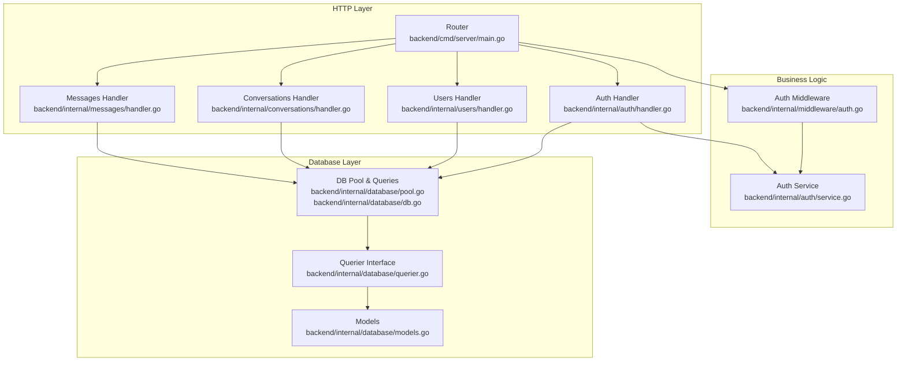
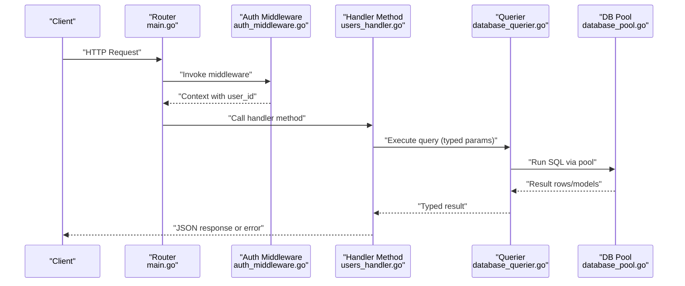
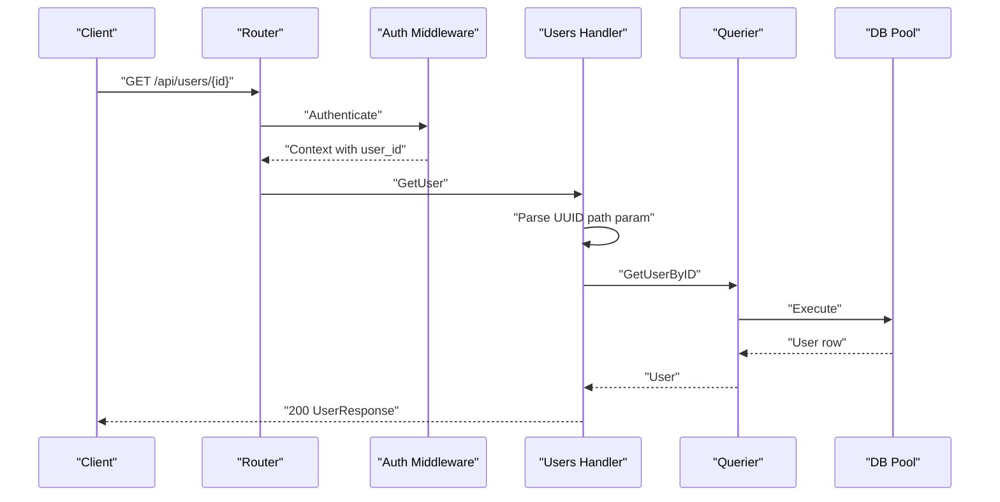
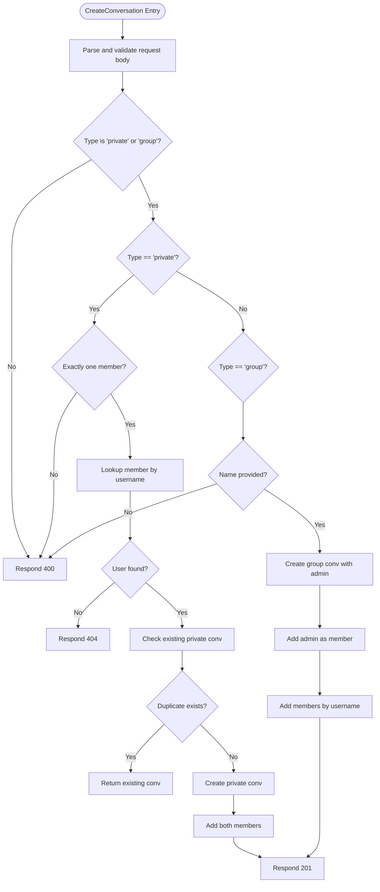
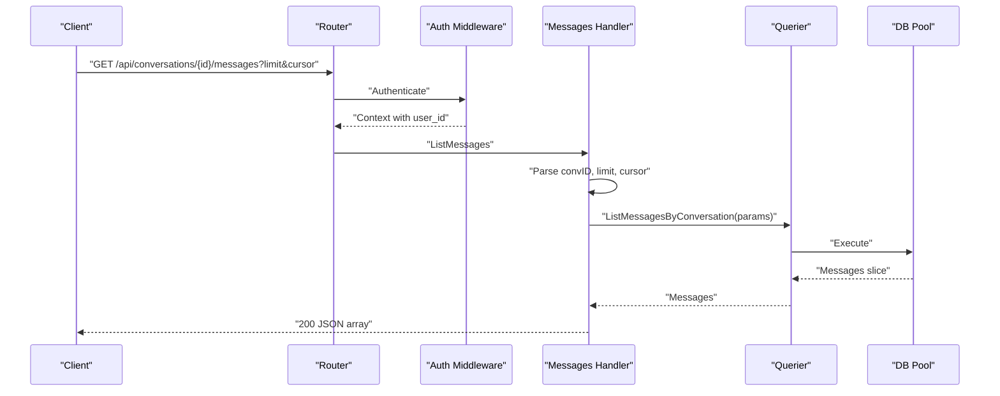
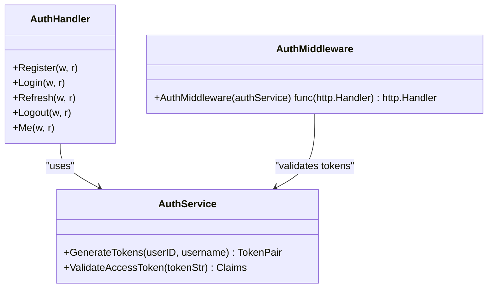
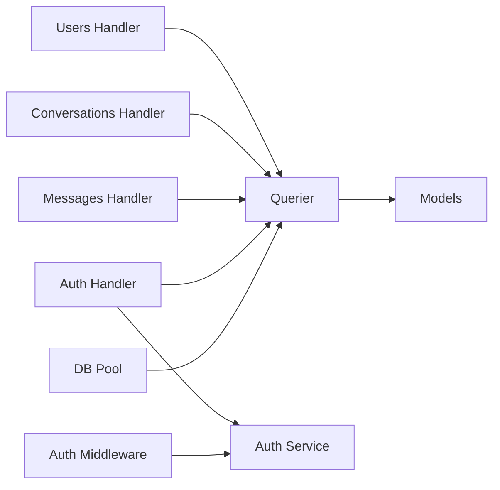

# Service Layer

<cite>
**Referenced Files in This Document**
- [main.go](file://backend/cmd/server/main.go)
- [auth_handler.go](file://backend/internal/auth/handler.go)
- [auth_service.go](file://backend/internal/auth/service.go)
- [users_handler.go](file://backend/internal/users/handler.go)
- [conversations_handler.go](file://backend/internal/conversations/handler.go)
- [messages_handler.go](file://backend/internal/messages/handler.go)
- [auth_types.go](file://backend/internal/auth/types.go)
- [users_types.go](file://backend/internal/users/types.go)
- [conversations_types.go](file://backend/internal/conversations/types.go)
- [messages_types.go](file://backend/internal/messages/types.go)
- [auth_middleware.go](file://backend/internal/middleware/auth.go)
- [database_querier.go](file://backend/internal/database/querier.go)
- [database_models.go](file://backend/internal/database/models.go)
- [database_db.go](file://backend/internal/database/db.go)
- [database_pool.go](file://backend/internal/database/pool.go)
- [config_config.go](file://backend/internal/config/config.go)
</cite>

## Table of Contents
1. [Introduction](#introduction)
2. [Project Structure](#project-structure)
3. [Core Components](#core-components)
4. [Architecture Overview](#architecture-overview)
5. [Detailed Component Analysis](#detailed-component-analysis)
6. [Dependency Analysis](#dependency-analysis)
7. [Performance Considerations](#performance-considerations)
8. [Troubleshooting Guide](#troubleshooting-guide)
9. [Conclusion](#conclusion)

## Introduction
This document explains the service layer architecture and handler implementations across the users, conversations, and messages services. It details how HTTP handlers separate concerns from business logic and database operations, outlines the handler pattern used consistently across services, and describes CRUD operations, request validation, response formatting, error handling, input sanitization, and data transformation between layers. Examples reference specific file locations to help you locate the implementation details.

## Project Structure
The backend follows a layered architecture:
- HTTP Handlers: Define route endpoints and orchestrate request/response handling per domain (users, conversations, messages, auth).
- Business Logic Services: Encapsulate domain-specific logic (e.g., JWT token generation and validation).
- Database Layer: Provides strongly-typed queries via sqlc-generated Querier interface and connection pooling.

**Diagram sources**
- [main.go:86-125](file://backend/cmd/server/main.go#L86-L125)
- [auth_handler.go:15-21](file://backend/internal/auth/handler.go#L15-L21)
- [users_handler.go:12-14](file://backend/internal/users/handler.go#L12-L14)
- [conversations_handler.go:13-15](file://backend/internal/conversations/handler.go#L13-L15)
- [messages_handler.go:13-15](file://backend/internal/messages/handler.go#L13-L15)
- [auth_service.go:11-15](file://backend/internal/auth/service.go#L11-L15)
- [auth_middleware.go:11-37](file://backend/internal/middleware/auth.go#L11-L37)
- [database_querier.go:13-50](file://backend/internal/database/querier.go#L13-L50)
- [database_pool.go:15-46](file://backend/internal/database/pool.go#L15-L46)
- [database_db.go:20-33](file://backend/internal/database/db.go#L20-L33)
- [database_models.go:24-100](file://backend/internal/database/models.go#L24-L100)

**Section sources**
- [main.go:29-158](file://backend/cmd/server/main.go#L29-L158)
- [database_pool.go:20-46](file://backend/internal/database/pool.go#L20-L46)
- [database_db.go:20-33](file://backend/internal/database/db.go#L20-L33)
- [database_querier.go:13-50](file://backend/internal/database/querier.go#L13-L50)

## Core Components
- HTTP Handlers: Each domain module exposes a constructor and HTTP methods for CRUD operations. They decode JSON requests, validate inputs, call database queries via the Querier interface, and format JSON responses.
- Business Logic Services: The auth service encapsulates JWT token generation and validation, while middleware enforces bearer token authentication and injects user identity into the request context.
- Database Layer: A sqlc-generated Querier interface abstracts SQL operations, with a pooled connection manager and typed models for domain entities.

Key responsibilities:
- HTTP Handlers: Request parsing, validation, error handling, response formatting, and delegation to database layer.
- Business Logic Services: Token lifecycle management and validation.
- Database Layer: Strongly-typed queries, transactions support, and model definitions.

**Section sources**
- [users_handler.go:26-47](file://backend/internal/users/handler.go#L26-L47)
- [conversations_handler.go:27-38](file://backend/internal/conversations/handler.go#L27-L38)
- [messages_handler.go:31-68](file://backend/internal/messages/handler.go#L31-L68)
- [auth_service.go:37-73](file://backend/internal/auth/service.go#L37-L73)
- [auth_middleware.go:11-37](file://backend/internal/middleware/auth.go#L11-L37)
- [database_querier.go:13-50](file://backend/internal/database/querier.go#L13-L50)

## Architecture Overview
The system uses a clean separation of concerns:
- Router binds endpoints to handlers.
- Middleware validates tokens and enriches context with user identity.
- Handlers validate inputs, sanitize basic fields, and call Querier methods.
- Querier executes SQL via sqlc-generated methods and returns typed models.
- Handlers format responses and handle errors.

**Diagram sources**
- [main.go:86-125](file://backend/cmd/server/main.go#L86-L125)
- [auth_middleware.go:11-37](file://backend/internal/middleware/auth.go#L11-L37)
- [users_handler.go:26-47](file://backend/internal/users/handler.go#L26-L47)
- [database_querier.go:13-50](file://backend/internal/database/querier.go#L13-L50)
- [database_pool.go:20-46](file://backend/internal/database/pool.go#L20-L46)

## Detailed Component Analysis

### Users Service Handler Pattern
The users handler implements:
- ListUsers: Returns all users with a simple transformation to UserResponse.
- GetUser: Validates UUID path parameter, fetches by ID, and responds with UserResponse.
- UpdateProfile: Reads authenticated user_id from context, decodes request body, updates user, and returns transformed UserResponse.

Validation and sanitization:
- Path parameters parsed and validated as UUID.
- Request body decoded with json.NewDecoder; invalid JSON yields 400.
- Response transformation ensures consistent shape using UserResponse.

Error handling:
- Database errors logged and mapped to 500.
- Not found and bad request scenarios return appropriate HTTP codes.

**Diagram sources**
- [users_handler.go:61-83](file://backend/internal/users/handler.go#L61-L83)
- [database_querier.go:36-36](file://backend/internal/database/querier.go#L36-L36)

**Section sources**
- [users_handler.go:26-47](file://backend/internal/users/handler.go#L26-L47)
- [users_handler.go:61-83](file://backend/internal/users/handler.go#L61-L83)
- [users_handler.go:96-129](file://backend/internal/users/handler.go#L96-L129)
- [users_types.go:8-22](file://backend/internal/users/types.go#L8-L22)

### Conversations Service Handler Pattern
The conversations handler implements:
- ListConversations: Returns all conversations for the authenticated user.
- CreateConversation: Supports private and group conversations with validation and deduplication for private chats.
- AddMember/RemoveMember: Manages group membership with role assignment.
- GetConversation: Fetches a single conversation by ID.

Validation and sanitization:
- Type constrained to "private" or "group".
- Private conversations require exactly one other member; duplicates are detected and reused.
- Group conversations require a name and at least one member.
- UUID parsing for IDs and usernames resolved to user IDs.

Error handling:
- Validation failures return 400.
- Not found returns 404.
- Database errors log and return 500.

**Diagram sources**
- [conversations_handler.go:51-161](file://backend/internal/conversations/handler.go#L51-L161)

**Section sources**
- [conversations_handler.go:27-38](file://backend/internal/conversations/handler.go#L27-L38)
- [conversations_handler.go:51-161](file://backend/internal/conversations/handler.go#L51-L161)
- [conversations_handler.go:176-210](file://backend/internal/conversations/handler.go#L176-L210)
- [conversations_handler.go:225-250](file://backend/internal/conversations/handler.go#L225-L250)
- [conversations_handler.go:264-279](file://backend/internal/conversations/handler.go#L264-L279)
- [conversations_types.go:5-9](file://backend/internal/conversations/types.go#L5-L9)

### Messages Service Handler Pattern
The messages handler implements:
- ListMessages: Cursor-based pagination with limit and optional cursor parameter.
- SendMessage: Creates a message with content validation and defaults message type to "text" if omitted.
- DeleteMessage: Deletes a message by ID only if the caller is the sender.

Validation and sanitization:
- Conversation ID parsed as UUID.
- Limit enforced between 1 and 100; default 50.
- Cursor parsed as UUID; invalid values treated as nil.
- Content required for sending; type defaults to "text".

Error handling:
- Invalid IDs return 400.
- Not found returns 404.
- Database errors log and return 500.

**Diagram sources**
- [messages_handler.go:31-68](file://backend/internal/messages/handler.go#L31-L68)
- [database_querier.go:39-39](file://backend/internal/database/querier.go#L39-L39)

**Section sources**
- [messages_handler.go:31-68](file://backend/internal/messages/handler.go#L31-L68)
- [messages_handler.go:82-124](file://backend/internal/messages/handler.go#L82-L124)
- [messages_handler.go:138-158](file://backend/internal/messages/handler.go#L138-L158)
- [messages_types.go:5-9](file://backend/internal/messages/types.go#L5-L9)

### Authentication Service and Middleware
The auth service and middleware coordinate:
- Auth Handler: Registration, login, token refresh, logout, and profile retrieval.
- Auth Service: Generates access and refresh tokens with TTLs and validates access tokens.
- Auth Middleware: Extracts Bearer token, validates signature and claims, and injects user identity into context.

**Diagram sources**
- [auth_service.go:11-93](file://backend/internal/auth/service.go#L11-L93)
- [auth_handler.go:15-311](file://backend/internal/auth/handler.go#L15-L311)
- [auth_middleware.go:11-37](file://backend/internal/middleware/auth.go#L11-L37)

**Section sources**
- [auth_handler.go:34-115](file://backend/internal/auth/handler.go#L34-L115)
- [auth_handler.go:128-181](file://backend/internal/auth/handler.go#L128-L181)
- [auth_handler.go:194-247](file://backend/internal/auth/handler.go#L194-L247)
- [auth_handler.go:258-266](file://backend/internal/auth/handler.go#L258-L266)
- [auth_handler.go:278-295](file://backend/internal/auth/handler.go#L278-L295)
- [auth_service.go:29-73](file://backend/internal/auth/service.go#L29-L73)
- [auth_middleware.go:11-37](file://backend/internal/middleware/auth.go#L11-L37)
- [auth_types.go:8-48](file://backend/internal/auth/types.go#L8-L48)

## Dependency Analysis
The handlers depend on the Querier interface, ensuring loose coupling to the database implementation. The main function wires up handlers, middleware, and services, while the database layer manages connections and migrations.

**Diagram sources**
- [users_handler.go:12-14](file://backend/internal/users/handler.go#L12-L14)
- [conversations_handler.go:13-15](file://backend/internal/conversations/handler.go#L13-L15)
- [messages_handler.go:13-15](file://backend/internal/messages/handler.go#L13-L15)
- [auth_handler.go:15-21](file://backend/internal/auth/handler.go#L15-L21)
- [auth_middleware.go:11-11](file://backend/internal/middleware/auth.go#L11-L11)
- [database_querier.go:13-50](file://backend/internal/database/querier.go#L13-L50)
- [database_pool.go:15-46](file://backend/internal/database/pool.go#L15-L46)
- [database_models.go:24-100](file://backend/internal/database/models.go#L24-L100)

**Section sources**
- [main.go:53-61](file://backend/cmd/server/main.go#L53-L61)
- [database_querier.go:13-50](file://backend/internal/database/querier.go#L13-L50)
- [database_db.go:20-33](file://backend/internal/database/db.go#L20-L33)

## Performance Considerations
- Connection pooling: The database pool is configured with a fixed maximum concurrency, reducing connection overhead.
- Pagination: Messages handler supports cursor-based pagination with a configurable limit to avoid large payloads.
- Minimal transformations: Handlers keep response transformations lightweight to reduce CPU overhead.
- Middleware efficiency: Token validation occurs once per protected route and injects user identity for subsequent handlers.

[No sources needed since this section provides general guidance]

## Troubleshooting Guide
Common issues and resolutions:
- Authentication failures: Verify Authorization header format ("Bearer <token>") and token validity. Check middleware logs for token parsing errors.
- Invalid UUIDs: Ensure path parameters conform to UUID format; handlers return 400 for malformed IDs.
- Request body decoding errors: Confirm JSON payload structure matches expected request types; handlers return 400 for invalid JSON.
- Database errors: Inspect logs for underlying SQL errors; handlers return 500 with generic messages to clients.
- Not found resources: Handlers return 404 for missing users, conversations, or messages.

**Section sources**
- [auth_middleware.go:14-30](file://backend/internal/middleware/auth.go#L14-L30)
- [users_handler.go:63-67](file://backend/internal/users/handler.go#L63-L67)
- [conversations_handler.go:178-182](file://backend/internal/conversations/handler.go#L178-L182)
- [messages_handler.go:142-146](file://backend/internal/messages/handler.go#L142-L146)
- [auth_handler.go:36-39](file://backend/internal/auth/handler.go#L36-L39)

## Conclusion
The service layer cleanly separates HTTP handling, business logic, and database operations. Handlers implement a consistent pattern across domains: robust request validation, controlled error handling, and standardized JSON responses. The Querier interface and sqlc-generated models provide strong typing and maintainable database interactions. Authentication is centralized through a dedicated service and middleware, ensuring secure and consistent access control across all endpoints.