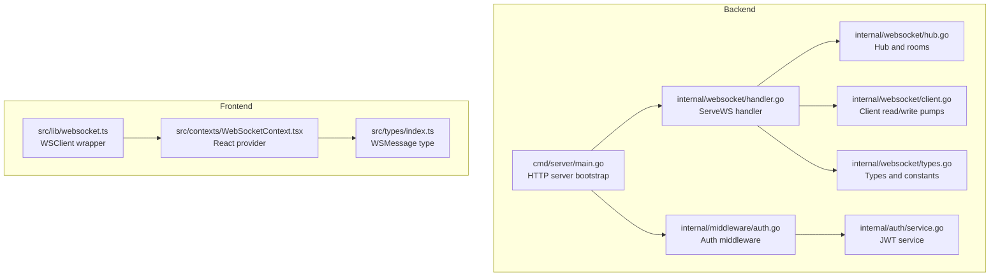
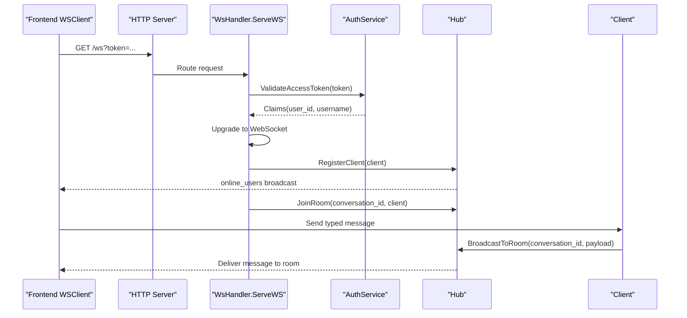
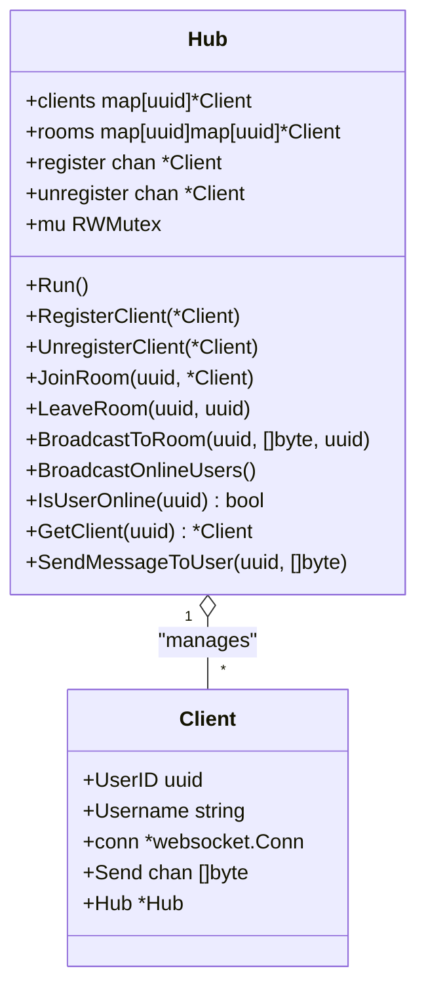
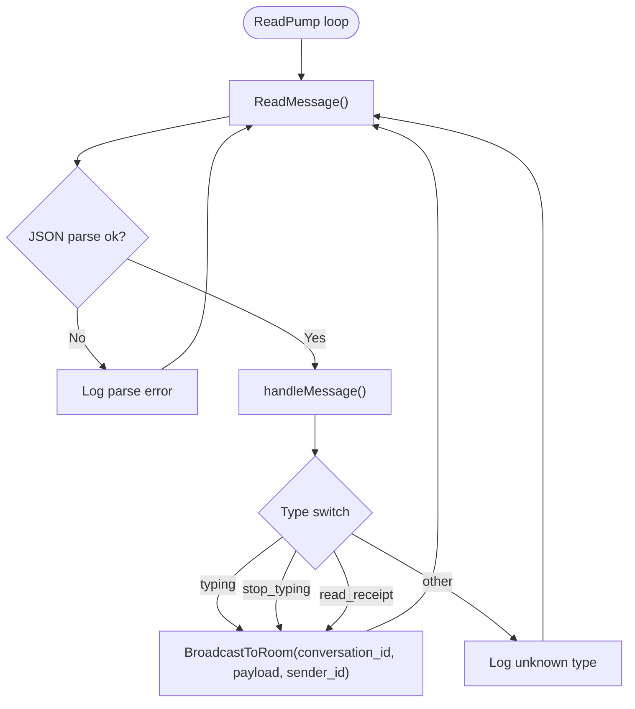
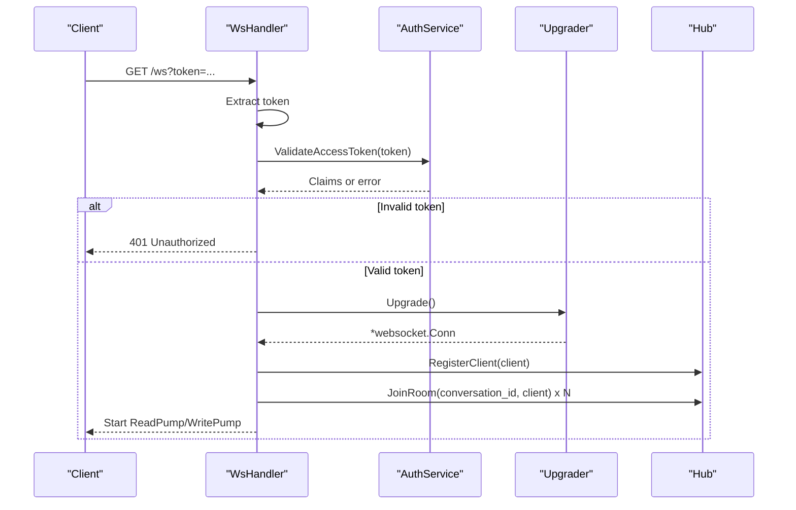
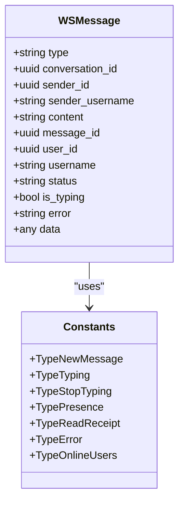
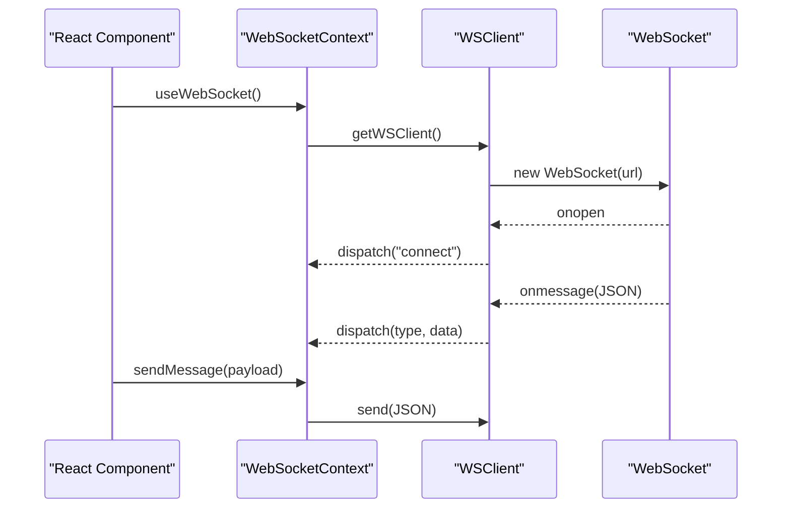
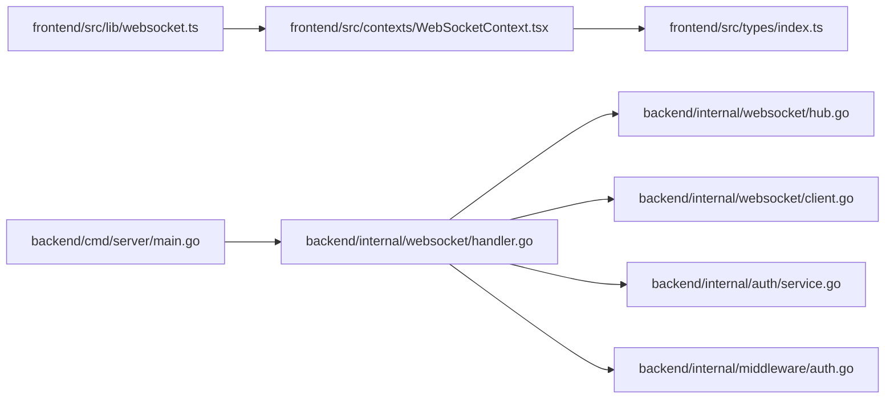

# WebSocket Implementation

<cite>
**Referenced Files in This Document**
- [hub.go](file://backend/internal/websocket/hub.go)
- [client.go](file://backend/internal/websocket/client.go)
- [handler.go](file://backend/internal/websocket/handler.go)
- [types.go](file://backend/internal/websocket/types.go)
- [main.go](file://backend/cmd/server/main.go)
- [auth.go](file://backend/internal/middleware/auth.go)
- [service.go](file://backend/internal/auth/service.go)
- [websocket.ts](file://frontend/src/lib/websocket.ts)
- [WebSocketContext.tsx](file://frontend/src/contexts/WebSocketContext.tsx)
- [index.ts](file://frontend/src/types/index.ts)
</cite>

## Table of Contents
1. [Introduction](#introduction)
2. [Project Structure](#project-structure)
3. [Core Components](#core-components)
4. [Architecture Overview](#architecture-overview)
5. [Detailed Component Analysis](#detailed-component-analysis)
6. [Dependency Analysis](#dependency-analysis)
7. [Performance Considerations](#performance-considerations)
8. [Troubleshooting Guide](#troubleshooting-guide)
9. [Conclusion](#conclusion)
10. [Appendices](#appendices)

## Introduction
This document explains the WebSocket implementation architecture used for real-time messaging. It covers the hub-based message broadcasting system, client connection management, and room-based communication patterns. It documents the WebSocket hub structure, client registration and removal, and message distribution mechanisms. It also details the WebSocket handler implementation, connection upgrade process, and message parsing. Real-time message delivery, presence tracking, and connection lifecycle management are described, along with examples of WebSocket message formats, event handling, and integration with the authentication system for secure connections.

## Project Structure
The WebSocket subsystem resides under backend/internal/websocket and integrates with the HTTP server and authentication system. The frontend provides a WebSocket client wrapper and a React context for connection management and event handling.

**Diagram sources**
- [main.go:121-122](file://backend/cmd/server/main.go#L121-L122)
- [handler.go:25-61](file://backend/internal/websocket/handler.go#L25-L61)
- [hub.go:9-16](file://backend/internal/websocket/hub.go#L9-L16)
- [client.go:25-55](file://backend/internal/websocket/client.go#L25-L55)
- [types.go:10-54](file://backend/internal/websocket/types.go#L10-L54)
- [auth.go:11-37](file://backend/internal/middleware/auth.go#L11-L37)
- [service.go:75-93](file://backend/internal/auth/service.go#L75-L93)
- [websocket.ts:1-95](file://frontend/src/lib/websocket.ts#L1-L95)
- [WebSocketContext.tsx:27-55](file://frontend/src/contexts/WebSocketContext.tsx#L27-L55)
- [index.ts:58-71](file://frontend/src/types/index.ts#L58-L71)

**Section sources**
- [main.go:121-122](file://backend/cmd/server/main.go#L121-L122)
- [handler.go:25-61](file://backend/internal/websocket/handler.go#L25-L61)
- [hub.go:9-16](file://backend/internal/websocket/hub.go#L9-L16)
- [client.go:25-55](file://backend/internal/websocket/client.go#L25-L55)
- [types.go:10-54](file://backend/internal/websocket/types.go#L10-L54)
- [auth.go:11-37](file://backend/internal/middleware/auth.go#L11-L37)
- [service.go:75-93](file://backend/internal/auth/service.go#L75-L93)
- [websocket.ts:1-95](file://frontend/src/lib/websocket.ts#L1-L95)
- [WebSocketContext.tsx:27-55](file://frontend/src/contexts/WebSocketContext.tsx#L27-L55)
- [index.ts:58-71](file://frontend/src/types/index.ts#L58-L71)

## Core Components
- Hub: Central coordinator managing connected clients and rooms, broadcasting presence and per-room messages.
- Client: Encapsulates a single WebSocket connection, handles read/write loops, and delegates message routing.
- WsHandler: HTTP endpoint that validates JWT tokens, upgrades HTTP requests to WebSocket, and subscribes clients to conversations.
- Types: Defines message types, WSMessage structure, and client/hub types.
- Frontend WSClient: Wraps browser WebSocket, manages reconnection, and dispatches events.
- WebSocketContext: React provider that initializes the WSClient, tracks connection state and online users, and exposes subscription helpers.

**Section sources**
- [hub.go:47-54](file://backend/internal/websocket/hub.go#L47-L54)
- [client.go:38-55](file://backend/internal/websocket/client.go#L38-L55)
- [handler.go:25-61](file://backend/internal/websocket/handler.go#L25-L61)
- [types.go:10-54](file://backend/internal/websocket/types.go#L10-L54)
- [websocket.ts:5-85](file://frontend/src/lib/websocket.ts#L5-L85)
- [WebSocketContext.tsx:16-76](file://frontend/src/contexts/WebSocketContext.tsx#L16-L76)

## Architecture Overview
The WebSocket architecture follows a hub-and-spoke model:
- Clients connect via the /ws endpoint with a JWT access token passed as a query parameter.
- On successful validation, the server upgrades the connection and registers the client in the hub.
- The hub subscribes the client to all of their conversations (rooms).
- Clients send typed messages; the server parses JSON and routes based on type.
- Broadcasting occurs either to all online users (presence) or to a specific conversation room.

**Diagram sources**
- [handler.go:25-61](file://backend/internal/websocket/handler.go#L25-L61)
- [service.go:75-93](file://backend/internal/auth/service.go#L75-L93)
- [hub.go:66-82](file://backend/internal/websocket/hub.go#L66-L82)
- [client.go:86-109](file://backend/internal/websocket/client.go#L86-L109)

## Detailed Component Analysis

### Hub: Room and Presence Management
The hub maintains:
- clients: Online users keyed by user ID.
- rooms: Conversation-to-client mapping for room-based broadcasting.
- register/unregister channels: Synchronized client lifecycle updates.
- RWMutex: Thread-safe access to shared state.

Key operations:
- RegisterClient and UnregisterClient enqueue client lifecycle changes; Run processes them and broadcasts online users.
- JoinRoom and LeaveRoom manage room membership.
- BroadcastToRoom delivers messages to all room participants except the sender.
- BroadcastOnlineUsers constructs a WSMessage with type online_users and pushes it to all online clients.
- SendMessageToUser targets a specific user if online.

**Diagram sources**
- [hub.go:47-54](file://backend/internal/websocket/hub.go#L47-L54)
- [types.go:37-53](file://backend/internal/websocket/types.go#L37-L53)

**Section sources**
- [hub.go:9-16](file://backend/internal/websocket/hub.go#L9-L16)
- [hub.go:18-40](file://backend/internal/websocket/hub.go#L18-L40)
- [hub.go:42-64](file://backend/internal/websocket/hub.go#L42-L64)
- [hub.go:74-94](file://backend/internal/websocket/hub.go#L74-L94)
- [hub.go:96-109](file://backend/internal/websocket/hub.go#L96-L109)
- [hub.go:111-136](file://backend/internal/websocket/hub.go#L111-L136)

### Client: Read/Write Loops and Message Routing
Client responsibilities:
- ReadPump: Enforces read limits and pong deadlines, parses incoming JSON into WSMessage, and delegates to handleMessage.
- WritePump: Sends queued messages and periodic ping frames; closes on errors or channel close.
- handleMessage: Routes typing, stop_typing, and read_receipt events to the hub for room-wide broadcast.

**Diagram sources**
- [client.go:25-55](file://backend/internal/websocket/client.go#L25-L55)
- [client.go:86-109](file://backend/internal/websocket/client.go#L86-L109)
- [hub.go:96-109](file://backend/internal/websocket/hub.go#L96-L109)

**Section sources**
- [client.go:12-23](file://backend/internal/websocket/client.go#L12-L23)
- [client.go:25-55](file://backend/internal/websocket/client.go#L25-L55)
- [client.go:57-84](file://backend/internal/websocket/client.go#L57-L84)
- [client.go:86-109](file://backend/internal/websocket/client.go#L86-L109)

### WebSocket Handler: Authentication and Upgrade
The handler enforces security:
- Extracts token from query string.
- Validates JWT via AuthService; on failure returns 401.
- Upgrades HTTP connection to WebSocket.
- Creates Client with UserID and Username from claims.
- Registers client with Hub and subscribes to user’s conversations.
- Starts separate goroutines for WritePump and ReadPump.

**Diagram sources**
- [handler.go:25-61](file://backend/internal/websocket/handler.go#L25-L61)
- [service.go:75-93](file://backend/internal/auth/service.go#L75-L93)

**Section sources**
- [handler.go:25-61](file://backend/internal/websocket/handler.go#L25-L61)
- [main.go:55-58](file://backend/cmd/server/main.go#L55-L58)

### Message Types and Formats
Message types include:
- typing, stop_typing, read_receipt for real-time collaboration signals.
- online_users for presence updates.
- Additional types (new_message, presence, error) defined for broader messaging scenarios.

WSMessage fields:
- type: discriminates message semantics.
- conversation_id, sender_id, sender_username: contextual identifiers.
- content, message_id, user_id, username, status, is_typing, error, data: optional payload fields.

**Diagram sources**
- [types.go:21-35](file://backend/internal/websocket/types.go#L21-L35)
- [types.go:10-19](file://backend/internal/websocket/types.go#L10-L19)

**Section sources**
- [types.go:10-19](file://backend/internal/websocket/types.go#L10-L19)
- [types.go:21-35](file://backend/internal/websocket/types.go#L21-L35)

### Frontend WebSocket Client and Context
Frontend WSClient:
- Constructs URL with access_token query parameter.
- Manages connection lifecycle with automatic reconnect.
- Parses incoming JSON and dispatches events by type.

WebSocketContext:
- Initializes WSClient on user presence.
- Subscribes to connect/disconnect and online_users events.
- Exposes sendMessage and subscribe helpers.

**Diagram sources**
- [WebSocketContext.tsx:27-55](file://frontend/src/contexts/WebSocketContext.tsx#L27-L55)
- [websocket.ts:19-51](file://frontend/src/lib/websocket.ts#L19-L51)
- [index.ts:58-71](file://frontend/src/types/index.ts#L58-L71)

**Section sources**
- [websocket.ts:1-95](file://frontend/src/lib/websocket.ts#L1-L95)
- [WebSocketContext.tsx:16-76](file://frontend/src/contexts/WebSocketContext.tsx#L16-L76)
- [index.ts:58-71](file://frontend/src/types/index.ts#L58-L71)

## Dependency Analysis
- WsHandler depends on Hub, AuthService, and database.Querier to subscribe clients to conversations.
- Hub depends on Client and uses goroutine-driven channels for registration/unregistration.
- Client depends on Hub for broadcasting and on gorilla/websocket for transport.
- Frontend WSClient depends on local storage for tokens and on React context for state.

**Diagram sources**
- [main.go:55-58](file://backend/cmd/server/main.go#L55-L58)
- [handler.go:17-23](file://backend/internal/websocket/handler.go#L17-L23)
- [hub.go:9-16](file://backend/internal/websocket/hub.go#L9-L16)
- [client.go:38-55](file://backend/internal/websocket/client.go#L38-L55)
- [service.go:75-93](file://backend/internal/auth/service.go#L75-L93)
- [auth.go:11-37](file://backend/internal/middleware/auth.go#L11-L37)
- [websocket.ts:1-95](file://frontend/src/lib/websocket.ts#L1-L95)
- [WebSocketContext.tsx:27-55](file://frontend/src/contexts/WebSocketContext.tsx#L27-L55)
- [index.ts:58-71](file://frontend/src/types/index.ts#L58-L71)

**Section sources**
- [main.go:55-58](file://backend/cmd/server/main.go#L55-L58)
- [handler.go:17-23](file://backend/internal/websocket/handler.go#L17-L23)
- [hub.go:9-16](file://backend/internal/websocket/hub.go#L9-L16)
- [client.go:38-55](file://backend/internal/websocket/client.go#L38-L55)
- [service.go:75-93](file://backend/internal/auth/service.go#L75-L93)
- [auth.go:11-37](file://backend/internal/middleware/auth.go#L11-L37)
- [websocket.ts:1-95](file://frontend/src/lib/websocket.ts#L1-L95)
- [WebSocketContext.tsx:27-55](file://frontend/src/contexts/WebSocketContext.tsx#L27-L55)
- [index.ts:58-71](file://frontend/src/types/index.ts#L58-L71)

## Performance Considerations
- Channel buffering: Client.Send buffer prevents backpressure spikes; adjust capacity based on expected burstiness.
- Broadcast fan-out: BroadcastToRoom iterates over room members; keep rooms reasonably sized to avoid excessive loops.
- Concurrency: Separate goroutines for read/write minimize blocking; ensure proper cleanup on exit.
- Heartbeats: Ping/Pong timers maintain liveness; tune writeWait and pongWait for network conditions.
- Memory: Use read limits to cap message sizes; avoid unbounded buffers.

[No sources needed since this section provides general guidance]

## Troubleshooting Guide
Common issues and resolutions:
- Missing or invalid token: Ensure access_token is present and valid; server responds with 401 Unauthorized.
- Unexpected close errors: ReadPump logs unexpected errors; inspect client-side reconnection behavior.
- No room messages received: Verify client was subscribed to the conversation via subscribeToConversations.
- Presence not updating: Confirm BroadcastOnlineUsers runs after register/unregister events.

**Section sources**
- [handler.go:27-36](file://backend/internal/websocket/handler.go#L27-L36)
- [client.go:41-44](file://backend/internal/websocket/client.go#L41-L44)
- [handler.go:63-73](file://backend/internal/websocket/handler.go#L63-L73)
- [hub.go:25](file://backend/internal/websocket/hub.go#L25)

## Conclusion
The WebSocket implementation leverages a robust hub-and-spoke architecture with explicit room-based broadcasting and presence tracking. Secure connections are enforced via JWT validation during the upgrade process. The frontend provides a resilient client wrapper and a React context for seamless integration. Together, these components deliver reliable real-time messaging with clear separation of concerns and manageable complexity.

[No sources needed since this section summarizes without analyzing specific files]

## Appendices

### Example Message Formats
- Presence update:
  - type: online_users
  - data: array of user IDs
- Typing indicators:
  - type: typing or stop_typing
  - conversation_id: target room
  - sender_id, sender_username: originator
- Read receipts:
  - type: read_receipt
  - conversation_id: target room
  - message_id: associated message

**Section sources**
- [types.go:10-19](file://backend/internal/websocket/types.go#L10-L19)
- [types.go:21-35](file://backend/internal/websocket/types.go#L21-L35)
- [client.go:86-109](file://backend/internal/websocket/client.go#L86-L109)
- [hub.go:42-64](file://backend/internal/websocket/hub.go#L42-L64)