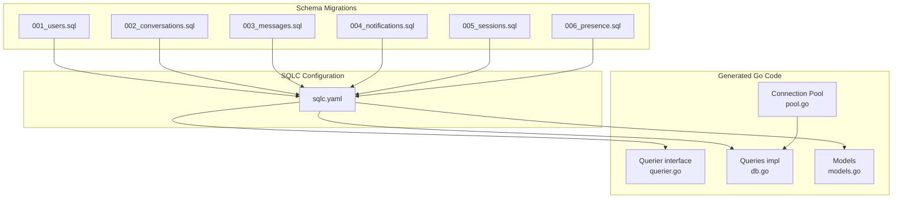
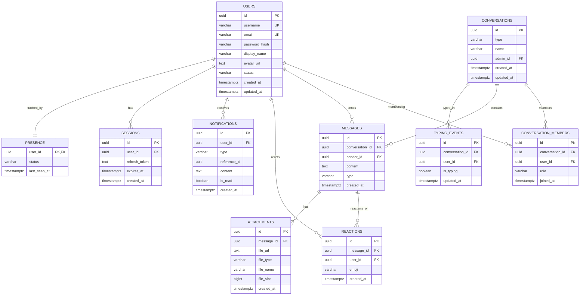
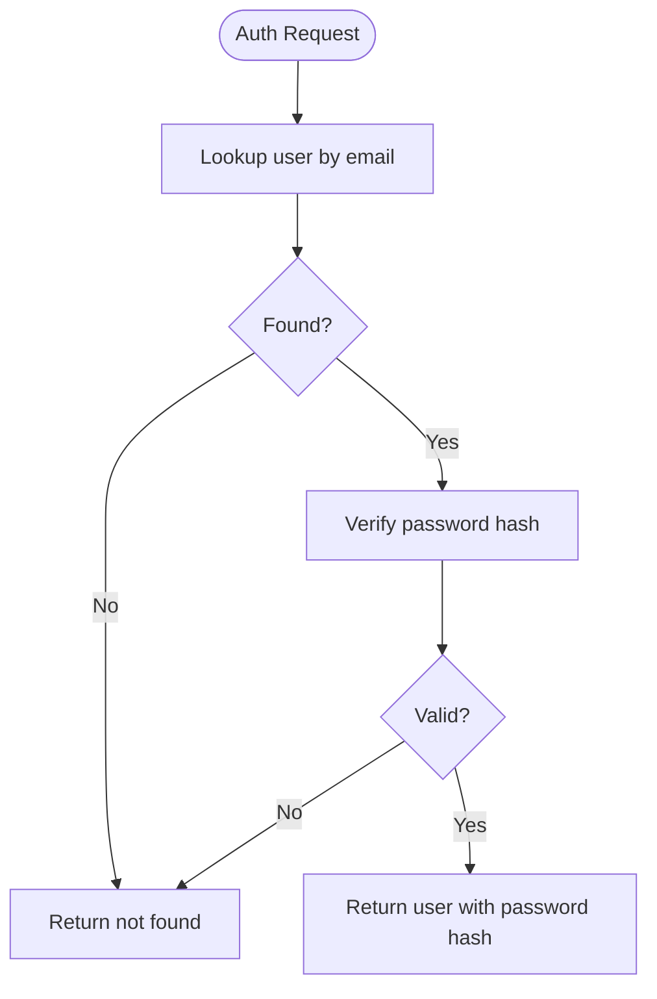
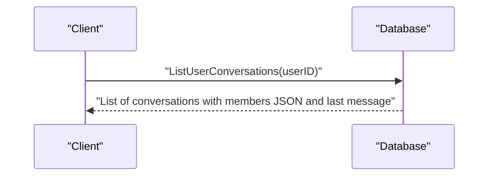
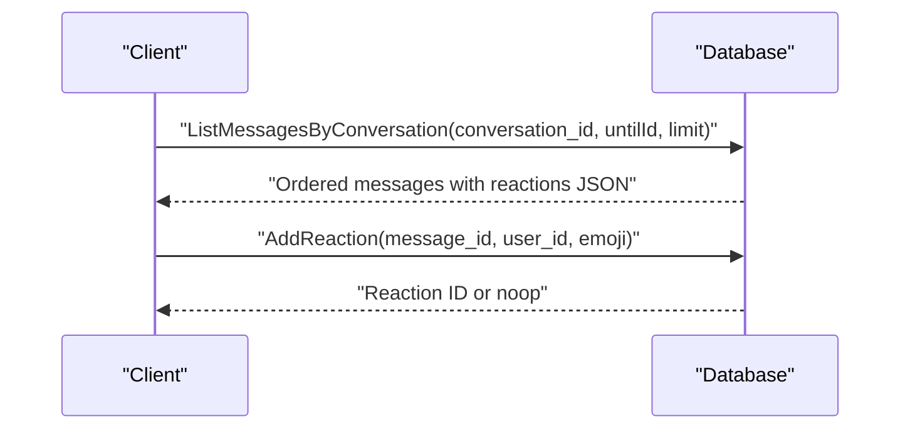
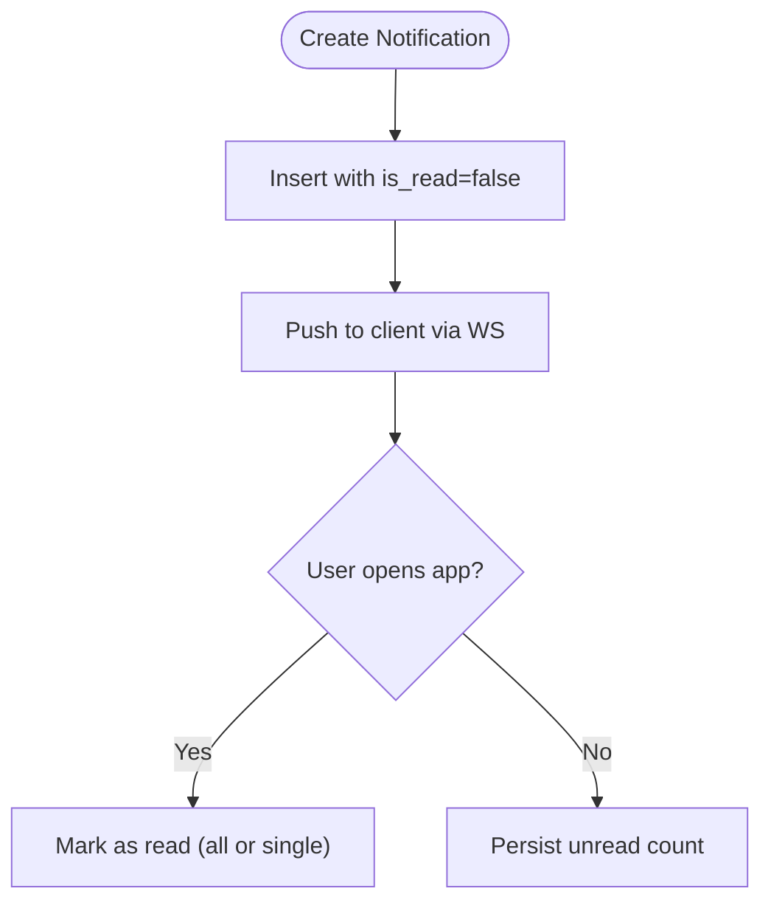
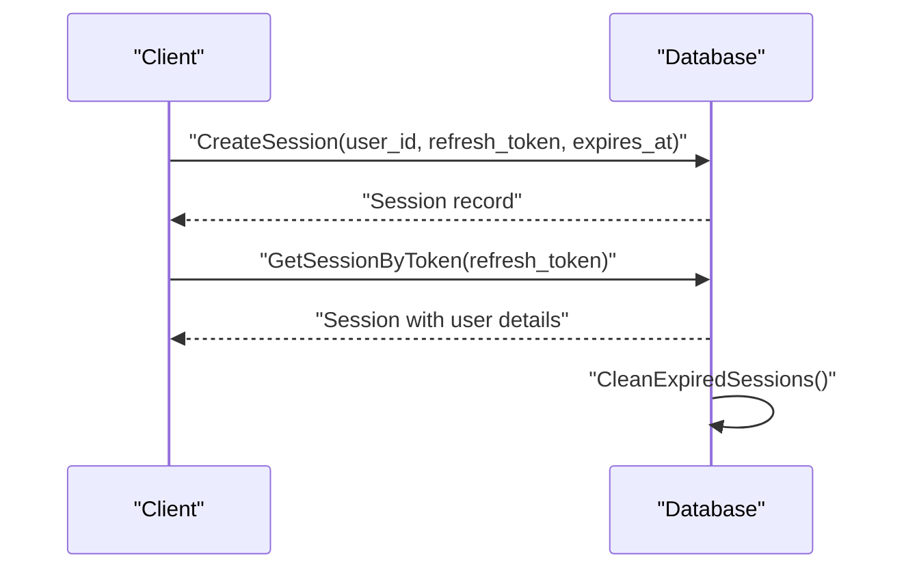
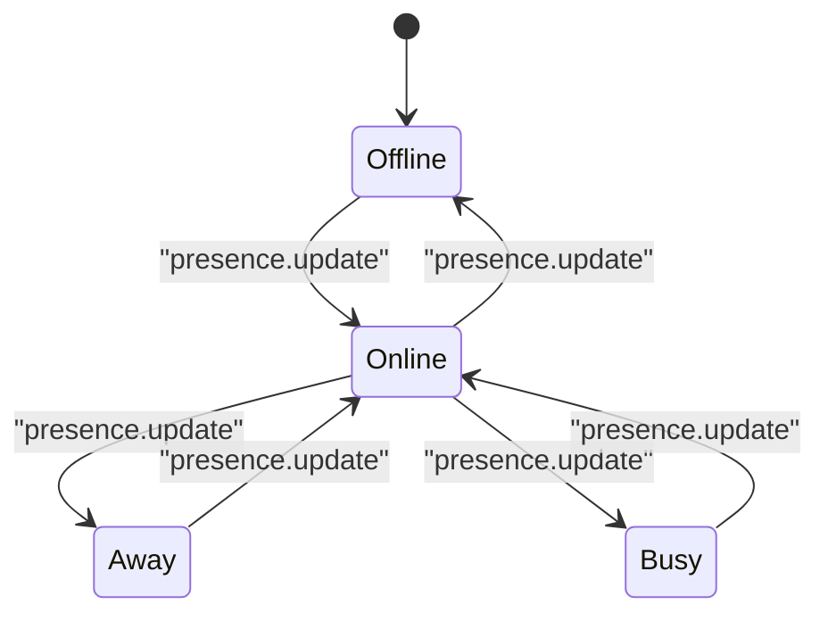
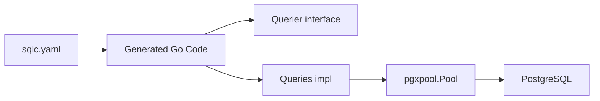

# Database Layer

<cite>
**Referenced Files in This Document**
- [001_users.sql](file://backend/sql/schema/001_users.sql)
- [002_conversations.sql](file://backend/sql/schema/002_conversations.sql)
- [003_messages.sql](file://backend/sql/schema/003_messages.sql)
- [004_notifications.sql](file://backend/sql/schema/004_notifications.sql)
- [005_sessions.sql](file://backend/sql/schema/005_sessions.sql)
- [006_presence.sql](file://backend/sql/schema/006_presence.sql)
- [users.sql](file://backend/sql/queries/users.sql)
- [conversations.sql](file://backend/sql/queries/conversations.sql)
- [messages.sql](file://backend/sql/queries/messages.sql)
- [notifications.sql](file://backend/sql/queries/notifications.sql)
- [sessions.sql](file://backend/sql/queries/sessions.sql)
- [sqlc.yaml](file://backend/sqlc.yaml)
- [db.go](file://backend/internal/database/db.go)
- [pool.go](file://backend/internal/database/pool.go)
- [models.go](file://backend/internal/database/models.go)
- [querier.go](file://backend/internal/database/querier.go)
</cite>

## Table of Contents
1. [Introduction](#introduction)
2. [Project Structure](#project-structure)
3. [Core Components](#core-components)
4. [Architecture Overview](#architecture-overview)
5. [Detailed Component Analysis](#detailed-component-analysis)
6. [Dependency Analysis](#dependency-analysis)
7. [Performance Considerations](#performance-considerations)
8. [Troubleshooting Guide](#troubleshooting-guide)
9. [Conclusion](#conclusion)
10. [Appendices](#appendices)

## Introduction
This document provides comprehensive data model documentation for the database layer of the Go-Chatsync project. It details entity relationships among users, conversations, messages, and supporting tables (attachments, reactions, notifications, sessions, presence, typing events). It documents primary and foreign keys, indexes, constraints, and validation rules enforced by the PostgreSQL schema migrations. It also explains data access patterns via SQLC-generated code, query optimization strategies, connection pooling, caching considerations, data lifecycle and retention, and security/access control patterns.

## Project Structure
The database layer is organized around SQL schema migrations and SQLC-generated Go code:
- Schema migrations define tables, constraints, indexes, and check constraints.
- SQLC configuration maps database types to Go types and generates strongly-typed query interfaces and models.
- Generated code exposes a Querier interface and a set of typed queries for each domain.

**Diagram sources**
- [sqlc.yaml:1-25](file://backend/sqlc.yaml#L1-L25)
- [db.go:1-33](file://backend/internal/database/db.go#L1-L33)
- [pool.go:1-77](file://backend/internal/database/pool.go#L1-L77)
- [models.go:1-101](file://backend/internal/database/models.go#L1-L101)
- [querier.go:1-53](file://backend/internal/database/querier.go#L1-L53)
- [001_users.sql:1-18](file://backend/sql/schema/001_users.sql#L1-L18)
- [002_conversations.sql:1-25](file://backend/sql/schema/002_conversations.sql#L1-L25)
- [003_messages.sql:1-36](file://backend/sql/schema/003_messages.sql#L1-L36)
- [004_notifications.sql:1-13](file://backend/sql/schema/004_notifications.sql#L1-L13)
- [005_sessions.sql:1-12](file://backend/sql/schema/005_sessions.sql#L1-L12)
- [006_presence.sql:1-18](file://backend/sql/schema/006_presence.sql#L1-L18)

**Section sources**
- [sqlc.yaml:1-25](file://backend/sqlc.yaml#L1-L25)
- [db.go:1-33](file://backend/internal/database/db.go#L1-L33)
- [pool.go:1-77](file://backend/internal/database/pool.go#L1-L77)
- [models.go:1-101](file://backend/internal/database/models.go#L1-L101)
- [querier.go:1-53](file://backend/internal/database/querier.go#L1-L53)

## Core Components
- Users: Core identity and profile table with unique usernames and emails, timestamps, and status.
- Conversations: Private or group chats with optional admin and membership tracking.
- Messages: Text-based chat content with sender and conversation linkage, plus reactions and attachments.
- Attachments: File metadata linked to messages.
- Reactions: Emoji reactions per message per user.
- Notifications: Per-user alerts with read/unread state.
- Sessions: Refresh token storage with expiry and user linkage.
- Presence and Typing Events: Real-time status and typing indicators.

Key constraints and indexes:
- UUID primary keys with generated defaults.
- Unique constraints on (conversation_id, user_id) for memberships and (message_id, user_id, emoji) for reactions.
- Foreign keys with cascading deletes for child records.
- Indexes on frequently filtered/sorted columns to optimize reads.

**Section sources**
- [001_users.sql:1-18](file://backend/sql/schema/001_users.sql#L1-L18)
- [002_conversations.sql:1-25](file://backend/sql/schema/002_conversations.sql#L1-L25)
- [003_messages.sql:1-36](file://backend/sql/schema/003_messages.sql#L1-L36)
- [004_notifications.sql:1-13](file://backend/sql/schema/004_notifications.sql#L1-L13)
- [005_sessions.sql:1-12](file://backend/sql/schema/005_sessions.sql#L1-L12)
- [006_presence.sql:1-18](file://backend/sql/schema/006_presence.sql#L1-L18)

## Architecture Overview
The database architecture centers on a normalized relational model with explicit referential integrity. SQLC generates a Querier interface and a concrete Queries type backed by a connection pool. Business logic is encapsulated in SQL queries and enforced by database constraints.

**Diagram sources**
- [001_users.sql:1-18](file://backend/sql/schema/001_users.sql#L1-L18)
- [002_conversations.sql:1-25](file://backend/sql/schema/002_conversations.sql#L1-L25)
- [003_messages.sql:1-36](file://backend/sql/schema/003_messages.sql#L1-L36)
- [004_notifications.sql:1-13](file://backend/sql/schema/004_notifications.sql#L1-L13)
- [005_sessions.sql:1-12](file://backend/sql/schema/005_sessions.sql#L1-L12)
- [006_presence.sql:1-18](file://backend/sql/schema/006_presence.sql#L1-L18)

## Detailed Component Analysis

### Users
- Purpose: Store user identity, credentials, profile, and status.
- Constraints:
  - Unique username and email.
  - Default status and timestamps.
- Generated queries: Create, read by ID/username/email, update profile/password/status, delete.
- Access patterns: Authentication relies on fetching user with password hash; updates use optimistic concurrency via updated_at.

**Diagram sources**
- [users.sql:16-24](file://backend/sql/queries/users.sql#L16-L24)

**Section sources**
- [001_users.sql:1-18](file://backend/sql/schema/001_users.sql#L1-L18)
- [users.sql:1-52](file://backend/sql/queries/users.sql#L1-L52)

### Conversations and Memberships
- Purpose: Manage private and group conversations and membership roles.
- Constraints:
  - Conversation type check constraint restricts values.
  - Membership uniqueness prevents duplicate joins.
  - Role check constraint restricts values.
- Generated queries: Create, fetch by ID, list user conversations, manage members, check membership, find private conversation, delete.
- Access patterns: Listing user conversations aggregates member info and last message metadata inline.

**Diagram sources**
- [conversations.sql:20-36](file://backend/sql/queries/conversations.sql#L20-L36)

**Section sources**
- [002_conversations.sql:1-25](file://backend/sql/schema/002_conversations.sql#L1-L25)
- [conversations.sql:1-76](file://backend/sql/queries/conversations.sql#L1-L76)

### Messages, Reactions, and Attachments
- Purpose: Store message content, sender, and related metadata; reactions and attachments augment messages.
- Constraints:
  - Message sender and conversation foreign keys with cascade delete.
  - Reaction uniqueness per message/user/emoji.
  - Attachment metadata stored per message.
- Generated queries: Create message, fetch by ID with sender username, list messages with reactions aggregation, add/remove reaction, delete message.
- Access patterns: Pagination uses cursor-like parameters (message ID threshold) and limit; reactions aggregated per message.

**Diagram sources**
- [messages.sql:12-28](file://backend/sql/queries/messages.sql#L12-L28)
- [messages.sql:33-37](file://backend/sql/queries/messages.sql#L33-L37)

**Section sources**
- [003_messages.sql:1-36](file://backend/sql/schema/003_messages.sql#L1-L36)
- [messages.sql:1-41](file://backend/sql/queries/messages.sql#L1-L41)

### Notifications
- Purpose: Deliver user-specific notifications with read state.
- Constraints: None beyond standard columns; read flag maintained via updates.
- Generated queries: Create, list paginated, unread count, mark read (single/all), delete.
- Access patterns: Unread count optimized with partial index on (user_id, is_read) where is_read is false.

**Diagram sources**
- [notifications.sql:13-16](file://backend/sql/queries/notifications.sql#L13-L16)
- [004_notifications.sql:11-12](file://backend/sql/schema/004_notifications.sql#L11-L12)

**Section sources**
- [004_notifications.sql:1-13](file://backend/sql/schema/004_notifications.sql#L1-L13)
- [notifications.sql:1-26](file://backend/sql/queries/notifications.sql#L1-L26)

### Sessions
- Purpose: Persist refresh tokens with expiry tied to user.
- Constraints: Token uniqueness implied by lookup; expiry enforced by cleanup job.
- Generated queries: Create session, lookup by token with user details, delete by id/user, clean expired.
- Access patterns: Periodic cleanup removes expired sessions; token-based auth decouples session lifetime from access tokens.

**Diagram sources**
- [sessions.sql:18-19](file://backend/sql/queries/sessions.sql#L18-L19)
- [005_sessions.sql:1-12](file://backend/sql/schema/005_sessions.sql#L1-L12)

**Section sources**
- [005_sessions.sql:1-12](file://backend/sql/schema/005_sessions.sql#L1-L12)
- [sessions.sql:1-20](file://backend/sql/queries/sessions.sql#L1-L20)

### Presence and Typing Events
- Purpose: Track user online/offline/away/busy status and typing indicators per conversation.
- Constraints: Status check constraint; typing event uniqueness per conversation/user.
- Generated queries: Presence updates and lookups; typing event creation/toggling.
- Access patterns: Real-time updates via WebSocket; presence refreshed periodically.

**Diagram sources**
- [006_presence.sql:1-18](file://backend/sql/schema/006_presence.sql#L1-L18)

**Section sources**
- [006_presence.sql:1-18](file://backend/sql/schema/006_presence.sql#L1-L18)

## Dependency Analysis
- SQLC configuration defines schema and query directories, Go package output, and type overrides for UUID and timestamptz.
- Generated code depends on pgx/v5 and exposes a Querier interface implemented by Queries.
- Connection pooling is managed by pgxpool with a fixed max connection count and runtime migrations applied on startup.

**Diagram sources**
- [sqlc.yaml:1-25](file://backend/sqlc.yaml#L1-L25)
- [db.go:14-32](file://backend/internal/database/db.go#L14-L32)
- [pool.go:20-46](file://backend/internal/database/pool.go#L20-L46)

**Section sources**
- [sqlc.yaml:1-25](file://backend/sqlc.yaml#L1-L25)
- [db.go:1-33](file://backend/internal/database/db.go#L1-L33)
- [pool.go:1-77](file://backend/internal/database/pool.go#L1-L77)

## Performance Considerations
- Indexes:
  - Users: username, email, status.
  - Conversations: admin_id.
  - Conversation members: conversation_id, user_id.
  - Messages: conversation_id, sender_id, (conversation_id, created_at desc).
  - Reactions: message_id.
  - Attachments: message_id.
  - Notifications: user_id, (user_id, is_read) partial index for unread.
  - Sessions: user_id, refresh_token, expires_at.
  - Typing events: conversation_id.
- Query patterns:
  - Cursor pagination for messages using id threshold and limit.
  - Aggregation of members and reactions embedded in queries to reduce round trips.
  - Partial index on notifications for efficient unread counts.
- Connection pooling:
  - Max connections configured to balance throughput and server load.
  - Pool ping on startup ensures liveness.
- Migration management:
  - Sequential application of schema files in sorted order.
  - Idempotent migrations supported by upserts and existence checks in queries.

[No sources needed since this section provides general guidance]

## Troubleshooting Guide
- Connection failures:
  - Verify DSN correctness and network reachability.
  - Check pool configuration and MaxConns limits.
- Migration errors:
  - Confirm schema directory readability and file permissions.
  - Review migration execution logs for failing statements.
- Query errors:
  - Validate foreign key constraints and unique constraints.
  - Ensure indexes exist for filtered/sorted columns.
- Data integrity:
  - Use transactions for multi-statement operations (e.g., create conversation and add members).
  - Apply cascading deletes consistently to avoid orphaned rows.

**Section sources**
- [pool.go:48-76](file://backend/internal/database/pool.go#L48-L76)
- [db.go:14-32](file://backend/internal/database/db.go#L14-L32)

## Conclusion
The database layer enforces strong referential integrity and clear business rules through schema constraints and SQL queries. SQLC-generated code provides a robust, type-safe interface for data access, while connection pooling and indexing support scalable performance. Real-time features leverage presence and typing tables alongside notifications and sessions for a cohesive user experience.

[No sources needed since this section summarizes without analyzing specific files]

## Appendices

### SQLC Generation Details
- Package and output configuration:
  - Engine: PostgreSQL.
  - Schema and queries directories.
  - Go package output and SQL package selection.
  - Type overrides for UUID and timestamptz.
- Generated artifacts:
  - Querier interface with method signatures for all operations.
  - Typed models for all entities.
  - Queries struct implementing the interface and a WithTx helper for transactions.

**Section sources**
- [sqlc.yaml:1-25](file://backend/sqlc.yaml#L1-L25)
- [models.go:1-101](file://backend/internal/database/models.go#L1-L101)
- [querier.go:13-52](file://backend/internal/database/querier.go#L13-L52)
- [db.go:20-32](file://backend/internal/database/db.go#L20-L32)

### Data Lifecycle and Retention
- Messages and attachments:
  - Cascading deletes on conversation/member/message ensure cleanup.
  - No automated retention policy is defined; consider periodic purges for large deployments.
- Notifications:
  - No retention policy present; unread counts rely on partial index.
- Sessions:
  - Expiry-based cleanup via scheduled job.

**Section sources**
- [003_messages.sql:3,15,25](file://backend/sql/schema/003_messages.sql#L3,L15,L25)
- [002_conversations.sql:15,16](file://backend/sql/schema/002_conversations.sql#L15,L16)
- [sessions.sql:18-19](file://backend/sql/queries/sessions.sql#L18-L19)

### Security and Access Control
- Authentication:
  - Password hashes stored; sensitive fields excluded from non-private queries.
- Authorization:
  - Queries filter by user_id (e.g., notifications, sessions) to enforce ownership.
  - Membership checks prevent unauthorized access to conversations.
- Transport and secrets:
  - Use secure DSNs and environment variables for credentials.
  - Rotate refresh tokens and enforce short-lived access tokens.

**Section sources**
- [users.sql:21-24](file://backend/sql/queries/users.sql#L21-L24)
- [conversations.sql:54-58](file://backend/sql/queries/conversations.sql#L54-L58)
- [notifications.sql:6-11](file://backend/sql/queries/notifications.sql#L6-L11)
- [sessions.sql:6-10](file://backend/sql/queries/sessions.sql#L6-L10)