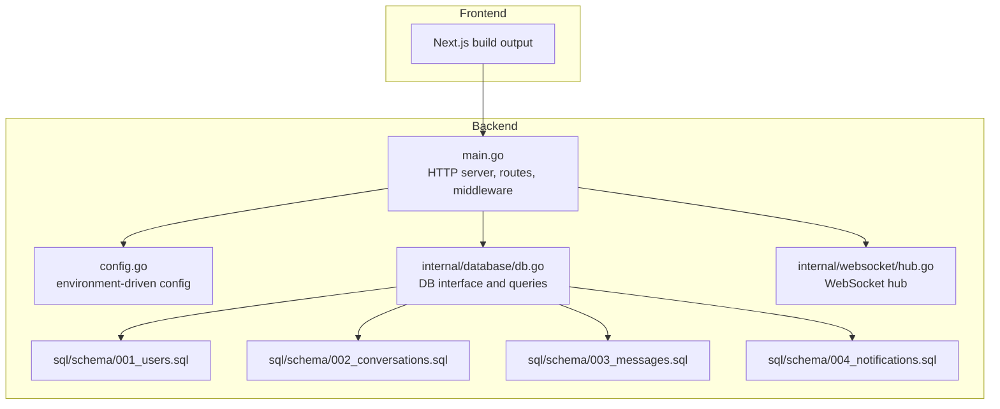
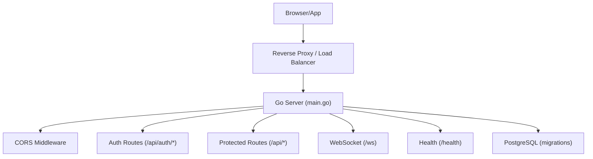
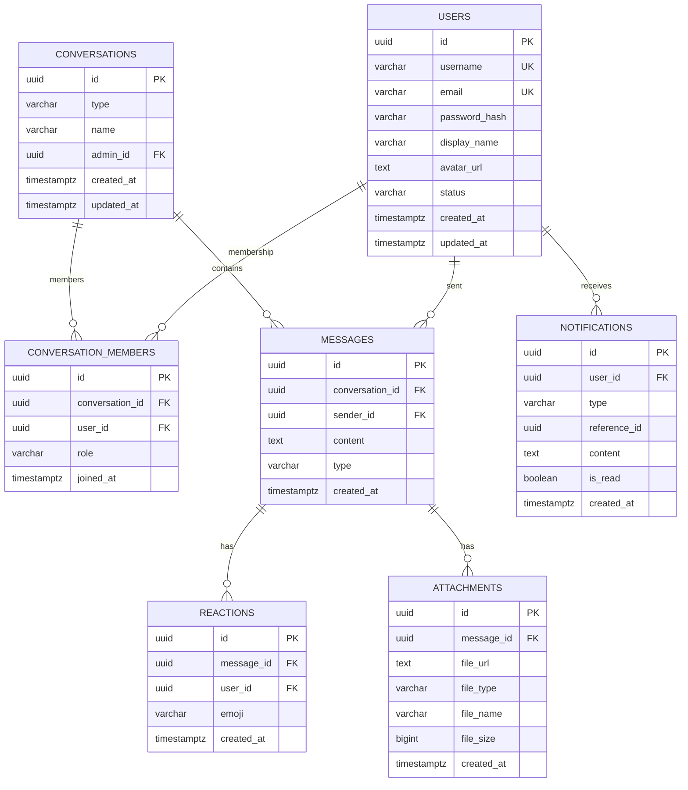
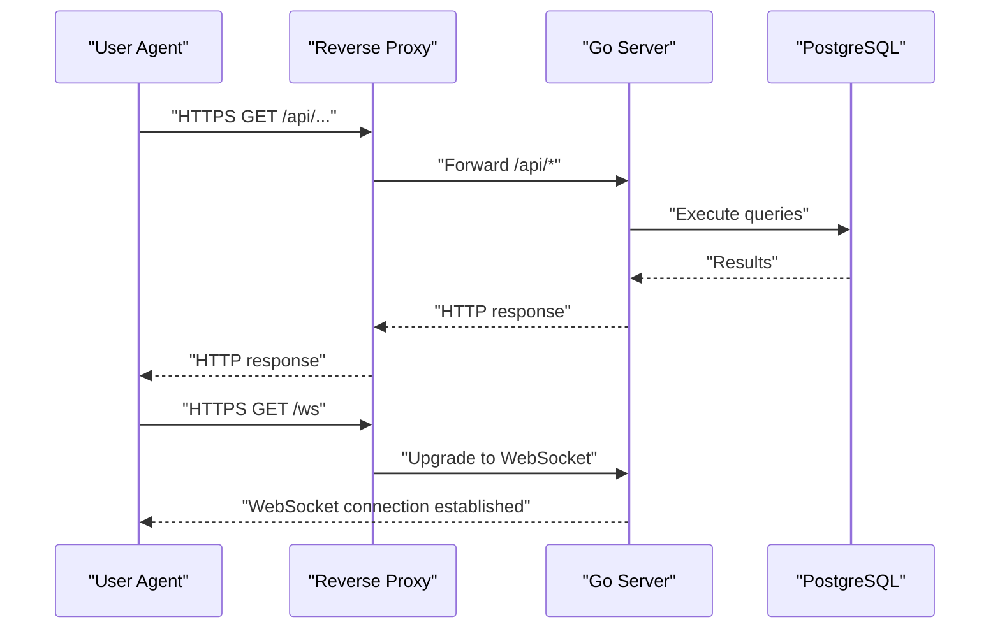
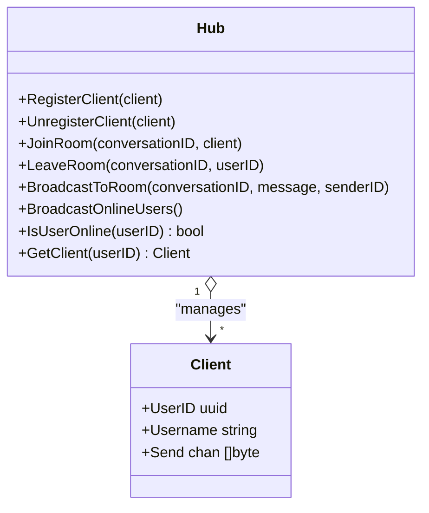
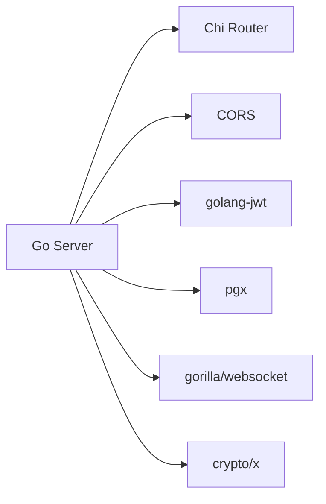

# Deployment Guide

<cite>
**Referenced Files in This Document**
- [main.go](file://backend/cmd/server/main.go)
- [config.go](file://backend/internal/config/config.go)
- [db.go](file://backend/internal/database/db.go)
- [001_users.sql](file://backend/sql/schema/001_users.sql)
- [002_conversations.sql](file://backend/sql/schema/002_conversations.sql)
- [003_messages.sql](file://backend/sql/schema/003_messages.sql)
- [004_notifications.sql](file://backend/sql/schema/004_notifications.sql)
- [hub.go](file://backend/internal/websocket/hub.go)
- [run.sh](file://run.sh)
- [go.mod](file://backend/go.mod)
- [package.json](file://frontend/package.json)
- [next.config.ts](file://frontend/next.config.ts)
</cite>

## Table of Contents
1. [Introduction](#introduction)
2. [Project Structure](#project-structure)
3. [Core Components](#core-components)
4. [Architecture Overview](#architecture-overview)
5. [Detailed Component Analysis](#detailed-component-analysis)
6. [Dependency Analysis](#dependency-analysis)
7. [Performance Considerations](#performance-considerations)
8. [Troubleshooting Guide](#troubleshooting-guide)
9. [Conclusion](#conclusion)
10. [Appendices](#appendices)

## Introduction
This guide provides production-grade deployment instructions for Go-Chatsync. It covers environment configuration, database migrations, single-port serving architecture, static asset bundling, reverse proxy setup, containerization, orchestration, security hardening, observability, and operational procedures. The backend is a single Go process exposing REST APIs, a WebSocket endpoint, and a health check, while the frontend is built with Next.js and bundled into the backend’s static assets.

## Project Structure
Go-Chatsync comprises:
- Backend server written in Go, with routing, middleware, authentication, database access, and WebSocket hub.
- SQL schema under sql/schema for PostgreSQL, managed via migrations at startup.
- Frontend built with Next.js and copied into the backend static directory during build.

**Diagram sources**
- [main.go:26-147](file://backend/cmd/server/main.go#L26-L147)
- [config.go:23-44](file://backend/internal/config/config.go#L23-L44)
- [db.go:14-33](file://backend/internal/database/db.go#L14-L33)
- [001_users.sql:1-18](file://backend/sql/schema/001_users.sql#L1-L18)
- [002_conversations.sql:1-25](file://backend/sql/schema/002_conversations.sql#L1-L25)
- [003_messages.sql:1-36](file://backend/sql/schema/003_messages.sql#L1-L36)
- [004_notifications.sql:1-13](file://backend/sql/schema/004_notifications.sql#L1-L13)
- [hub.go:56-170](file://backend/internal/websocket/hub.go#L56-L170)

**Section sources**
- [main.go:26-147](file://backend/cmd/server/main.go#L26-L147)
- [config.go:23-44](file://backend/internal/config/config.go#L23-L44)
- [db.go:14-33](file://backend/internal/database/db.go#L14-L33)
- [001_users.sql:1-18](file://backend/sql/schema/001_users.sql#L1-L18)
- [002_conversations.sql:1-25](file://backend/sql/schema/002_conversations.sql#L1-L25)
- [003_messages.sql:1-36](file://backend/sql/schema/003_messages.sql#L1-L36)
- [004_notifications.sql:1-13](file://backend/sql/schema/004_notifications.sql#L1-L13)
- [hub.go:56-170](file://backend/internal/websocket/hub.go#L56-L170)

## Core Components
- HTTP server and router: Chi router with logging, recovery, request ID, and CORS middleware. Exposes health check, public auth endpoints, protected resource endpoints, and WebSocket upgrade.
- Configuration: Loads environment variables for database connection, server port, JWT secrets, and TTLs.
- Database: Uses pgx with migrations executed at startup against PostgreSQL.
- WebSocket: Central hub managing clients and rooms for real-time messaging.
- Static assets: Next.js build copied into backend static directory and served by the Go server.

Key production configuration variables:
- Database: DB_HOST, DB_PORT, DB_USER, DB_PASSWORD, DB_NAME, DB_SSLMODE
- Server: SERVER_PORT
- JWT: JWT_SECRET, JWT_ACCESS_TTL (minutes), JWT_REFRESH_TTL (days)

Health check endpoint: GET /health

**Section sources**
- [main.go:58-115](file://backend/cmd/server/main.go#L58-L115)
- [config.go:23-44](file://backend/internal/config/config.go#L23-L44)
- [config.go:9-21](file://backend/internal/config/config.go#L9-L21)
- [db.go:14-33](file://backend/internal/database/db.go#L14-L33)
- [hub.go:56-170](file://backend/internal/websocket/hub.go#L56-L170)

## Architecture Overview
The backend runs a single HTTP server that:
- Serves REST endpoints under /api/*
- Upgrades connections to WebSocket at /ws
- Provides a health check at /health
- Serves static assets from the backend static directory

**Diagram sources**
- [main.go:58-115](file://backend/cmd/server/main.go#L58-L115)
- [main.go:38-41](file://backend/cmd/server/main.go#L38-L41)

## Detailed Component Analysis

### Environment Variables and Configuration
Production configuration is driven by environment variables. Ensure the following are set:
- DB_HOST, DB_PORT, DB_USER, DB_PASSWORD, DB_NAME, DB_SSLMODE
- SERVER_PORT
- JWT_SECRET (strong random value)
- JWT_ACCESS_TTL (minutes)
- JWT_REFRESH_TTL (days)

Behavior:
- Defaults are applied if variables are missing.
- DSN composes a PostgreSQL connection string from environment values.

Operational notes:
- Rotate JWT_SECRET during deployments to invalidate refresh tokens.
- Set DB_SSLMODE to a secure mode in production (e.g., enable TLS).

**Section sources**
- [config.go:23-44](file://backend/internal/config/config.go#L23-L44)
- [config.go:9-21](file://backend/internal/config/config.go#L9-L21)
- [config.go:39-44](file://backend/internal/config/config.go#L39-L44)

### Database Migration and Schema
At startup, the server runs migrations located under sql/schema. The following tables are created:
- users: user accounts and metadata
- conversations and conversation_members: chat rooms and memberships
- messages, reactions, attachments: messages and related artifacts
- notifications: user notifications

Indexes optimize lookups for usernames, emails, statuses, conversation membership, message history, and unread notifications.

**Diagram sources**
- [001_users.sql:1-18](file://backend/sql/schema/001_users.sql#L1-L18)
- [002_conversations.sql:1-25](file://backend/sql/schema/002_conversations.sql#L1-L25)
- [003_messages.sql:1-36](file://backend/sql/schema/003_messages.sql#L1-L36)
- [004_notifications.sql:1-13](file://backend/sql/schema/004_notifications.sql#L1-L13)

**Section sources**
- [main.go:38-41](file://backend/cmd/server/main.go#L38-L41)
- [001_users.sql:1-18](file://backend/sql/schema/001_users.sql#L1-L18)
- [002_conversations.sql:1-25](file://backend/sql/schema/002_conversations.sql#L1-L25)
- [003_messages.sql:1-36](file://backend/sql/schema/003_messages.sql#L1-L36)
- [004_notifications.sql:1-13](file://backend/sql/schema/004_notifications.sql#L1-L13)

### Single-Port Serving Architecture
The server listens on a single port and serves:
- REST API under /api/*
- WebSocket at /ws
- Health check at /health
- Static assets bundled under backend/static/build

Static asset serving:
- The build script copies Next.js output into backend/static/build.
- The server exposes static files via the Go HTTP server.

Reverse proxy considerations:
- Terminate TLS at the reverse proxy (recommended).
- Forward /api/* to the backend server.
- Forward /ws to the backend server for WebSocket upgrades.
- Serve static assets from the backend static directory.

**Diagram sources**
- [main.go:58-115](file://backend/cmd/server/main.go#L58-L115)
- [run.sh:53-58](file://run.sh#L53-L58)

**Section sources**
- [main.go:58-115](file://backend/cmd/server/main.go#L58-L115)
- [run.sh:53-58](file://run.sh#L53-L58)

### WebSocket Hub Behavior
The hub maintains:
- A registry of connected clients keyed by user ID
- Rooms keyed by conversation ID
- Broadcasts online users periodically

**Diagram sources**
- [hub.go:48-170](file://backend/internal/websocket/hub.go#L48-L170)

**Section sources**
- [hub.go:56-170](file://backend/internal/websocket/hub.go#L56-L170)

### Build and Asset Bundling
The repository provides a convenience script to:
- Install Go and Node.js dependencies if missing
- Build the Next.js frontend
- Copy the build output into backend/static/build
- Build the Go server binary

Production recommendation:
- Build the frontend in CI/CD and copy the production build into backend/static/build before building the Go binary.
- Pin dependency versions and use a reproducible build environment.

**Section sources**
- [run.sh:23-64](file://run.sh#L23-L64)
- [package.json:5-11](file://frontend/package.json#L5-L11)
- [next.config.ts:1-8](file://frontend/next.config.ts#L1-L8)

## Dependency Analysis
External dependencies include:
- HTTP routing and middleware: Chi and CORS
- Authentication: JWT library
- Database: pgx
- WebSockets: Gorilla WebSocket
- Cryptography: golang.org/x/crypto

**Diagram sources**
- [go.mod:5-13](file://backend/go.mod#L5-L13)

**Section sources**
- [go.mod:5-13](file://backend/go.mod#L5-L13)

## Performance Considerations
- Timeouts: The server sets read, write, and idle timeouts suitable for production.
- Concurrency: The WebSocket hub uses channels and mutexes; ensure adequate memory for concurrent clients.
- Database: Use connection pooling and keep migrations minimal in production.
- Static assets: Serve compressed assets and leverage caching headers via reverse proxy.
- Horizontal scaling: Place multiple backend instances behind a load balancer; ensure shared session storage if needed.

[No sources needed since this section provides general guidance]

## Troubleshooting Guide
Common deployment issues and resolutions:
- Database connectivity failures
  - Verify DB_HOST, DB_PORT, DB_USER, DB_PASSWORD, DB_NAME, DB_SSLMODE.
  - Test connectivity externally before deploying.
- Migration errors
  - Ensure PostgreSQL supports UUID and pgcrypto extensions.
  - Confirm the schema directory is readable by the server process.
- Health check failing
  - Confirm /health responds with 200 OK.
  - Check reverse proxy routing and TLS termination.
- Static assets not loading
  - Confirm frontend build is copied into backend/static/build.
  - Validate file permissions and paths.
- WebSocket upgrade failures
  - Ensure reverse proxy supports WebSocket upgrades.
  - Check firewall and network policies for the WebSocket path.
- Graceful shutdown
  - The server waits up to 30 seconds during shutdown; adjust reverse proxy timeouts accordingly.

**Section sources**
- [main.go:38-41](file://backend/cmd/server/main.go#L38-L41)
- [main.go:117-144](file://backend/cmd/server/main.go#L117-L144)
- [run.sh:53-58](file://run.sh#L53-L58)

## Conclusion
Deploying Go-Chatsync involves configuring environment variables, ensuring database readiness with migrations, bundling the frontend into static assets, and serving everything through a reverse proxy. Apply security hardening, monitor health, and plan for scaling and rollbacks. The single-port architecture simplifies deployment while enabling REST, WebSocket, and static serving from one process.

[No sources needed since this section summarizes without analyzing specific files]

## Appendices

### Production Configuration Checklist
- Database
  - Host, port, credentials, and SSL mode configured
  - UUID and pgcrypto extensions enabled
- Server
  - SERVER_PORT set appropriately
  - JWT_SECRET rotated and stored securely
  - Access and refresh TTLs aligned with policy
- Reverse Proxy
  - TLS termination
  - Route /api/* to backend
  - Route /ws to backend
  - Serve static assets from backend static directory
- Monitoring
  - Health check endpoint monitored
  - Logs aggregated and retained per policy

[No sources needed since this section provides general guidance]

### Security Hardening Recommendations
- HTTPS/TLS
  - Terminate TLS at the reverse proxy with strong ciphers and modern protocols.
  - Enforce HSTS and appropriate security headers.
- CORS
  - Restrict AllowedOrigins to trusted domains in production.
  - Limit exposed headers and methods.
- Authentication
  - Use short AccessTTL and reasonable RefreshTTL.
  - Store JWT_SECRET securely and rotate regularly.
  - Protect refresh endpoints and enforce rate limiting.
- Secrets Management
  - Use environment injection or secret managers; avoid committing secrets.

**Section sources**
- [main.go:64-71](file://backend/cmd/server/main.go#L64-L71)
- [config.go:32-34](file://backend/internal/config/config.go#L32-L34)

### Monitoring and Logging
- Health checks
  - Monitor GET /health for 200 OK.
- Logs
  - Capture server logs and database connection logs.
  - Aggregate logs centrally and apply retention policies.
- Metrics
  - Track request latency, error rates, and WebSocket client counts.

[No sources needed since this section provides general guidance]

### Rollback Procedures
- Keep previous binary and static assets available.
- Re-deploy with the prior version and reverse proxy switch.
- Validate health checks and core endpoints after rollback.
- Re-run migrations only if schema changed between versions.

**Section sources**
- [main.go:117-144](file://backend/cmd/server/main.go#L117-L144)

### Scaling Considerations
- Stateless backend: Scale horizontally behind a load balancer.
- Shared state: Use external cache or database for shared session state if needed.
- WebSocket scaling: Use sticky sessions or a shared state mechanism to handle presence and rooms.

[No sources needed since this section provides general guidance]