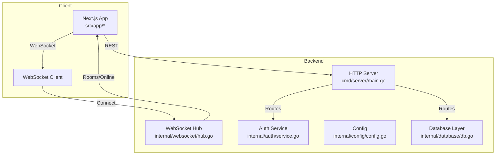
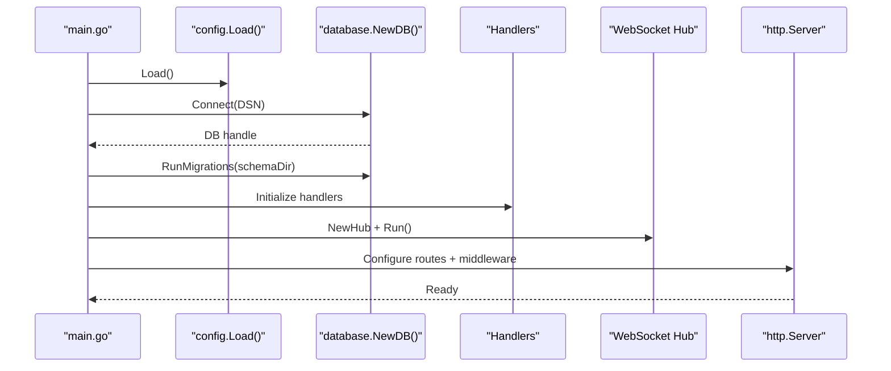
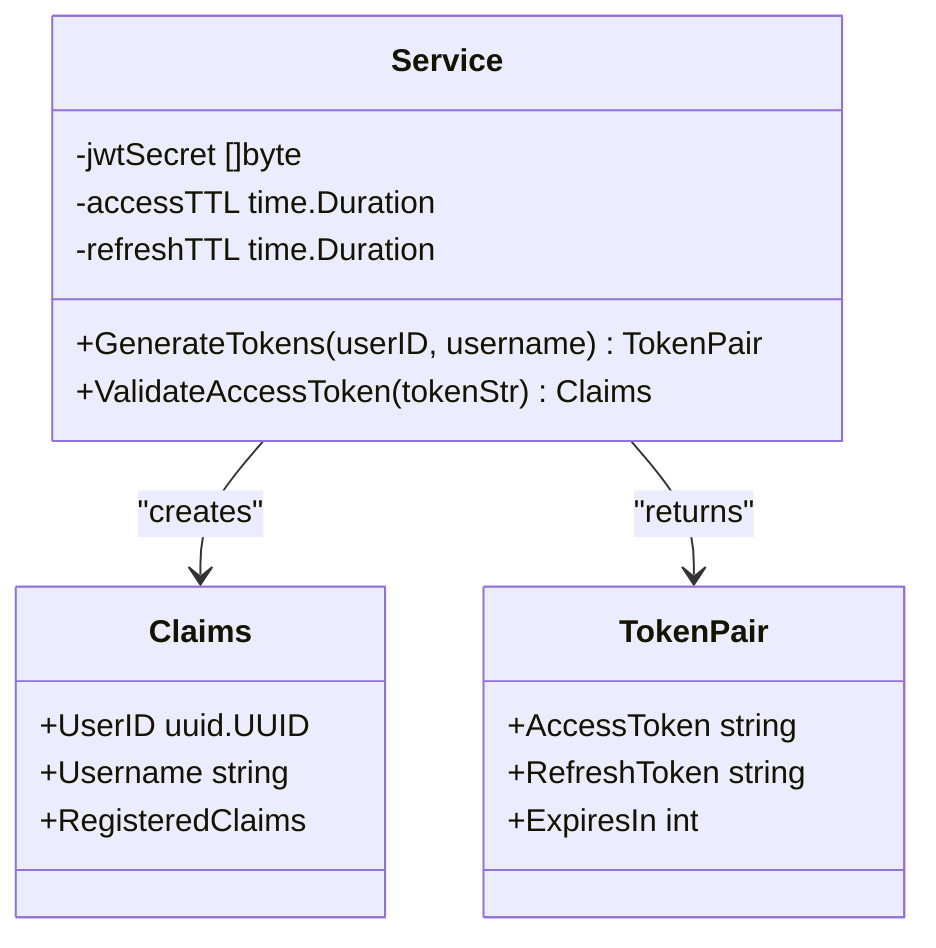
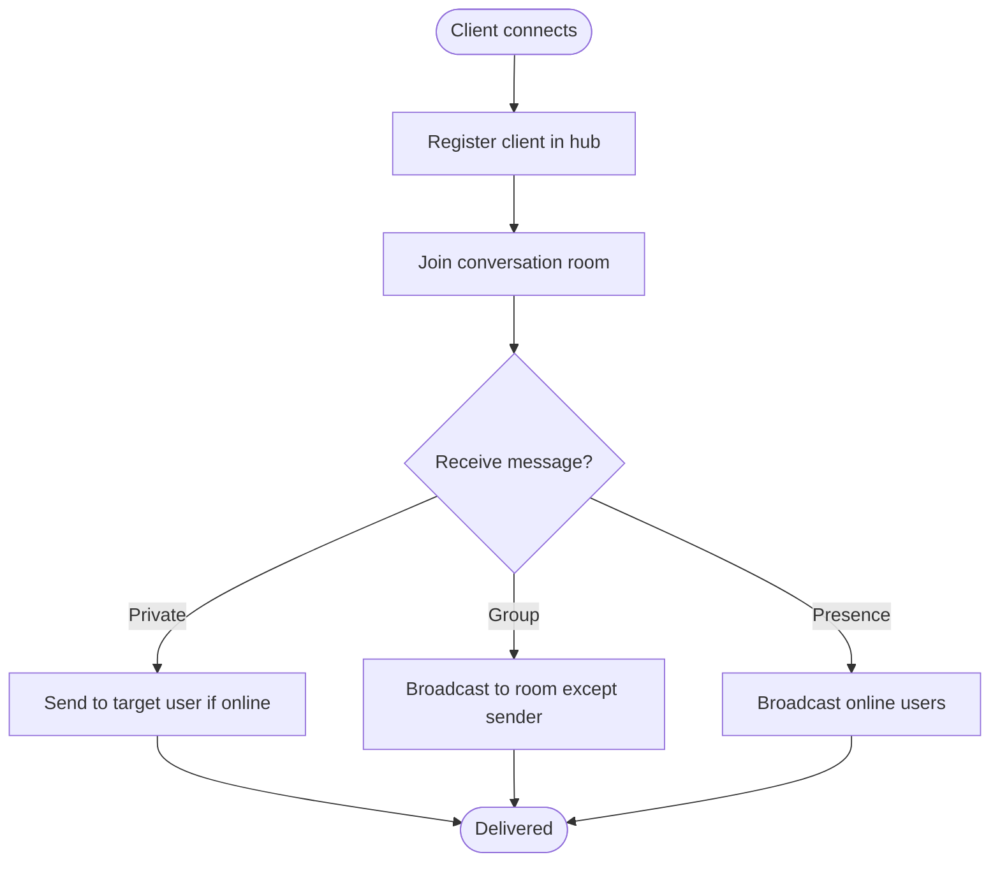
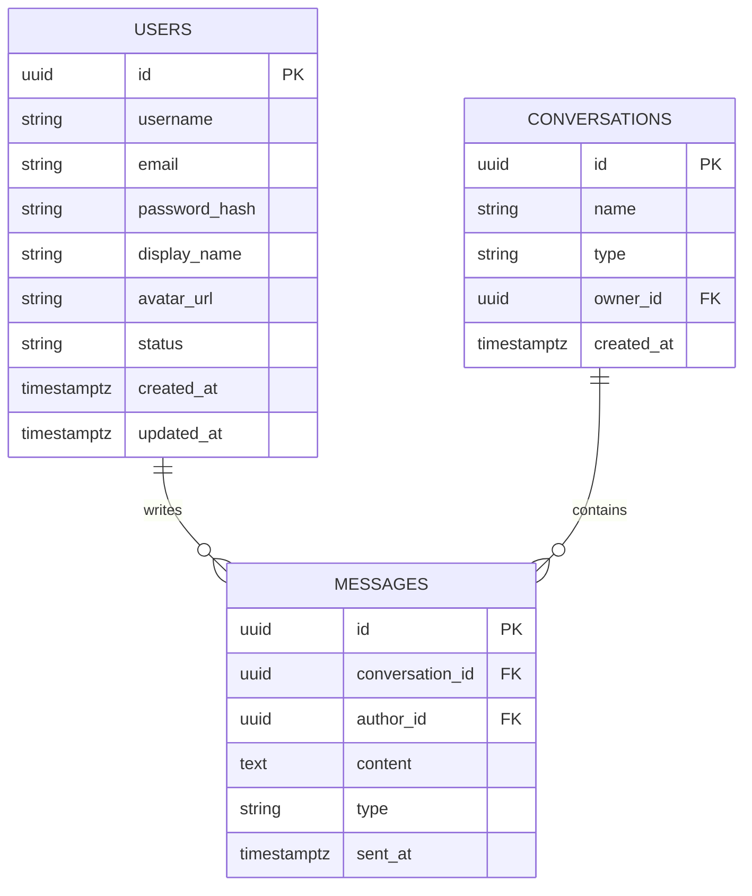
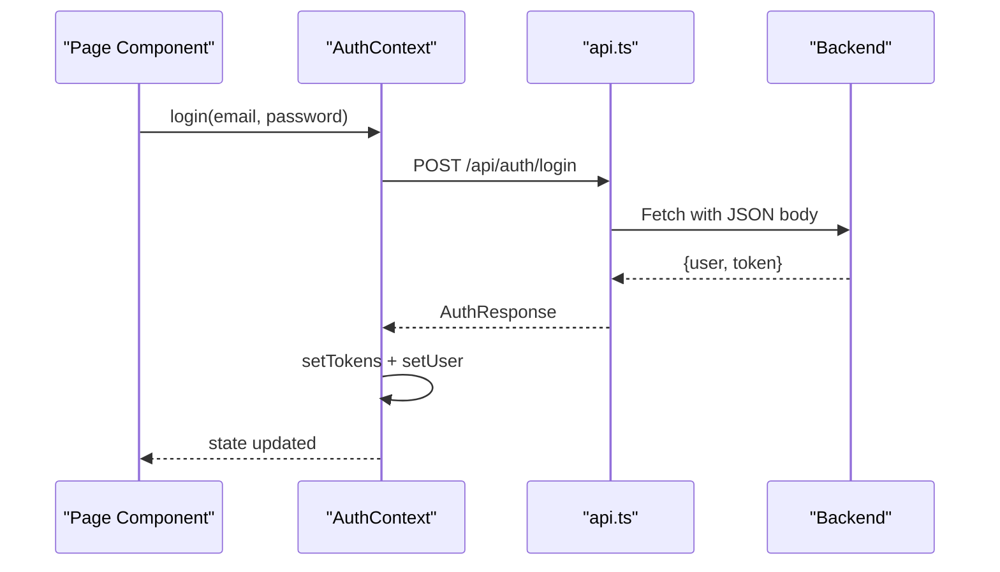
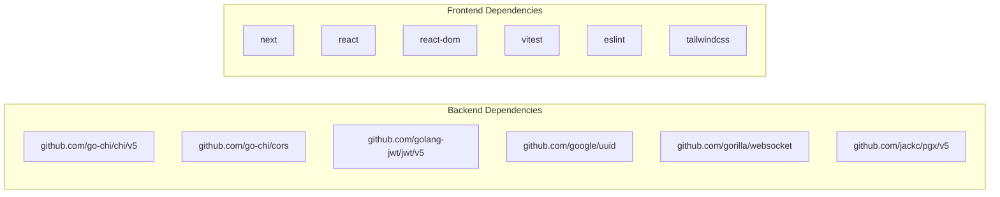

# Development Guidelines

<cite>
**Referenced Files in This Document**
- [README.md](file://README.md)
- [backend/go.mod](file://backend/go.mod)
- [backend/cmd/server/main.go](file://backend/cmd/server/main.go)
- [backend/internal/config/config.go](file://backend/internal/config/config.go)
- [backend/internal/auth/service.go](file://backend/internal/auth/service.go)
- [backend/internal/websocket/hub.go](file://backend/internal/websocket/hub.go)
- [backend/internal/database/db.go](file://backend/internal/database/db.go)
- [backend/sqlc.yaml](file://backend/sqlc.yaml)
- [frontend/package.json](file://frontend/package.json)
- [frontend/src/app/layout.tsx](file://frontend/src/app/layout.tsx)
- [frontend/src/components/Providers.tsx](file://frontend/src/components/Providers.tsx)
- [frontend/src/lib/api.ts](file://frontend/src/lib/api.ts)
- [frontend/src/contexts/AuthContext.tsx](file://frontend/src/contexts/AuthContext.tsx)
- [frontend/tests/api.test.ts](file://frontend/tests/api.test.ts)
- [frontend/vitest.config.ts](file://frontend/vitest.config.ts)
</cite>

## Table of Contents
1. [Introduction](#introduction)
2. [Project Structure](#project-structure)
3. [Core Components](#core-components)
4. [Architecture Overview](#architecture-overview)
5. [Detailed Component Analysis](#detailed-component-analysis)
6. [Dependency Analysis](#dependency-analysis)
7. [Performance Considerations](#performance-considerations)
8. [Troubleshooting Guide](#troubleshooting-guide)
9. [Code Review and Quality Assurance](#code-review-and-quality-assurance)
10. [Git Workflow and Pull Requests](#git-workflow-and-pull-requests)
11. [Extending Functionality](#extending-functionality)
12. [Security Considerations](#security-considerations)
13. [Accessibility Requirements](#accessibility-requirements)
14. [Conclusion](#conclusion)

## Introduction
This document provides comprehensive development guidelines for contributing to Go-Chatsync. It covers backend and frontend development standards, error handling and logging patterns, debugging approaches, Git workflow, code review, testing, and quality assurance. It also outlines performance optimization best practices, security considerations, and accessibility requirements to maintain consistency and reliability across the codebase.

## Project Structure
The project follows a clear separation of concerns:
- Backend: Go application with a modular internal package structure, SQLC-generated database layer, and WebSocket hub for real-time messaging.
- Frontend: Next.js application with TypeScript, React components, contexts for authentication and WebSocket, and a centralized API client.

```mermaid
graph TB
subgraph "Backend (Go)"
A["cmd/server/main.go<br/>Entry point and HTTP server"]
B["internal/config/config.go<br/>Environment-driven configuration"]
C["internal/auth/service.go<br/>JWT token generation/validation"]
D["internal/websocket/hub.go<br/>WebSocket hub and rooms"]
E["internal/database/db.go<br/>SQLC-generated queries"]
F["sqlc.yaml<br/>Database schema and codegen config"]
end
subgraph "Frontend (Next.js)"
G["src/app/layout.tsx<br/>Root layout and providers"]
H["src/components/Providers.tsx<br/>Context providers composition"]
I["src/lib/api.ts<br/>HTTP client with auth headers"]
J["src/contexts/AuthContext.tsx<br/>Authentication state and helpers"]
K["tests/api.test.ts<br/>Vitest unit tests"]
L["vitest.config.ts<br/>Testing configuration"]
end
A --> B
A --> C
A --> D
A --> E
E --> F
G --> H
H --> J
J --> I
I --> A
```

**Diagram sources**
- [backend/cmd/server/main.go:1-148](file://backend/cmd/server/main.go#L1-L148)
- [backend/internal/config/config.go:1-61](file://backend/internal/config/config.go#L1-L61)
- [backend/internal/auth/service.go:1-94](file://backend/internal/auth/service.go#L1-L94)
- [backend/internal/websocket/hub.go:1-137](file://backend/internal/websocket/hub.go#L1-L137)
- [backend/internal/database/db.go:1-33](file://backend/internal/database/db.go#L1-L33)
- [backend/sqlc.yaml:1-25](file://backend/sqlc.yaml#L1-L25)
- [frontend/src/app/layout.tsx:1-38](file://frontend/src/app/layout.tsx#L1-L38)
- [frontend/src/components/Providers.tsx:1-14](file://frontend/src/components/Providers.tsx#L1-L14)
- [frontend/src/lib/api.ts:1-118](file://frontend/src/lib/api.ts#L1-L118)
- [frontend/src/contexts/AuthContext.tsx:1-95](file://frontend/src/contexts/AuthContext.tsx#L1-L95)
- [frontend/tests/api.test.ts:1-101](file://frontend/tests/api.test.ts#L1-L101)
- [frontend/vitest.config.ts:1-16](file://frontend/vitest.config.ts#L1-L16)

**Section sources**
- [README.md:214-233](file://README.md#L214-L233)
- [backend/cmd/server/main.go:1-148](file://backend/cmd/server/main.go#L1-L148)
- [frontend/src/app/layout.tsx:1-38](file://frontend/src/app/layout.tsx#L1-L38)

## Core Components
- Backend entry point initializes configuration, database, services, handlers, and the WebSocket hub, then starts the HTTP server with graceful shutdown.
- Configuration is environment-driven with sensible defaults for database connectivity and JWT tokens.
- Authentication service generates and validates JWT tokens with configurable TTLs.
- WebSocket hub manages clients, rooms, and broadcasting for real-time messaging.
- SQLC generates strongly-typed database queries and models from schema and SQL files.
- Frontend provides a root layout, composed providers, a typed API client, and an authentication context.

Key backend files:
- [backend/cmd/server/main.go:26-147](file://backend/cmd/server/main.go#L26-L147)
- [backend/internal/config/config.go:23-44](file://backend/internal/config/config.go#L23-L44)
- [backend/internal/auth/service.go:29-93](file://backend/internal/auth/service.go#L29-L93)
- [backend/internal/websocket/hub.go:9-137](file://backend/internal/websocket/hub.go#L9-L137)
- [backend/internal/database/db.go:14-33](file://backend/internal/database/db.go#L14-L33)
- [backend/sqlc.yaml:1-25](file://backend/sqlc.yaml#L1-L25)

Key frontend files:
- [frontend/src/app/layout.tsx:22-37](file://frontend/src/app/layout.tsx#L22-L37)
- [frontend/src/components/Providers.tsx:7-13](file://frontend/src/components/Providers.tsx#L7-L13)
- [frontend/src/lib/api.ts:11-37](file://frontend/src/lib/api.ts#L11-L37)
- [frontend/src/contexts/AuthContext.tsx:27-87](file://frontend/src/contexts/AuthContext.tsx#L27-L87)

**Section sources**
- [backend/cmd/server/main.go:26-147](file://backend/cmd/server/main.go#L26-L147)
- [backend/internal/config/config.go:23-44](file://backend/internal/config/config.go#L23-L44)
- [backend/internal/auth/service.go:29-93](file://backend/internal/auth/service.go#L29-L93)
- [backend/internal/websocket/hub.go:9-137](file://backend/internal/websocket/hub.go#L9-L137)
- [backend/internal/database/db.go:14-33](file://backend/internal/database/db.go#L14-L33)
- [backend/sqlc.yaml:1-25](file://backend/sqlc.yaml#L1-L25)
- [frontend/src/app/layout.tsx:22-37](file://frontend/src/app/layout.tsx#L22-L37)
- [frontend/src/components/Providers.tsx:7-13](file://frontend/src/components/Providers.tsx#L7-L13)
- [frontend/src/lib/api.ts:11-37](file://frontend/src/lib/api.ts#L11-L37)
- [frontend/src/contexts/AuthContext.tsx:27-87](file://frontend/src/contexts/AuthContext.tsx#L27-L87)

## Architecture Overview
The system uses a single-port architecture:
- Backend serves static assets and exposes REST endpoints and a WebSocket endpoint.
- Frontend runs on a separate development port during local development but is bundled and served by the backend in production.
- WebSocket hub coordinates real-time messaging across private and group conversations.

**Diagram sources**
- [backend/cmd/server/main.go:57-114](file://backend/cmd/server/main.go#L57-L114)
- [backend/internal/websocket/hub.go:9-137](file://backend/internal/websocket/hub.go#L9-L137)
- [backend/internal/auth/service.go:29-93](file://backend/internal/auth/service.go#L29-L93)
- [backend/internal/config/config.go:23-44](file://backend/internal/config/config.go#L23-L44)
- [backend/internal/database/db.go:14-33](file://backend/internal/database/db.go#L14-L33)

**Section sources**
- [README.md:119-147](file://README.md#L119-L147)
- [backend/cmd/server/main.go:57-114](file://backend/cmd/server/main.go#L57-L114)

## Detailed Component Analysis

### Backend: HTTP Server and Routing
- Initializes configuration, connects to the database, runs migrations, and sets up handlers and middleware.
- Exposes health check, public auth endpoints, and protected routes grouped under an authentication middleware.
- Starts the HTTP server with timeouts and graceful shutdown.

**Diagram sources**
- [backend/cmd/server/main.go:26-147](file://backend/cmd/server/main.go#L26-L147)
- [backend/internal/config/config.go:23-44](file://backend/internal/config/config.go#L23-L44)
- [backend/internal/database/db.go:14-33](file://backend/internal/database/db.go#L14-L33)

**Section sources**
- [backend/cmd/server/main.go:26-147](file://backend/cmd/server/main.go#L26-L147)

### Backend: Authentication Service (JWT)
- Generates access and refresh tokens with configured TTLs.
- Validates access tokens and extracts claims.
- Integrates with the HTTP server via middleware and handlers.

**Diagram sources**
- [backend/internal/auth/service.go:11-93](file://backend/internal/auth/service.go#L11-L93)

**Section sources**
- [backend/internal/auth/service.go:29-93](file://backend/internal/auth/service.go#L29-L93)

### Backend: WebSocket Hub
- Manages client registration/unregistration, rooms, and broadcasting.
- Supports online user broadcasts and per-room message delivery.

**Diagram sources**
- [backend/internal/websocket/hub.go:18-137](file://backend/internal/websocket/hub.go#L18-L137)

**Section sources**
- [backend/internal/websocket/hub.go:18-137](file://backend/internal/websocket/hub.go#L18-L137)

### Backend: Database Layer (SQLC)
- Generated queries and models provide type-safe database access.
- Overrides ensure UUID and timestamptz types map to idiomatic Go types.

**Diagram sources**
- [backend/sqlc.yaml:17-25](file://backend/sqlc.yaml#L17-L25)
- [backend/internal/database/db.go:14-33](file://backend/internal/database/db.go#L14-L33)

**Section sources**
- [backend/sqlc.yaml:1-25](file://backend/sqlc.yaml#L1-L25)
- [backend/internal/database/db.go:14-33](file://backend/internal/database/db.go#L14-L33)

### Frontend: API Client and Authentication Context
- Centralized API client handles base URL, auth headers, and error handling.
- Authentication context manages user state, login/register/logout, and token storage.
- Providers compose context providers at the root layout level.

**Diagram sources**
- [frontend/src/contexts/AuthContext.tsx:44-75](file://frontend/src/contexts/AuthContext.tsx#L44-L75)
- [frontend/src/lib/api.ts:41-63](file://frontend/src/lib/api.ts#L41-L63)
- [backend/cmd/server/main.go:80-85](file://backend/cmd/server/main.go#L80-L85)

**Section sources**
- [frontend/src/lib/api.ts:11-37](file://frontend/src/lib/api.ts#L11-L37)
- [frontend/src/contexts/AuthContext.tsx:27-87](file://frontend/src/contexts/AuthContext.tsx#L27-L87)
- [frontend/src/components/Providers.tsx:7-13](file://frontend/src/components/Providers.tsx#L7-L13)
- [frontend/src/app/layout.tsx:22-37](file://frontend/src/app/layout.tsx#L22-L37)

## Dependency Analysis
Backend module dependencies and frontend package dependencies define the technology stack and integration points.

**Diagram sources**
- [backend/go.mod:5-13](file://backend/go.mod#L5-L13)
- [frontend/package.json:12-31](file://frontend/package.json#L12-L31)

**Section sources**
- [backend/go.mod:1-22](file://backend/go.mod#L1-L22)
- [frontend/package.json:1-33](file://frontend/package.json#L1-L33)

## Performance Considerations
- Use prepared queries and avoid N+1 selects by leveraging generated queries.
- Minimize allocations in hot paths (WebSocket message handling and routing).
- Apply connection pooling and timeouts at the HTTP server level.
- Keep message payload sizes reasonable; batch presence updates where appropriate.
- Cache frequently accessed user profiles and conversation metadata in memory for short TTLs.
- Monitor PostgreSQL query performance and add missing indexes for high-cardinality fields.

[No sources needed since this section provides general guidance]

## Troubleshooting Guide
- Backend
  - Use structured logging and request IDs for traceability.
  - Enable recover middleware to prevent panics from crashing the server.
  - Verify environment variables for database DSN and JWT secrets.
  - Check WebSocket hub logs for client registration/unregistration anomalies.
- Frontend
  - Inspect network tab for failed API requests and missing Authorization headers.
  - Validate token storage and expiration handling in localStorage.
  - Use Vitest snapshots and assertions to verify API client behavior.

**Section sources**
- [backend/cmd/server/main.go:61-63](file://backend/cmd/server/main.go#L61-L63)
- [backend/internal/config/config.go:23-44](file://backend/internal/config/config.go#L23-L44)
- [frontend/src/lib/api.ts:11-37](file://frontend/src/lib/api.ts#L11-L37)
- [frontend/tests/api.test.ts:26-100](file://frontend/tests/api.test.ts#L26-L100)

## Code Review and Quality Assurance
- Backend
  - Enforce consistent error wrapping and return types.
  - Validate inputs early and fail fast.
  - Keep handlers thin; delegate business logic to services.
  - Ensure all exported functions have godoc comments.
- Frontend
  - Prefer TypeScript types over dynamic typing.
  - Use React hooks consistently and memoize expensive computations.
  - Write unit tests for API client functions and context logic.
  - Lint with ESLint and format with Prettier/Tailwind CSS.

**Section sources**
- [frontend/src/lib/api.ts:11-37](file://frontend/src/lib/api.ts#L11-L37)
- [frontend/tests/api.test.ts:26-100](file://frontend/tests/api.test.ts#L26-L100)
- [frontend/vitest.config.ts:4-15](file://frontend/vitest.config.ts#L4-L15)

## Git Workflow and Pull Requests
- Branch naming: feature/short-description, fix/issue, chore/task.
- Commit messages: present tense, concise, include issue reference if applicable.
- PR checklist:
  - All tests pass locally.
  - Code reviewed by at least one maintainer.
  - Changes documented in README if user-facing.
  - No hardcoded secrets; environment variables used for configuration.

**Section sources**
- [README.md:318-325](file://README.md#L318-L325)

## Extending Functionality
- Backend
  - Add new domain features by creating new internal packages (e.g., notifications).
  - Define SQL queries and models; regenerate with SQLC.
  - Add handlers and routes; protect with middleware as needed.
- Frontend
  - Create new pages under src/app and components under src/components.
  - Extend types in src/types/index.ts.
  - Add new API endpoints to the api client and tests.

**Section sources**
- [backend/sqlc.yaml:1-25](file://backend/sqlc.yaml#L1-L25)
- [frontend/src/lib/api.ts:39-117](file://frontend/src/lib/api.ts#L39-L117)

## Security Considerations
- Backend
  - Validate and sanitize all inputs; enforce CSRF protection for state-changing endpoints.
  - Rotate JWT secrets and manage refresh token lifecycle securely.
  - Limit CORS exposure; restrict allowed origins and headers.
- Frontend
  - Never log sensitive tokens; clear tokens on logout.
  - Use HTTPS in production; enforce secure cookies for tokens.
  - Sanitize user-generated content before rendering.

**Section sources**
- [backend/cmd/server/main.go:64-71](file://backend/cmd/server/main.go#L64-L71)
- [backend/internal/auth/service.go:37-73](file://backend/internal/auth/service.go#L37-L73)
- [frontend/src/contexts/AuthContext.tsx:71-75](file://frontend/src/contexts/AuthContext.tsx#L71-L75)

## Accessibility Requirements
- Use semantic HTML and ARIA attributes where necessary.
- Ensure keyboard navigation support for interactive elements.
- Provide focus management for dialogs and modals.
- Maintain sufficient color contrast and readable font sizes.
- Test with screen readers and assistive technologies.

[No sources needed since this section provides general guidance]

## Conclusion
These guidelines establish a consistent foundation for building, testing, and maintaining Go-Chatsync. By adhering to the outlined patterns—modular backend design, type-safe database access, robust authentication, real-time WebSocket coordination, and disciplined frontend development—you can extend functionality safely and efficiently while preserving performance, security, and accessibility.