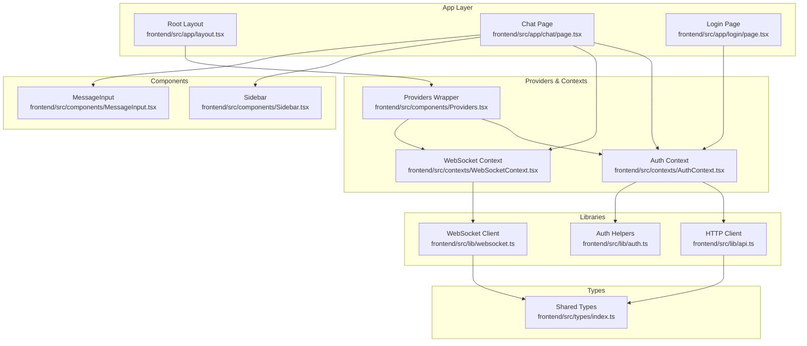
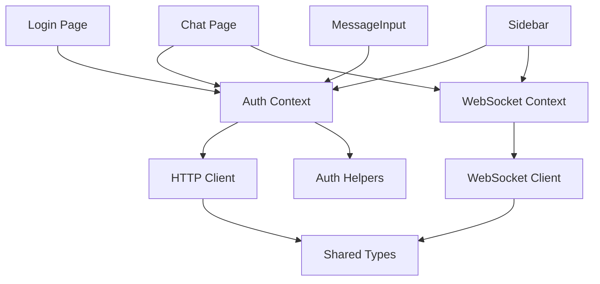
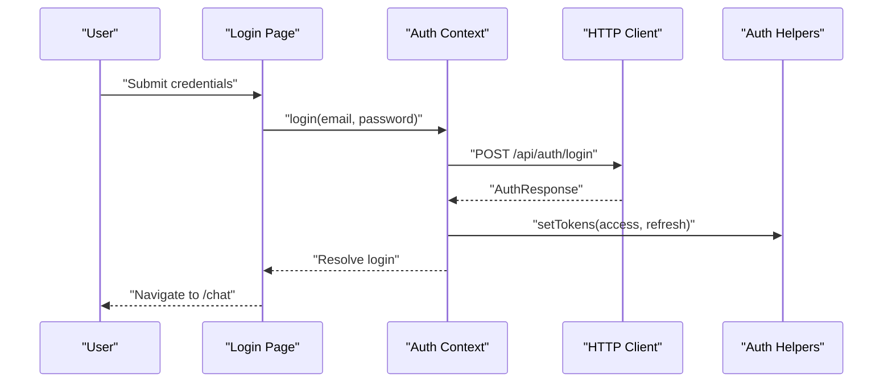
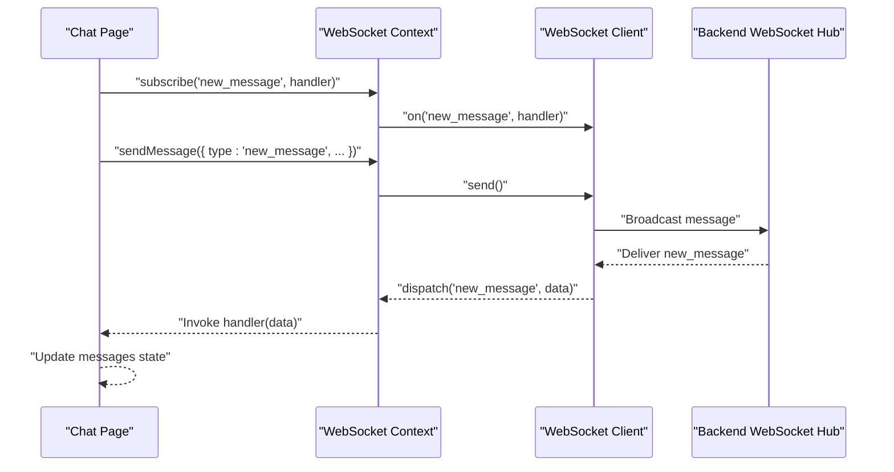
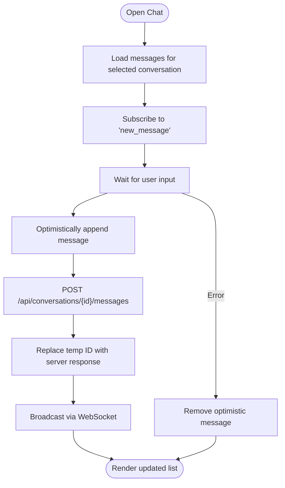
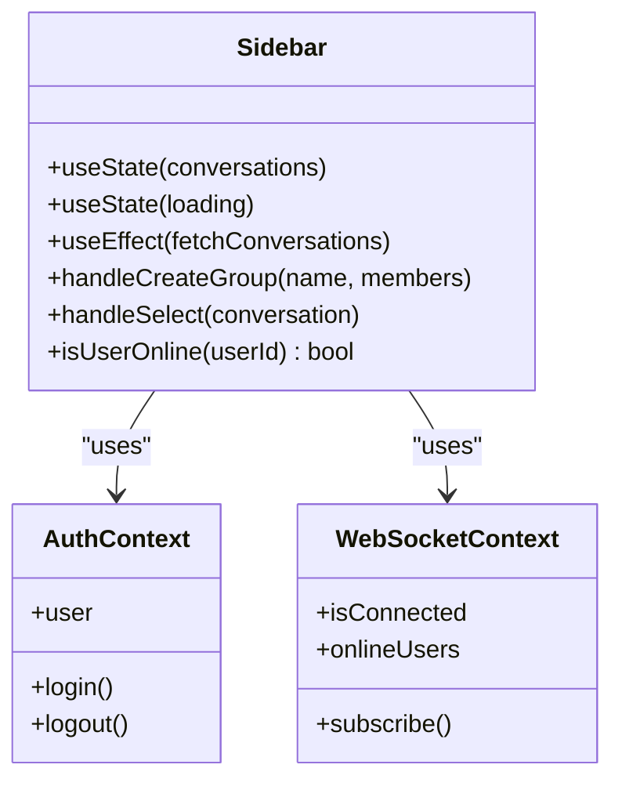
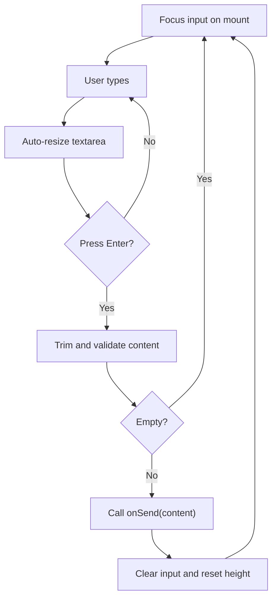
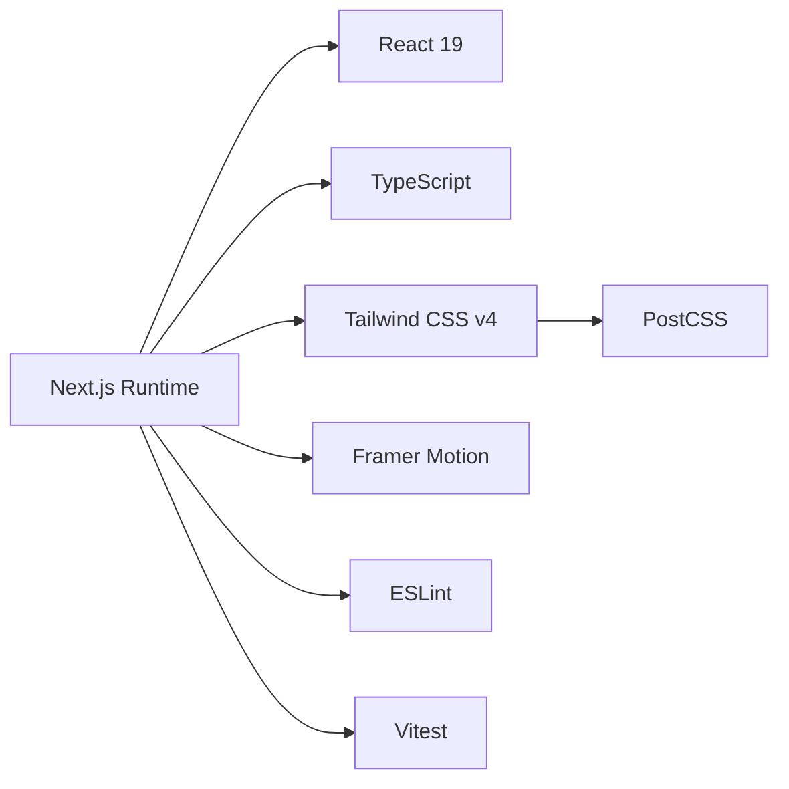

# Frontend Architecture

<cite>
**Referenced Files in This Document**
- [layout.tsx](file://frontend/src/app/layout.tsx)
- [Providers.tsx](file://frontend/src/components/Providers.tsx)
- [AuthContext.tsx](file://frontend/src/contexts/AuthContext.tsx)
- [WebSocketContext.tsx](file://frontend/src/contexts/WebSocketContext.tsx)
- [api.ts](file://frontend/src/lib/api.ts)
- [websocket.ts](file://frontend/src/lib/websocket.ts)
- [auth.ts](file://frontend/src/lib/auth.ts)
- [index.ts](file://frontend/src/types/index.ts)
- [page.tsx (Chat)](file://frontend/src/app/chat/page.tsx)
- [page.tsx (Login)](file://frontend/src/app/login/page.tsx)
- [Sidebar.tsx](file://frontend/src/components/Sidebar.tsx)
- [MessageInput.tsx](file://frontend/src/components/MessageInput.tsx)
- [package.json](file://frontend/package.json)
- [next.config.ts](file://frontend/next.config.ts)
- [tsconfig.json](file://frontend/tsconfig.json)
</cite>

## Table of Contents
1. [Introduction](#introduction)
2. [Project Structure](#project-structure)
3. [Core Components](#core-components)
4. [Architecture Overview](#architecture-overview)
5. [Detailed Component Analysis](#detailed-component-analysis)
6. [Dependency Analysis](#dependency-analysis)
7. [Performance Considerations](#performance-considerations)
8. [Troubleshooting Guide](#troubleshooting-guide)
9. [Conclusion](#conclusion)
10. [Appendices](#appendices)

## Introduction
This document describes the frontend architecture of the Next.js application built with React, TypeScript, and the Next.js App Router. The system emphasizes real-time messaging using WebSocket connections, centralized authentication via React Context, and a cohesive design system powered by Tailwind CSS variables and Framer Motion animations. It covers component interactions, state management patterns, WebSocket integration, authentication flow, infrastructure requirements, build configuration, and deployment considerations.

## Project Structure
The frontend follows Next.js App Router conventions with a strict separation of server-side layout, client-side providers, shared contexts, typed APIs, and reusable components. The structure supports scalable growth across pages, contexts, and utilities.

**Diagram sources**
- [layout.tsx:1-38](file://frontend/src/app/layout.tsx#L1-L38)
- [Providers.tsx:1-14](file://frontend/src/components/Providers.tsx#L1-L14)
- [AuthContext.tsx:1-95](file://frontend/src/contexts/AuthContext.tsx#L1-L95)
- [WebSocketContext.tsx:1-84](file://frontend/src/contexts/WebSocketContext.tsx#L1-L84)
- [api.ts:1-118](file://frontend/src/lib/api.ts#L1-L118)
- [websocket.ts:1-95](file://frontend/src/lib/websocket.ts#L1-L95)
- [auth.ts:1-29](file://frontend/src/lib/auth.ts#L1-L29)
- [index.ts:1-72](file://frontend/src/types/index.ts#L1-L72)
- [page.tsx (Chat):1-232](file://frontend/src/app/chat/page.tsx#L1-L232)
- [page.tsx (Login):1-129](file://frontend/src/app/login/page.tsx#L1-L129)
- [Sidebar.tsx:1-227](file://frontend/src/components/Sidebar.tsx#L1-L227)
- [MessageInput.tsx:1-85](file://frontend/src/components/MessageInput.tsx#L1-L85)

**Section sources**
- [layout.tsx:1-38](file://frontend/src/app/layout.tsx#L1-L38)
- [Providers.tsx:1-14](file://frontend/src/components/Providers.tsx#L1-L14)
- [package.json:1-33](file://frontend/package.json#L1-L33)
- [next.config.ts:1-8](file://frontend/next.config.ts#L1-L8)
- [tsconfig.json:1-35](file://frontend/tsconfig.json#L1-L35)

## Core Components
- Root layout initializes fonts, global styles, and wraps children with Providers.
- Providers composes AuthProvider and WebSocketProvider to expose authentication and WebSocket capabilities to the app.
- AuthContext manages user session state, login/register/logout actions, and integrates with local storage tokens.
- WebSocketContext manages connection lifecycle, message subscriptions, and broadcasting via a singleton WSClient.
- Shared API client encapsulates HTTP requests with automatic Authorization header injection and error handling.
- Reusable components include Sidebar and MessageInput, which consume contexts and drive UI interactions.

**Section sources**
- [layout.tsx:16-38](file://frontend/src/app/layout.tsx#L16-L38)
- [Providers.tsx:7-14](file://frontend/src/components/Providers.tsx#L7-L14)
- [AuthContext.tsx:15-95](file://frontend/src/contexts/AuthContext.tsx#L15-L95)
- [WebSocketContext.tsx:16-84](file://frontend/src/contexts/WebSocketContext.tsx#L16-L84)
- [api.ts:11-118](file://frontend/src/lib/api.ts#L11-L118)
- [websocket.ts:5-95](file://frontend/src/lib/websocket.ts#L5-L95)

## Architecture Overview
The architecture centers around a layered design:
- Presentation Layer: Pages (login, chat) and reusable components (Sidebar, MessageInput).
- Context Layer: Authentication and WebSocket contexts coordinate state and events.
- Service Layer: API client and WebSocket client abstract network concerns.
- Type System: Shared TypeScript interfaces define contracts across layers.

**Diagram sources**
- [page.tsx (Login):1-129](file://frontend/src/app/login/page.tsx#L1-L129)
- [page.tsx (Chat):1-232](file://frontend/src/app/chat/page.tsx#L1-L232)
- [Sidebar.tsx:1-227](file://frontend/src/components/Sidebar.tsx#L1-L227)
- [MessageInput.tsx:1-85](file://frontend/src/components/MessageInput.tsx#L1-L85)
- [AuthContext.tsx:1-95](file://frontend/src/contexts/AuthContext.tsx#L1-L95)
- [WebSocketContext.tsx:1-84](file://frontend/src/contexts/WebSocketContext.tsx#L1-L84)
- [api.ts:1-118](file://frontend/src/lib/api.ts#L1-L118)
- [websocket.ts:1-95](file://frontend/src/lib/websocket.ts#L1-L95)
- [auth.ts:1-29](file://frontend/src/lib/auth.ts#L1-L29)
- [index.ts:1-72](file://frontend/src/types/index.ts#L1-L72)

## Detailed Component Analysis

### Authentication Flow
The authentication flow uses React Context to centralize state and integrates with local storage tokens. The AuthProvider hydrates user data on startup, exposes login/register/logout functions, and ensures proper cleanup.

**Diagram sources**
- [page.tsx (Login):17-29](file://frontend/src/app/login/page.tsx#L17-L29)
- [AuthContext.tsx:44-75](file://frontend/src/contexts/AuthContext.tsx#L44-L75)
- [api.ts:41-60](file://frontend/src/lib/api.ts#L41-L60)
- [auth.ts:15-23](file://frontend/src/lib/auth.ts#L15-L23)

**Section sources**
- [AuthContext.tsx:27-88](file://frontend/src/contexts/AuthContext.tsx#L27-L88)
- [api.ts:39-63](file://frontend/src/lib/api.ts#L39-L63)
- [auth.ts:4-28](file://frontend/src/lib/auth.ts#L4-L28)

### WebSocket Integration
WebSocketContext manages a singleton client, handles reconnection, and exposes subscription and send primitives. It listens for online user updates and forwards incoming messages to subscribers.

**Diagram sources**
- [page.tsx (Chat):32-51](file://frontend/src/app/chat/page.tsx#L32-L51)
- [WebSocketContext.tsx:27-76](file://frontend/src/contexts/WebSocketContext.tsx#L27-L76)
- [websocket.ts:19-84](file://frontend/src/lib/websocket.ts#L19-L84)

**Section sources**
- [WebSocketContext.tsx:27-76](file://frontend/src/contexts/WebSocketContext.tsx#L27-L76)
- [websocket.ts:5-95](file://frontend/src/lib/websocket.ts#L5-L95)

### Chat Page Interaction
The Chat page orchestrates message loading, real-time updates, optimistic UI, and sending messages via both HTTP and WebSocket.

**Diagram sources**
- [page.tsx (Chat):12-89](file://frontend/src/app/chat/page.tsx#L12-L89)

**Section sources**
- [page.tsx (Chat):12-189](file://frontend/src/app/chat/page.tsx#L12-L189)

### Sidebar and Conversation Management
Sidebar fetches conversations, displays presence indicators, and allows creating groups. It integrates with WebSocket online users and Auth context for user info.

**Diagram sources**
- [Sidebar.tsx:12-227](file://frontend/src/components/Sidebar.tsx#L12-L227)
- [AuthContext.tsx:15-95](file://frontend/src/contexts/AuthContext.tsx#L15-L95)
- [WebSocketContext.tsx:16-84](file://frontend/src/contexts/WebSocketContext.tsx#L16-L84)

**Section sources**
- [Sidebar.tsx:12-227](file://frontend/src/components/Sidebar.tsx#L12-L227)

### MessageInput Component
MessageInput provides a dynamic textarea with auto-resize, Enter-to-send behavior, and optimistic UX feedback.

**Diagram sources**
- [MessageInput.tsx:10-85](file://frontend/src/components/MessageInput.tsx#L10-L85)

**Section sources**
- [MessageInput.tsx:10-85](file://frontend/src/components/MessageInput.tsx#L10-L85)

## Dependency Analysis
The frontend relies on Next.js runtime, React 19, TypeScript, Tailwind CSS v4, and Framer Motion for animations. Build and test tooling includes ESLint, Vitest, and PostCSS/Tailwind integration.

**Diagram sources**
- [package.json:12-31](file://frontend/package.json#L12-L31)

**Section sources**
- [package.json:1-33](file://frontend/package.json#L1-L33)
- [tsconfig.json:2-23](file://frontend/tsconfig.json#L2-L23)

## Performance Considerations
- Optimistic UI: Chat app replaces temporary message IDs after successful API responses to reduce perceived latency.
- Efficient rendering: Chat lists leverage animation libraries for smooth entry transitions and minimal DOM churn.
- Lazy initialization: WebSocket client is created only when a user exists, avoiding unnecessary connections.
- Reconnection strategy: WebSocket client retries with exponential backoff to recover from transient failures.
- Local caching: Auth helpers store tokens in local storage to avoid redundant sign-ins.

[No sources needed since this section provides general guidance]

## Troubleshooting Guide
Common issues and remedies:
- Authentication errors: Verify token presence in local storage and ensure API base URL is configured. Check error propagation from AuthContext to UI.
- WebSocket disconnections: Confirm backend WebSocket endpoint availability and token query parameter. Inspect reconnect logs and timers.
- Network failures: Inspect HTTP client error handling and ensure Authorization header is attached automatically.
- Build/test failures: Validate TypeScript strictness and path aliases. Run lint and unit tests to catch regressions early.

**Section sources**
- [AuthContext.tsx:32-42](file://frontend/src/contexts/AuthContext.tsx#L32-L42)
- [api.ts:31-37](file://frontend/src/lib/api.ts#L31-L37)
- [websocket.ts:33-37](file://frontend/src/lib/websocket.ts#L33-L37)
- [auth.ts:15-23](file://frontend/src/lib/auth.ts#L15-L23)

## Conclusion
The frontend employs a clean, layered architecture with React Context for state and event coordination, a robust HTTP client for API interactions, and a resilient WebSocket client for real-time updates. The design emphasizes scalability, maintainability, and a polished user experience through animations and responsive UI patterns.

[No sources needed since this section summarizes without analyzing specific files]

## Appendices

### Technology Stack
- Next.js App Router with React 19 and TypeScript
- Tailwind CSS v4 for styling with CSS variables
- Framer Motion for animations
- Vitest and Testing Library for testing
- ESLint for code quality

**Section sources**
- [package.json:12-31](file://frontend/package.json#L12-L31)
- [tsconfig.json:2-23](file://frontend/tsconfig.json#L2-L23)

### Build and Deployment Notes
- Build command: next build
- Dev server: next dev
- Production start: next start
- Environment variables: NEXT_PUBLIC_API_URL, NEXT_PUBLIC_WS_URL, access_token/refresh_token stored in local storage
- Infrastructure: Backend API and WebSocket server must be reachable at configured URLs

**Section sources**
- [package.json:5-10](file://frontend/package.json#L5-L10)
- [api.ts:1](file://frontend/src/lib/api.ts#L1)
- [websocket.ts:1](file://frontend/src/lib/websocket.ts#L1)
- [auth.ts:15-23](file://frontend/src/lib/auth.ts#L15-L23)

### Cross-Cutting Concerns
- Error boundaries: Wrap critical areas with error handling to prevent app crashes.
- Loading states: Use skeleton loaders and progress indicators during data fetches and message sends.
- Responsive design: Utilize Tailwind utilities and CSS variables for adaptive layouts across devices.
- Accessibility: Ensure focus management, keyboard navigation, and ARIA attributes where appropriate.

[No sources needed since this section provides general guidance]