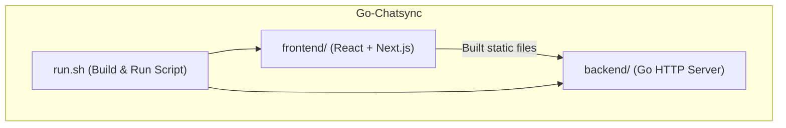
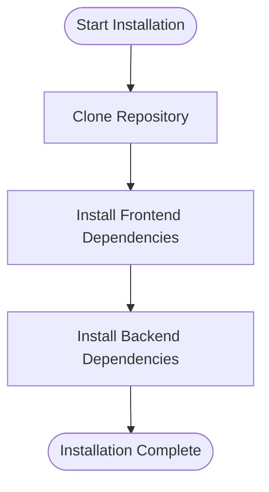
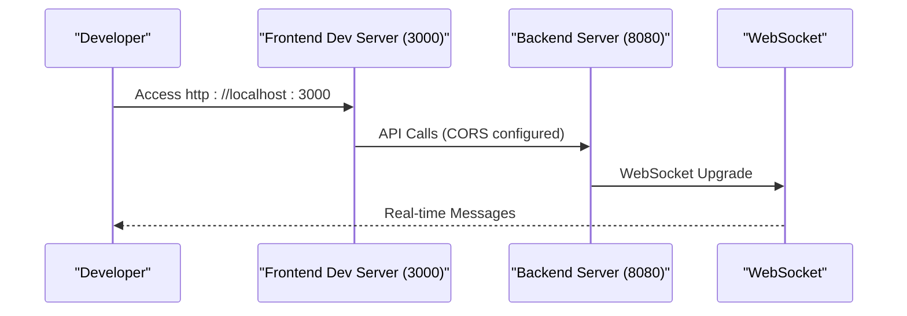
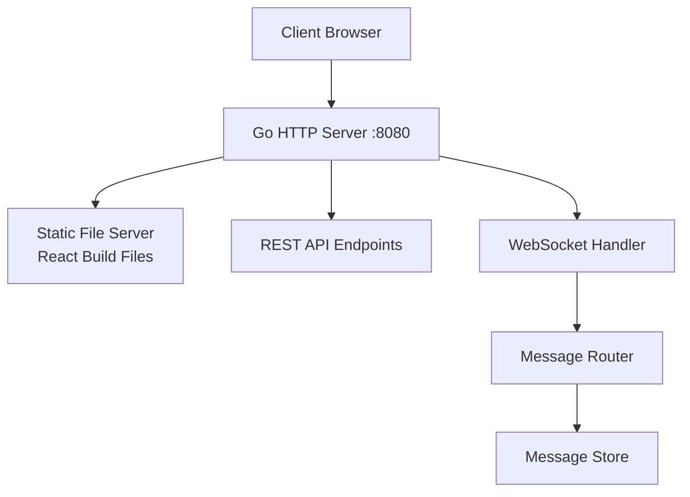
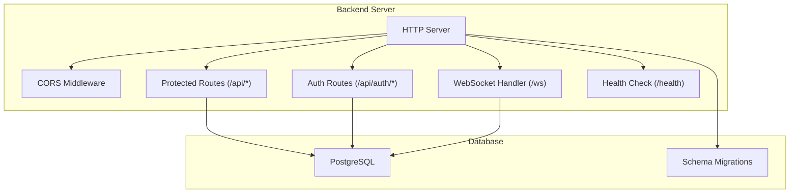

# Getting Started

<cite>
**Referenced Files in This Document**
- [README.md](file://README.md)
- [run.sh](file://run.sh)
- [backend/go.mod](file://backend/go.mod)
- [backend/cmd/server/main.go](file://backend/cmd/server/main.go)
- [backend/internal/config/config.go](file://backend/internal/config/config.go)
- [backend/internal/database/db.go](file://backend/internal/database/db.go)
- [backend/sql/schema/001_users.sql](file://backend/sql/schema/001_users.sql)
- [backend/scripts/build.sh](file://backend/scripts/build.sh)
- [frontend/package.json](file://frontend/package.json)
- [frontend/README.md](file://frontend/README.md)
- [frontend/tsconfig.json](file://frontend/tsconfig.json)
</cite>

## Table of Contents
1. [Introduction](#introduction)
2. [Project Structure](#project-structure)
3. [Prerequisites](#prerequisites)
4. [Installation](#installation)
5. [Initial Setup](#initial-setup)
6. [Running the Application](#running-the-application)
7. [Development Environment](#development-environment)
8. [Production Deployment](#production-deployment)
9. [Environment Variables](#environment-variables)
10. [Architecture Overview](#architecture-overview)
11. [Troubleshooting Guide](#troubleshooting-guide)
12. [Conclusion](#conclusion)

## Introduction
Go-Chatsync is a real-time chat application built with Go and React, featuring private messaging, group chat, user presence tracking, and WebSocket-based bidirectional communication. The application serves both frontend and backend from a single Go HTTP server on port 8080 in production, while supporting separate development servers during local development.

## Project Structure
The project is organized into two primary modules:
- frontend/: React application using Next.js
- backend/: Go application with HTTP server, WebSocket handler, database layer, and API endpoints

**Diagram sources**
- [README.md:214-233](file://README.md#L214-L233)
- [run.sh:1-77](file://run.sh#L1-L77)

**Section sources**
- [README.md:214-233](file://README.md#L214-L233)

## Prerequisites
Ensure your system meets the following requirements before installation:
- Go 1.16 or later
- Node.js 14 or later
- npm or yarn (or another supported package manager)

These prerequisites are verified by the run.sh script and required for building and running the application.

**Section sources**
- [README.md:237-242](file://README.md#L237-L242)
- [run.sh:11-21](file://run.sh#L11-L21)

## Installation
Follow these steps to install the application locally:

1. Clone the repository and navigate into the project directory
2. Install frontend dependencies
3. Install backend dependencies

**Diagram sources**
- [README.md:243-262](file://README.md#L243-L262)

**Section sources**
- [README.md:243-262](file://README.md#L243-L262)

## Initial Setup
Before running the application, configure the environment variables for database connectivity and server settings. These variables are loaded by the backend configuration loader.

Key environment variables:
- DB_HOST: PostgreSQL host (default: localhost)
- DB_PORT: PostgreSQL port (default: 5432)
- DB_USER: PostgreSQL username (default: postgres)
- DB_PASSWORD: PostgreSQL password (default: password)
- DB_NAME: Database name (default: go-chatsync)
- DB_SSLMODE: SSL mode (default: disable)
- SERVER_PORT: Application port (default: 8080)
- JWT_SECRET: Secret key for JWT signing (default provided)
- JWT_ACCESS_TTL: Access token TTL in minutes (default: 15)
- JWT_REFRESH_TTL: Refresh token TTL in days (default: 7)

The configuration loader reads these values from environment variables and provides defaults when unspecified.

**Section sources**
- [backend/internal/config/config.go:23-37](file://backend/internal/config/config.go#L23-L37)
- [backend/internal/config/config.go:39-44](file://backend/internal/config/config.go#L39-L44)

## Running the Application
The simplest way to run the application is using the provided run.sh script, which automates the entire build and startup process.

### Using run.sh
The script performs the following actions:
1. Verifies Go and Node.js installations
2. Installs Go dependencies if needed
3. Installs frontend dependencies if needed
4. Builds the React application
5. Copies build artifacts to the backend static directory
6. Builds the Go binary
7. Starts the server on port 8080

After successful startup, the server serves the React application and handles WebSocket connections on the same port.

**Section sources**
- [run.sh:1-77](file://run.sh#L1-L77)
- [README.md:263-274](file://README.md#L263-L274)

## Development Environment
During development, the frontend and backend operate on separate ports:
- Frontend: Next.js development server on port 3000
- Backend: Go HTTP server on port 8080
- WebSocket connections target the backend server

The frontend README documents the development server commands and expected URL for accessing the application.

**Diagram sources**
- [frontend/README.md:5-17](file://frontend/README.md#L5-L17)
- [backend/cmd/server/main.go:113-115](file://backend/cmd/server/main.go#L113-L115)

**Section sources**
- [README.md:136-147](file://README.md#L136-L147)
- [frontend/README.md:5-17](file://frontend/README.md#L5-L17)

## Production Deployment
In production, the application is served entirely from a single port (8080):
- The Go server builds and serves the React application's static files
- All API endpoints and WebSocket connections are handled by the same server
- No separate frontend development server is required

The backend main.go sets up the HTTP server with CORS middleware, health checks, API routes, and WebSocket endpoint, all bound to the configured port.

**Diagram sources**
- [README.md:121-147](file://README.md#L121-L147)
- [backend/cmd/server/main.go:57-115](file://backend/cmd/server/main.go#L57-L115)

**Section sources**
- [README.md:121-147](file://README.md#L121-L147)
- [backend/cmd/server/main.go:116-124](file://backend/cmd/server/main.go#L116-L124)

## Environment Variables
Configure the following environment variables for proper operation:

Required:
- DB_HOST, DB_PORT, DB_USER, DB_PASSWORD, DB_NAME for database connectivity
- SERVER_PORT for the application port (default 8080)

Security:
- JWT_SECRET: Change from the default value in production environments

Token TTL:
- JWT_ACCESS_TTL: Access token lifetime in minutes (default 15)
- JWT_REFRESH_TTL: Refresh token lifetime in days (default 7)

The configuration loader provides sensible defaults but strongly recommends changing JWT_SECRET and database credentials for production.

**Section sources**
- [backend/internal/config/config.go:9-21](file://backend/internal/config/config.go#L9-L21)
- [backend/internal/config/config.go:23-37](file://backend/internal/config/config.go#L23-L37)

## Architecture Overview
The application follows a unified backend architecture where the Go server handles:
- Static file serving for the React application
- REST API endpoints for authentication, users, conversations, and messages
- WebSocket connections for real-time messaging
- Database migrations and connection management

**Diagram sources**
- [backend/cmd/server/main.go:57-115](file://backend/cmd/server/main.go#L57-L115)
- [backend/internal/database/db.go:14-32](file://backend/internal/database/db.go#L14-L32)

**Section sources**
- [backend/cmd/server/main.go:26-56](file://backend/cmd/server/main.go#L26-L56)
- [backend/internal/database/db.go:14-32](file://backend/internal/database/db.go#L14-L32)

## Troubleshooting Guide
Common setup and runtime issues:

### Port Conflicts
- Issue: Port 8080 already in use
- Solution: Change SERVER_PORT environment variable to an available port

### Database Connectivity
- Issue: Cannot connect to PostgreSQL
- Verify: DB_HOST, DB_PORT, DB_USER, DB_PASSWORD, DB_NAME environment variables
- Check: PostgreSQL service status and network accessibility

### Build Failures
- Issue: Frontend build fails
- Verify: Node.js version compatibility and npm/yarn availability
- Check: Required dependencies in package.json

- Issue: Go build fails
- Verify: Go version compatibility and module dependencies
- Check: Backend dependencies with go mod tidy

### WebSocket Issues
- Issue: WebSocket connection failures
- Verify: Backend server is running on expected port
- Check: CORS configuration allows WebSocket upgrades

### Development vs Production
- Development: Frontend on 3000, Backend on 8080
- Production: Single server on 8080 serving static files and APIs

**Section sources**
- [run.sh:11-21](file://run.sh#L11-L21)
- [backend/internal/config/config.go:23-37](file://backend/internal/config/config.go#L23-L37)
- [backend/cmd/server/main.go:116-124](file://backend/cmd/server/main.go#L116-L124)

## Conclusion
Go-Chatsync provides a streamlined development and deployment experience with a unified backend architecture. The run.sh script simplifies the entire build and startup process, while environment variables enable flexible configuration for different deployment scenarios. For production, the single-port architecture reduces complexity and improves operational simplicity.