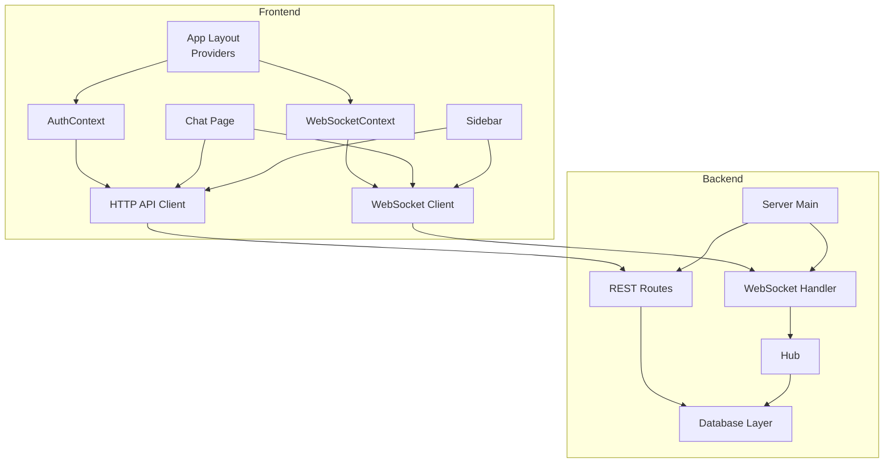
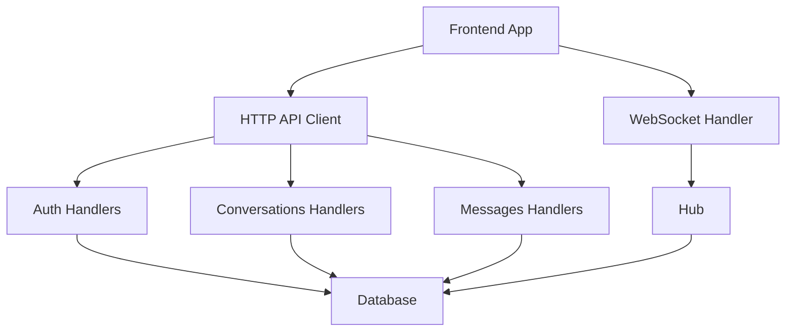
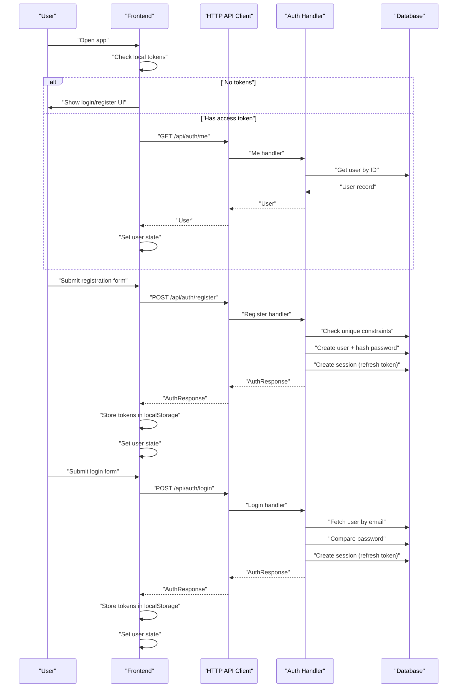
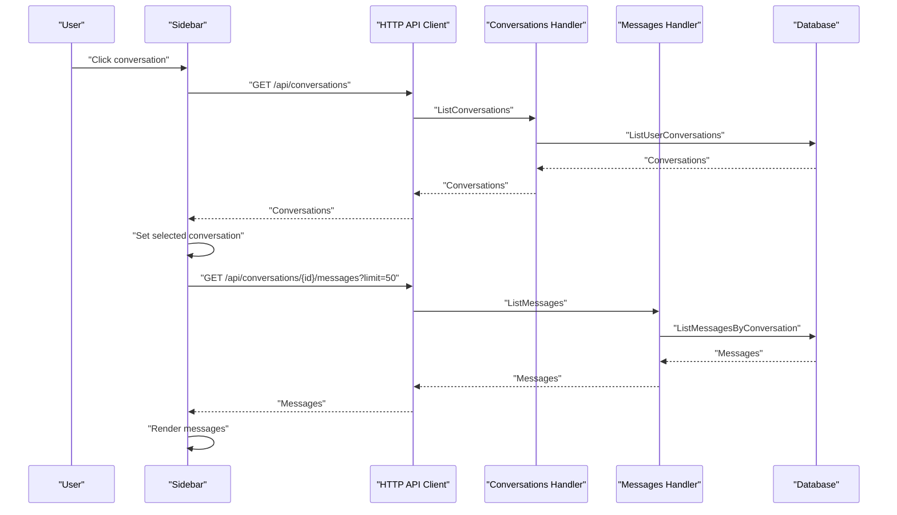
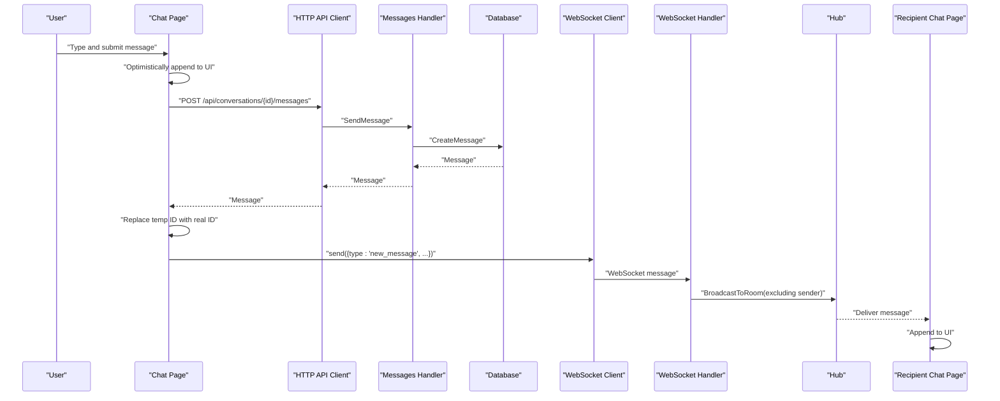
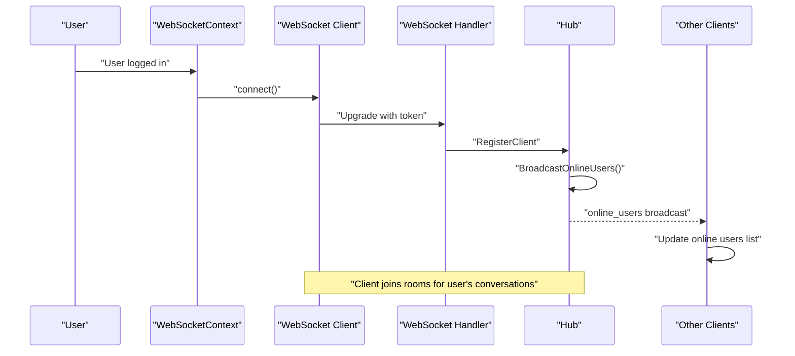
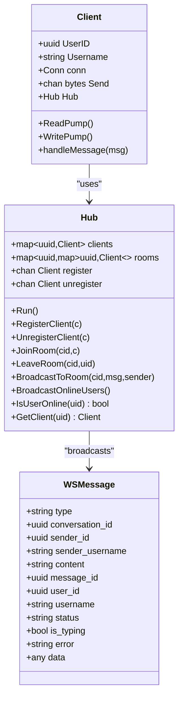
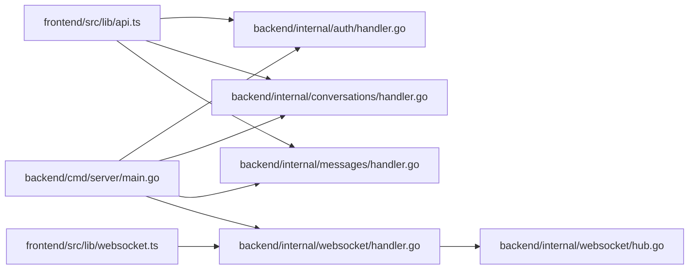

# Application Flow

<cite>
**Referenced Files in This Document**
- [backend/cmd/server/main.go](file://backend/cmd/server/main.go)
- [backend/internal/auth/handler.go](file://backend/internal/auth/handler.go)
- [backend/internal/conversations/handler.go](file://backend/internal/conversations/handler.go)
- [backend/internal/messages/handler.go](file://backend/internal/messages/handler.go)
- [backend/internal/websocket/handler.go](file://backend/internal/websocket/handler.go)
- [backend/internal/websocket/hub.go](file://backend/internal/websocket/hub.go)
- [backend/internal/websocket/client.go](file://backend/internal/websocket/client.go)
- [backend/internal/websocket/types.go](file://backend/internal/websocket/types.go)
- [frontend/src/lib/api.ts](file://frontend/src/lib/api.ts)
- [frontend/src/lib/websocket.ts](file://frontend/src/lib/websocket.ts)
- [frontend/src/lib/auth.ts](file://frontend/src/lib/auth.ts)
- [frontend/src/contexts/AuthContext.tsx](file://frontend/src/contexts/AuthContext.tsx)
- [frontend/src/contexts/WebSocketContext.tsx](file://frontend/src/contexts/WebSocketContext.tsx)
- [frontend/src/app/chat/page.tsx](file://frontend/src/app/chat/page.tsx)
- [frontend/src/components/Sidebar.tsx](file://frontend/src/components/Sidebar.tsx)
- [frontend/src/types/index.ts](file://frontend/src/types/index.ts)
</cite>

## Table of Contents
1. [Introduction](#introduction)
2. [Project Structure](#project-structure)
3. [Core Components](#core-components)
4. [Architecture Overview](#architecture-overview)
5. [Detailed Component Analysis](#detailed-component-analysis)
6. [Dependency Analysis](#dependency-analysis)
7. [Performance Considerations](#performance-considerations)
8. [Troubleshooting Guide](#troubleshooting-guide)
9. [Conclusion](#conclusion)

## Introduction
This document explains the end-to-end user journey and system interactions for the application, covering the complete flow from initial connection through authentication, chat selection, message sending, and real-time updates. It details how the frontend React components integrate with backend services, including static asset serving, API endpoints, and WebSocket connections. Practical user scenarios, error handling during flow interruptions, and state management across phases are included.

## Project Structure
The application follows a clear separation of concerns:
- Backend: HTTP server with REST endpoints and WebSocket support, organized by domain (auth, conversations, messages, users) and shared infrastructure (database, middleware, websocket hub).
- Frontend: Next.js application with React components, context providers for auth and WebSocket, typed APIs, and UI pages.

**Diagram sources**
- [backend/cmd/server/main.go:29-155](file://backend/cmd/server/main.go#L29-L155)
- [frontend/src/app/layout.tsx:22-37](file://frontend/src/app/layout.tsx#L22-L37)
- [frontend/src/components/Providers.tsx:7-13](file://frontend/src/components/Providers.tsx#L7-L13)

**Section sources**
- [backend/cmd/server/main.go:29-155](file://backend/cmd/server/main.go#L29-L155)
- [frontend/src/app/layout.tsx:22-37](file://frontend/src/app/layout.tsx#L22-L37)
- [frontend/src/components/Providers.tsx:7-13](file://frontend/src/components/Providers.tsx#L7-L13)

## Core Components
- Backend HTTP server initializes database, runs migrations, constructs services and handlers, sets up CORS, registers REST endpoints, and starts the server with graceful shutdown.
- Authentication handlers manage registration, login, token refresh, logout, and profile retrieval.
- Conversations handlers manage listing, creation, member addition/removal, and retrieval of conversations.
- Messages handlers manage listing messages with cursor-based pagination, sending messages, and deletion.
- WebSocket handler upgrades connections, validates tokens, registers clients, subscribes them to rooms, and runs read/write pumps.
- WebSocket hub manages client registration/unregistration, broadcasting online users, room joining/leaving, and intra-room messaging.
- Frontend API client encapsulates HTTP requests with bearer token injection and standardized error handling.
- Frontend WebSocket client encapsulates connection lifecycle, reconnection, event dispatching, and message sending.
- Frontend contexts provide global state for authentication and WebSocket connectivity to components.

**Section sources**
- [backend/cmd/server/main.go:29-155](file://backend/cmd/server/main.go#L29-L155)
- [backend/internal/auth/handler.go:34-295](file://backend/internal/auth/handler.go#L34-L295)
- [backend/internal/conversations/handler.go:27-279](file://backend/internal/conversations/handler.go#L27-L279)
- [backend/internal/messages/handler.go:31-158](file://backend/internal/messages/handler.go#L31-L158)
- [backend/internal/websocket/handler.go:25-73](file://backend/internal/websocket/handler.go#L25-L73)
- [backend/internal/websocket/hub.go:18-136](file://backend/internal/websocket/hub.go#L18-L136)
- [frontend/src/lib/api.ts:11-117](file://frontend/src/lib/api.ts#L11-L117)
- [frontend/src/lib/websocket.ts:5-94](file://frontend/src/lib/websocket.ts#L5-L94)
- [frontend/src/contexts/AuthContext.tsx:27-87](file://frontend/src/contexts/AuthContext.tsx#L27-L87)
- [frontend/src/contexts/WebSocketContext.tsx:27-75](file://frontend/src/contexts/WebSocketContext.tsx#L27-L75)

## Architecture Overview
The system integrates a React frontend with a Go backend:
- REST endpoints serve authentication, user, conversation, and message operations.
- WebSocket endpoint provides real-time updates and presence.
- Static assets are served by the frontend build; the backend focuses on API and WebSocket.

**Diagram sources**
- [backend/cmd/server/main.go:83-122](file://backend/cmd/server/main.go#L83-L122)
- [backend/internal/websocket/handler.go:25-61](file://backend/internal/websocket/handler.go#L25-L61)
- [frontend/src/lib/api.ts:39-117](file://frontend/src/lib/api.ts#L39-L117)
- [frontend/src/lib/websocket.ts:11-51](file://frontend/src/lib/websocket.ts#L11-L51)

## Detailed Component Analysis

### End-to-End User Journey: Registration and Login Flow
This sequence covers user registration, login, token storage, and initial profile retrieval.

**Diagram sources**
- [frontend/src/contexts/AuthContext.tsx:32-42](file://frontend/src/contexts/AuthContext.tsx#L32-L42)
- [frontend/src/lib/api.ts:40-63](file://frontend/src/lib/api.ts#L40-L63)
- [backend/internal/auth/handler.go:34-181](file://backend/internal/auth/handler.go#L34-L181)

**Section sources**
- [frontend/src/contexts/AuthContext.tsx:27-87](file://frontend/src/contexts/AuthContext.tsx#L27-L87)
- [frontend/src/lib/auth.ts:4-28](file://frontend/src/lib/auth.ts#L4-L28)
- [backend/internal/auth/handler.go:34-181](file://backend/internal/auth/handler.go#L34-L181)

### Chat Selection and History Retrieval
This sequence covers selecting a conversation and retrieving message history.

**Diagram sources**
- [frontend/src/components/Sidebar.tsx:21-27](file://frontend/src/components/Sidebar.tsx#L21-L27)
- [frontend/src/lib/api.ts:78-107](file://frontend/src/lib/api.ts#L78-L107)
- [backend/internal/conversations/handler.go:27-38](file://backend/internal/conversations/handler.go#L27-L38)
- [backend/internal/messages/handler.go:31-68](file://backend/internal/messages/handler.go#L31-L68)

**Section sources**
- [frontend/src/components/Sidebar.tsx:12-27](file://frontend/src/components/Sidebar.tsx#L12-L27)
- [frontend/src/lib/api.ts:78-107](file://frontend/src/lib/api.ts#L78-L107)
- [backend/internal/conversations/handler.go:27-38](file://backend/internal/conversations/handler.go#L27-L38)
- [backend/internal/messages/handler.go:31-68](file://backend/internal/messages/handler.go#L31-L68)

### Real-Time Messaging and Presence Updates
This sequence covers sending a message optimistically, persisting it via API, broadcasting via WebSocket, and receiving real-time updates.

**Diagram sources**
- [frontend/src/app/chat/page.tsx:53-89](file://frontend/src/app/chat/page.tsx#L53-L89)
- [frontend/src/lib/api.ts:109-113](file://frontend/src/lib/api.ts#L109-L113)
- [backend/internal/messages/handler.go:82-124](file://backend/internal/messages/handler.go#L82-L124)
- [frontend/src/lib/websocket.ts:62-68](file://frontend/src/lib/websocket.ts#L62-L68)
- [backend/internal/websocket/handler.go:25-61](file://backend/internal/websocket/handler.go#L25-L61)
- [backend/internal/websocket/hub.go:96-109](file://backend/internal/websocket/hub.go#L96-L109)

**Section sources**
- [frontend/src/app/chat/page.tsx:12-89](file://frontend/src/app/chat/page.tsx#L12-L89)
- [frontend/src/lib/websocket.ts:5-94](file://frontend/src/lib/websocket.ts#L5-L94)
- [backend/internal/websocket/handler.go:25-61](file://backend/internal/websocket/handler.go#L25-L61)
- [backend/internal/websocket/hub.go:96-109](file://backend/internal/websocket/hub.go#L96-L109)

### Presence and Online Users
This sequence covers WebSocket connection establishment and presence broadcasts.

**Diagram sources**
- [frontend/src/contexts/WebSocketContext.tsx:33-55](file://frontend/src/contexts/WebSocketContext.tsx#L33-L55)
- [frontend/src/lib/websocket.ts:19-51](file://frontend/src/lib/websocket.ts#L19-L51)
- [backend/internal/websocket/handler.go:25-73](file://backend/internal/websocket/handler.go#L25-L73)
- [backend/internal/websocket/hub.go:42-64](file://backend/internal/websocket/hub.go#L42-L64)

**Section sources**
- [frontend/src/contexts/WebSocketContext.tsx:27-75](file://frontend/src/contexts/WebSocketContext.tsx#L27-L75)
- [frontend/src/lib/websocket.ts:5-94](file://frontend/src/lib/websocket.ts#L5-L94)
- [backend/internal/websocket/handler.go:25-73](file://backend/internal/websocket/handler.go#L25-L73)
- [backend/internal/websocket/hub.go:42-64](file://backend/internal/websocket/hub.go#L42-L64)

### WebSocket Message Types and Room Management

**Diagram sources**
- [backend/internal/websocket/types.go:21-53](file://backend/internal/websocket/types.go#L21-L53)
- [backend/internal/websocket/client.go:25-109](file://backend/internal/websocket/client.go#L25-L109)
- [backend/internal/websocket/hub.go:18-136](file://backend/internal/websocket/hub.go#L18-L136)

**Section sources**
- [backend/internal/websocket/types.go:10-53](file://backend/internal/websocket/types.go#L10-L53)
- [backend/internal/websocket/client.go:25-109](file://backend/internal/websocket/client.go#L25-L109)
- [backend/internal/websocket/hub.go:18-136](file://backend/internal/websocket/hub.go#L18-L136)

### Error Handling During Flow Interruptions
Common failure points and handling strategies:
- HTTP API errors: The API client throws a typed error with status and message; components catch and surface user-friendly messages.
- WebSocket connection failures: The client logs errors, triggers a reconnect timer, and dispatches connect/disconnect events; UI reflects connection state.
- Authentication failures: Login/Register handlers return 400/401 with structured error messages; AuthContext captures and surfaces errors.
- Message sending failures: Optimistic UI rollback occurs when API fails; WebSocket send failures warn but do not block UI.

Practical examples:
- Registration with invalid input or duplicate email triggers a 400/409 response; the UI displays the error and prevents submission.
- Login with wrong credentials returns 401; the UI clears stored tokens and prompts for correct credentials.
- WebSocket disconnect triggers reconnection; presence updates pause until re-established.

**Section sources**
- [frontend/src/lib/api.ts:3-37](file://frontend/src/lib/api.ts#L3-L37)
- [frontend/src/lib/websocket.ts:33-50](file://frontend/src/lib/websocket.ts#L33-L50)
- [backend/internal/auth/handler.go:34-181](file://backend/internal/auth/handler.go#L34-L181)

### State Management Across Phases
- Authentication state: AuthContext holds user, loading, and error state; it hydrates from localStorage on mount and persists tokens after login/register.
- WebSocket state: WebSocketContext tracks connection status, online users, and exposes subscribe/send helpers; it connects when a user exists and disconnects on unmount.
- Chat state: Chat page maintains selected conversation, message list, and optimistic updates; it loads messages on selection and subscribes to real-time events.
- Sidebar state: Sidebar maintains conversation list, loading state, and active selection; it reflects online presence and connection status.

**Section sources**
- [frontend/src/contexts/AuthContext.tsx:27-87](file://frontend/src/contexts/AuthContext.tsx#L27-L87)
- [frontend/src/contexts/WebSocketContext.tsx:27-75](file://frontend/src/contexts/WebSocketContext.tsx#L27-L75)
- [frontend/src/app/chat/page.tsx:12-89](file://frontend/src/app/chat/page.tsx#L12-L89)
- [frontend/src/components/Sidebar.tsx:12-27](file://frontend/src/components/Sidebar.tsx#L12-L27)

## Dependency Analysis
Key integration points:
- Frontend API client depends on environment variables for base URLs and injects Authorization headers using tokens from localStorage.
- WebSocket client constructs the URL with a token query parameter and manages connection lifecycle and reconnection.
- Backend routes depend on middleware for authentication and use handlers backed by database queries.
- WebSocket handler depends on auth service for token validation and database queries for room subscription.

**Diagram sources**
- [frontend/src/lib/api.ts:11-117](file://frontend/src/lib/api.ts#L11-L117)
- [frontend/src/lib/websocket.ts:11-51](file://frontend/src/lib/websocket.ts#L11-L51)
- [backend/cmd/server/main.go:83-122](file://backend/cmd/server/main.go#L83-L122)
- [backend/internal/websocket/handler.go:25-61](file://backend/internal/websocket/handler.go#L25-L61)

**Section sources**
- [frontend/src/lib/api.ts:11-117](file://frontend/src/lib/api.ts#L11-L117)
- [frontend/src/lib/websocket.ts:11-51](file://frontend/src/lib/websocket.ts#L11-L51)
- [backend/cmd/server/main.go:83-122](file://backend/cmd/server/main.go#L83-L122)
- [backend/internal/websocket/handler.go:25-61](file://backend/internal/websocket/handler.go#L25-L61)

## Performance Considerations
- Cursor-based pagination for messages limits payload sizes and improves responsiveness.
- WebSocket ping/pong keep-alive and bounded buffers prevent resource leaks.
- Room-based broadcasting avoids unnecessary fan-out to offline users.
- Optimistic UI updates reduce perceived latency; server responses reconcile state.

## Troubleshooting Guide
- Authentication issues:
  - Verify tokens exist in localStorage and are not expired.
  - Check network tab for 401 responses and ensure Authorization header is present.
- WebSocket issues:
  - Confirm token query parameter is present in the WebSocket URL.
  - Inspect browser console for WebSocket errors and reconnect attempts.
  - Validate server logs for upgrade failures or hub registration errors.
- Message delivery:
  - Ensure the selected conversation ID is correct and the user belongs to the conversation.
  - Check that the message type is supported and content is non-empty.
- Presence updates:
  - Confirm the user is connected and online; verify presence broadcasts are received.

**Section sources**
- [frontend/src/lib/auth.ts:4-28](file://frontend/src/lib/auth.ts#L4-L28)
- [frontend/src/lib/websocket.ts:19-51](file://frontend/src/lib/websocket.ts#L19-L51)
- [backend/internal/websocket/handler.go:25-61](file://backend/internal/websocket/handler.go#L25-L61)
- [backend/internal/messages/handler.go:82-124](file://backend/internal/messages/handler.go#L82-L124)

## Conclusion
The application provides a cohesive end-to-end flow from authentication to real-time messaging. The frontend leverages context providers and typed APIs to manage state and integrate with backend services, while the backend ensures secure, scalable handling of REST and WebSocket interactions. Robust error handling and optimistic UI updates deliver a responsive user experience across all phases.