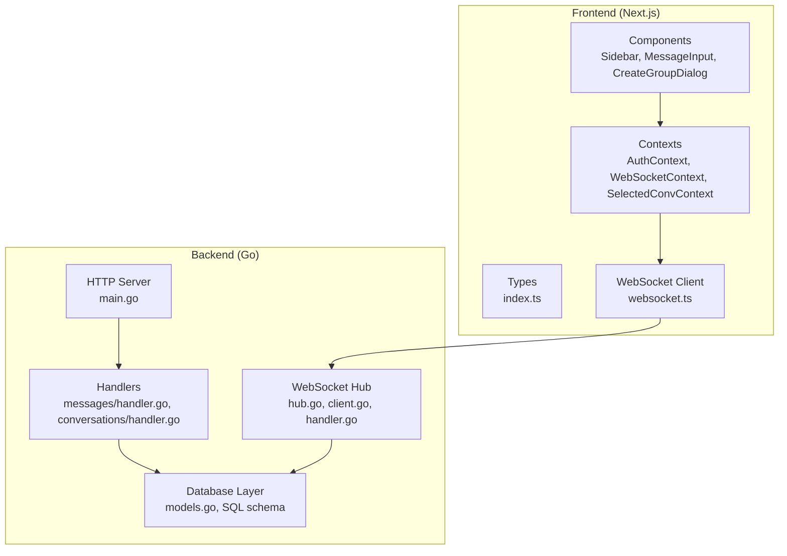
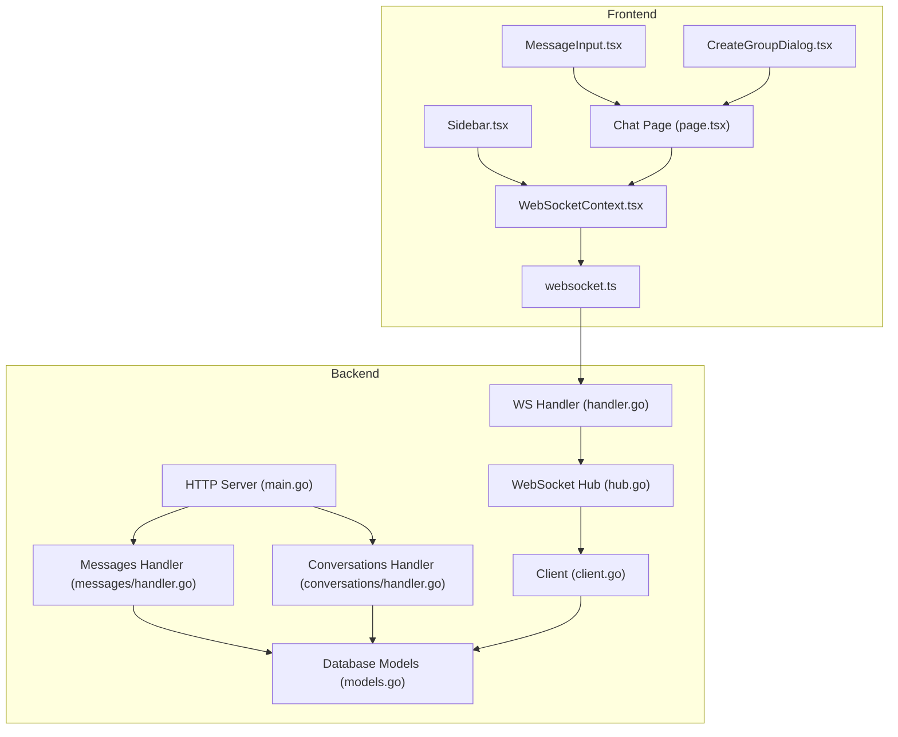
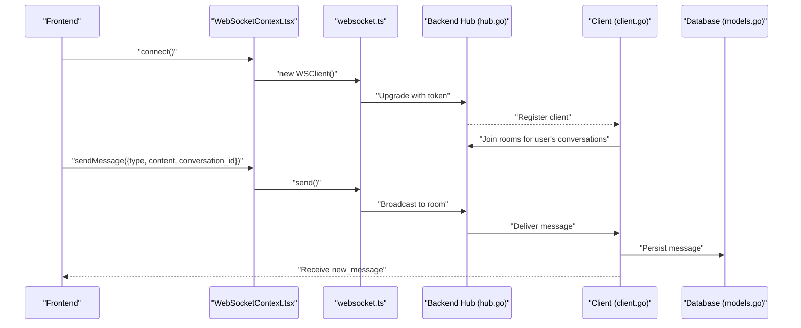
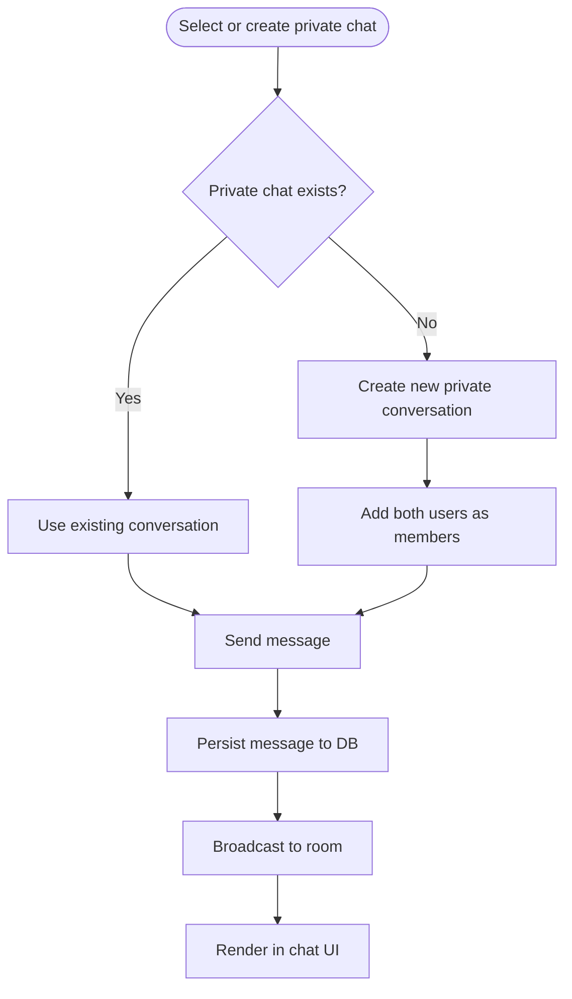
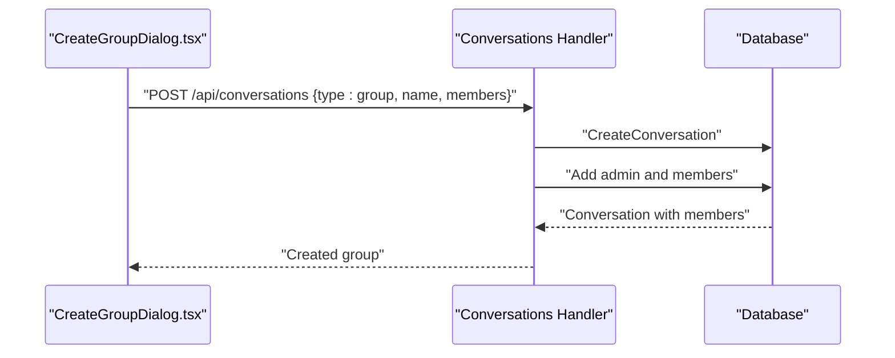
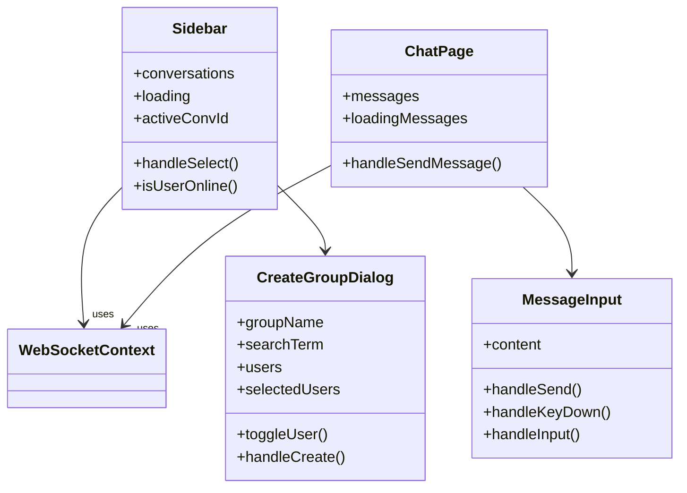
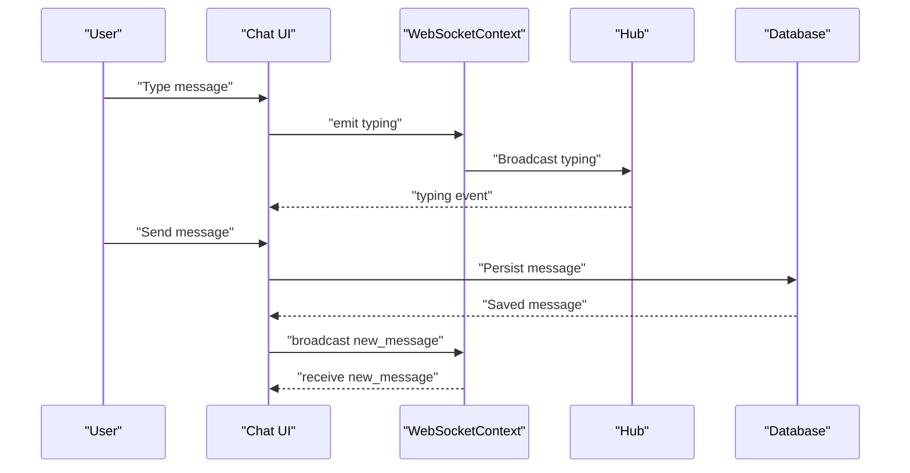
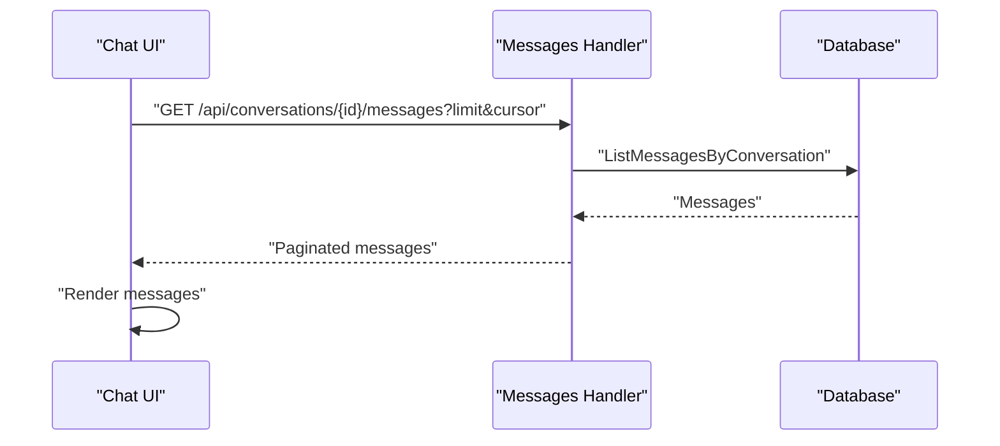
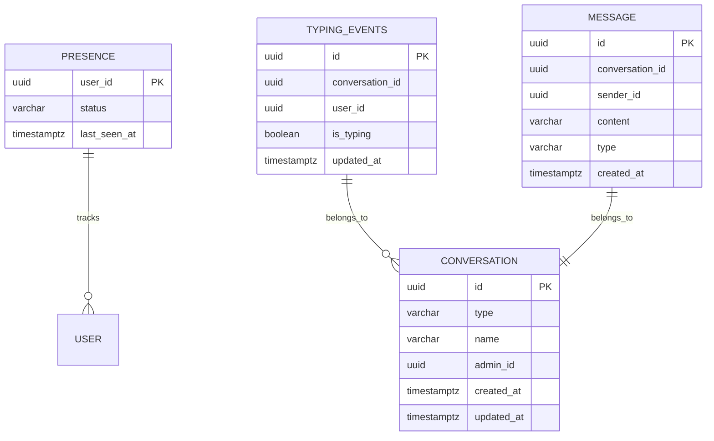
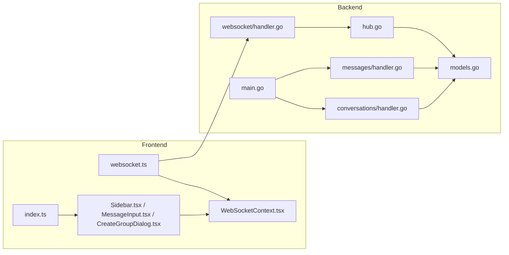

# Features Overview

<cite>
**Referenced Files in This Document**
- [README.md](file://README.md)
- [main.go](file://backend/cmd/server/main.go)
- [hub.go](file://backend/internal/websocket/hub.go)
- [client.go](file://backend/internal/websocket/client.go)
- [handler.go](file://backend/internal/websocket/handler.go)
- [models.go](file://backend/internal/database/models.go)
- [006_presence.sql](file://backend/sql/schema/006_presence.sql)
- [layout.tsx](file://frontend/src/app/layout.tsx)
- [Sidebar.tsx](file://frontend/src/components/Sidebar.tsx)
- [MessageInput.tsx](file://frontend/src/components/MessageInput.tsx)
- [CreateGroupDialog.tsx](file://frontend/src/components/CreateGroupDialog.tsx)
- [page.tsx](file://frontend/src/app/chat/page.tsx)
- [WebSocketContext.tsx](file://frontend/src/contexts/WebSocketContext.tsx)
- [websocket.ts](file://frontend/src/lib/websocket.ts)
- [index.ts](file://frontend/src/types/index.ts)
- [handler.go](file://backend/internal/messages/handler.go)
- [handler.go](file://backend/internal/conversations/handler.go)
</cite>

## Table of Contents
1. [Introduction](#introduction)
2. [Project Structure](#project-structure)
3. [Core Components](#core-components)
4. [Architecture Overview](#architecture-overview)
5. [Detailed Component Analysis](#detailed-component-analysis)
6. [Dependency Analysis](#dependency-analysis)
7. [Performance Considerations](#performance-considerations)
8. [Troubleshooting Guide](#troubleshooting-guide)
9. [Conclusion](#conclusion)

## Introduction
This document presents a comprehensive overview of Go-Chatsync’s feature set and user capabilities. It explains real-time messaging, private and group chat, UI components, and real-time updates, and details how these features integrate with the WebSocket infrastructure and database layer. It also describes modern UI design, responsive layout, and intuitive navigation, along with message history persistence, user presence tracking, unread message counts, and last seen timestamps.

## Project Structure
The application follows a clean separation of concerns:
- Backend (Go): HTTP server, WebSocket hub, handlers, middleware, and database layer.
- Frontend (Next.js): UI components, contexts for auth and WebSocket, typed models, and API wrappers.
- Shared: TypeScript types define contracts for messages, conversations, and users.

**Diagram sources**
- [main.go:29-156](file://backend/cmd/server/main.go#L29-L156)
- [hub.go:1-137](file://backend/internal/websocket/hub.go#L1-L137)
- [client.go:1-110](file://backend/internal/websocket/client.go#L1-L110)
- [handler.go:1-74](file://backend/internal/websocket/handler.go#L1-L74)
- [handler.go:1-169](file://backend/internal/messages/handler.go#L1-L169)
- [handler.go:1-290](file://backend/internal/conversations/handler.go#L1-L290)
- [models.go:1-101](file://backend/internal/database/models.go#L1-L101)
- [websocket.ts:1-95](file://frontend/src/lib/websocket.ts#L1-L95)
- [index.ts:1-72](file://frontend/src/types/index.ts#L1-L72)

**Section sources**
- [README.md:104-118](file://README.md#L104-L118)
- [main.go:61-123](file://backend/cmd/server/main.go#L61-L123)

## Core Components
- Real-time messaging via WebSocket: bidirectional, low-latency communication between clients and server.
- Private messaging: one-on-one chat with online/offline indicators.
- Group chat: create groups, manage members, and chat in group channels.
- UI components: Sidebar, MessageInput, CreateGroupDialog, and chat page with animated message bubbles.
- Real-time updates: live presence, typing indicators, read receipts, and message delivery.
- Message history persistence: stored in the database and retrieved on conversation selection.
- User presence tracking: online user list broadcast and last seen timestamps.
- Unread message counts and last seen timestamps: calculated and synchronized across sessions.

**Section sources**
- [README.md:104-118](file://README.md#L104-L118)
- [README.md:275-317](file://README.md#L275-L317)
- [Sidebar.tsx:12-227](file://frontend/src/components/Sidebar.tsx#L12-L227)
- [MessageInput.tsx:1-85](file://frontend/src/components/MessageInput.tsx#L1-L85)
- [CreateGroupDialog.tsx:1-186](file://frontend/src/components/CreateGroupDialog.tsx#L1-L186)
- [page.tsx:12-232](file://frontend/src/app/chat/page.tsx#L12-L232)
- [WebSocketContext.tsx:1-84](file://frontend/src/contexts/WebSocketContext.tsx#L1-L84)
- [websocket.ts:1-95](file://frontend/src/lib/websocket.ts#L1-L95)
- [index.ts:1-72](file://frontend/src/types/index.ts#L1-L72)
- [handler.go:1-169](file://backend/internal/messages/handler.go#L1-L169)
- [handler.go:1-290](file://backend/internal/conversations/handler.go#L1-L290)
- [models.go:1-101](file://backend/internal/database/models.go#L1-L101)
- [006_presence.sql:1-18](file://backend/sql/schema/006_presence.sql#L1-L18)

## Architecture Overview
The system integrates a React frontend with a Go backend over a single port. The frontend serves static assets and communicates via WebSocket for real-time updates. The backend exposes REST endpoints for CRUD operations and manages WebSocket connections through a hub.

**Diagram sources**
- [main.go:29-156](file://backend/cmd/server/main.go#L29-L156)
- [hub.go:1-137](file://backend/internal/websocket/hub.go#L1-L137)
- [client.go:1-110](file://backend/internal/websocket/client.go#L1-L110)
- [handler.go:1-74](file://backend/internal/websocket/handler.go#L1-L74)
- [handler.go:1-169](file://backend/internal/messages/handler.go#L1-L169)
- [handler.go:1-290](file://backend/internal/conversations/handler.go#L1-L290)
- [models.go:1-101](file://backend/internal/database/models.go#L1-L101)
- [Sidebar.tsx:12-227](file://frontend/src/components/Sidebar.tsx#L12-L227)
- [MessageInput.tsx:1-85](file://frontend/src/components/MessageInput.tsx#L1-L85)
- [CreateGroupDialog.tsx:1-186](file://frontend/src/components/CreateGroupDialog.tsx#L1-L186)
- [page.tsx:12-232](file://frontend/src/app/chat/page.tsx#L12-L232)
- [WebSocketContext.tsx:1-84](file://frontend/src/contexts/WebSocketContext.tsx#L1-L84)
- [websocket.ts:1-95](file://frontend/src/lib/websocket.ts#L1-L95)

## Detailed Component Analysis

### Real-time Messaging
- WebSocket upgrade and authentication: the WS handler validates tokens and upgrades HTTP to WebSocket, then registers clients and subscribes them to conversations.
- Message routing: clients send typed messages; the server stores them and broadcasts to rooms.
- Client lifecycle: ping/pong keepalive, buffered writes, graceful disconnects.

**Diagram sources**
- [handler.go:25-74](file://backend/internal/websocket/handler.go#L25-L74)
- [hub.go:18-137](file://backend/internal/websocket/hub.go#L18-L137)
- [client.go:25-110](file://backend/internal/websocket/client.go#L25-L110)
- [WebSocketContext.tsx:27-76](file://frontend/src/contexts/WebSocketContext.tsx#L27-L76)
- [websocket.ts:19-85](file://frontend/src/lib/websocket.ts#L19-L85)
- [models.go:41-48](file://backend/internal/database/models.go#L41-L48)

**Section sources**
- [handler.go:25-74](file://backend/internal/websocket/handler.go#L25-L74)
- [hub.go:18-137](file://backend/internal/websocket/hub.go#L18-L137)
- [client.go:25-110](file://backend/internal/websocket/client.go#L25-L110)
- [WebSocketContext.tsx:27-76](file://frontend/src/contexts/WebSocketContext.tsx#L27-L76)
- [websocket.ts:19-85](file://frontend/src/lib/websocket.ts#L19-L85)
- [models.go:41-48](file://backend/internal/database/models.go#L41-L48)

### Private Messaging
- One-on-one chat: the backend ensures a private conversation exists between two users and adds both as members if needed.
- Real-time delivery: messages are persisted and broadcast to the private room; the frontend renders them instantly.
- Presence indicators: online status is shown in the sidebar for private chats.

**Diagram sources**
- [handler.go:51-116](file://backend/internal/conversations/handler.go#L51-L116)
- [handler.go:82-124](file://backend/internal/messages/handler.go#L82-L124)
- [models.go:24-48](file://backend/internal/database/models.go#L24-L48)

**Section sources**
- [handler.go:51-116](file://backend/internal/conversations/handler.go#L51-L116)
- [handler.go:82-124](file://backend/internal/messages/handler.go#L82-L124)
- [Sidebar.tsx:120-186](file://frontend/src/components/Sidebar.tsx#L120-L186)

### Group Chat Functionality
- Create groups: specify name and members; admin role is assigned to creator.
- Manage members: add/remove users with dedicated endpoints.
- Group-specific message history: messages are scoped to conversation IDs.

**Diagram sources**
- [CreateGroupDialog.tsx:29-61](file://frontend/src/components/CreateGroupDialog.tsx#L29-L61)
- [handler.go:103-161](file://backend/internal/conversations/handler.go#L103-L161)
- [models.go:24-48](file://backend/internal/database/models.go#L24-L48)

**Section sources**
- [CreateGroupDialog.tsx:29-61](file://frontend/src/components/CreateGroupDialog.tsx#L29-L61)
- [handler.go:103-161](file://backend/internal/conversations/handler.go#L103-L161)
- [Sidebar.tsx:171-175](file://frontend/src/components/Sidebar.tsx#L171-L175)

### User Interface Components
- Sidebar: lists conversations, shows online status, last message preview, and member counts.
- MessageInput: multi-line input with auto-resize, Enter-to-send, and optimistic UI updates.
- CreateGroupDialog: search and select users, validate inputs, and submit creation.
- Chat page: loads message history, renders animated message bubbles, and displays presence.

**Diagram sources**
- [Sidebar.tsx:12-227](file://frontend/src/components/Sidebar.tsx#L12-L227)
- [MessageInput.tsx:10-85](file://frontend/src/components/MessageInput.tsx#L10-L85)
- [CreateGroupDialog.tsx:13-186](file://frontend/src/components/CreateGroupDialog.tsx#L13-L186)
- [page.tsx:12-232](file://frontend/src/app/chat/page.tsx#L12-L232)

**Section sources**
- [Sidebar.tsx:12-227](file://frontend/src/components/Sidebar.tsx#L12-L227)
- [MessageInput.tsx:10-85](file://frontend/src/components/MessageInput.tsx#L10-L85)
- [CreateGroupDialog.tsx:13-186](file://frontend/src/components/CreateGroupDialog.tsx#L13-L186)
- [page.tsx:12-232](file://frontend/src/app/chat/page.tsx#L12-L232)

### Real-time Updates
- Presence: the hub maintains online users and broadcasts the list to all clients.
- Typing/read receipts: clients emit typing events; the server rebroadcasts to the room.
- Message delivery: after API creation, the frontend optimistically appends and then syncs with the server via WebSocket.

**Diagram sources**
- [WebSocketContext.tsx:27-76](file://frontend/src/contexts/WebSocketContext.tsx#L27-L76)
- [hub.go:42-64](file://backend/internal/websocket/hub.go#L42-L64)
- [client.go:86-110](file://backend/internal/websocket/client.go#L86-L110)
- [page.tsx:53-89](file://frontend/src/app/chat/page.tsx#L53-L89)

**Section sources**
- [WebSocketContext.tsx:27-76](file://frontend/src/contexts/WebSocketContext.tsx#L27-L76)
- [hub.go:42-64](file://backend/internal/websocket/hub.go#L42-L64)
- [client.go:86-110](file://backend/internal/websocket/client.go#L86-L110)
- [page.tsx:53-89](file://frontend/src/app/chat/page.tsx#L53-L89)

### Message History Persistence
- On conversation selection, the frontend fetches messages from the backend and renders them.
- Pagination parameters (limit, cursor) are supported by the messages handler.
- Messages are stored with timestamps and associated with conversation IDs.

**Diagram sources**
- [page.tsx:20-29](file://frontend/src/app/chat/page.tsx#L20-L29)
- [handler.go:31-68](file://backend/internal/messages/handler.go#L31-L68)
- [models.go:41-48](file://backend/internal/database/models.go#L41-L48)

**Section sources**
- [page.tsx:20-29](file://frontend/src/app/chat/page.tsx#L20-L29)
- [handler.go:31-68](file://backend/internal/messages/handler.go#L31-L68)
- [models.go:41-48](file://backend/internal/database/models.go#L41-L48)

### User Presence Tracking, Unread Counts, and Last Seen Timestamps
- Presence: the hub tracks online users and broadcasts the list; clients update UI accordingly.
- Last seen: a presence table stores user status and last seen timestamps; used for unread calculations and UI indicators.
- Unread counts: not explicitly implemented in code; can be derived from last seen timestamps and message timestamps.

**Diagram sources**
- [006_presence.sql:1-18](file://backend/sql/schema/006_presence.sql#L1-L18)
- [models.go:60-88](file://backend/internal/database/models.go#L60-L88)
- [models.go:24-48](file://backend/internal/database/models.go#L24-L48)
- [models.go:41-48](file://backend/internal/database/models.go#L41-L48)

**Section sources**
- [hub.go:42-64](file://backend/internal/websocket/hub.go#L42-L64)
- [006_presence.sql:1-18](file://backend/sql/schema/006_presence.sql#L1-L18)
- [models.go:60-88](file://backend/internal/database/models.go#L60-L88)
- [Sidebar.tsx:126-128](file://frontend/src/components/Sidebar.tsx#L126-L128)

### Modern UI Design and Responsive Layout
- Next.js app shell with global fonts and providers.
- Glass morphism styling, dynamic color variables, and responsive breakpoints.
- Animated transitions for messages and sidebar entries using Framer Motion.

**Section sources**
- [layout.tsx:16-38](file://frontend/src/app/layout.tsx#L16-L38)
- [Sidebar.tsx:55-216](file://frontend/src/components/Sidebar.tsx#L55-L216)
- [page.tsx:127-189](file://frontend/src/app/chat/page.tsx#L127-L189)

## Dependency Analysis
- Frontend depends on:
  - WebSocket client for real-time communication.
  - Auth and WebSocket contexts for session and connection state.
  - Typed models for API contracts.
- Backend depends on:
  - Chi router for HTTP endpoints.
  - Gorilla WebSocket for real-time messaging.
  - SQLC-generated models and queries for database operations.

**Diagram sources**
- [websocket.ts:1-95](file://frontend/src/lib/websocket.ts#L1-L95)
- [WebSocketContext.tsx:1-84](file://frontend/src/contexts/WebSocketContext.tsx#L1-L84)
- [Sidebar.tsx:1-227](file://frontend/src/components/Sidebar.tsx#L1-L227)
- [MessageInput.tsx:1-85](file://frontend/src/components/MessageInput.tsx#L1-L85)
- [CreateGroupDialog.tsx:1-186](file://frontend/src/components/CreateGroupDialog.tsx#L1-L186)
- [index.ts:1-72](file://frontend/src/types/index.ts#L1-L72)
- [main.go:29-156](file://backend/cmd/server/main.go#L29-L156)
- [handler.go:1-169](file://backend/internal/messages/handler.go#L1-L169)
- [handler.go:1-290](file://backend/internal/conversations/handler.go#L1-L290)
- [handler.go:1-74](file://backend/internal/websocket/handler.go#L1-L74)
- [hub.go:1-137](file://backend/internal/websocket/hub.go#L1-L137)
- [models.go:1-101](file://backend/internal/database/models.go#L1-L101)

**Section sources**
- [main.go:61-123](file://backend/cmd/server/main.go#L61-L123)
- [handler.go:1-74](file://backend/internal/websocket/handler.go#L1-L74)
- [hub.go:1-137](file://backend/internal/websocket/hub.go#L1-L137)
- [handler.go:1-169](file://backend/internal/messages/handler.go#L1-L169)
- [handler.go:1-290](file://backend/internal/conversations/handler.go#L1-L290)
- [websocket.ts:1-95](file://frontend/src/lib/websocket.ts#L1-L95)
- [index.ts:1-72](file://frontend/src/types/index.ts#L1-L72)

## Performance Considerations
- WebSocket efficiency: ping/pong keepalive, write deadlines, and bounded buffers reduce resource usage.
- Pagination: message listing supports limit and cursor parameters to avoid large payloads.
- Optimistic UI: immediate local rendering of outgoing messages improves perceived latency.
- Minimal re-renders: selective updates via contexts and typed events.

[No sources needed since this section provides general guidance]

## Troubleshooting Guide
- WebSocket connection errors: automatic reconnect with exponential backoff; verify token presence and validity.
- Message delivery failures: confirm API response and WebSocket broadcast; inspect server logs for unmarshal errors.
- Presence issues: ensure hub registration/unregistration flows and online user broadcasts are functioning.
- Database connectivity: verify migrations ran and connection pooling; check query errors in handlers.

**Section sources**
- [websocket.ts:19-51](file://frontend/src/lib/websocket.ts#L19-L51)
- [client.go:25-55](file://backend/internal/websocket/client.go#L25-L55)
- [handler.go:32-42](file://backend/internal/websocket/handler.go#L32-L42)
- [handler.go:62-68](file://backend/internal/messages/handler.go#L62-L68)

## Conclusion
Go-Chatsync delivers a modern, real-time chat experience with robust private and group messaging, a polished UI, and seamless integration between the React frontend and Go backend. Its WebSocket-first architecture, typed contracts, and database-backed persistence provide a scalable foundation for real-time collaboration.