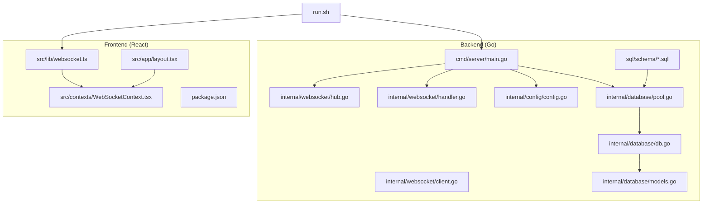
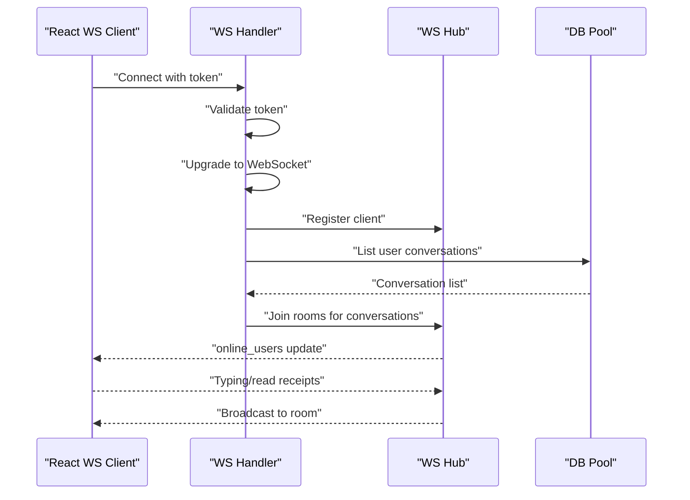
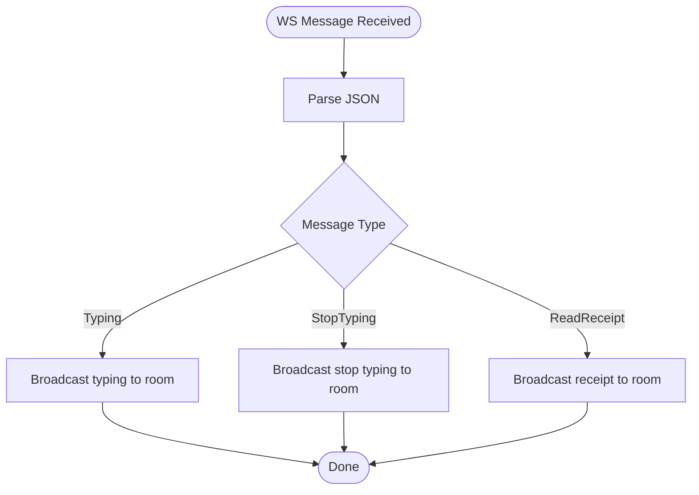
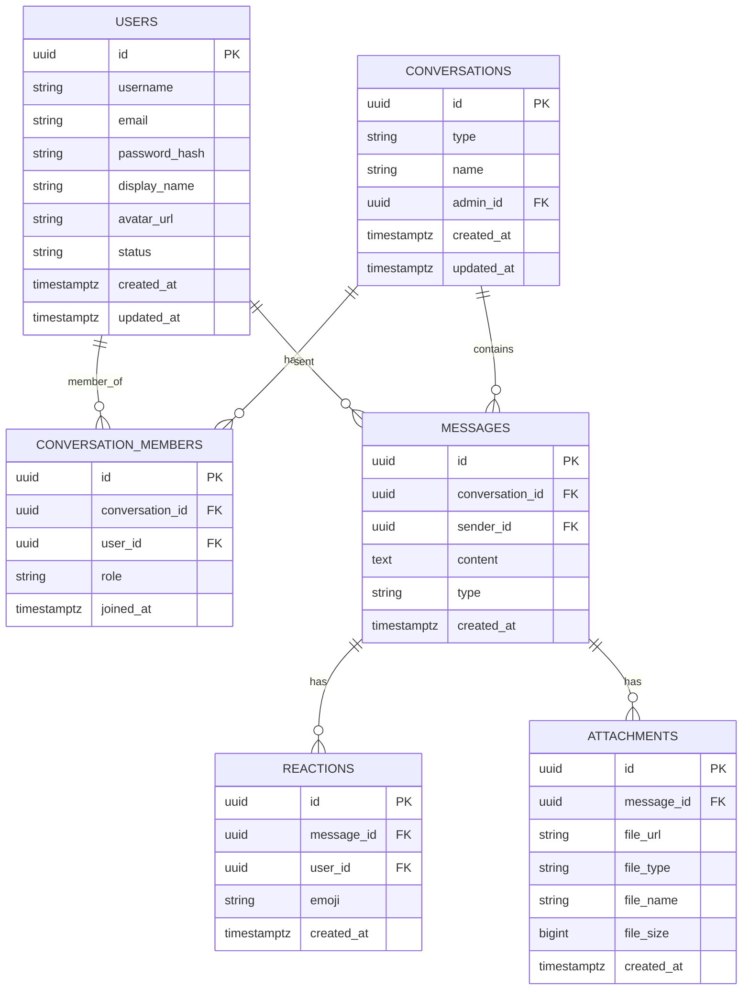
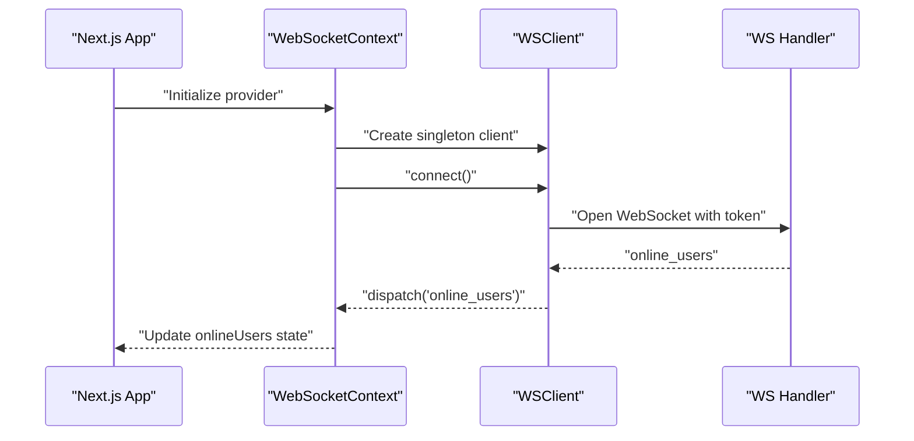
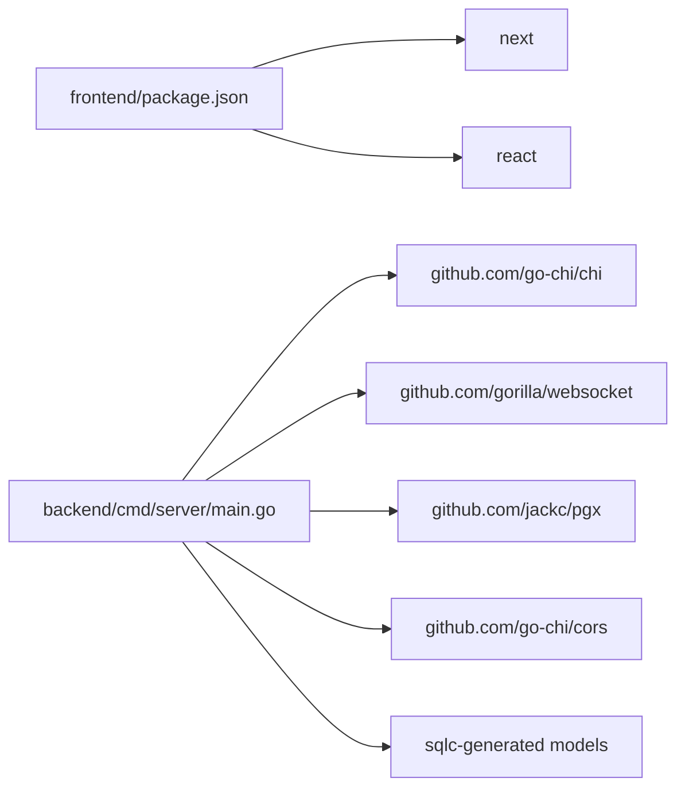

# Project Overview

<cite>
**Referenced Files in This Document**
- [README.md](file://README.md)
- [main.go](file://backend/cmd/server/main.go)
- [hub.go](file://backend/internal/websocket/hub.go)
- [client.go](file://backend/internal/websocket/client.go)
- [handler.go](file://backend/internal/websocket/handler.go)
- [config.go](file://backend/internal/config/config.go)
- [db.go](file://backend/internal/database/db.go)
- [pool.go](file://backend/internal/database/pool.go)
- [models.go](file://backend/internal/database/models.go)
- [002_conversations.sql](file://backend/sql/schema/002_conversations.sql)
- [003_messages.sql](file://backend/sql/schema/003_messages.sql)
- [run.sh](file://run.sh)
- [layout.tsx](file://frontend/src/app/layout.tsx)
- [websocket.ts](file://frontend/src/lib/websocket.ts)
- [WebSocketContext.tsx](file://frontend/src/contexts/WebSocketContext.tsx)
- [package.json](file://frontend/package.json)
</cite>

## Table of Contents
1. [Introduction](#introduction)
2. [Project Structure](#project-structure)
3. [Core Components](#core-components)
4. [Architecture Overview](#architecture-overview)
5. [Detailed Component Analysis](#detailed-component-analysis)
6. [Dependency Analysis](#dependency-analysis)
7. [Performance Considerations](#performance-considerations)
8. [Troubleshooting Guide](#troubleshooting-guide)
9. [Conclusion](#conclusion)

## Introduction
Go-Chatsync is a real-time chat application that combines a Go backend with a React frontend, delivering instant messaging, group chat, and user presence features. The system emphasizes a single-port serving architecture, WebSocket-based real-time communication, and PostgreSQL-backed persistence. It targets modern web deployment with simplified operations and scalable connection handling.

Key goals:
- Real-time bidirectional messaging via WebSocket
- Private and group conversations with message history
- User presence and online status tracking
- Unified single-port serving for development and production
- Clean separation of concerns between frontend and backend

## Project Structure
The repository is organized into two primary areas:
- backend: Go server, HTTP routing, WebSocket hub, database integration, and configuration
- frontend: Next.js React application with TypeScript, Material-UI-inspired design, and WebSocket client integration



**Diagram sources**
- [main.go:1-148](file://backend/cmd/server/main.go#L1-L148)
- [hub.go:1-170](file://backend/internal/websocket/hub.go#L1-L170)
- [client.go:1-125](file://backend/internal/websocket/client.go#L1-L125)
- [handler.go:1-74](file://backend/internal/websocket/handler.go#L1-L74)
- [config.go:1-61](file://backend/internal/config/config.go#L1-L61)
- [pool.go:1-77](file://backend/internal/database/pool.go#L1-L77)
- [db.go:1-33](file://backend/internal/database/db.go#L1-L33)
- [models.go:1-101](file://backend/internal/database/models.go#L1-L101)
- [run.sh:1-77](file://run.sh#L1-L77)
- [layout.tsx:1-38](file://frontend/src/app/layout.tsx#L1-L38)
- [websocket.ts:1-95](file://frontend/src/lib/websocket.ts#L1-L95)
- [WebSocketContext.tsx:1-84](file://frontend/src/contexts/WebSocketContext.tsx#L1-L84)
- [package.json:1-33](file://frontend/package.json#L1-L33)

**Section sources**
- [README.md:214-233](file://README.md#L214-L233)
- [main.go:1-148](file://backend/cmd/server/main.go#L1-L148)
- [run.sh:1-77](file://run.sh#L1-L77)

## Core Components
- Go HTTP server and router: Initializes configuration, database, services, and registers HTTP endpoints and WebSocket route.
- WebSocket hub: Central coordinator for client registration, room management, and broadcasting.
- Client manager: Encapsulates per-connection read/write pumps, ping/pong handling, and message routing.
- WebSocket handler: Validates JWT tokens, upgrades HTTP to WebSocket, and subscribes clients to their conversations.
- Database integration: Connection pooling, migrations, and typed models generated via sqlc.
- React frontend: Provides WebSocket client, context provider, and UI scaffolding.

Practical example flow:
- User connects via WebSocket with a valid token
- Server registers the client and subscribes them to their conversations
- Client receives online users list and real-time updates

**Section sources**
- [main.go:26-125](file://backend/cmd/server/main.go#L26-L125)
- [hub.go:47-170](file://backend/internal/websocket/hub.go#L47-L170)
- [client.go:13-125](file://backend/internal/websocket/client.go#L13-L125)
- [handler.go:25-74](file://backend/internal/websocket/handler.go#L25-L74)
- [pool.go:20-46](file://backend/internal/database/pool.go#L20-L46)
- [models.go:24-101](file://backend/internal/database/models.go#L24-L101)
- [websocket.ts:11-95](file://frontend/src/lib/websocket.ts#L11-L95)
- [WebSocketContext.tsx:27-76](file://frontend/src/contexts/WebSocketContext.tsx#L27-L76)

## Architecture Overview
The system follows a single-port serving model:
- Port 8080 serves both static React assets and API/WebSocket endpoints
- Development: React dev server on port 3000; production: single Go binary serving everything
- WebSocket hub orchestrates real-time messaging; clients subscribe to conversations

```mermaid
graph TB
subgraph "Client Browser"
FE["Next.js App<br/>layout.tsx"]
WSClient["WebSocket Client<br/>websocket.ts"]
WSContext["WebSocket Context<br/>WebSocketContext.tsx"]
end
subgraph "Go Server :8080"
HTTP["HTTP Server<br/>main.go"]
WSHandler["WebSocket Handler<br/>handler.go"]
WSHub["WebSocket Hub<br/>hub.go"]
ClientMgr["Client Manager<br/>client.go"]
DBPool["DB Pool & Migrations<br/>pool.go"]
Models["Typed Models<br/>models.go"]
end
FE --> WSContext
WSContext --> WSClient
WSClient < --> WSHandler
WSHandler --> WSHub
WSHub --> ClientMgr
HTTP --> WSHandler
HTTP --> DBPool
DBPool --> Models
```

**Diagram sources**
- [main.go:57-125](file://backend/cmd/server/main.go#L57-L125)
- [handler.go:25-74](file://backend/internal/websocket/handler.go#L25-L74)
- [hub.go:47-170](file://backend/internal/websocket/hub.go#L47-L170)
- [client.go:26-125](file://backend/internal/websocket/client.go#L26-L125)
- [pool.go:20-77](file://backend/internal/database/pool.go#L20-L77)
- [models.go:24-101](file://backend/internal/database/models.go#L24-L101)
- [layout.tsx:22-38](file://frontend/src/app/layout.tsx#L22-L38)
- [websocket.ts:11-95](file://frontend/src/lib/websocket.ts#L11-L95)
- [WebSocketContext.tsx:27-76](file://frontend/src/contexts/WebSocketContext.tsx#L27-L76)

## Detailed Component Analysis

### WebSocket Communication Flow
End-to-end flow from client to server and back:
- Client connects with token
- Server validates token and upgrades to WebSocket
- Server registers client and subscribes to conversations
- Client receives online users and real-time updates



**Diagram sources**
- [handler.go:25-74](file://backend/internal/websocket/handler.go#L25-L74)
- [hub.go:65-111](file://backend/internal/websocket/hub.go#L65-L111)
- [client.go:26-110](file://backend/internal/websocket/client.go#L26-L110)
- [websocket.ts:19-51](file://frontend/src/lib/websocket.ts#L19-L51)

**Section sources**
- [README.md:27-55](file://README.md#L27-L55)
- [handler.go:25-74](file://backend/internal/websocket/handler.go#L25-L74)
- [hub.go:65-111](file://backend/internal/websocket/hub.go#L65-L111)
- [client.go:26-110](file://backend/internal/websocket/client.go#L26-L110)
- [websocket.ts:19-51](file://frontend/src/lib/websocket.ts#L19-L51)

### Message Handling Flow
Message routing and delivery logic:
- Client sends typed messages
- Server routes to appropriate handlers
- Messages persisted and delivered to recipients



**Diagram sources**
- [client.go:87-110](file://backend/internal/websocket/client.go#L87-L110)
- [hub.go:143-156](file://backend/internal/websocket/hub.go#L143-L156)

**Section sources**
- [client.go:87-110](file://backend/internal/websocket/client.go#L87-L110)
- [hub.go:143-156](file://backend/internal/websocket/hub.go#L143-L156)

### Database Schema and Models
PostgreSQL schema supports conversations, messages, reactions, and attachments. Typed models are generated for type-safe queries.



**Diagram sources**
- [002_conversations.sql:1-25](file://backend/sql/schema/002_conversations.sql#L1-L25)
- [003_messages.sql:1-36](file://backend/sql/schema/003_messages.sql#L1-L36)
- [models.go:14-101](file://backend/internal/database/models.go#L14-L101)

**Section sources**
- [002_conversations.sql:1-25](file://backend/sql/schema/002_conversations.sql#L1-L25)
- [003_messages.sql:1-36](file://backend/sql/schema/003_messages.sql#L1-L36)
- [models.go:14-101](file://backend/internal/database/models.go#L14-L101)

### Frontend WebSocket Integration
The React frontend encapsulates WebSocket connectivity and event handling:
- Singleton WSClient manages connection lifecycle, reconnection, and message dispatch
- WebSocketContext wires authentication state to connection management
- Environment-driven base URL and token injection



**Diagram sources**
- [layout.tsx:22-38](file://frontend/src/app/layout.tsx#L22-L38)
- [WebSocketContext.tsx:27-76](file://frontend/src/contexts/WebSocketContext.tsx#L27-L76)
- [websocket.ts:11-95](file://frontend/src/lib/websocket.ts#L11-L95)
- [handler.go:25-74](file://backend/internal/websocket/handler.go#L25-L74)

**Section sources**
- [layout.tsx:22-38](file://frontend/src/app/layout.tsx#L22-L38)
- [WebSocketContext.tsx:27-76](file://frontend/src/contexts/WebSocketContext.tsx#L27-L76)
- [websocket.ts:11-95](file://frontend/src/lib/websocket.ts#L11-L95)

## Dependency Analysis
High-level dependencies:
- Backend depends on Chi router, Gorilla WebSocket, and PGX connection pool
- Database layer uses sqlc-generated models and migrations
- Frontend depends on Next.js and consumes environment variables for WebSocket base URL



**Diagram sources**
- [package.json:12-31](file://frontend/package.json#L12-L31)
- [main.go:21-24](file://backend/cmd/server/main.go#L21-L24)
- [pool.go:12-13](file://backend/internal/database/pool.go#L12-L13)
- [models.go:1-4](file://backend/internal/database/models.go#L1-L4)

**Section sources**
- [package.json:12-31](file://frontend/package.json#L12-L31)
- [main.go:21-24](file://backend/cmd/server/main.go#L21-L24)
- [pool.go:12-13](file://backend/internal/database/pool.go#L12-L13)
- [models.go:1-4](file://backend/internal/database/models.go#L1-L4)

## Performance Considerations
- Single-port serving reduces operational complexity and improves caching
- WebSocket connection reuse minimizes latency and CPU overhead
- Database connection pooling limits resource contention
- Indexes on frequently queried columns improve query performance
- Frontend reconnection logic ensures resilience against transient failures

[No sources needed since this section provides general guidance]

## Troubleshooting Guide
Common issues and remedies:
- Missing or invalid token during WebSocket upgrade leads to unauthorized errors
- Connection drops trigger automatic reconnection in the frontend client
- Database connectivity problems surface during startup; verify DSN and credentials
- Migration failures indicate schema inconsistencies; review applied migrations

Operational tips:
- Use health checks to confirm server readiness
- Monitor WebSocket hub registration/unregistration logs
- Validate environment variables for ports and secrets

**Section sources**
- [handler.go:25-42](file://backend/internal/websocket/handler.go#L25-L42)
- [websocket.ts:33-41](file://frontend/src/lib/websocket.ts#L33-L41)
- [config.go:23-44](file://backend/internal/config/config.go#L23-L44)
- [pool.go:48-77](file://backend/internal/database/pool.go#L48-L77)

## Conclusion
Go-Chatsync demonstrates a clean, pragmatic architecture combining a Go backend with a React frontend. Its single-port serving, WebSocket-based real-time engine, and PostgreSQL persistence form a cohesive foundation for scalable chat applications. The documented flows and component relationships provide a clear blueprint for extending features, optimizing performance, and maintaining reliability across development and production environments.