# Real-time Communication

<cite>
**Referenced Files in This Document**
- [main.go](file://backend/cmd/server/main.go)
- [hub.go](file://backend/internal/websocket/hub.go)
- [client.go](file://backend/internal/websocket/client.go)
- [handler.go](file://backend/internal/websocket/handler.go)
- [types.go](file://backend/internal/websocket/types.go)
- [websocket.ts](file://frontend/src/lib/websocket.ts)
- [WebSocketContext.tsx](file://frontend/src/contexts/WebSocketContext.tsx)
- [index.ts](file://frontend/src/types/index.ts)
- [models.go](file://backend/internal/database/models.go)
- [006_presence.sql](file://backend/sql/schema/006_presence.sql)
- [handler.go](file://backend/internal/messages/handler.go)
</cite>

## Table of Contents
1. [Introduction](#introduction)
2. [Project Structure](#project-structure)
3. [Core Components](#core-components)
4. [Architecture Overview](#architecture-overview)
5. [Detailed Component Analysis](#detailed-component-analysis)
6. [Dependency Analysis](#dependency-analysis)
7. [Performance Considerations](#performance-considerations)
8. [Troubleshooting Guide](#troubleshooting-guide)
9. [Conclusion](#conclusion)
10. [Appendices](#appendices)

## Introduction
This document explains the real-time communication subsystem built with WebSocket in the Go-Chatsync project. It covers connection establishment, client registration, connection management, message flow patterns (private/group messaging, typing indicators, read receipts, presence, and online user broadcasting), and the end-to-end message processing pipeline. It also documents connection monitoring, error handling, practical message formats, connection lifecycle management, presence tracking, and scalability/performance/security considerations.

## Project Structure
The real-time communication spans backend and frontend components:
- Backend
  - WebSocket hub and client management
  - WebSocket upgrade handler with JWT-based authentication
  - Message types and payload structure
  - Presence and typing event schema
- Frontend
  - WebSocket client wrapper with reconnection logic
  - React context for connection state and message routing
  - Shared TypeScript types for WebSocket messages

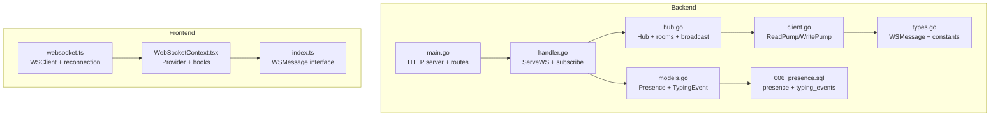

**Diagram sources**
- [main.go:29-122](file://backend/cmd/server/main.go#L29-L122)
- [handler.go:25-61](file://backend/internal/websocket/handler.go#L25-L61)
- [hub.go:9-137](file://backend/internal/websocket/hub.go#L9-L137)
- [client.go:25-110](file://backend/internal/websocket/client.go#L25-L110)
- [types.go:10-54](file://backend/internal/websocket/types.go#L10-L54)
- [models.go:60-88](file://backend/internal/database/models.go#L60-L88)
- [006_presence.sql:1-18](file://backend/sql/schema/006_presence.sql#L1-L18)
- [websocket.ts:1-95](file://frontend/src/lib/websocket.ts#L1-L95)
- [WebSocketContext.tsx:27-76](file://frontend/src/contexts/WebSocketContext.tsx#L27-L76)
- [index.ts:58-72](file://frontend/src/types/index.ts#L58-L72)

**Section sources**
- [main.go:29-122](file://backend/cmd/server/main.go#L29-L122)
- [handler.go:25-61](file://backend/internal/websocket/handler.go#L25-L61)
- [hub.go:9-137](file://backend/internal/websocket/hub.go#L9-L137)
- [client.go:25-110](file://backend/internal/websocket/client.go#L25-L110)
- [types.go:10-54](file://backend/internal/websocket/types.go#L10-L54)
- [models.go:60-88](file://backend/internal/database/models.go#L60-L88)
- [006_presence.sql:1-18](file://backend/sql/schema/006_presence.sql#L1-L18)
- [websocket.ts:1-95](file://frontend/src/lib/websocket.ts#L1-L95)
- [WebSocketContext.tsx:27-76](file://frontend/src/contexts/WebSocketContext.tsx#L27-L76)
- [index.ts:58-72](file://frontend/src/types/index.ts#L58-L72)

## Core Components
- Hub: Central coordinator managing connected clients and rooms, broadcasting online users, and dispatching messages to rooms.
- Client: Encapsulates a single WebSocket connection with read/write pumps, ping/pong handling, and message routing.
- WsHandler: HTTP endpoint that upgrades requests to WebSocket, validates JWT tokens, constructs Client, registers with Hub, and subscribes to user conversations.
- Types: Defines message types and the WSMessage payload structure used across the system.
- Frontend WSClient: Wraps browser WebSocket with reconnection, message parsing, and event dispatching.
- Presence/Typing: Backend schema and models support presence and typing indicators; frontend consumes presence updates via WebSocket.

Key responsibilities:
- Connection lifecycle: Upgrade, authenticate, register, subscribe, monitor, unregister.
- Room management: Join/leave rooms per conversation; broadcast to room except sender.
- Online user broadcasting: Notify clients when users come online/offline.
- Message routing: Private/group typing, read receipts, presence, and generic new_message events.

**Section sources**
- [hub.go:9-137](file://backend/internal/websocket/hub.go#L9-L137)
- [client.go:25-110](file://backend/internal/websocket/client.go#L25-L110)
- [handler.go:25-73](file://backend/internal/websocket/handler.go#L25-L73)
- [types.go:10-54](file://backend/internal/websocket/types.go#L10-L54)
- [websocket.ts:19-84](file://frontend/src/lib/websocket.ts#L19-L84)
- [models.go:60-88](file://backend/internal/database/models.go#L60-L88)
- [006_presence.sql:1-18](file://backend/sql/schema/006_presence.sql#L1-L18)

## Architecture Overview
End-to-end flow from HTTP upgrade to real-time messaging:

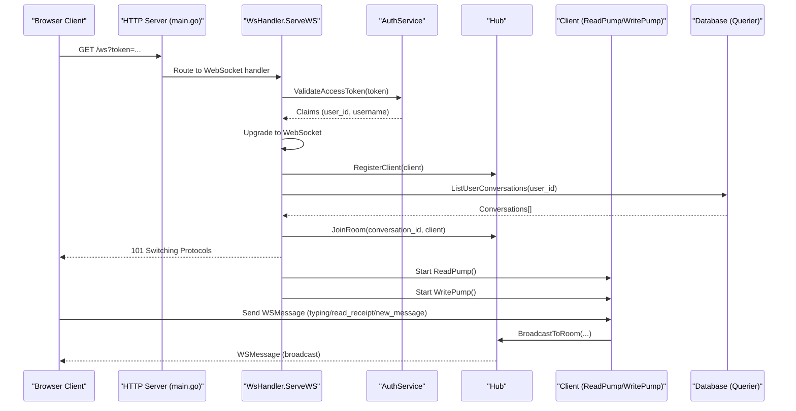

**Diagram sources**
- [main.go:121-122](file://backend/cmd/server/main.go#L121-L122)
- [handler.go:25-61](file://backend/internal/websocket/handler.go#L25-L61)
- [handler.go:63-73](file://backend/internal/websocket/handler.go#L63-L73)
- [hub.go:66-109](file://backend/internal/websocket/hub.go#L66-L109)
- [client.go:25-110](file://backend/internal/websocket/client.go#L25-L110)

## Detailed Component Analysis

### WebSocket Hub and Room Management
The Hub maintains:
- clients: Online user map keyed by user ID
- rooms: Conversation-to-client membership map
- channels: register/unregister queues
- mutex: RWMutex for safe concurrent access

Behavior highlights:
- Register/unregister updates client map and broadcasts online users
- JoinRoom/LeaveRoom manage conversation subscriptions
- BroadcastToRoom sends messages to all clients in a room except the sender
- SendMessageToUser delivers a message to a specific online user
- IsUserOnline and GetClient provide quick checks and retrieval

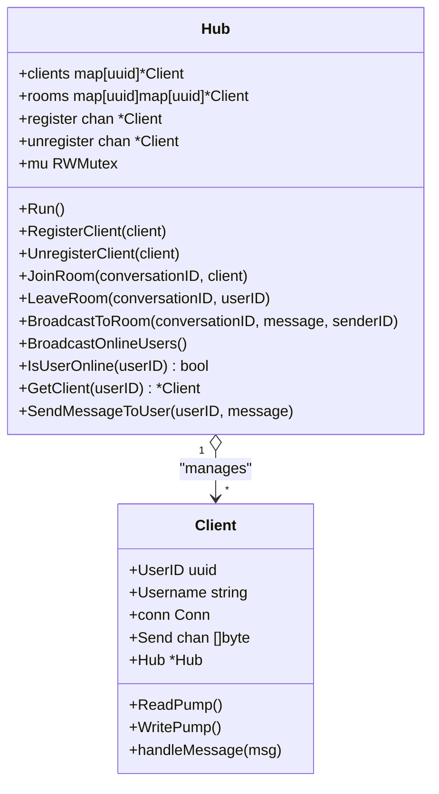

**Diagram sources**
- [hub.go:9-137](file://backend/internal/websocket/hub.go#L9-L137)
- [types.go:37-53](file://backend/internal/websocket/types.go#L37-L53)

**Section sources**
- [hub.go:9-137](file://backend/internal/websocket/hub.go#L9-L137)
- [types.go:37-53](file://backend/internal/websocket/types.go#L37-L53)

### Client Read/Write Pumps and Message Handling
Client responsibilities:
- ReadPump: Enforces max message size, pong deadline, and pong handler; parses JSON WSMessage; delegates to handleMessage; auto-unregisters on unexpected errors
- WritePump: Ticker-based ping, write deadlines, and buffered message sending; closes on channel close or write error
- handleMessage: Routes typing, stop_typing, and read_receipt to the room after enriching with sender info

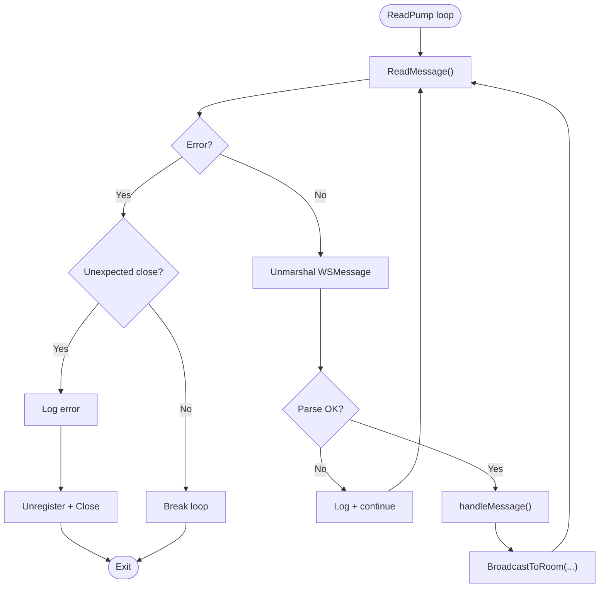

**Diagram sources**
- [client.go:25-55](file://backend/internal/websocket/client.go#L25-L55)
- [client.go:86-109](file://backend/internal/websocket/client.go#L86-L109)
- [hub.go:96-109](file://backend/internal/websocket/hub.go#L96-L109)

**Section sources**
- [client.go:25-110](file://backend/internal/websocket/client.go#L25-L110)
- [hub.go:96-109](file://backend/internal/websocket/hub.go#L96-L109)

### WebSocket Handler and Connection Lifecycle
The handler:
- Extracts token from query string
- Validates JWT via AuthService
- Upgrades to WebSocket
- Constructs Client with buffered send channel
- Registers with Hub and subscribes to user conversations
- Starts ReadPump and WritePump goroutines

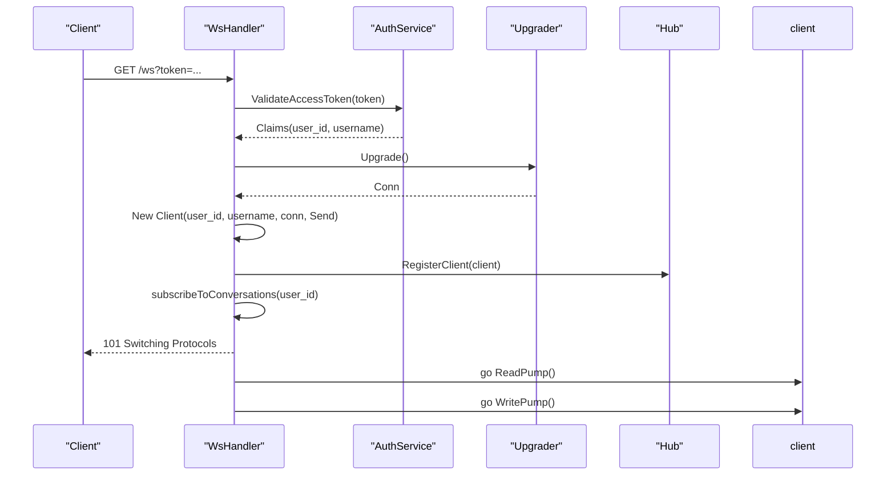

**Diagram sources**
- [handler.go:25-61](file://backend/internal/websocket/handler.go#L25-L61)
- [handler.go:63-73](file://backend/internal/websocket/handler.go#L63-L73)

**Section sources**
- [handler.go:25-73](file://backend/internal/websocket/handler.go#L25-L73)

### Message Types and Payload Structure
Defined message types:
- new_message
- typing
- stop_typing
- presence
- read_receipt
- error
- online_users

WSMessage fields include type, conversation_id, sender metadata, content, message_id, user-specific fields, status, typing flag, and arbitrary data.

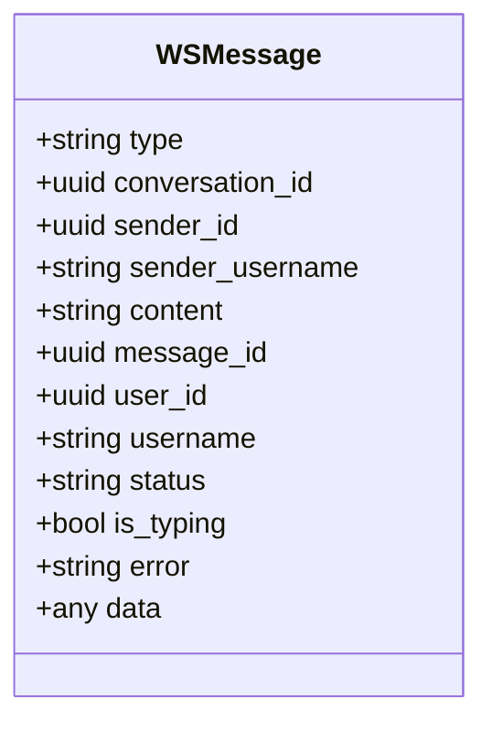

**Diagram sources**
- [types.go:21-35](file://backend/internal/websocket/types.go#L21-L35)

**Section sources**
- [types.go:10-35](file://backend/internal/websocket/types.go#L10-L35)
- [index.ts:58-72](file://frontend/src/types/index.ts#L58-L72)

### Frontend WebSocket Client and Context
Frontend features:
- WSClient wraps browser WebSocket with tokenized URL, reconnection timer, onopen/onclose/onerror/onmessage
- Event dispatching by message type
- Singleton client creation via getWSClient
- WebSocketContext provider exposes connection state, online users, and helpers to send and subscribe

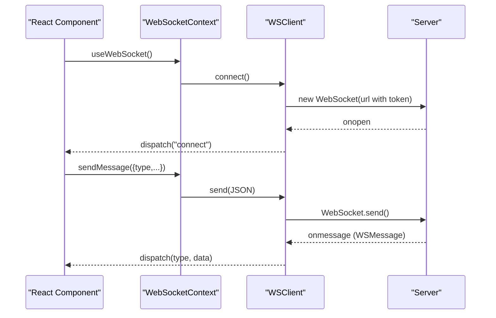

**Diagram sources**
- [websocket.ts:19-84](file://frontend/src/lib/websocket.ts#L19-L84)
- [WebSocketContext.tsx:27-76](file://frontend/src/contexts/WebSocketContext.tsx#L27-L76)

**Section sources**
- [websocket.ts:1-95](file://frontend/src/lib/websocket.ts#L1-L95)
- [WebSocketContext.tsx:16-76](file://frontend/src/contexts/WebSocketContext.tsx#L16-L76)
- [index.ts:58-72](file://frontend/src/types/index.ts#L58-L72)

### Presence Tracking and Typing Events
Backend schema supports:
- presence: user_id, status, last_seen_at
- typing_events: conversation_id, user_id, is_typing, updated_at

Frontend consumes presence updates via the presence message type and tracks online users via online_users broadcasts.

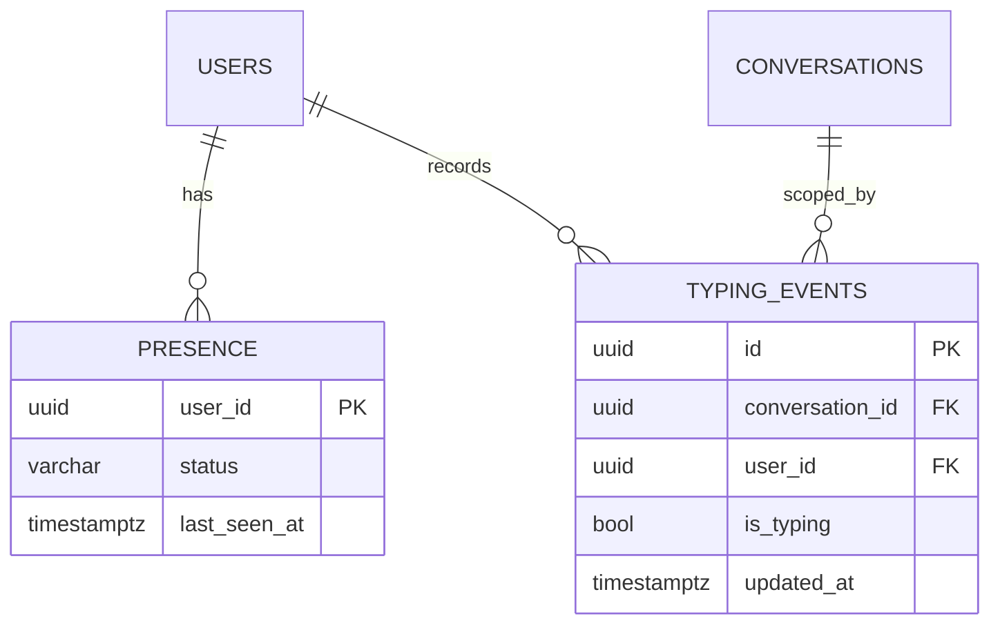

**Diagram sources**
- [006_presence.sql:1-18](file://backend/sql/schema/006_presence.sql#L1-L18)
- [models.go:60-88](file://backend/internal/database/models.go#L60-L88)

**Section sources**
- [006_presence.sql:1-18](file://backend/sql/schema/006_presence.sql#L1-L18)
- [models.go:60-88](file://backend/internal/database/models.go#L60-L88)

### Message Flow Patterns
- Private messaging: Client sends new_message to a specific conversation; Hub broadcasts to room except sender.
- Group messaging: Same as private but applies to multiple recipients in the room.
- Typing indicators: Client sends typing/stop_typing; Hub broadcasts to room with sender metadata.
- Read receipts: Client sends read_receipt; Hub broadcasts to room with sender metadata.
- System notifications: online_users broadcast informs clients of currently online users.
- History requests: Handled by HTTP endpoint for listing messages; not part of WebSocket.

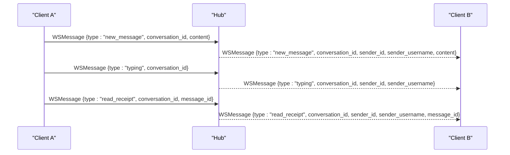

**Diagram sources**
- [client.go:86-109](file://backend/internal/websocket/client.go#L86-L109)
- [hub.go:96-109](file://backend/internal/websocket/hub.go#L96-L109)
- [types.go:10-19](file://backend/internal/websocket/types.go#L10-L19)

**Section sources**
- [client.go:86-109](file://backend/internal/websocket/client.go#L86-L109)
- [hub.go:96-109](file://backend/internal/websocket/hub.go#L96-L109)
- [types.go:10-19](file://backend/internal/websocket/types.go#L10-L19)

### Connection Monitoring and Error Handling
- ReadPump sets read limits and deadlines; pong handler resets deadline; logs unexpected errors and triggers cleanup
- WritePump handles ticker-based pings, write deadlines, and graceful closure
- Hub’s BroadcastToRoom uses non-blocking send with defaults to avoid blocking
- Frontend WSClient reconnects automatically on close with exponential backoff-like delay

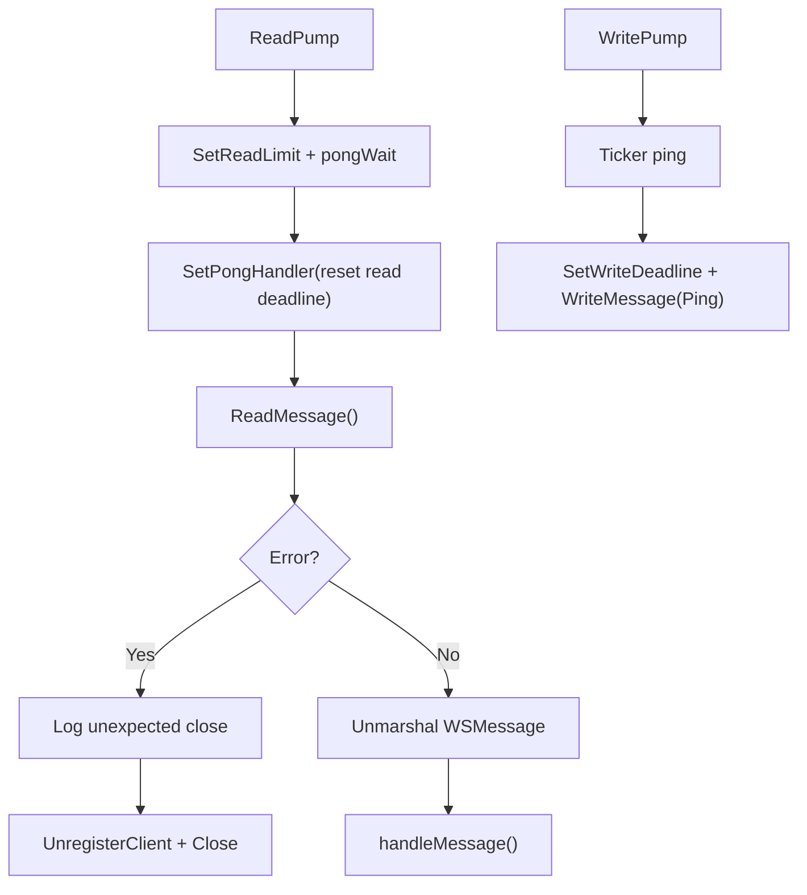

**Diagram sources**
- [client.go:25-84](file://backend/internal/websocket/client.go#L25-L84)
- [hub.go:96-109](file://backend/internal/websocket/hub.go#L96-L109)
- [websocket.ts:19-51](file://frontend/src/lib/websocket.ts#L19-L51)

**Section sources**
- [client.go:25-84](file://backend/internal/websocket/client.go#L25-L84)
- [hub.go:96-109](file://backend/internal/websocket/hub.go#L96-L109)
- [websocket.ts:19-51](file://frontend/src/lib/websocket.ts#L19-L51)

## Dependency Analysis
- Server bootstraps Hub and WsHandler, mounts /ws route, and starts goroutines for hub.Run and client pumps
- WsHandler depends on AuthService for JWT validation and Querier for conversation subscription
- Hub depends on Client and uses RWMutex for thread-safe operations
- Frontend WSClient depends on local storage for tokens and React context for state management

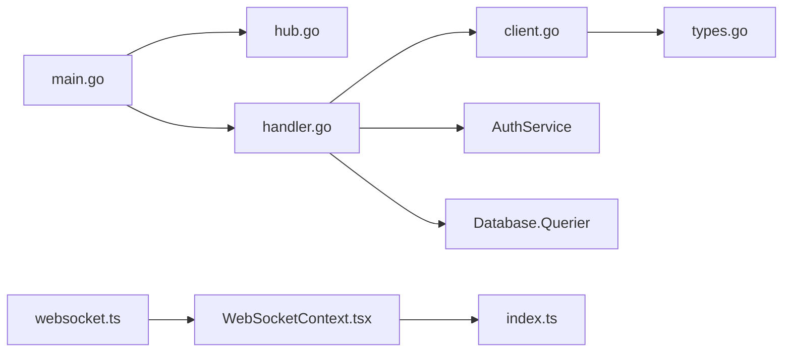

**Diagram sources**
- [main.go:55-58](file://backend/cmd/server/main.go#L55-L58)
- [handler.go:17-23](file://backend/internal/websocket/handler.go#L17-L23)
- [client.go:3-10](file://backend/internal/websocket/client.go#L3-L10)
- [types.go:3-8](file://backend/internal/websocket/types.go#L3-L8)
- [websocket.ts:1-17](file://frontend/src/lib/websocket.ts#L1-L17)
- [WebSocketContext.tsx:12-14](file://frontend/src/contexts/WebSocketContext.tsx#L12-L14)
- [index.ts:58-72](file://frontend/src/types/index.ts#L58-L72)

**Section sources**
- [main.go:55-58](file://backend/cmd/server/main.go#L55-L58)
- [handler.go:17-23](file://backend/internal/websocket/handler.go#L17-L23)
- [client.go:3-10](file://backend/internal/websocket/client.go#L3-L10)
- [types.go:3-8](file://backend/internal/websocket/types.go#L3-L8)
- [websocket.ts:1-17](file://frontend/src/lib/websocket.ts#L1-L17)
- [WebSocketContext.tsx:12-14](file://frontend/src/contexts/WebSocketContext.tsx#L12-L14)
- [index.ts:58-72](file://frontend/src/types/index.ts#L58-L72)

## Performance Considerations
- Channel buffering: Client.Send buffer prevents backpressure spikes during bursts
- Non-blocking sends: Hub’s BroadcastToRoom uses select default to avoid blocking writers
- Read/write deadlines: Prevent resource leaks and detect dead peers promptly
- Room-based broadcasting: Efficient fan-out per conversation reduces unnecessary work
- Reconnection strategy: Frontend WSClient retries with backoff to reduce load on restarts
- Message size limits: Enforced read limits prevent memory exhaustion
- Concurrency model: Separate goroutines for read/write and hub loop keep I/O non-blocking

[No sources needed since this section provides general guidance]

## Troubleshooting Guide
Common issues and remedies:
- Authentication failures: Ensure token is present and valid; server responds with unauthorized on missing/invalid token
- Connection drops: ReadPump logs unexpected closures; client reconnects automatically
- No messages received: Verify client joined the correct conversation rooms; check subscribeToConversations logic
- Broadcast delays: Confirm non-blocking send pattern and adequate buffer sizes
- Frontend not reconnecting: Check reconnection timer and onclose handler

**Section sources**
- [handler.go:25-42](file://backend/internal/websocket/handler.go#L25-L42)
- [client.go:25-55](file://backend/internal/websocket/client.go#L25-L55)
- [websocket.ts:33-37](file://frontend/src/lib/websocket.ts#L33-L37)

## Conclusion
The WebSocket subsystem provides a robust foundation for real-time chat with clear separation of concerns: Hub for connection and room management, Client for transport and message routing, and WsHandler for secure upgrade and subscription. The frontend integrates seamlessly with React via a dedicated context, while presence and typing indicators are supported by backend schema and message types. With careful attention to deadlines, buffering, and reconnection, the system scales efficiently and remains resilient under load.

[No sources needed since this section summarizes without analyzing specific files]

## Appendices

### Practical Examples: Message Formats
- Private message
  - type: "new_message"
  - conversation_id: UUID
  - sender_id: UUID
  - sender_username: string
  - content: string
- Typing indicator
  - type: "typing" or "stop_typing"
  - conversation_id: UUID
  - sender_id: UUID
  - sender_username: string
- Read receipt
  - type: "read_receipt"
  - conversation_id: UUID
  - message_id: UUID
  - sender_id: UUID
  - sender_username: string
- Presence update
  - type: "presence"
  - user_id: UUID
  - username: string
  - status: string
- Online users broadcast
  - type: "online_users"
  - data: array of user UUIDs

**Section sources**
- [types.go:10-35](file://backend/internal/websocket/types.go#L10-L35)
- [index.ts:58-72](file://frontend/src/types/index.ts#L58-L72)

### Connection Lifecycle Management
- Establish: GET /ws?token=... → Upgrade → Register → Subscribe → Start pumps
- Monitor: Read deadlines, pong handler, periodic pings
- Cleanup: Unregister on close; remove from rooms; broadcast online users

**Section sources**
- [handler.go:25-61](file://backend/internal/websocket/handler.go#L25-L61)
- [client.go:25-84](file://backend/internal/websocket/client.go#L25-L84)
- [hub.go:18-40](file://backend/internal/websocket/hub.go#L18-L40)

### Security Measures
- JWT-based authentication on WebSocket upgrade
- CORS enabled for cross-origin requests
- Read/write deadlines and read limits mitigate abuse
- Minimal origin check in Upgrader; production deployments should tighten origin policy

**Section sources**
- [handler.go:25-42](file://backend/internal/websocket/handler.go#L25-L42)
- [main.go:67-74](file://backend/cmd/server/main.go#L67-L74)
- [client.go:12-23](file://backend/internal/websocket/client.go#L12-L23)