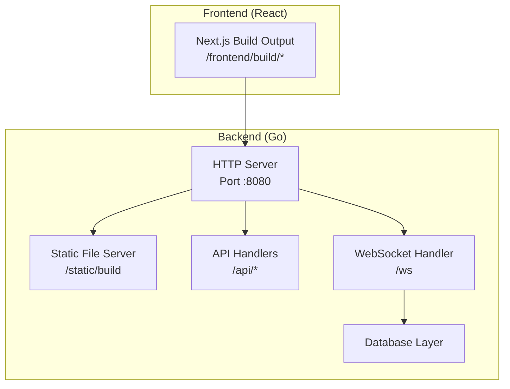
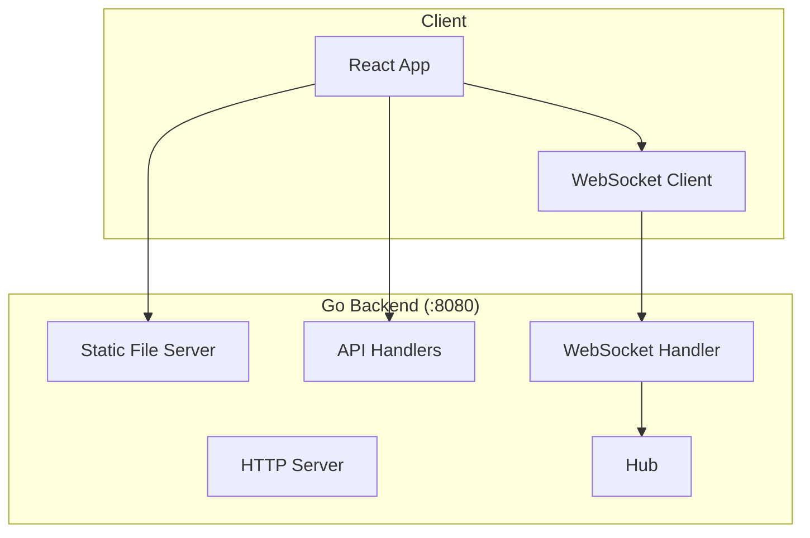
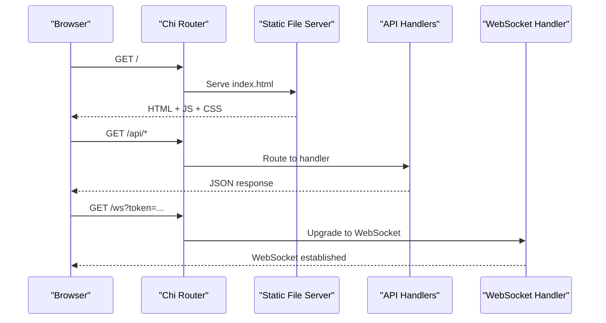
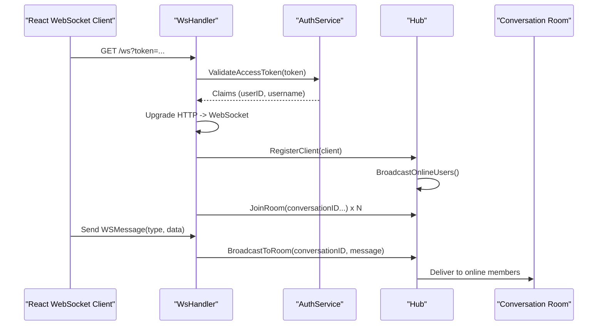
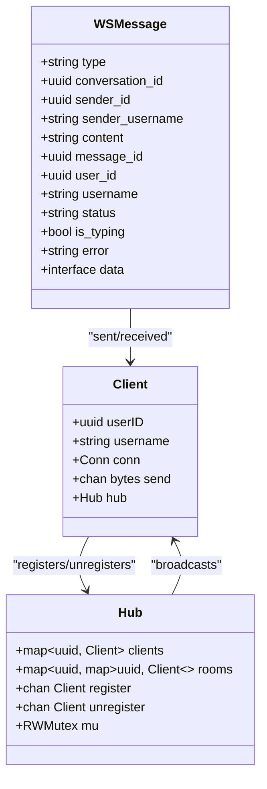
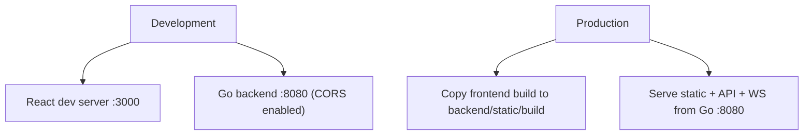
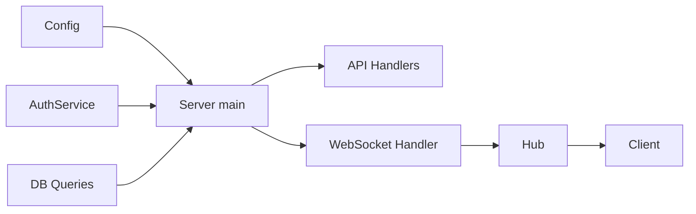

# System Architecture

<cite>
**Referenced Files in This Document**
- [main.go](file://backend/cmd/server/main.go)
- [config.go](file://backend/internal/config/config.go)
- [handler.go](file://backend/internal/websocket/handler.go)
- [hub.go](file://backend/internal/websocket/hub.go)
- [client.go](file://backend/internal/websocket/client.go)
- [types.go](file://backend/internal/websocket/types.go)
- [run.sh](file://run.sh)
- [build.sh](file://backend/scripts/build.sh)
- [README.md](file://README.md)
</cite>

## Table of Contents
1. [Introduction](#introduction)
2. [Project Structure](#project-structure)
3. [Core Components](#core-components)
4. [Architecture Overview](#architecture-overview)
5. [Detailed Component Analysis](#detailed-component-analysis)
6. [Dependency Analysis](#dependency-analysis)
7. [Performance Considerations](#performance-considerations)
8. [Troubleshooting Guide](#troubleshooting-guide)
9. [Conclusion](#conclusion)

## Introduction
This document explains the system architecture of Go-Chatsync, focusing on the single-port serving design where a Go backend server serves both static files and WebSocket connections. It covers the HTTP server configuration, client-server communication flow, and the development versus production deployment model. The architecture emphasizes simplicity, resource efficiency, and streamlined deployment by embedding the React frontend build into the Go backend for production.

## Project Structure
The system comprises two primary parts:
- Backend (Go): HTTP server, API endpoints, WebSocket hub, and static asset serving.
- Frontend (React): Next.js application that is built and embedded into the backend for production.

**Diagram sources**
- [main.go:57-124](file://backend/cmd/server/main.go#L57-L124)
- [run.sh:53-58](file://run.sh#L53-L58)

**Section sources**
- [README.md:119-148](file://README.md#L119-L148)
- [main.go:57-124](file://backend/cmd/server/main.go#L57-L124)
- [run.sh:53-58](file://run.sh#L53-L58)

## Core Components
- HTTP Server and Routing: The Go server initializes Chi router, applies middleware, registers health checks, public and protected API routes, and the WebSocket endpoint.
- WebSocket Hub: Central coordinator for client registration, room management, and broadcasting messages to online users.
- Client Management: Gorilla WebSocket-backed client with read/write pumps, ping/pong handling, and message routing.
- Configuration: Environment-driven configuration for database connectivity, JWT secrets, and server port.
- Static Asset Embedding: Frontend build artifacts copied into the backend’s static directory and served via the HTTP server.

Key implementation references:
- HTTP server initialization and route registration: [main.go:57-124](file://backend/cmd/server/main.go#L57-L124)
- WebSocket hub lifecycle and room management: [hub.go:18-137](file://backend/internal/websocket/hub.go#L18-L137)
- Client read/write pumps and message handling: [client.go:25-110](file://backend/internal/websocket/client.go#L25-L110)
- WebSocket handler upgrade and subscription: [handler.go:25-74](file://backend/internal/websocket/handler.go#L25-L74)
- Configuration loading and DSN construction: [config.go:23-44](file://backend/internal/config/config.go#L23-L44)
- Static build embedding for production: [run.sh:53-58](file://run.sh#L53-L58), [build.sh:7-12](file://backend/scripts/build.sh#L7-L12)

**Section sources**
- [main.go:57-124](file://backend/cmd/server/main.go#L57-L124)
- [hub.go:18-137](file://backend/internal/websocket/hub.go#L18-L137)
- [client.go:25-110](file://backend/internal/websocket/client.go#L25-L110)
- [handler.go:25-74](file://backend/internal/websocket/handler.go#L25-L74)
- [config.go:23-44](file://backend/internal/config/config.go#L23-L44)
- [run.sh:53-58](file://run.sh#L53-L58)
- [build.sh:7-12](file://backend/scripts/build.sh#L7-L12)

## Architecture Overview
The system employs a single-port serving architecture:
- Development: React dev server runs on port 3000; Go backend runs on port 8080 with CORS configured for cross-origin requests.
- Production: The React build is copied into the backend’s static directory and served by the Go HTTP server on port 8080, eliminating the need for a separate frontend server.

**Diagram sources**
- [README.md:121-148](file://README.md#L121-L148)
- [main.go:57-124](file://backend/cmd/server/main.go#L57-L124)
- [handler.go:25-74](file://backend/internal/websocket/handler.go#L25-L74)

**Section sources**
- [README.md:121-148](file://README.md#L121-L148)
- [main.go:57-124](file://backend/cmd/server/main.go#L57-L124)

## Detailed Component Analysis

### HTTP Server and Static File Serving
- The server initializes Chi router, sets logging, recovery, request ID, and CORS middleware.
- Health check endpoint is exposed at /health.
- API routes are grouped under /api with public auth endpoints and protected endpoints gated by authentication middleware.
- The WebSocket endpoint is mounted at /ws.
- Static assets are served from the backend’s static directory, populated by copying the React build output during the build pipeline.

**Diagram sources**
- [main.go:57-124](file://backend/cmd/server/main.go#L57-L124)

**Section sources**
- [main.go:57-124](file://backend/cmd/server/main.go#L57-L124)

### WebSocket Communication Flow
- Token validation: The WebSocket handler extracts the token from query parameters and validates it using the authentication service.
- Connection upgrade: The HTTP connection is upgraded to a WebSocket using a configurable upgrader.
- Client registration: A new client is created and registered with the hub; the hub broadcasts online users.
- Room subscription: The client subscribes to all conversations returned by the database queries.
- Message handling: The client reads messages, parses them into typed structures, and delegates to the hub for broadcasting within rooms.
- Heartbeat and cleanup: Read pump enforces read limits and pong deadlines; write pump handles periodic pings and buffered writes; defers handle unregister and close.

**Diagram sources**
- [handler.go:25-74](file://backend/internal/websocket/handler.go#L25-L74)
- [hub.go:74-109](file://backend/internal/websocket/hub.go#L74-L109)
- [client.go:86-110](file://backend/internal/websocket/client.go#L86-L110)

**Section sources**
- [handler.go:25-74](file://backend/internal/websocket/handler.go#L25-L74)
- [hub.go:74-109](file://backend/internal/websocket/hub.go#L74-L109)
- [client.go:86-110](file://backend/internal/websocket/client.go#L86-L110)

### Client-Server Data Model
The WebSocket message format and client/hub structures define the runtime data model for real-time communication.

**Diagram sources**
- [types.go:22-53](file://backend/internal/websocket/types.go#L22-L53)

**Section sources**
- [types.go:22-53](file://backend/internal/websocket/types.go#L22-L53)

### Development vs Production Deployment
- Development:
  - React dev server runs on port 3000.
  - Go backend runs on port 8080 with CORS allowing credentials and multiple methods.
  - Cross-origin requests are permitted for local development.
- Production:
  - The React build is copied into backend/static/build.
  - The Go server serves static files from this directory.
  - Single binary serves all content on port 8080 without external frontend dependencies.

**Diagram sources**
- [README.md:136-147](file://README.md#L136-L147)
- [run.sh:53-58](file://run.sh#L53-L58)

**Section sources**
- [README.md:136-147](file://README.md#L136-L147)
- [run.sh:53-58](file://run.sh#L53-L58)

## Dependency Analysis
- The server depends on configuration for database DSN and server port.
- Handlers depend on the authentication service and database querier.
- The WebSocket handler depends on the hub and authentication service.
- The hub coordinates clients and rooms; clients depend on Gorilla WebSocket for transport.

**Diagram sources**
- [config.go:23-44](file://backend/internal/config/config.go#L23-L44)
- [main.go:26-55](file://backend/cmd/server/main.go#L26-L55)
- [handler.go:17-23](file://backend/internal/websocket/handler.go#L17-L23)
- [hub.go:9-16](file://backend/internal/websocket/hub.go#L9-L16)

**Section sources**
- [config.go:23-44](file://backend/internal/config/config.go#L23-L44)
- [main.go:26-55](file://backend/cmd/server/main.go#L26-L55)
- [handler.go:17-23](file://backend/internal/websocket/handler.go#L17-L23)
- [hub.go:9-16](file://backend/internal/websocket/hub.go#L9-L16)

## Performance Considerations
- Single-port serving reduces operational complexity and network overhead.
- Static assets are served directly by the Go HTTP server, minimizing latency for initial page loads.
- WebSocket clients reuse a single persistent connection, reducing connection establishment costs.
- Buffered channels and goroutines enable asynchronous read/write handling with periodic pings for liveness.
- Room-based broadcasting avoids unnecessary message fan-out to offline users.

[No sources needed since this section provides general guidance]

## Troubleshooting Guide
Common issues and diagnostics:
- Missing or invalid token on WebSocket upgrade leads to unauthorized responses.
- Upgrade failures indicate misconfigured headers or mismatched origins.
- Read pump errors often signal unexpected close or protocol violations; verify client-side reconnect logic.
- Hub registration/unregistration issues can cause stale online user lists; ensure proper defer cleanup.
- Static file 404s suggest the build artifacts were not copied into the static directory prior to building the Go binary.

Operational references:
- Token validation and upgrade flow: [handler.go:25-61](file://backend/internal/websocket/handler.go#L25-L61)
- Read pump error handling and cleanup: [client.go:25-55](file://backend/internal/websocket/client.go#L25-L55)
- Hub registration/unregistration loop: [hub.go:18-40](file://backend/internal/websocket/hub.go#L18-L40)
- Static build copy step: [run.sh:53-58](file://run.sh#L53-L58)

**Section sources**
- [handler.go:25-61](file://backend/internal/websocket/handler.go#L25-L61)
- [client.go:25-55](file://backend/internal/websocket/client.go#L25-L55)
- [hub.go:18-40](file://backend/internal/websocket/hub.go#L18-L40)
- [run.sh:53-58](file://run.sh#L53-L58)

## Conclusion
Go-Chatsync’s single-port architecture consolidates static file serving, API handling, and WebSocket communication under one Go process. This design simplifies deployment, improves resource efficiency, and streamlines development workflows. The React frontend build is embedded into the backend for production, enabling a zero-dependency runtime that serves all content from a single address and port.

[No sources needed since this section summarizes without analyzing specific files]