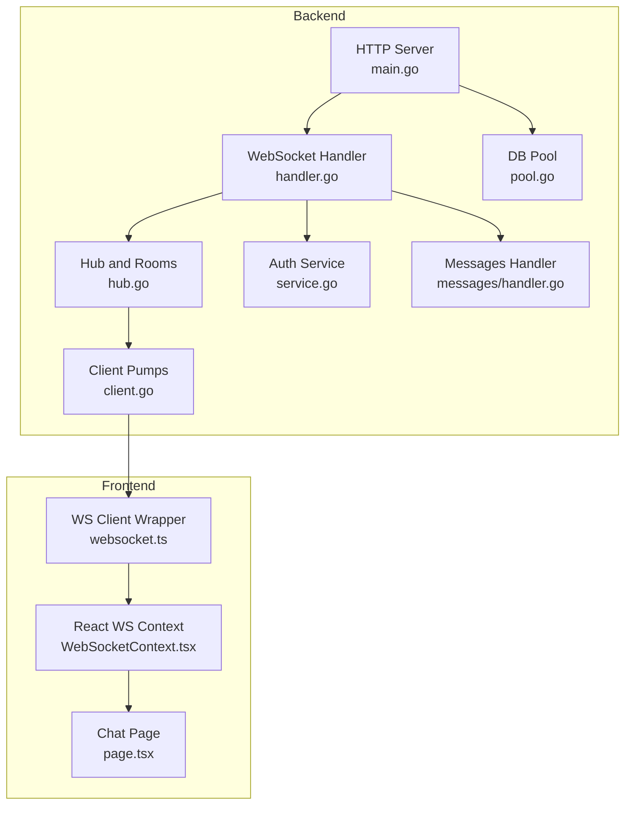
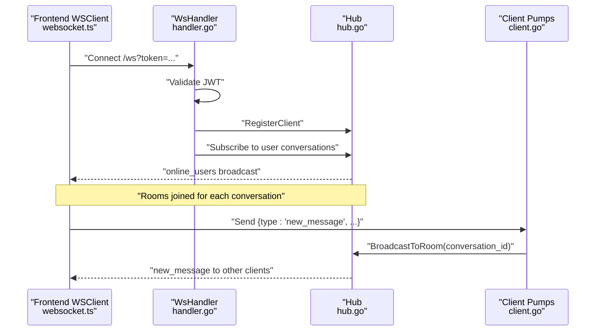
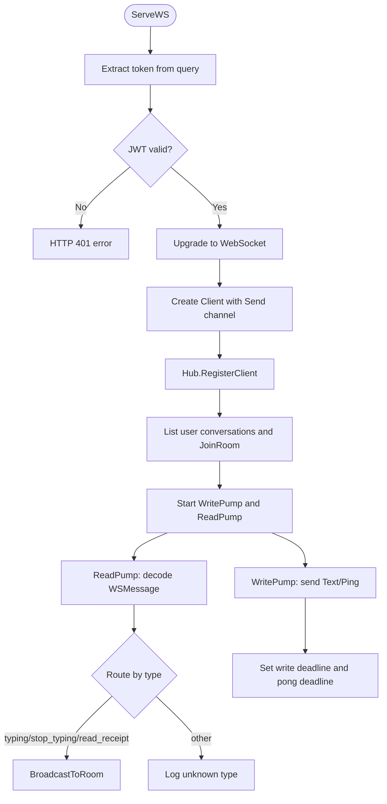
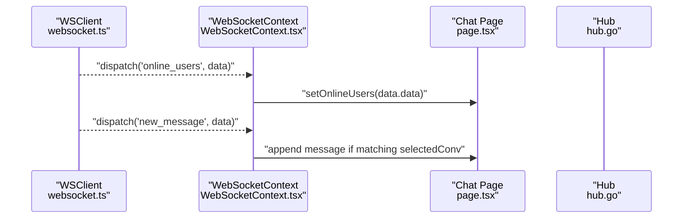
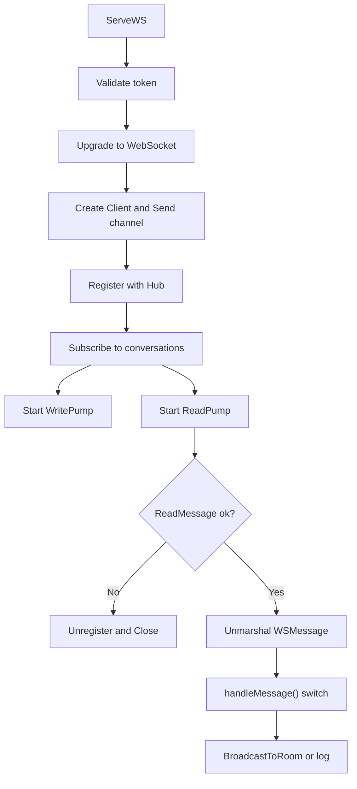
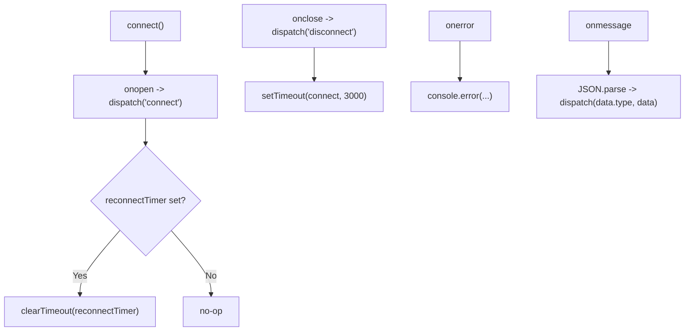
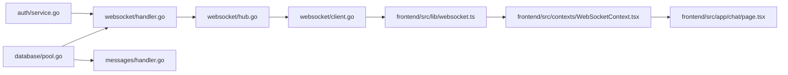

# Real-time Communication

<cite>
**Referenced Files in This Document**
- [hub.go](file://backend/internal/websocket/hub.go)
- [client.go](file://backend/internal/websocket/client.go)
- [handler.go](file://backend/internal/websocket/handler.go)
- [main.go](file://backend/cmd/server/main.go)
- [websocket.ts](file://frontend/src/lib/websocket.ts)
- [WebSocketContext.tsx](file://frontend/src/contexts/WebSocketContext.tsx)
- [page.tsx](file://frontend/src/app/chat/page.tsx)
- [service.go](file://backend/internal/auth/service.go)
- [handler.go](file://backend/internal/messages/handler.go)
- [models.go](file://backend/internal/database/models.go)
- [pool.go](file://backend/internal/database/pool.go)
- [006_presence.sql](file://backend/sql/schema/006_presence.sql)
</cite>

## Table of Contents
1. [Introduction](#introduction)
2. [Project Structure](#project-structure)
3. [Core Components](#core-components)
4. [Architecture Overview](#architecture-overview)
5. [Detailed Component Analysis](#detailed-component-analysis)
6. [Dependency Analysis](#dependency-analysis)
7. [Performance Considerations](#performance-considerations)
8. [Security and Resource Protection](#security-and-resource-protection)
9. [Troubleshooting Guide](#troubleshooting-guide)
10. [Conclusion](#conclusion)

## Introduction
This document explains the real-time communication system built with WebSocket in the Go-Chatsync project. It covers the WebSocket protocol implementation, message format specifications, event handling patterns, connection lifecycle management, automatic reconnection strategies, error recovery mechanisms, message broadcasting, room-based communication, and presence tracking. It also includes concrete examples of message types, client-server communication patterns, real-time update mechanisms, performance considerations, scalability implications, security features, input validation, and troubleshooting guidance.

## Project Structure
The real-time subsystem spans backend and frontend:
- Backend: WebSocket hub, client pump, upgrade handler, authentication integration, and HTTP server wiring.
- Frontend: WebSocket client wrapper, React context provider, and chat page integration.

**Diagram sources**
- [main.go:26-147](file://backend/cmd/server/main.go#L26-L147)
- [handler.go:25-61](file://backend/internal/websocket/handler.go#L25-L61)
- [hub.go:48-170](file://backend/internal/websocket/hub.go#L48-L170)
- [client.go:26-125](file://backend/internal/websocket/client.go#L26-L125)
- [service.go:1-94](file://backend/internal/auth/service.go#L1-L94)
- [handler.go:60-135](file://backend/internal/messages/handler.go#L60-L135)
- [pool.go:20-46](file://backend/internal/database/pool.go#L20-L46)
- [websocket.ts:1-95](file://frontend/src/lib/websocket.ts#L1-L95)
- [WebSocketContext.tsx:27-76](file://frontend/src/contexts/WebSocketContext.tsx#L27-L76)
- [page.tsx:12-232](file://frontend/src/app/chat/page.tsx#L12-L232)

**Section sources**
- [main.go:26-147](file://backend/cmd/server/main.go#L26-L147)
- [handler.go:25-61](file://backend/internal/websocket/handler.go#L25-L61)
- [hub.go:48-170](file://backend/internal/websocket/hub.go#L48-L170)
- [client.go:26-125](file://backend/internal/websocket/client.go#L26-L125)
- [websocket.ts:1-95](file://frontend/src/lib/websocket.ts#L1-L95)
- [WebSocketContext.tsx:27-76](file://frontend/src/contexts/WebSocketContext.tsx#L27-L76)
- [page.tsx:12-232](file://frontend/src/app/chat/page.tsx#L12-L232)

## Core Components
- WebSocket Hub: Manages connected clients, rooms, and broadcasts.
- Client: Encapsulates a single connection with read/write pumps and message routing.
- WebSocket Handler: Upgrades HTTP connections, validates tokens, and subscribes clients to rooms.
- Frontend WS Client: Wraps browser WebSocket with reconnection and event dispatch.
- Authentication Service: Validates JWT access tokens used for WebSocket upgrades.
- Messages Handler: Accepts and persists messages; integrates with real-time updates.
- Database Pool: Provides connection pooling for reliable persistence.

**Section sources**
- [hub.go:48-170](file://backend/internal/websocket/hub.go#L48-L170)
- [client.go:26-125](file://backend/internal/websocket/client.go#L26-L125)
- [handler.go:25-61](file://backend/internal/websocket/handler.go#L25-L61)
- [websocket.ts:1-95](file://frontend/src/lib/websocket.ts#L1-L95)
- [service.go:75-93](file://backend/internal/auth/service.go#L75-L93)
- [handler.go:60-135](file://backend/internal/messages/handler.go#L60-L135)
- [pool.go:20-46](file://backend/internal/database/pool.go#L20-L46)

## Architecture Overview
The system follows a publish-subscribe model:
- Clients connect with a JWT token and are subscribed to their conversations.
- The hub maintains per-user online presence and per-conversation rooms.
- Incoming messages are broadcast to room members excluding the sender.
- Frontend receives events and updates UI in real time.

**Diagram sources**
- [handler.go:25-61](file://backend/internal/websocket/handler.go#L25-L61)
- [hub.go:89-111](file://backend/internal/websocket/hub.go#L89-L111)
- [hub.go:143-156](file://backend/internal/websocket/hub.go#L143-L156)
- [client.go:87-110](file://backend/internal/websocket/client.go#L87-L110)
- [websocket.ts:19-51](file://frontend/src/lib/websocket.ts#L19-L51)

**Section sources**
- [handler.go:25-61](file://backend/internal/websocket/handler.go#L25-L61)
- [hub.go:89-111](file://backend/internal/websocket/hub.go#L89-L111)
- [hub.go:143-156](file://backend/internal/websocket/hub.go#L143-L156)
- [client.go:87-110](file://backend/internal/websocket/client.go#L87-L110)
- [websocket.ts:19-51](file://frontend/src/lib/websocket.ts#L19-L51)

## Detailed Component Analysis

### WebSocket Protocol Implementation
- Upgrade and handshake: The handler uses an upgrader to convert HTTP requests to WebSocket connections and validates the JWT token from the query string.
- Client lifecycle: Each client runs two goroutines: a read pump that decodes incoming messages and a write pump that handles outbound messages and periodic ping/pong keepalive.
- Room-based messaging: Clients are subscribed to rooms based on their conversations; broadcasts target rooms and exclude the sender.

**Diagram sources**
- [handler.go:25-61](file://backend/internal/websocket/handler.go#L25-L61)
- [client.go:26-85](file://backend/internal/websocket/client.go#L26-L85)
- [client.go:87-110](file://backend/internal/websocket/client.go#L87-L110)
- [hub.go:143-156](file://backend/internal/websocket/hub.go#L143-L156)

**Section sources**
- [handler.go:25-61](file://backend/internal/websocket/handler.go#L25-L61)
- [client.go:26-85](file://backend/internal/websocket/client.go#L26-L85)
- [client.go:87-110](file://backend/internal/websocket/client.go#L87-L110)
- [hub.go:143-156](file://backend/internal/websocket/hub.go#L143-L156)

### Message Format Specifications
The WebSocket message envelope supports multiple event types and optional fields. The backend defines constants for message types and a unified struct for transport.

- Message types:
  - new_message: Real-time delivery of a newly sent message.
  - typing: Indicates a user started typing in a conversation.
  - stop_typing: Indicates a user stopped typing in a conversation.
  - read_receipt: Acknowledges read status for a message.
  - presence: Reserved for presence updates.
  - error: Error reporting.
  - online_users: Broadcast of currently online users.

- Envelope fields:
  - type: Event discriminator.
  - conversation_id: Room identifier for room-scoped events.
  - sender_id, sender_username: Originator identity for typed events.
  - content: Message payload for text-based events.
  - message_id: Unique identifier for the message.
  - user_id, username: Target user for user-scoped events.
  - status: Presence or status indicator.
  - is_typing: Boolean flag for typing events.
  - error: Human-readable error text.
  - data: Arbitrary payload for lists or metadata.

**Section sources**
- [hub.go:11-20](file://backend/internal/websocket/hub.go#L11-L20)
- [hub.go:22-36](file://backend/internal/websocket/hub.go#L22-L36)

### Event Handling Patterns
- Frontend event routing: The WS client parses inbound JSON and dispatches to registered handlers keyed by message type.
- Online users: The hub periodically broadcasts online users to all clients upon register/unregister events.
- Room broadcasts: The hub forwards room-scoped messages to all participants except the sender.

**Diagram sources**
- [websocket.ts:43-84](file://frontend/src/lib/websocket.ts#L43-L84)
- [WebSocketContext.tsx:43-45](file://frontend/src/contexts/WebSocketContext.tsx#L43-L45)
- [page.tsx:35-51](file://frontend/src/app/chat/page.tsx#L35-L51)
- [hub.go:89-111](file://backend/internal/websocket/hub.go#L89-L111)

**Section sources**
- [websocket.ts:43-84](file://frontend/src/lib/websocket.ts#L43-L84)
- [WebSocketContext.tsx:43-45](file://frontend/src/contexts/WebSocketContext.tsx#L43-L45)
- [page.tsx:35-51](file://frontend/src/app/chat/page.tsx#L35-L51)
- [hub.go:89-111](file://backend/internal/websocket/hub.go#L89-L111)

### Connection Lifecycle Management
- Connection establishment: The handler extracts a JWT from the query string, validates it, upgrades the connection, registers the client, subscribes to conversations, and starts read/write loops.
- Read loop: Applies read limits, sets pong deadlines, and handles unexpected close errors.
- Write loop: Sends outbound messages and periodic ping frames with write deadlines.
- Graceful teardown: On read loop exit, the client is unregistered and connections closed.

**Diagram sources**
- [handler.go:25-61](file://backend/internal/websocket/handler.go#L25-L61)
- [client.go:26-56](file://backend/internal/websocket/client.go#L26-L56)
- [client.go:58-85](file://backend/internal/websocket/client.go#L58-L85)
- [client.go:87-110](file://backend/internal/websocket/client.go#L87-L110)

**Section sources**
- [handler.go:25-61](file://backend/internal/websocket/handler.go#L25-L61)
- [client.go:26-56](file://backend/internal/websocket/client.go#L26-L56)
- [client.go:58-85](file://backend/internal/websocket/client.go#L58-L85)
- [client.go:87-110](file://backend/internal/websocket/client.go#L87-L110)

### Automatic Reconnection Strategies
- Frontend reconnection: The WS client attempts to reconnect every 3 seconds after disconnection and clears timers on successful connect.
- Backpressure: Send channels are buffered; default behavior ignores blocked sends to prevent writer stalls.

**Diagram sources**
- [websocket.ts:19-51](file://frontend/src/lib/websocket.ts#L19-L51)

**Section sources**
- [websocket.ts:19-51](file://frontend/src/lib/websocket.ts#L19-L51)

### Error Recovery Mechanisms
- Unexpected close detection: Read loop logs unexpected closure reasons and proceeds to unregister/close.
- Write failures: Write pump exits on write errors, ensuring cleanup.
- Unknown message types: Read loop logs unknown types and continues processing.

**Section sources**
- [client.go:42-46](file://backend/internal/websocket/client.go#L42-L46)
- [client.go:74-76](file://backend/internal/websocket/client.go#L74-L76)
- [client.go:107-109](file://backend/internal/websocket/client.go#L107-L109)

### Message Broadcasting System
- Room membership: Joined rooms are stored in a map keyed by conversation ID; broadcasts iterate over room members and skip the sender.
- Online users: The hub computes online users and broadcasts a list to all clients.

**Section sources**
- [hub.go:121-129](file://backend/internal/websocket/hub.go#L121-L129)
- [hub.go:131-141](file://backend/internal/websocket/hub.go#L131-L141)
- [hub.go:143-156](file://backend/internal/websocket/hub.go#L143-L156)
- [hub.go:89-111](file://backend/internal/websocket/hub.go#L89-L111)

### Room-Based Communication
- Subscription: On connect, the handler fetches the user’s conversations and joins each room.
- Broadcasting: Room broadcasts exclude the sender to avoid self-delivery.

**Section sources**
- [handler.go:63-73](file://backend/internal/websocket/handler.go#L63-L73)
- [hub.go:143-156](file://backend/internal/websocket/hub.go#L143-L156)

### Presence Tracking
- Online users broadcast: The hub emits a list of currently connected user IDs to all clients.
- Presence table: The schema includes a presence table and typing events for richer presence signals.

**Section sources**
- [hub.go:89-111](file://backend/internal/websocket/hub.go#L89-L111)
- [006_presence.sql:1-18](file://backend/sql/schema/006_presence.sql#L1-L18)

### Concrete Examples: Message Types and Patterns
- new_message: Sent by the frontend after successful server-side creation; the backend broadcasts to the conversation room.
- typing/stop_typing: Sent by the client; the backend forwards to the room with sender identity.
- read_receipt: Sent by the client; the backend forwards to the room.
- online_users: Periodically broadcast by the hub to inform clients of online users.

**Section sources**
- [hub.go:11-20](file://backend/internal/websocket/hub.go#L11-L20)
- [client.go:87-110](file://backend/internal/websocket/client.go#L87-L110)
- [page.tsx:77-82](file://frontend/src/app/chat/page.tsx#L77-L82)

## Dependency Analysis
- Backend dependencies:
  - Gorilla WebSocket for transport.
  - JWT service for token validation.
  - SQLC-generated database queries for conversation/message persistence.
  - PostgreSQL connection pool for concurrency and reliability.
- Frontend dependencies:
  - React context for global WS state.
  - Local storage for token retrieval.

**Diagram sources**
- [service.go:75-93](file://backend/internal/auth/service.go#L75-L93)
- [handler.go:60-135](file://backend/internal/messages/handler.go#L60-L135)
- [pool.go:20-46](file://backend/internal/database/pool.go#L20-L46)
- [handler.go:25-61](file://backend/internal/websocket/handler.go#L25-L61)
- [hub.go:48-170](file://backend/internal/websocket/hub.go#L48-L170)
- [client.go:26-125](file://backend/internal/websocket/client.go#L26-L125)
- [websocket.ts:1-95](file://frontend/src/lib/websocket.ts#L1-L95)
- [WebSocketContext.tsx:27-76](file://frontend/src/contexts/WebSocketContext.tsx#L27-L76)
- [page.tsx:12-232](file://frontend/src/app/chat/page.tsx#L12-L232)

**Section sources**
- [service.go:75-93](file://backend/internal/auth/service.go#L75-L93)
- [handler.go:60-135](file://backend/internal/messages/handler.go#L60-L135)
- [pool.go:20-46](file://backend/internal/database/pool.go#L20-L46)
- [handler.go:25-61](file://backend/internal/websocket/handler.go#L25-L61)
- [hub.go:48-170](file://backend/internal/websocket/hub.go#L48-L170)
- [client.go:26-125](file://backend/internal/websocket/client.go#L26-L125)
- [websocket.ts:1-95](file://frontend/src/lib/websocket.ts#L1-L95)
- [WebSocketContext.tsx:27-76](file://frontend/src/contexts/WebSocketContext.tsx#L27-L76)
- [page.tsx:12-232](file://frontend/src/app/chat/page.tsx#L12-L232)

## Performance Considerations
- Connection pooling: The database pool is configured with a fixed maximum; this bounds concurrent connections and reduces overhead.
- Buffered channels: Client send channels are buffered to reduce blocking; however, default behavior drops messages on backpressure to avoid writer stalls.
- Read/write deadlines: Timeouts for reads/writes prevent resource leaks and improve resilience under network issues.
- Room broadcasts: Iterating over room members is O(n); consider partitioning or sharding for very large rooms.
- Ping/pong intervals: Tuned to detect dead peers efficiently without excessive traffic.

Recommendations:
- Monitor queue depths of client Send channels and consider dynamic buffering or rate limiting.
- For high-scale deployments, shard hubs by tenant or region and use external pub/sub (e.g., Redis) to coordinate cross-instance broadcasts.
- Apply compression for large payloads if needed.

**Section sources**
- [pool.go:26](file://backend/internal/database/pool.go#L26)
- [client.go:42-46](file://backend/internal/websocket/client.go#L42-L46)
- [client.go:73-76](file://backend/internal/websocket/client.go#L73-L76)
- [client.go:14-18](file://backend/internal/websocket/client.go#L14-L18)

## Security and Resource Protection
- Transport security: The upgrader allows any origin; production deployments should restrict origins and enforce TLS termination at the edge.
- Authentication: WebSocket upgrades require a valid JWT passed as a query parameter; the handler validates the token before establishing the connection.
- Input validation: The read pump applies a maximum message size and JSON parsing; unknown message types are logged and ignored.
- Rate limiting and quotas: Not implemented in code; consider adding per-client rate limits and message size caps at the ingress layer.

**Section sources**
- [client.go:20-24](file://backend/internal/websocket/client.go#L20-L24)
- [handler.go:25-36](file://backend/internal/websocket/handler.go#L25-L36)
- [client.go:32-37](file://backend/internal/websocket/client.go#L32-L37)
- [client.go:49-52](file://backend/internal/websocket/client.go#L49-L52)

## Troubleshooting Guide
Common issues and resolutions:
- Connection drops:
  - Verify JWT validity and expiration; ensure the token is present in the query string.
  - Check read/write timeouts and network stability; review unexpected close logs.
- Message ordering:
  - The current implementation does not guarantee ordering across rooms; ensure UI logic handles out-of-order messages gracefully.
- Synchronization problems:
  - The frontend maintains a temporary optimistic message and reconciles with the server response; confirm that the reconciliation logic replaces the temporary ID with the server-assigned ID.
- Presence not updating:
  - Confirm that register/unregister events trigger online_users broadcasts and that the frontend handler updates state accordingly.

Operational checks:
- Inspect server logs for token validation failures and upgrade errors.
- Validate room membership by ensuring conversation subscription occurs after registration.
- Monitor hub room sizes and broadcast latencies.

**Section sources**
- [handler.go:25-36](file://backend/internal/websocket/handler.go#L25-L36)
- [client.go:42-46](file://backend/internal/websocket/client.go#L42-L46)
- [page.tsx:57-87](file://frontend/src/app/chat/page.tsx#L57-L87)
- [hub.go:89-111](file://backend/internal/websocket/hub.go#L89-L111)

## Conclusion
The real-time communication system combines a lightweight WebSocket hub with room-based broadcasting, JWT-based authentication, and a resilient frontend client with automatic reconnection. While the current implementation focuses on simplicity and clarity, production deployments should consider transport hardening, rate limiting, and horizontal scaling strategies to achieve robustness and scalability at higher loads.