# Testing Strategy

<cite>
**Referenced Files in This Document**
- [backend/tests/auth_service_test.go](file://backend/tests/auth_service_test.go)
- [backend/tests/handlers_test.go](file://backend/tests/handlers_test.go)
- [backend/tests/websocket_hub_test.go](file://backend/tests/websocket_hub_test.go)
- [backend/tests/middleware_test.go](file://backend/tests/middleware_test.go)
- [backend/internal/auth/service.go](file://backend/internal/auth/service.go)
- [backend/internal/auth/handler.go](file://backend/internal/auth/handler.go)
- [backend/internal/middleware/auth.go](file://backend/internal/middleware/auth.go)
- [backend/internal/websocket/hub.go](file://backend/internal/websocket/hub.go)
- [frontend/tests/api.test.ts](file://frontend/tests/api.test.ts)
- [frontend/tests/auth.test.ts](file://frontend/tests/auth.test.ts)
- [frontend/tests/types.test.ts](file://frontend/tests/types.test.ts)
- [frontend/vitest.config.ts](file://frontend/vitest.config.ts)
- [frontend/src/lib/api.ts](file://frontend/src/lib/api.ts)
- [frontend/src/lib/auth.ts](file://frontend/src/lib/auth.ts)
- [frontend/src/lib/websocket.ts](file://frontend/src/lib/websocket.ts)
- [frontend/src/contexts/AuthContext.tsx](file://frontend/src/contexts/AuthContext.tsx)
- [frontend/src/contexts/WebSocketContext.tsx](file://frontend/src/contexts/WebSocketContext.tsx)
</cite>

## Table of Contents
1. [Introduction](#introduction)
2. [Project Structure](#project-structure)
3. [Core Components](#core-components)
4. [Architecture Overview](#architecture-overview)
5. [Detailed Component Analysis](#detailed-component-analysis)
6. [Dependency Analysis](#dependency-analysis)
7. [Performance Considerations](#performance-considerations)
8. [Troubleshooting Guide](#troubleshooting-guide)
9. [Conclusion](#conclusion)
10. [Appendices](#appendices)

## Introduction
This document provides a comprehensive testing strategy for both backend and frontend components of the chat application. It covers unit testing approaches for Go services and HTTP handlers, including mock implementations and dependency injection patterns. It also explains frontend testing strategies using React Testing Library and Vitest, context provider testing, and WebSocket functionality validation. Concrete examples are drawn from the actual test files to illustrate authentication service tests, handler tests, and WebSocket hub tests. The guide includes best practices, coverage expectations, continuous integration setup considerations, and guidance for testing real-time applications, asynchronous operations, and state management.

## Project Structure
The repository is split into backend and frontend directories. Backend tests reside under backend/tests and exercise Go services, handlers, middleware, and WebSocket hubs. Frontend tests live under frontend/tests and validate API client behavior, authentication helpers, type definitions, and WebSocket client connectivity.

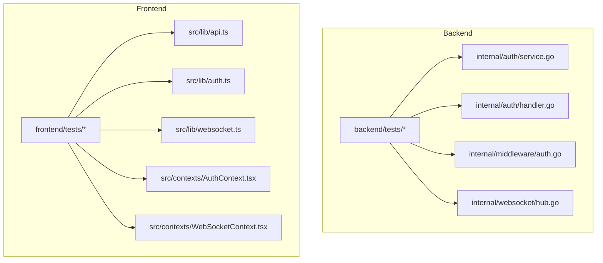

**Diagram sources**
- [backend/tests/auth_service_test.go:1-125](file://backend/tests/auth_service_test.go#L1-L125)
- [backend/tests/handlers_test.go:1-304](file://backend/tests/handlers_test.go#L1-L304)
- [backend/tests/websocket_hub_test.go:1-217](file://backend/tests/websocket_hub_test.go#L1-L217)
- [backend/tests/middleware_test.go:1-137](file://backend/tests/middleware_test.go#L1-L137)
- [backend/internal/auth/service.go:1-94](file://backend/internal/auth/service.go#L1-L94)
- [backend/internal/auth/handler.go:1-259](file://backend/internal/auth/handler.go#L1-L259)
- [backend/internal/middleware/auth.go:1-48](file://backend/internal/middleware/auth.go#L1-L48)
- [backend/internal/websocket/hub.go:1-170](file://backend/internal/websocket/hub.go#L1-L170)
- [frontend/tests/api.test.ts:1-101](file://frontend/tests/api.test.ts#L1-L101)
- [frontend/tests/auth.test.ts:1-55](file://frontend/tests/auth.test.ts#L1-L55)
- [frontend/tests/types.test.ts:1-50](file://frontend/tests/types.test.ts#L1-L50)
- [frontend/src/lib/api.ts:1-118](file://frontend/src/lib/api.ts#L1-L118)
- [frontend/src/lib/auth.ts:1-29](file://frontend/src/lib/auth.ts#L1-L29)
- [frontend/src/lib/websocket.ts:1-95](file://frontend/src/lib/websocket.ts#L1-L95)
- [frontend/src/contexts/AuthContext.tsx:1-95](file://frontend/src/contexts/AuthContext.tsx#L1-L95)
- [frontend/src/contexts/WebSocketContext.tsx:1-84](file://frontend/src/contexts/WebSocketContext.tsx#L1-L84)

**Section sources**
- [backend/tests/auth_service_test.go:1-125](file://backend/tests/auth_service_test.go#L1-L125)
- [backend/tests/handlers_test.go:1-304](file://backend/tests/handlers_test.go#L1-L304)
- [backend/tests/websocket_hub_test.go:1-217](file://backend/tests/websocket_hub_test.go#L1-L217)
- [backend/tests/middleware_test.go:1-137](file://backend/tests/middleware_test.go#L1-L137)
- [frontend/tests/api.test.ts:1-101](file://frontend/tests/api.test.ts#L1-L101)
- [frontend/tests/auth.test.ts:1-55](file://frontend/tests/auth.test.ts#L1-L55)
- [frontend/tests/types.test.ts:1-50](file://frontend/tests/types.test.ts#L1-L50)

## Core Components
This section outlines the primary testing targets and their roles:
- Authentication service: JWT token generation and validation, TTL enforcement, concurrency safety.
- HTTP handlers: Registration, login, refresh, logout, and profile retrieval with request validation and persistence via mocks.
- Middleware: Authorization guard injecting user identity into request context.
- WebSocket hub: Client registration, room management, presence broadcasting, and concurrent access safety.
- Frontend API client: HTTP requests with token injection, error handling, and endpoint coverage.
- Frontend auth helpers: Token storage and retrieval, authentication state checks.
- Frontend WebSocket client: Connection lifecycle, message dispatch, reconnection, and subscription management.
- Frontend contexts: Provider testing for Auth and WebSocket contexts.

**Section sources**
- [backend/internal/auth/service.go:1-94](file://backend/internal/auth/service.go#L1-L94)
- [backend/internal/auth/handler.go:1-259](file://backend/internal/auth/handler.go#L1-L259)
- [backend/internal/middleware/auth.go:1-48](file://backend/internal/middleware/auth.go#L1-L48)
- [backend/internal/websocket/hub.go:1-170](file://backend/internal/websocket/hub.go#L1-L170)
- [frontend/src/lib/api.ts:1-118](file://frontend/src/lib/api.ts#L1-L118)
- [frontend/src/lib/auth.ts:1-29](file://frontend/src/lib/auth.ts#L1-L29)
- [frontend/src/lib/websocket.ts:1-95](file://frontend/src/lib/websocket.ts#L1-L95)
- [frontend/src/contexts/AuthContext.tsx:1-95](file://frontend/src/contexts/AuthContext.tsx#L1-L95)
- [frontend/src/contexts/WebSocketContext.tsx:1-84](file://frontend/src/contexts/WebSocketContext.tsx#L1-L84)

## Architecture Overview
The testing architecture separates concerns across backend and frontend:
- Backend tests validate service logic, HTTP handler behavior, middleware integration, and WebSocket hub operations using lightweight mocks and in-memory concurrency.
- Frontend tests validate API client behavior, auth helpers, WebSocket client, and context providers using Vitest with jsdom environment and isolated mocks for browser APIs.

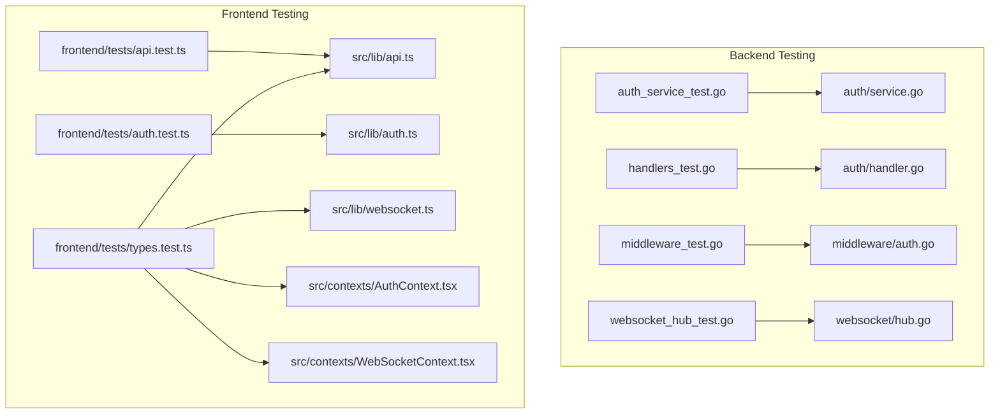

**Diagram sources**
- [backend/tests/auth_service_test.go:1-125](file://backend/tests/auth_service_test.go#L1-L125)
- [backend/tests/handlers_test.go:1-304](file://backend/tests/handlers_test.go#L1-L304)
- [backend/tests/middleware_test.go:1-137](file://backend/tests/middleware_test.go#L1-L137)
- [backend/tests/websocket_hub_test.go:1-217](file://backend/tests/websocket_hub_test.go#L1-L217)
- [backend/internal/auth/service.go:1-94](file://backend/internal/auth/service.go#L1-L94)
- [backend/internal/auth/handler.go:1-259](file://backend/internal/auth/handler.go#L1-L259)
- [backend/internal/middleware/auth.go:1-48](file://backend/internal/middleware/auth.go#L1-L48)
- [backend/internal/websocket/hub.go:1-170](file://backend/internal/websocket/hub.go#L1-L170)
- [frontend/tests/api.test.ts:1-101](file://frontend/tests/api.test.ts#L1-L101)
- [frontend/tests/auth.test.ts:1-55](file://frontend/tests/auth.test.ts#L1-L55)
- [frontend/tests/types.test.ts:1-50](file://frontend/tests/types.test.ts#L1-L50)
- [frontend/src/lib/api.ts:1-118](file://frontend/src/lib/api.ts#L1-L118)
- [frontend/src/lib/auth.ts:1-29](file://frontend/src/lib/auth.ts#L1-L29)
- [frontend/src/lib/websocket.ts:1-95](file://frontend/src/lib/websocket.ts#L1-L95)
- [frontend/src/contexts/AuthContext.tsx:1-95](file://frontend/src/contexts/AuthContext.tsx#L1-L95)
- [frontend/src/contexts/WebSocketContext.tsx:1-84](file://frontend/src/contexts/WebSocketContext.tsx#L1-L84)

## Detailed Component Analysis

### Backend Authentication Service Tests
This suite validates JWT token generation and validation, token duration, invalid token handling, expired tokens, wrong secret keys, and concurrent token generation.

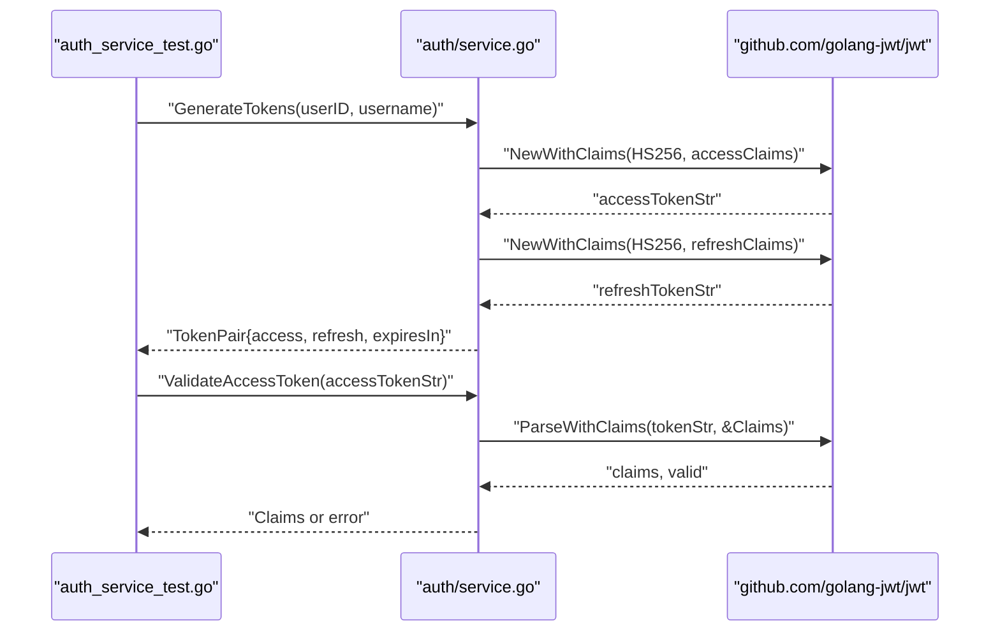

**Diagram sources**
- [backend/tests/auth_service_test.go:11-46](file://backend/tests/auth_service_test.go#L11-L46)
- [backend/internal/auth/service.go:37-73](file://backend/internal/auth/service.go#L37-L73)
- [backend/internal/auth/service.go:75-93](file://backend/internal/auth/service.go#L75-L93)

Key test scenarios:
- Token pair generation and expiry correctness.
- Validation failure for invalid tokens and expired tokens.
- Cross-service secret mismatch validation.
- Concurrency-safe token generation.

Best practices:
- Use deterministic secrets and short TTLs for predictable tests.
- Validate claims issuer and payload fields.
- Assert error types and status codes.

**Section sources**
- [backend/tests/auth_service_test.go:11-125](file://backend/tests/auth_service_test.go#L11-L125)
- [backend/internal/auth/service.go:11-94](file://backend/internal/auth/service.go#L11-L94)

### Backend HTTP Handlers Tests
These tests validate request validation, duplicate detection, and response correctness for auth, users, messages, and conversations endpoints using a mock database.Querier.

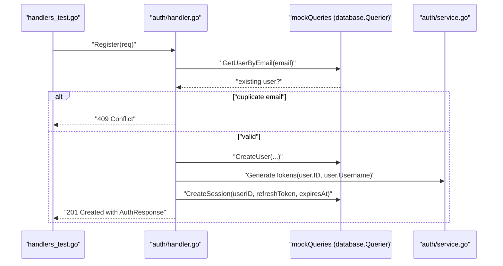

**Diagram sources**
- [backend/tests/handlers_test.go:153-206](file://backend/tests/handlers_test.go#L153-L206)
- [backend/internal/auth/handler.go:23-104](file://backend/internal/auth/handler.go#L23-L104)
- [backend/tests/handlers_test.go:19-139](file://backend/tests/handlers_test.go#L19-L139)

Additional handler validations:
- Users list endpoint requires authenticated context.
- Messages endpoint validates content length.
- Conversations endpoint validates type and member constraints.

Best practices:
- Use httptest.NewRequest and httptest.NewRecorder for HTTP testing.
- Inject context values for authenticated routes.
- Mock only the necessary database.Querier methods.

**Section sources**
- [backend/tests/handlers_test.go:146-304](file://backend/tests/handlers_test.go#L146-L304)
- [backend/internal/auth/handler.go:1-259](file://backend/internal/auth/handler.go#L1-L259)

### Backend Middleware Tests
This suite verifies that the authorization middleware extracts tokens from headers, validates them, and injects user identity into the request context.

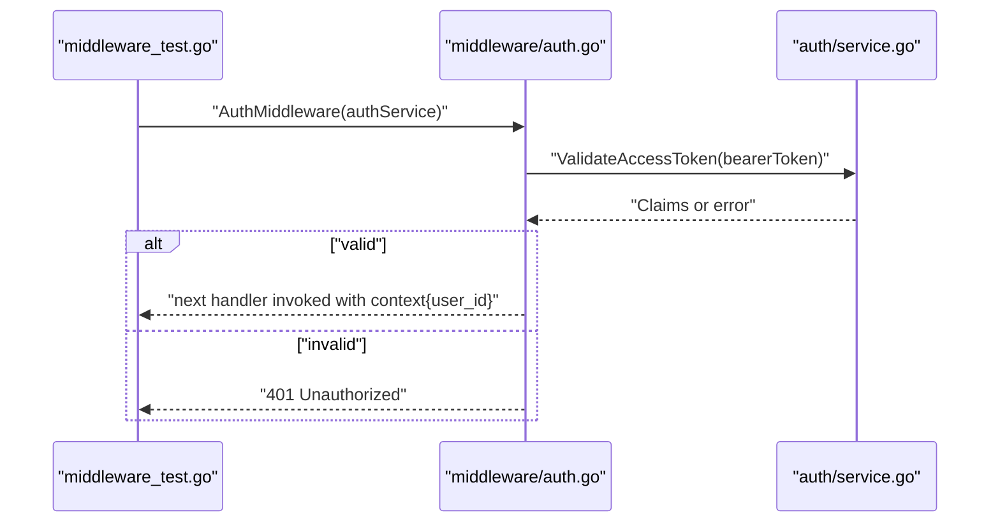

**Diagram sources**
- [backend/tests/middleware_test.go:27-100](file://backend/tests/middleware_test.go#L27-L100)
- [backend/internal/middleware/auth.go:18-44](file://backend/internal/middleware/auth.go#L18-L44)
- [backend/internal/auth/service.go:75-93](file://backend/internal/auth/service.go#L75-L93)

Edge cases covered:
- Missing Authorization header.
- Wrong header format (missing Bearer scheme).
- Invalid or empty token.
- Wrong authentication scheme (e.g., Basic).

**Section sources**
- [backend/tests/middleware_test.go:13-137](file://backend/tests/middleware_test.go#L13-L137)
- [backend/internal/middleware/auth.go:1-48](file://backend/internal/middleware/auth.go#L1-L48)

### Backend WebSocket Hub Tests
These tests validate hub initialization, client registration/unregistration, room joining/leaving, presence broadcasting, and concurrent client behavior.

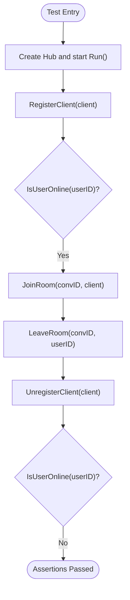

**Diagram sources**
- [backend/tests/websocket_hub_test.go:14-111](file://backend/tests/websocket_hub_test.go#L14-L111)
- [backend/internal/websocket/hub.go:56-87](file://backend/internal/websocket/hub.go#L56-L87)
- [backend/internal/websocket/hub.go:113-141](file://backend/internal/websocket/hub.go#L113-L141)

Concurrency and robustness:
- Duplicate registrations replace older clients.
- Broadcasting online users updates all clients.
- Room membership is cleaned up during unregistration.

**Section sources**
- [backend/tests/websocket_hub_test.go:1-217](file://backend/tests/websocket_hub_test.go#L1-L217)
- [backend/internal/websocket/hub.go:1-170](file://backend/internal/websocket/hub.go#L1-L170)

### Frontend API Client Tests
These tests validate HTTP requests, error handling, and token inclusion for authentication endpoints.

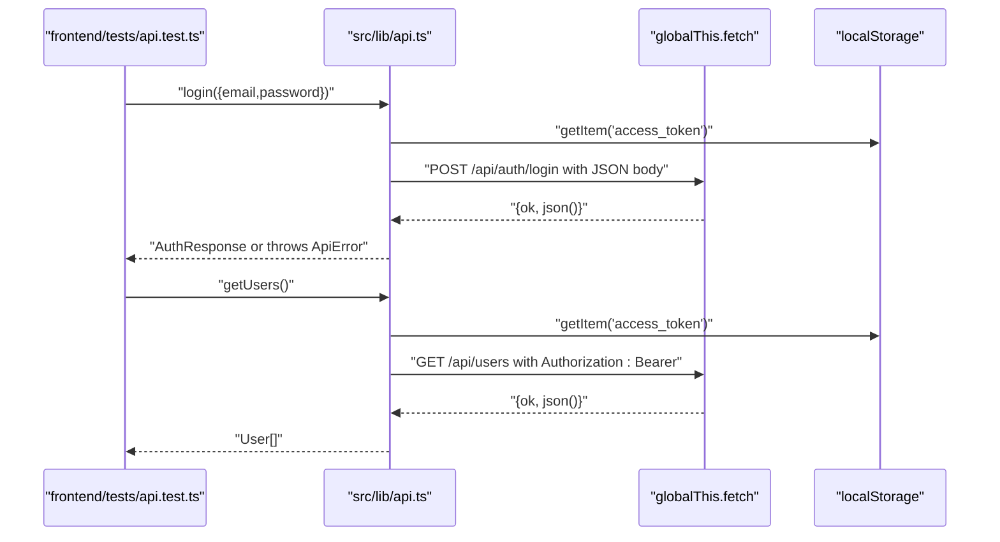

**Diagram sources**
- [frontend/tests/api.test.ts:32-100](file://frontend/tests/api.test.ts#L32-L100)
- [frontend/src/lib/api.ts:11-60](file://frontend/src/lib/api.ts#L11-L60)

Best practices:
- Mock globalThis.fetch and localStorage for isolation.
- Assert request URLs, methods, and headers.
- Validate error propagation and status handling.

**Section sources**
- [frontend/tests/api.test.ts:1-101](file://frontend/tests/api.test.ts#L1-L101)
- [frontend/src/lib/api.ts:1-118](file://frontend/src/lib/api.ts#L1-L118)

### Frontend Auth Helpers Tests
These tests verify token storage, retrieval, clearing, and authentication state checks.

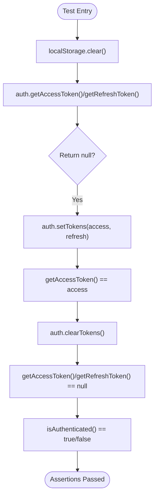

**Diagram sources**
- [frontend/tests/auth.test.ts:27-54](file://frontend/tests/auth.test.ts#L27-L54)
- [frontend/src/lib/auth.ts:1-29](file://frontend/src/lib/auth.ts#L1-L29)

**Section sources**
- [frontend/tests/auth.test.ts:1-55](file://frontend/tests/auth.test.ts#L1-L55)
- [frontend/src/lib/auth.ts:1-29](file://frontend/src/lib/auth.ts#L1-L29)

### Frontend WebSocket Client Tests
These tests validate connection lifecycle, message dispatch, reconnection, and subscription management.

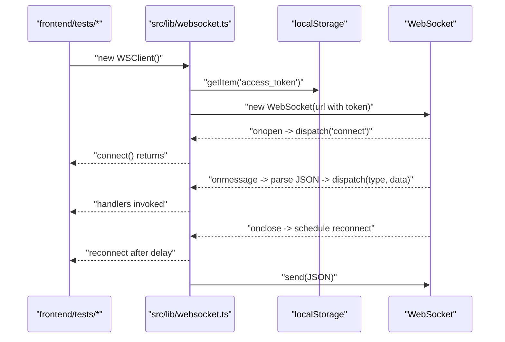

**Diagram sources**
- [frontend/src/lib/websocket.ts:11-95](file://frontend/src/lib/websocket.ts#L11-L95)

**Section sources**
- [frontend/src/lib/websocket.ts:1-95](file://frontend/src/lib/websocket.ts#L1-L95)

### Frontend Context Provider Tests
These tests validate AuthProvider and WebSocketProvider behavior, including initial load, login, logout, and WebSocket events.

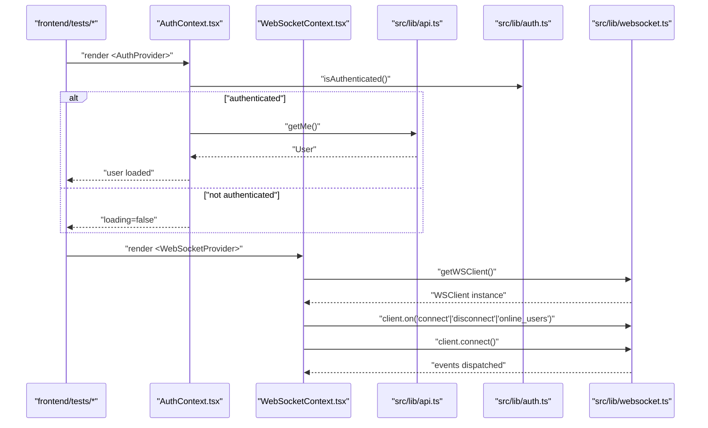

**Diagram sources**
- [frontend/src/contexts/AuthContext.tsx:27-95](file://frontend/src/contexts/AuthContext.tsx#L27-L95)
- [frontend/src/contexts/WebSocketContext.tsx:27-84](file://frontend/src/contexts/WebSocketContext.tsx#L27-L84)
- [frontend/src/lib/api.ts:62-63](file://frontend/src/lib/api.ts#L62-L63)
- [frontend/src/lib/auth.ts:25-27](file://frontend/src/lib/auth.ts#L25-L27)
- [frontend/src/lib/websocket.ts:19-85](file://frontend/src/lib/websocket.ts#L19-L85)

**Section sources**
- [frontend/src/contexts/AuthContext.tsx:1-95](file://frontend/src/contexts/AuthContext.tsx#L1-L95)
- [frontend/src/contexts/WebSocketContext.tsx:1-84](file://frontend/src/contexts/WebSocketContext.tsx#L1-L84)
- [frontend/src/lib/api.ts:1-118](file://frontend/src/lib/api.ts#L1-L118)
- [frontend/src/lib/auth.ts:1-29](file://frontend/src/lib/auth.ts#L1-L29)
- [frontend/src/lib/websocket.ts:1-95](file://frontend/src/lib/websocket.ts#L1-L95)

## Dependency Analysis
Backend tests depend on internal packages and external libraries for JWT and UUID handling. Frontend tests depend on Vitest, jsdom, and mocked browser APIs.

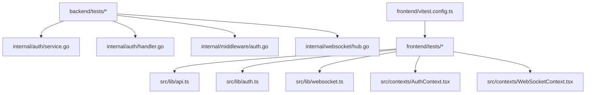

**Diagram sources**
- [backend/tests/auth_service_test.go:1-125](file://backend/tests/auth_service_test.go#L1-L125)
- [backend/tests/handlers_test.go:1-304](file://backend/tests/handlers_test.go#L1-L304)
- [backend/tests/websocket_hub_test.go:1-217](file://backend/tests/websocket_hub_test.go#L1-L217)
- [backend/tests/middleware_test.go:1-137](file://backend/tests/middleware_test.go#L1-L137)
- [backend/internal/auth/service.go:1-94](file://backend/internal/auth/service.go#L1-L94)
- [backend/internal/auth/handler.go:1-259](file://backend/internal/auth/handler.go#L1-L259)
- [backend/internal/middleware/auth.go:1-48](file://backend/internal/middleware/auth.go#L1-L48)
- [backend/internal/websocket/hub.go:1-170](file://backend/internal/websocket/hub.go#L1-L170)
- [frontend/tests/api.test.ts:1-101](file://frontend/tests/api.test.ts#L1-L101)
- [frontend/tests/auth.test.ts:1-55](file://frontend/tests/auth.test.ts#L1-L55)
- [frontend/tests/types.test.ts:1-50](file://frontend/tests/types.test.ts#L1-L50)
- [frontend/src/lib/api.ts:1-118](file://frontend/src/lib/api.ts#L1-L118)
- [frontend/src/lib/auth.ts:1-29](file://frontend/src/lib/auth.ts#L1-L29)
- [frontend/src/lib/websocket.ts:1-95](file://frontend/src/lib/websocket.ts#L1-L95)
- [frontend/src/contexts/AuthContext.tsx:1-95](file://frontend/src/contexts/AuthContext.tsx#L1-L95)
- [frontend/src/contexts/WebSocketContext.tsx:1-84](file://frontend/src/contexts/WebSocketContext.tsx#L1-L84)
- [frontend/vitest.config.ts:1-16](file://frontend/vitest.config.ts#L1-L16)

**Section sources**
- [frontend/vitest.config.ts:1-16](file://frontend/vitest.config.ts#L1-L16)

## Performance Considerations
- Backend tests: Prefer short TTLs and minimal sleeps to reduce flakiness; use channels and goroutines judiciously in hub tests; avoid heavy cryptographic operations in tests.
- Frontend tests: Mock network calls and timers to prevent slow tests; isolate localStorage per test; avoid real WebSocket connections in unit tests.

[No sources needed since this section provides general guidance]

## Troubleshooting Guide
Common issues and resolutions:
- Backend JWT validation failures: Ensure consistent secret and issuer; validate token claims structure.
- Handler test flakiness: Use deterministic UUIDs and controlled time; avoid relying on exact timestamps.
- Middleware unauthorized responses: Verify Authorization header format and bearer token presence.
- WebSocket hub race conditions: Use mutexes and buffered channels; assert state after small delays.
- Frontend API errors: Confirm fetch mock returns proper ok and status fields; assert thrown errors.
- Frontend auth helpers: Ensure localStorage is reset between tests; verify token presence before assertions.
- Frontend WebSocket client: Mock WebSocket and timers; assert event handlers are registered and invoked.

**Section sources**
- [backend/tests/auth_service_test.go:48-73](file://backend/tests/auth_service_test.go#L48-L73)
- [backend/tests/middleware_test.go:49-136](file://backend/tests/middleware_test.go#L49-L136)
- [backend/tests/websocket_hub_test.go:140-171](file://backend/tests/websocket_hub_test.go#L140-L171)
- [frontend/tests/api.test.ts:57-84](file://frontend/tests/api.test.ts#L57-L84)
- [frontend/tests/auth.test.ts:27-54](file://frontend/tests/auth.test.ts#L27-L54)
- [frontend/src/lib/websocket.ts:19-85](file://frontend/src/lib/websocket.ts#L19-L85)

## Conclusion
The testing strategy leverages targeted unit tests with precise mocks for both backend and frontend. Backend tests focus on JWT validation, HTTP handler correctness, middleware integration, and WebSocket hub reliability. Frontend tests emphasize API client behavior, auth helpers, WebSocket client lifecycle, and context provider functionality. By following the outlined best practices and using the provided examples as references, teams can maintain high confidence in real-time chat functionality while keeping tests fast, reliable, and maintainable.

[No sources needed since this section summarizes without analyzing specific files]

## Appendices

### Backend Testing Best Practices
- Use httptest for HTTP tests; inject context values for protected routes.
- Implement minimal mock interfaces for database operations.
- Validate JWT claims and error responses comprehensively.
- Test concurrent operations carefully with controlled timing.

**Section sources**
- [backend/tests/handlers_test.go:146-304](file://backend/tests/handlers_test.go#L146-L304)
- [backend/tests/middleware_test.go:13-137](file://backend/tests/middleware_test.go#L13-L137)
- [backend/tests/websocket_hub_test.go:1-217](file://backend/tests/websocket_hub_test.go#L1-L217)

### Frontend Testing Best Practices
- Configure Vitest with jsdom and aliases for clean imports.
- Mock globalThis.fetch and localStorage per test.
- Validate request construction, headers, and error handling.
- Test context providers with realistic user flows.

**Section sources**
- [frontend/vitest.config.ts:1-16](file://frontend/vitest.config.ts#L1-L16)
- [frontend/tests/api.test.ts:1-101](file://frontend/tests/api.test.ts#L1-L101)
- [frontend/tests/auth.test.ts:1-55](file://frontend/tests/auth.test.ts#L1-L55)
- [frontend/src/contexts/AuthContext.tsx:1-95](file://frontend/src/contexts/AuthContext.tsx#L1-L95)
- [frontend/src/contexts/WebSocketContext.tsx:1-84](file://frontend/src/contexts/WebSocketContext.tsx#L1-L84)

### Coverage and CI Guidance
- Target high coverage for critical paths: JWT generation/validation, HTTP handlers, middleware, and WebSocket hub operations.
- For frontend, ensure API client, auth helpers, and WebSocket client are covered.
- Integrate tests into CI using Vitest runner; configure environment and aliases as in the provided config.

[No sources needed since this section provides general guidance]