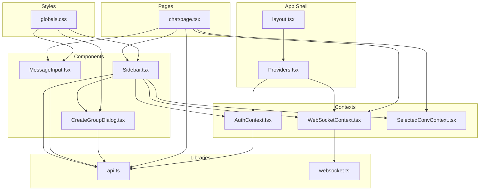
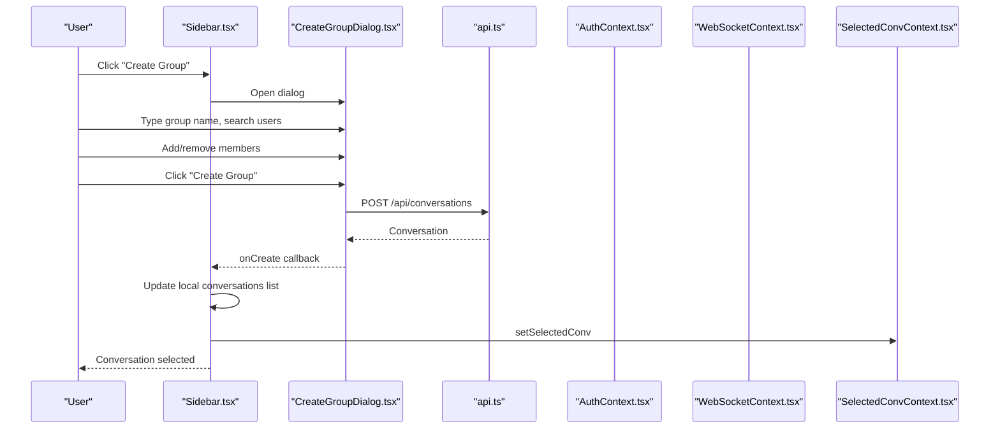
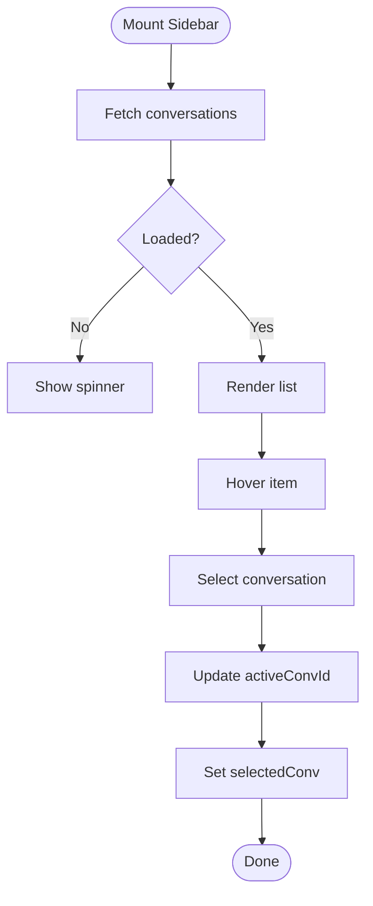
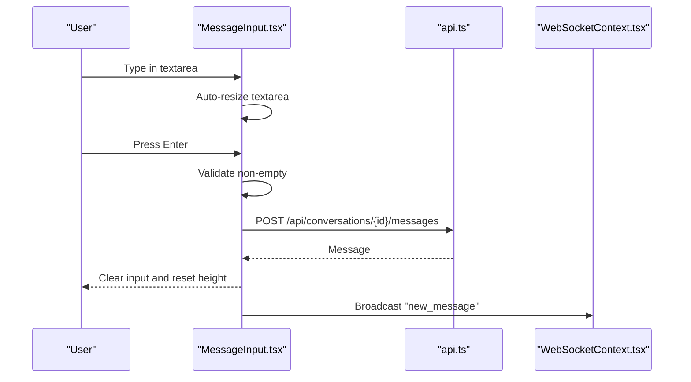
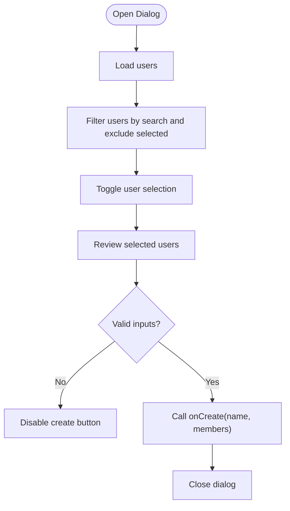
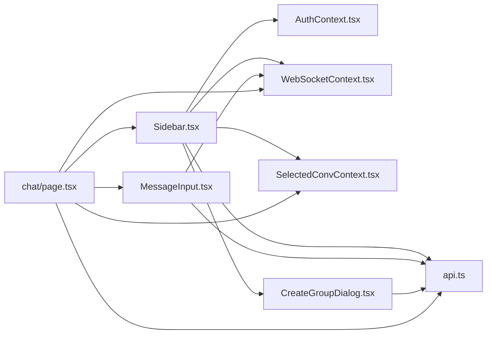

# UI Components

<cite>
**Referenced Files in This Document**
- [Sidebar.tsx](file://frontend/src/components/Sidebar.tsx)
- [MessageInput.tsx](file://frontend/src/components/MessageInput.tsx)
- [CreateGroupDialog.tsx](file://frontend/src/components/CreateGroupDialog.tsx)
- [ChatPage.tsx](file://frontend/src/app/chat/page.tsx)
- [globals.css](file://frontend/src/app/globals.css)
- [api.ts](file://frontend/src/lib/api.ts)
- [websocket.ts](file://frontend/src/lib/websocket.ts)
- [AuthContext.tsx](file://frontend/src/contexts/AuthContext.tsx)
- [WebSocketContext.tsx](file://frontend/src/contexts/WebSocketContext.tsx)
- [SelectedConvContext.tsx](file://frontend/src/contexts/SelectedConvContext.tsx)
- [index.ts](file://frontend/src/types/index.ts)
- [layout.tsx](file://frontend/src/app/layout.tsx)
- [Providers.tsx](file://frontend/src/components/Providers.tsx)
- [package.json](file://frontend/package.json)
</cite>

## Table of Contents
1. [Introduction](#introduction)
2. [Project Structure](#project-structure)
3. [Core Components](#core-components)
4. [Architecture Overview](#architecture-overview)
5. [Detailed Component Analysis](#detailed-component-analysis)
6. [Dependency Analysis](#dependency-analysis)
7. [Performance Considerations](#performance-considerations)
8. [Troubleshooting Guide](#troubleshooting-guide)
9. [Conclusion](#conclusion)
10. [Appendices](#appendices)

## Introduction
This document describes the React UI components that compose the chat application’s front end. It focuses on three primary components: Sidebar, MessageInput, and CreateGroupDialog. For each component, we document visual appearance, behavior, user interaction patterns, props/events, customization options, state management, animations/transitions, responsive design, accessibility, Material-UI theming alignment, cross-browser compatibility, performance optimization, and composition patterns. The goal is to enable developers to integrate, customize, and extend these components effectively.

## Project Structure
The UI components live under the frontend/src/components directory and are integrated into pages via providers and contexts. The global theming and animations are defined in the global CSS, while API and WebSocket clients provide runtime data and real-time updates.

**Diagram sources**
- [layout.tsx:1-38](file://frontend/src/app/layout.tsx#L1-L38)
- [Providers.tsx:1-14](file://frontend/src/components/Providers.tsx#L1-L14)
- [ChatPage.tsx:1-232](file://frontend/src/app/chat/page.tsx#L1-L232)
- [Sidebar.tsx:1-227](file://frontend/src/components/Sidebar.tsx#L1-L227)
- [MessageInput.tsx:1-85](file://frontend/src/components/MessageInput.tsx#L1-L85)
- [CreateGroupDialog.tsx:1-186](file://frontend/src/components/CreateGroupDialog.tsx#L1-L186)
- [AuthContext.tsx:1-95](file://frontend/src/contexts/AuthContext.tsx#L1-L95)
- [WebSocketContext.tsx:1-84](file://frontend/src/contexts/WebSocketContext.tsx#L1-L84)
- [SelectedConvContext.tsx:1-28](file://frontend/src/contexts/SelectedConvContext.tsx#L1-L28)
- [api.ts:1-118](file://frontend/src/lib/api.ts#L1-L118)
- [websocket.ts:1-95](file://frontend/src/lib/websocket.ts#L1-L95)
- [globals.css:1-199](file://frontend/src/app/globals.css#L1-L199)

**Section sources**
- [layout.tsx:1-38](file://frontend/src/app/layout.tsx#L1-L38)
- [Providers.tsx:1-14](file://frontend/src/components/Providers.tsx#L1-L14)
- [ChatPage.tsx:1-232](file://frontend/src/app/chat/page.tsx#L1-L232)

## Core Components
This section introduces the three components and their roles in the application.

- Sidebar: Displays conversations, user presence, search, and group creation dialog trigger. Integrates with authentication, WebSocket presence, and selected conversation context.
- MessageInput: Provides a resizable textarea with Enter-to-send behavior and animated send button.
- CreateGroupDialog: Modal dialog to create groups with user search, selection, and creation flow.

**Section sources**
- [Sidebar.tsx:12-227](file://frontend/src/components/Sidebar.tsx#L12-L227)
- [MessageInput.tsx:10-85](file://frontend/src/components/MessageInput.tsx#L10-L85)
- [CreateGroupDialog.tsx:13-186](file://frontend/src/components/CreateGroupDialog.tsx#L13-L186)

## Architecture Overview
The UI relies on a provider-based architecture:
- Providers.tsx composes AuthProvider and WebSocketProvider.
- Sidebar consumes AuthContext for user data, WebSocketContext for online presence, SelectedConvContext for active conversation, and API client for conversations and group creation.
- ChatPage integrates Sidebar and MessageInput, manages message lifecycle, and subscribes to WebSocket events.
- Global CSS defines theme tokens and animations used across components.

**Diagram sources**
- [Sidebar.tsx:29-44](file://frontend/src/components/Sidebar.tsx#L29-L44)
- [CreateGroupDialog.tsx:58-61](file://frontend/src/components/CreateGroupDialog.tsx#L58-L61)
- [api.ts:78-86](file://frontend/src/lib/api.ts#L78-L86)
- [SelectedConvContext.tsx:16-23](file://frontend/src/contexts/SelectedConvContext.tsx#L16-L23)

## Detailed Component Analysis

### Sidebar
- Purpose: Conversation list panel with search, online indicators, and group creation.
- Props: None (uses context and API internally).
- Events: Triggers conversation selection via SelectedConvContext; opens CreateGroupDialog.
- State:
  - conversations: fetched from API.
  - loading: indicates network activity.
  - showCreateGroup: controls dialog visibility.
  - activeConvId: highlights selected item.
- Interactions:
  - Fetches conversations on mount.
  - Renders skeleton/loading states.
  - Uses Framer Motion for list item entrance.
  - Displays online status badges for private chats.
  - Opens CreateGroupDialog with onCreate callback to create a group and update the list.
- Accessibility:
  - Uses semantic buttons and aria-friendly markup.
  - Focusable elements styled appropriately.
- Theming:
  - Uses CSS variables for colors and gradients.
  - Glass morphism effect via utility class.
- Animations:
  - List items animate in on load.
  - Online dot uses a pulse animation.
- Responsive:
  - Fixed width sidebar with overflow-y scrolling.
- Composition:
  - Composed with CreateGroupDialog and context providers.

**Diagram sources**
- [Sidebar.tsx:21-27](file://frontend/src/components/Sidebar.tsx#L21-L27)
- [Sidebar.tsx:120-186](file://frontend/src/components/Sidebar.tsx#L120-L186)
- [Sidebar.tsx:46-49](file://frontend/src/components/Sidebar.tsx#L46-L49)
- [SelectedConvContext.tsx:16-23](file://frontend/src/contexts/SelectedConvContext.tsx#L16-L23)

**Section sources**
- [Sidebar.tsx:12-227](file://frontend/src/components/Sidebar.tsx#L12-L227)
- [globals.css:67-82](file://frontend/src/app/globals.css#L67-L82)
- [globals.css:102-109](file://frontend/src/app/globals.css#L102-L109)

### MessageInput
- Purpose: Text input area for composing and sending messages.
- Props:
  - onSend: Callback invoked with trimmed message content when sending.
- State:
  - content: controlled textarea value.
  - inputRef: auto-resize textarea.
- Interactions:
  - Auto-resize textarea up to a max height.
  - Enter key sends (Shift+Enter for newline).
  - Disabled send button when empty.
  - Animated send button with hover/tap scaling.
- Accessibility:
  - Proper placeholder and focus styles.
  - Disabled state communicated visually.
- Theming:
  - Uses CSS variables for backgrounds, borders, and text.
- Animations:
  - Send button scales on hover/tap.
- Responsive:
  - Flexible width container; fixed button size.
- Composition:
  - Used by ChatPage; integrates with API and WebSocket.

**Diagram sources**
- [MessageInput.tsx:18-32](file://frontend/src/components/MessageInput.tsx#L18-L32)
- [MessageInput.tsx:60-80](file://frontend/src/components/MessageInput.tsx#L60-L80)
- [api.ts:109-113](file://frontend/src/lib/api.ts#L109-L113)
- [ChatPage.tsx:77-82](file://frontend/src/app/chat/page.tsx#L77-L82)

**Section sources**
- [MessageInput.tsx:10-85](file://frontend/src/components/MessageInput.tsx#L10-L85)
- [globals.css:67-82](file://frontend/src/app/globals.css#L67-L82)

### CreateGroupDialog
- Purpose: Modal dialog to create a group conversation.
- Props:
  - onClose: Called when dialog closes (e.g., cancel or click outside).
  - onCreate: Called with group name and member IDs when confirmed.
- State:
  - groupName: group name input.
  - searchTerm: user search filter.
  - users: fetched user list.
  - selectedUsers: Set of selected user IDs.
  - loading: indicates user list fetch.
  - dialogRef: click-outside detection.
- Interactions:
  - Fetches users on mount.
  - Filters users by search term and excludes selected users.
  - Toggles user selection; displays selected chips with remove button.
  - Creates group via API and invokes onCreate.
  - Closes dialog on successful creation or cancel.
  - Click outside to close.
- Accessibility:
  - Focus trap via click-outside detection.
  - Disabled states when invalid.
- Theming:
  - Uses CSS variables for surfaces and borders.
- Animations:
  - Modal fades and scales in/out.
- Responsive:
  - Max-width constrained modal; scrollable user list.

**Diagram sources**
- [CreateGroupDialog.tsx:24-30](file://frontend/src/components/CreateGroupDialog.tsx#L24-L30)
- [CreateGroupDialog.tsx:63-67](file://frontend/src/components/CreateGroupDialog.tsx#L63-L67)
- [CreateGroupDialog.tsx:46-56](file://frontend/src/components/CreateGroupDialog.tsx#L46-L56)
- [CreateGroupDialog.tsx:58-61](file://frontend/src/components/CreateGroupDialog.tsx#L58-L61)

**Section sources**
- [CreateGroupDialog.tsx:13-186](file://frontend/src/components/CreateGroupDialog.tsx#L13-L186)
- [globals.css:67-82](file://frontend/src/app/globals.css#L67-L82)

## Dependency Analysis
- Sidebar depends on:
  - AuthContext (user, logout).
  - WebSocketContext (onlineUsers, isConnected).
  - SelectedConvContext (setSelectedConv).
  - API client (conversations, createConversation).
  - CreateGroupDialog (composition).
- MessageInput depends on:
  - API client (sendMessage).
  - WebSocketContext (broadcast).
- CreateGroupDialog depends on:
  - API client (users, createConversation).
- ChatPage orchestrates:
  - SelectedConvContext (selected conversation).
  - WebSocketContext (subscribe, onlineUsers).
  - API client (messages, send).
  - MessageInput (onSend handler).

**Diagram sources**
- [Sidebar.tsx:3-9](file://frontend/src/components/Sidebar.tsx#L3-L9)
- [MessageInput.tsx:3-4](file://frontend/src/components/MessageInput.tsx#L3-L4)
- [CreateGroupDialog.tsx:3-6](file://frontend/src/components/CreateGroupDialog.tsx#L3-L6)
- [ChatPage.tsx:3-9](file://frontend/src/app/chat/page.tsx#L3-L9)

**Section sources**
- [Sidebar.tsx:3-9](file://frontend/src/components/Sidebar.tsx#L3-L9)
- [MessageInput.tsx:3-4](file://frontend/src/components/MessageInput.tsx#L3-L4)
- [CreateGroupDialog.tsx:3-6](file://frontend/src/components/CreateGroupDialog.tsx#L3-L6)
- [ChatPage.tsx:3-9](file://frontend/src/app/chat/page.tsx#L3-L9)

## Performance Considerations
- Virtualization: Consider virtualizing long conversation lists and message feeds for large datasets.
- Debounced search: Debounce user search input in dialogs to reduce re-renders.
- Memoization: Use memoized callbacks for event handlers to prevent unnecessary re-renders.
- Lazy loading: Lazy-load images/avatar placeholders if used later.
- Animation throttling: Respect reduced-motion preferences via CSS media queries.
- Network batching: Batch WebSocket messages when sending multiple actions rapidly.
- CSS isolation: Keep animations scoped to minimize layout thrashing.

[No sources needed since this section provides general guidance]

## Troubleshooting Guide
- Authentication issues:
  - Ensure tokens are present and valid; handle token refresh if needed.
  - Verify API base URL and CORS configuration.
- WebSocket connectivity:
  - Confirm connection lifecycle and reconnection logic.
  - Validate message parsing and dispatch.
- UI responsiveness:
  - Check CSS variables availability and fallbacks.
  - Ensure animations do not conflict with reduced-motion settings.
- Dialog interactions:
  - Verify click-outside detection and focus management.
  - Confirm form validation prevents empty submissions.

**Section sources**
- [AuthContext.tsx:32-42](file://frontend/src/contexts/AuthContext.tsx#L32-L42)
- [WebSocketContext.tsx:33-55](file://frontend/src/contexts/WebSocketContext.tsx#L33-L55)
- [websocket.ts:19-51](file://frontend/src/lib/websocket.ts#L19-L51)
- [CreateGroupDialog.tsx:32-44](file://frontend/src/components/CreateGroupDialog.tsx#L32-L44)

## Conclusion
The UI components are designed around a cohesive provider and context architecture, enabling clean separation of concerns and reusable interactions. Sidebar, MessageInput, and CreateGroupDialog leverage CSS variables for theming, Framer Motion for subtle animations, and context providers for state sharing. By following the patterns documented here—prop contracts, state management, accessibility, and performance—you can extend and customize the UI effectively.

[No sources needed since this section summarizes without analyzing specific files]

## Appendices

### TypeScript Interfaces
- User: [index.ts:1-8](file://frontend/src/types/index.ts#L1-L8)
- Conversation: [index.ts:21-31](file://frontend/src/types/index.ts#L21-L31)
- ConversationMember: [index.ts:33-38](file://frontend/src/types/index.ts#L33-L38)
- Message: [index.ts:40-49](file://frontend/src/types/index.ts#L40-L49)
- WSMessage: [index.ts:58-71](file://frontend/src/types/index.ts#L58-L71)

**Section sources**
- [index.ts:1-72](file://frontend/src/types/index.ts#L1-L72)

### Theming and Tokens
- CSS variables define primary/accent surfaces, borders, and statuses.
- Glass morphism and glow utilities enhance depth.
- Scrollbar styling and reduced-motion support included.

**Section sources**
- [globals.css:3-25](file://frontend/src/app/globals.css#L3-L25)
- [globals.css:67-82](file://frontend/src/app/globals.css#L67-L82)
- [globals.css:191-198](file://frontend/src/app/globals.css#L191-L198)

### Cross-Browser Compatibility
- Next.js and TailwindCSS provide broad browser coverage.
- CSS variables and backdrop-filter are widely supported with vendor prefixes in Tailwind.
- Framer Motion animations rely on Web Animations and transforms.

**Section sources**
- [package.json:12-17](file://frontend/package.json#L12-L17)
- [globals.css:67-73](file://frontend/src/app/globals.css#L67-L73)

### Component Composition Patterns
- Provider-first architecture ensures components remain stateless and testable.
- Event-driven patterns via WebSocket subscriptions decouple UI from data sources.
- Controlled components (MessageInput) centralize validation and normalization.

**Section sources**
- [Providers.tsx:7-13](file://frontend/src/components/Providers.tsx#L7-L13)
- [ChatPage.tsx:31-51](file://frontend/src/app/chat/page.tsx#L31-L51)
- [MessageInput.tsx:10-85](file://frontend/src/components/MessageInput.tsx#L10-L85)