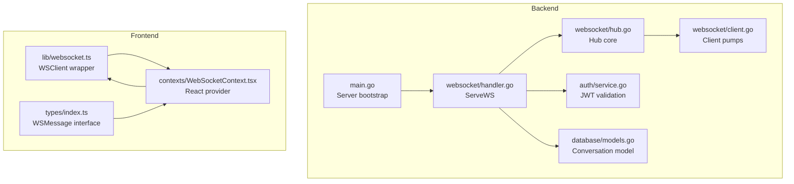
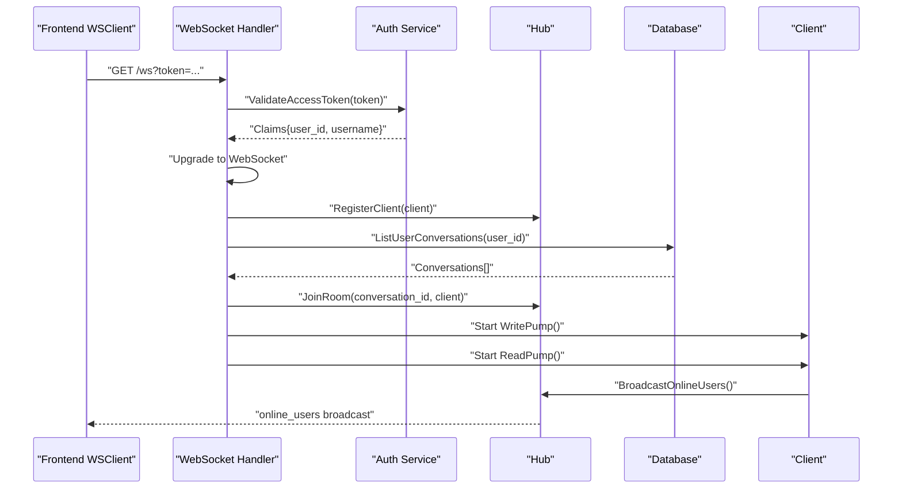
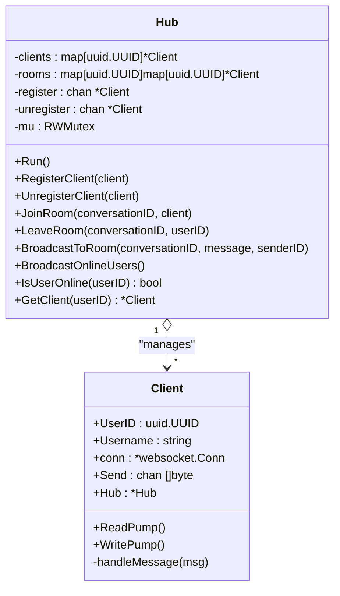
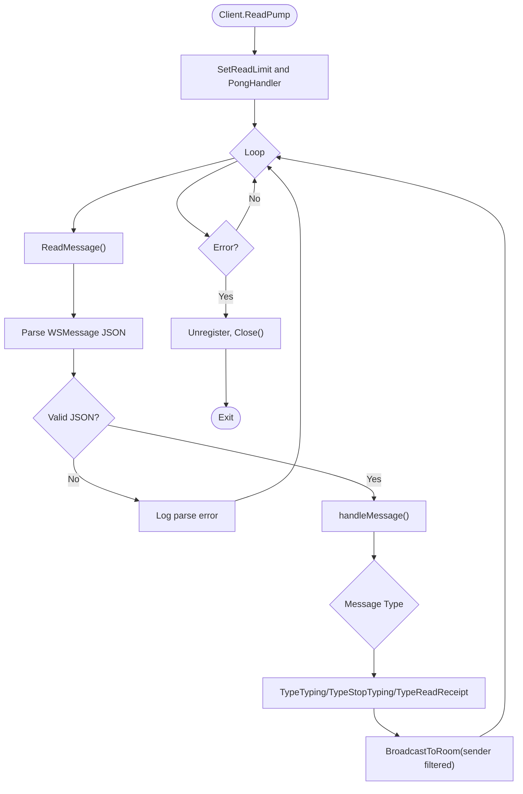
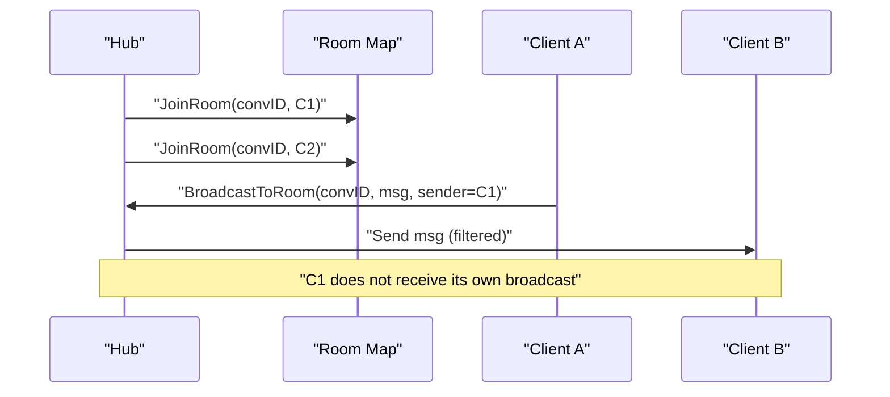
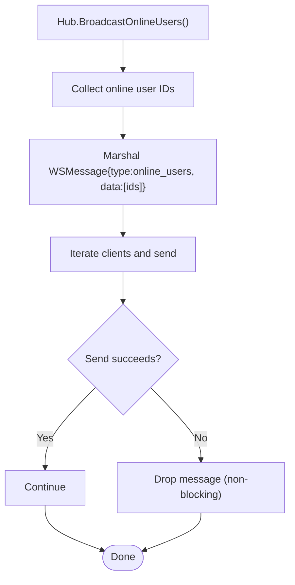
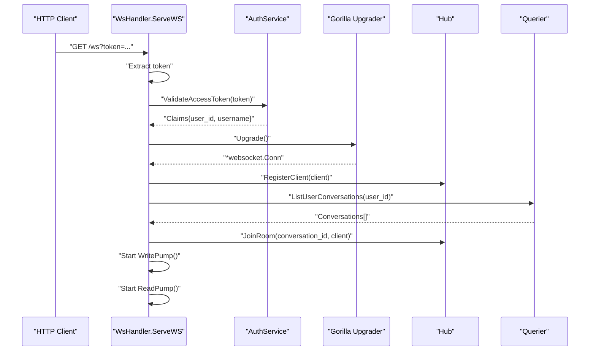
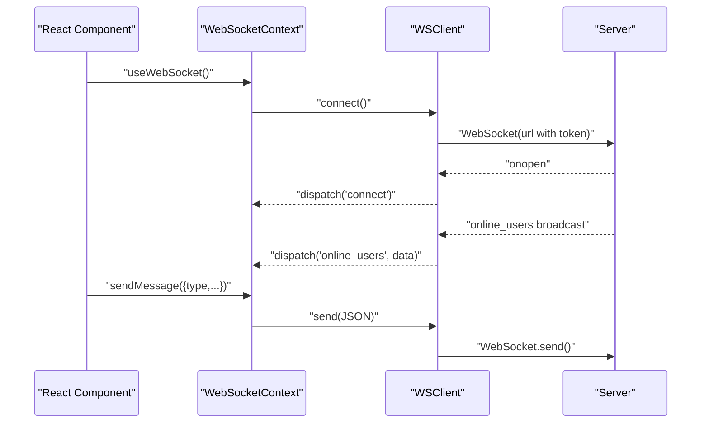
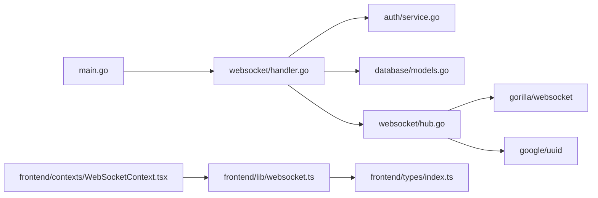

# WebSocket Implementation

<cite>
**Referenced Files in This Document**
- [main.go](file://backend/cmd/server/main.go)
- [hub.go](file://backend/internal/websocket/hub.go)
- [client.go](file://backend/internal/websocket/client.go)
- [handler.go](file://backend/internal/websocket/handler.go)
- [service.go](file://backend/internal/auth/service.go)
- [handler.go](file://backend/internal/auth/handler.go)
- [models.go](file://backend/internal/database/models.go)
- [websocket.ts](file://frontend/src/lib/websocket.ts)
- [WebSocketContext.tsx](file://frontend/src/contexts/WebSocketContext.tsx)
- [index.ts](file://frontend/src/types/index.ts)
- [websocket_hub_test.go](file://backend/tests/websocket_hub_test.go)
</cite>

## Table of Contents
1. [Introduction](#introduction)
2. [Project Structure](#project-structure)
3. [Core Components](#core-components)
4. [Architecture Overview](#architecture-overview)
5. [Detailed Component Analysis](#detailed-component-analysis)
6. [Dependency Analysis](#dependency-analysis)
7. [Performance Considerations](#performance-considerations)
8. [Security and Validation](#security-and-validation)
9. [Troubleshooting Guide](#troubleshooting-guide)
10. [Conclusion](#conclusion)

## Introduction
This document provides comprehensive documentation for the WebSocket implementation in the Go-Chatsync project. It covers the hub architecture with client registration, message routing, and connection lifecycle management. It documents the WebSocket handler implementation, including connection upgrade, message parsing, and error handling. It explains client management patterns, room-based message distribution, and real-time broadcasting mechanisms. The document includes concrete examples for message types (private, group, system), connection establishment, and graceful disconnection handling. It also addresses performance considerations, memory management, scalability implications, security features, input validation, resource protection, and troubleshooting guidance.

## Project Structure
The WebSocket implementation spans backend and frontend components:
- Backend: WebSocket hub, client management, and HTTP handler for connection upgrade
- Frontend: WebSocket client wrapper with reconnection logic and event handling
- Authentication: JWT-based access token validation for secure connections
- Database: Conversation membership queries to subscribe users to rooms upon connection

**Diagram sources**
- [main.go:26-148](file://backend/cmd/server/main.go#L26-L148)
- [handler.go:25-74](file://backend/internal/websocket/handler.go#L25-L74)
- [hub.go:47-170](file://backend/internal/websocket/hub.go#L47-L170)
- [client.go:26-125](file://backend/internal/websocket/client.go#L26-L125)
- [service.go:75-93](file://backend/internal/auth/service.go#L75-L93)
- [models.go:24-31](file://backend/internal/database/models.go#L24-L31)
- [websocket.ts:1-95](file://frontend/src/lib/websocket.ts#L1-L95)
- [WebSocketContext.tsx:27-84](file://frontend/src/contexts/WebSocketContext.tsx#L27-L84)
- [index.ts:58-71](file://frontend/src/types/index.ts#L58-L71)

**Section sources**
- [main.go:26-148](file://backend/cmd/server/main.go#L26-L148)
- [handler.go:25-74](file://backend/internal/websocket/handler.go#L25-L74)
- [hub.go:47-170](file://backend/internal/websocket/hub.go#L47-L170)
- [client.go:26-125](file://backend/internal/websocket/client.go#L26-L125)
- [service.go:75-93](file://backend/internal/auth/service.go#L75-L93)
- [models.go:24-31](file://backend/internal/database/models.go#L24-L31)
- [websocket.ts:1-95](file://frontend/src/lib/websocket.ts#L1-L95)
- [WebSocketContext.tsx:27-84](file://frontend/src/contexts/WebSocketContext.tsx#L27-L84)
- [index.ts:58-71](file://frontend/src/types/index.ts#L58-L71)

## Core Components
- Hub: Central coordinator managing connected clients and rooms, broadcasting online users, and routing messages to rooms.
- Client: Encapsulates a single WebSocket connection with read/write pumps, ping/pong handling, and message dispatching.
- WebSocket Handler: Validates access tokens, upgrades HTTP connections to WebSocket, creates client instances, registers them, subscribes to user conversations, and starts pump goroutines.
- Authentication Service: Validates JWT access tokens and extracts user identity for secure connection establishment.
- Frontend WSClient: Provides a robust WebSocket client wrapper with automatic reconnection, message parsing, and event subscription.

Key WebSocket message types and payload fields are defined in the shared types and hub structures.

**Section sources**
- [hub.go:11-36](file://backend/internal/websocket/hub.go#L11-L36)
- [hub.go:47-170](file://backend/internal/websocket/hub.go#L47-L170)
- [client.go:26-125](file://backend/internal/websocket/client.go#L26-L125)
- [handler.go:25-74](file://backend/internal/websocket/handler.go#L25-L74)
- [service.go:75-93](file://backend/internal/auth/service.go#L75-L93)
- [websocket.ts:1-95](file://frontend/src/lib/websocket.ts#L1-L95)

## Architecture Overview
The WebSocket architecture follows a hub-and-spoke model:
- Server bootstraps the hub and registers the WebSocket endpoint.
- Clients connect with a valid access token; the server validates the token and upgrades the connection.
- Upon successful upgrade, the server registers the client, subscribes them to their conversations (rooms), and starts read/write pumps.
- The hub manages client presence and room memberships, broadcasting online users and forwarding messages to rooms while filtering out the sender.

**Diagram sources**
- [main.go:113-114](file://backend/cmd/server/main.go#L113-L114)
- [handler.go:25-74](file://backend/internal/websocket/handler.go#L25-L74)
- [service.go:75-93](file://backend/internal/auth/service.go#L75-L93)
- [hub.go:65-111](file://backend/internal/websocket/hub.go#L65-L111)
- [client.go:26-85](file://backend/internal/websocket/client.go#L26-L85)

## Detailed Component Analysis

### Hub Architecture
The hub maintains:
- A map of connected clients keyed by user ID
- A map of rooms keyed by conversation ID, containing client maps
- Channels for registering/unregistering clients
- A mutex for concurrent access

Core operations:
- Registration/unregistration updates client presence and broadcasts online users
- Room join/leave maintains conversation subscriptions
- Broadcasting to room filters out the sender
- Online user broadcasting enumerates current clients

**Diagram sources**
- [hub.go:47-170](file://backend/internal/websocket/hub.go#L47-L170)
- [client.go:26-125](file://backend/internal/websocket/client.go#L26-L125)

**Section sources**
- [hub.go:47-170](file://backend/internal/websocket/hub.go#L47-L170)

### Client Management Patterns
- ReadPump: Handles incoming messages, enforces message size limits, sets pong deadline, and parses JSON messages. Dispatches to message handlers and logs unexpected errors.
- WritePump: Manages outgoing messages, pings periodically, and handles write deadlines.
- Ping/Pong: Implements keepalive with configurable timeouts and periods.
- Message dispatch: Routes typing, stop_typing, and read_receipt events to rooms.

**Diagram sources**
- [client.go:26-110](file://backend/internal/websocket/client.go#L26-L110)
- [hub.go:143-156](file://backend/internal/websocket/hub.go#L143-L156)

**Section sources**
- [client.go:26-110](file://backend/internal/websocket/client.go#L26-L110)

### Room-Based Message Distribution
- On connection, the server subscribes the client to all their conversations by joining rooms.
- Broadcasting to a room sends the message to all clients except the sender.
- Room removal occurs on leave or when the last client leaves, cleaning up empty rooms.

**Diagram sources**
- [handler.go:63-73](file://backend/internal/websocket/handler.go#L63-L73)
- [hub.go:121-156](file://backend/internal/websocket/hub.go#L121-L156)

**Section sources**
- [handler.go:63-73](file://backend/internal/websocket/handler.go#L63-L73)
- [hub.go:121-156](file://backend/internal/websocket/hub.go#L121-L156)

### Real-Time Broadcasting Mechanisms
- Online users broadcast: The hub enumerates online users and sends an online_users message to all clients.
- Room broadcasts: Messages are forwarded to all room members except the sender.
- Buffered channels: Client Send channels prevent blocking and protect against slow consumers.

**Diagram sources**
- [hub.go:89-111](file://backend/internal/websocket/hub.go#L89-L111)

**Section sources**
- [hub.go:89-111](file://backend/internal/websocket/hub.go#L89-L111)

### WebSocket Handler Implementation
- Token validation: Extracts token from query string and validates via JWT service.
- Connection upgrade: Uses Gorilla WebSocket upgrader with permissive origin policy.
- Client creation: Builds client with buffered send channel and assigns hub.
- Subscription: Fetches user conversations and joins rooms.
- Pump goroutines: Starts read and write pumps concurrently.

**Diagram sources**
- [handler.go:25-74](file://backend/internal/websocket/handler.go#L25-L74)
- [service.go:75-93](file://backend/internal/auth/service.go#L75-L93)

**Section sources**
- [handler.go:25-74](file://backend/internal/websocket/handler.go#L25-L74)
- [service.go:75-93](file://backend/internal/auth/service.go#L75-L93)

### Frontend WebSocket Integration
- WSClient: Establishes WebSocket connection with token query parameter, handles open/close/reconnect, parses messages, and dispatches events.
- WebSocketContext: React provider that initializes WSClient, tracks connection state, and exposes online users and messaging helpers.
- Types: Shared WSMessage interface ensures consistent message shape across frontend and backend.

**Diagram sources**
- [WebSocketContext.tsx:27-84](file://frontend/src/contexts/WebSocketContext.tsx#L27-L84)
- [websocket.ts:19-85](file://frontend/src/lib/websocket.ts#L19-L85)
- [index.ts:58-71](file://frontend/src/types/index.ts#L58-L71)

**Section sources**
- [WebSocketContext.tsx:27-84](file://frontend/src/contexts/WebSocketContext.tsx#L27-L84)
- [websocket.ts:19-85](file://frontend/src/lib/websocket.ts#L19-L85)
- [index.ts:58-71](file://frontend/src/types/index.ts#L58-L71)

## Dependency Analysis
- Server bootstrap wires the hub, handler, and routes.
- WebSocket handler depends on authentication service and database querier.
- Hub depends on Gorilla WebSocket and UUID libraries.
- Frontend depends on local storage for tokens and React context for state.

**Diagram sources**
- [main.go:52-55](file://backend/cmd/server/main.go#L52-L55)
- [handler.go:11-23](file://backend/internal/websocket/handler.go#L11-L23)
- [service.go:11-15](file://backend/internal/auth/service.go#L11-L15)
- [models.go:7-12](file://backend/internal/database/models.go#L7-L12)
- [hub.go:3-9](file://backend/internal/websocket/hub.go#L3-L9)
- [websocket.ts:1-11](file://frontend/src/lib/websocket.ts#L1-L11)
- [index.ts:1-8](file://frontend/src/types/index.ts#L1-L8)

**Section sources**
- [main.go:52-55](file://backend/cmd/server/main.go#L52-L55)
- [handler.go:11-23](file://backend/internal/websocket/handler.go#L11-L23)
- [service.go:11-15](file://backend/internal/auth/service.go#L11-L15)
- [models.go:7-12](file://backend/internal/database/models.go#L7-L12)
- [hub.go:3-9](file://backend/internal/websocket/hub.go#L3-L9)
- [websocket.ts:1-11](file://frontend/src/lib/websocket.ts#L1-L11)
- [index.ts:1-8](file://frontend/src/types/index.ts#L1-L8)

## Performance Considerations
- Channel buffering: Client send channels are buffered to prevent blocking under bursty loads.
- Non-blocking sends: Hub uses select with default cases to drop messages to slow clients, preventing deadlocks.
- Read limits: Enforced maximum message size prevents memory exhaustion from oversized frames.
- Keepalive: Ping/pong cycles detect dead peers promptly, reducing resource leaks.
- Room enumeration: Broadcasting iterates over room members; ensure conversation sizes remain reasonable.
- Concurrency: Hub.Run runs in a dedicated goroutine; client pumps run concurrently to minimize latency.

[No sources needed since this section provides general guidance]

## Security and Validation
- Access token requirement: Connections require a valid access token passed as a query parameter.
- JWT validation: Server validates token signature and claims before upgrading.
- Origin policy: Upgrader allows any origin; production deployments should tighten CORS and origin checks.
- Input validation: JSON parsing errors are logged; malformed messages are ignored to prevent crashes.
- Resource protection: Read limits and write deadlines protect against slowlorises and memory exhaustion.

**Section sources**
- [handler.go:25-42](file://backend/internal/websocket/handler.go#L25-L42)
- [service.go:75-93](file://backend/internal/auth/service.go#L75-L93)
- [client.go:20-24](file://backend/internal/websocket/client.go#L20-L24)
- [client.go:32-37](file://backend/internal/websocket/client.go#L32-L37)

## Troubleshooting Guide
Common issues and resolutions:
- Missing token: Server responds with unauthorized when token is absent.
- Invalid token: Server rejects connections with invalid or expired tokens.
- Connection upgrade failures: Check network connectivity and CORS settings.
- Frequent disconnects: Verify ping/pong intervals and client reconnection logic.
- No room messages: Ensure user belongs to the conversation and hub.JoinRoom was called.
- Slow clients: Buffered channels mitigate backpressure; consider client-side rate limiting.

Validation and tests:
- Unit tests cover client registration, room join/leave, online presence, and duplicate registration scenarios.

**Section sources**
- [handler.go:25-42](file://backend/internal/websocket/handler.go#L25-L42)
- [websocket_hub_test.go:23-50](file://backend/tests/websocket_hub_test.go#L23-L50)
- [websocket_hub_test.go:52-85](file://backend/tests/websocket_hub_test.go#L52-L85)
- [websocket_hub_test.go:87-138](file://backend/tests/websocket_hub_test.go#L87-L138)
- [websocket_hub_test.go:140-171](file://backend/tests/websocket_hub_test.go#L140-L171)
- [websocket_hub_test.go:173-216](file://backend/tests/websocket_hub_test.go#L173-L216)

## Conclusion
The WebSocket implementation provides a robust, scalable foundation for real-time chat:
- The hub efficiently manages client presence and room-based broadcasting.
- The handler secures connections with JWT validation and subscribes users to conversations.
- The frontend offers a resilient client with automatic reconnection and typed message handling.
- Security and performance are addressed through validated inputs, read limits, keepalive, and non-blocking sends.
- Extending to support additional message types (e.g., new_message) would follow the established patterns of parsing, dispatching, and room broadcasting.