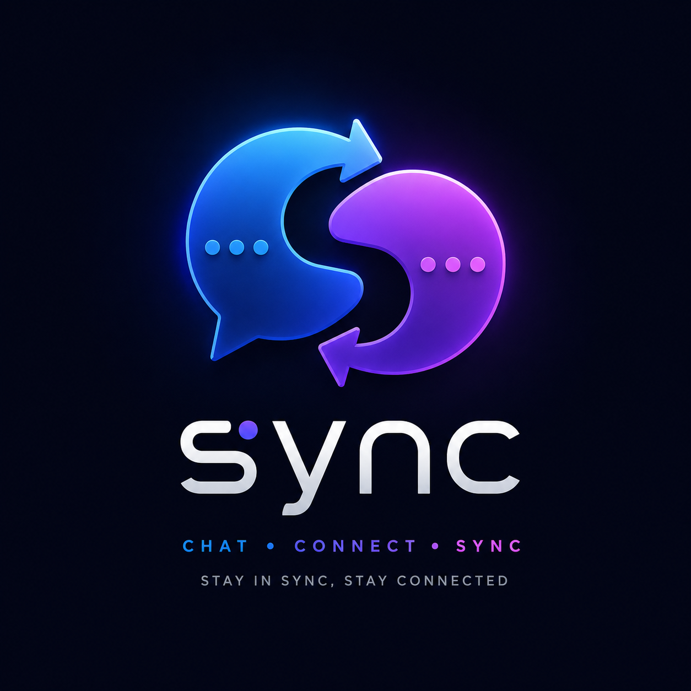
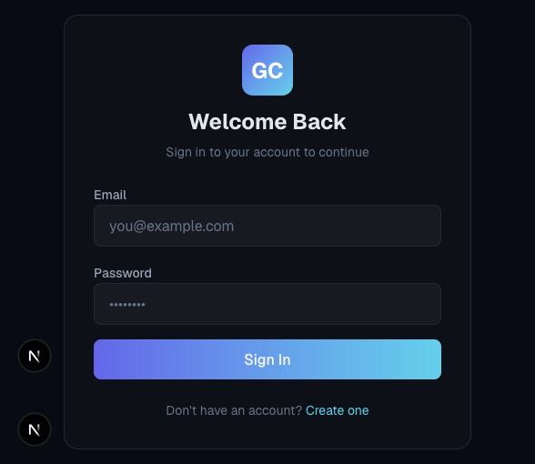

# sync



A real-time communication platform built with **Go** (backend) and **Next.js** (frontend), featuring private messaging, group chat, JWT authentication, and WebSocket-based real-time synchronization.



## Architecture

```
┌─────────────────────┐      ┌──────────────────────────────┐
│   Next.js Frontend  │      │       Go Backend (:8080)     │
│                     │      │                              │
│  ┌───────────────┐  │ HTTP │  ┌────────────────────────┐  │
│  │  Auth Pages   │──┼──────┼─▶│  Chi Router (REST API) │  │
│  │  (Login/Reg)  │  │      │  └─────────┬──────────────┘  │
│  └───────────────┘  │      │            │                 │
│  ┌───────────────┐  │      │  ┌─────────▼──────────────┐  │
│  │  Chat Dashboard│  │      │  │  Auth Middleware       │  │
│  │  (Messages)    │  │      │  └─────────┬──────────────┘  │
│  └───────────────┘  │      │            │                 │
│  ┌───────────────┐  │ WS   │  ┌─────────▼──────────────┐  │
│  │ WebSocket     │──┼──────┼─▶│  WebSocket Hub         │  │
│  │ Client        │  │      │  │  (Real-time Messaging) │  │
│  └───────────────┘  │      │  └────────────────────────┘  │
│                     │      │                              │
│  Port: 3000         │      │  ┌────────────────────────┐  │
└─────────────────────┘      │  │  PostgreSQL (GORM)     │  │
                              │  │  sync DB       │  │
                              │  └────────────────────────┘  │
                              │                              │
                              │  ┌────────────────────────┐  │
                              │  │  Swagger Docs          │  │
                              │  │  /swagger/index.html   │  │
                              │  └────────────────────────┘  │
                              └──────────────────────────────┘
```

## Demo

> Screenshots coming soon — showing the updated sync UI.

## Features

- **Real-time messaging** via WebSocket with room-based broadcasting
- **Private messaging** between users
- **Group chat** with member management
- **JWT authentication** with access and refresh tokens
- **User presence** tracking (online/offline status)
- **Typing indicators** and read receipts
- **Cursor-based pagination** for message history
- **RESTful API** with Swagger documentation
- **Modern UI** with dark theme, glass morphism, and animations

## Tech Stack

### Backend
- **Language:** Go 1.23
- **Router:** chi/v5
- **Database:** PostgreSQL with GORM
- **ORM:** GORM (AutoMigrate + Repository pattern)
- **Auth:** golang-jwt/v5 + bcrypt
- **WebSocket:** gorilla/websocket
- **API Docs:** swaggo/swagger

### Frontend
- **Framework:** Next.js 16 (App Router)
- **Language:** TypeScript 5
- **Styling:** Tailwind CSS 4
- **Animations:** Framer Motion 12
- **Testing:** Vitest 4

## Project Structure

```
├── backend/                      # Go backend
│   ├── cmd/server/main.go        # Entry point
│   ├── internal/
│   │   ├── auth/                 # Authentication (JWT, register, login)
│   │   │   ├── handler.go        # HTTP handlers
│   │   │   ├── service.go       # JWT token service
│   │   │   └── types.go         # Request/response structs
│   │   ├── config/               # Configuration
│   │   ├── conversations/        # Conversation management
│   │   │   ├── handler.go
│   │   │   └── types.go
│   │   ├── database/             # Database connection & pooling
│   │   │   └── pool.go          # GORM connection pool & AutoMigrate
│   │   ├── models/               # GORM model definitions
│   │   │   ├── user.go
│   │   │   ├── conversation.go
│   │   │   ├── message.go
│   │   │   ├── notification.go
│   │   │   └── session.go
│   │   ├── repository/           # Repository pattern interfaces
│   │   │   ├── repositories.go  # Combined Repositories struct
│   │   │   ├── user_repo.go
│   │   │   ├── conversation_repo.go
│   │   │   ├── message_repo.go
│   │   │   ├── notification_repo.go
│   │   │   └── session_repo.go
│   │   ├── messages/            # Message handling
│   │   │   ├── handler.go
│   │   │   └── types.go
│   │   ├── middleware/           # Auth middleware
│   │   │   ├── auth.go
│   │   │   └── types.go
│   │   ├── users/               # User management
│   │   │   ├── handler.go
│   │   │   └── types.go
│   │   └── websocket/           # WebSocket hub & client
│   │       ├── client.go        # Client read/write pumps
│   │       ├── handler.go       # WS upgrade handler
│   │       ├── hub.go           # Hub methods
│   │       └── types.go         # WS message & hub structs
│   ├── docs/
│   │   ├── swagger/             # Generated swagger docs
│   │   └── docs.go              # Swagger meta annotations
│   ├── tests/                   # Backend tests (30+ tests)
├── frontend/                    # Next.js frontend
│   ├── src/
│   │   ├── app/                 # App Router pages
│   │   │   ├── login/          # Login page
│   │   │   ├── register/       # Register page
│   │   │   └── chat/           # Chat dashboard
│   │   ├── components/         # React components
│   │   ├── contexts/           # Auth, WebSocket, SelectedConv
│   │   └── lib/                # API client, WebSocket client
│   ├── tests/                  # Frontend tests (11+ tests)
│   └── package.json
├── screenshots/                # Application screenshots
├── run.sh                      # Backend build & run script
```

## Getting Started

### Prerequisites

- Go 1.23 or later
- Node.js 18 or later
- npm or yarn
- PostgreSQL 16+ *(optional — use Docker Compose instead)*
- Docker & Docker Compose *(recommended for easy setup)*

### Docker (Recommended)

The fastest way to run the full stack:

```bash
# Start all services (PostgreSQL + backend + frontend)
docker compose up -d

# View logs
docker compose logs -f

# Stop everything
docker compose down
```

Services:
| Service | URL |
|---------|-----|
| Frontend | http://localhost:3000 |
| Backend API | http://localhost:8080 |
| Swagger Docs | http://localhost:8080/swagger/index.html |
| WebSocket | ws://localhost:8080/ws |

### Manual Setup

### Database Setup

1. Ensure PostgreSQL is running on `localhost:5432`
2. Create the database:
   ```bash
   createdb -U postgres sync
   ```
3. The application auto-applies migrations on startup

### Backend

```bash
# Start the backend server (auto-migrates DB)
cd backend
go run ./cmd/server
```

The backend starts on `http://localhost:8080` with:
- **REST API:** `http://localhost:8080`
- **WebSocket:** `ws://localhost:8080/ws`
- **Swagger Docs:** `http://localhost:8080/swagger/index.html`

### Frontend

```bash
cd frontend
npm install
npm run dev
```

The frontend starts on `http://localhost:3000`.

### Running Tests

```bash
# Backend tests (30+ tests)
cd backend && go test ./tests/... -v

# Frontend tests (11+ tests)
cd frontend && npm test

# Backend tests via Docker Compose (starts fresh PostgreSQL)
docker compose run --rm test
```

## API Documentation

Full interactive API documentation is available at `/swagger/index.html` when the backend is running.

### Endpoints

#### Authentication (Public)
| Method | Endpoint | Description |
|--------|----------|-------------|
| POST | `/api/auth/register` | Create a new account |
| POST | `/api/auth/login` | Login with credentials |
| POST | `/api/auth/refresh` | Refresh access token |

#### Authentication (Protected)
| Method | Endpoint | Description |
|--------|----------|-------------|
| POST | `/api/auth/logout` | Logout and invalidate sessions |
| GET | `/api/auth/me` | Get current user profile |

#### Users
| Method | Endpoint | Description |
|--------|----------|-------------|
| GET | `/api/users` | List all users |
| GET | `/api/users/{id}` | Get user by ID |
| PUT | `/api/users/me` | Update own profile |

#### Conversations
| Method | Endpoint | Description |
|--------|----------|-------------|
| GET | `/api/conversations` | List user conversations |
| POST | `/api/conversations` | Create conversation |
| GET | `/api/conversations/{id}` | Get conversation details |
| POST | `/api/conversations/{id}/members` | Add member |
| DELETE | `/api/conversations/{id}/members/{userId}` | Remove member |

#### Messages
| Method | Endpoint | Description |
|--------|----------|-------------|
| GET | `/api/conversations/{id}/messages` | List messages (paginated) |
| POST | `/api/conversations/{id}/messages` | Send message |
| DELETE | `/api/messages/{id}` | Delete message |

### WebSocket Events

Connect via `ws://localhost:8080/ws?token={jwt_token}`

| Event Type | Direction | Description |
|-----------|-----------|-------------|
| `new_message` | Server→Client | New message in conversation |
| `typing` | Client↔Server | User is typing |
| `stop_typing` | Client↔Server | User stopped typing |
| `read_receipt` | Client↔Server | Message read acknowledgement |
| `presence` | Server→Client | User presence update |
| `online_users` | Server→Client | List of online user IDs |

## Design Decisions

### Struct/Function Separation
- Application structs (request/response types) are kept in `types.go` files
- Handler functions and business logic are in `handler.go` files
- GORM model definitions are in `internal/models/`
- DB models are never mixed with application-level response structs

### Database Layer
- GORM handles schema migrations via `AutoMigrate()`
- Repository pattern abstracts database operations behind interfaces
- Connection pooling via GORM with 25 max connections
- All models use UUID primary keys with `gen_random_uuid()` default

### Testing
- Backend: Go standard `testing` package with table-driven tests
- Repository interfaces are mocked for unit tests
- Backend E2E: testcontainers-go for disposable PostgreSQL (or manual `TEST_DATABASE_URL`)
- Frontend: Vitest with jsdom for component testing
- Full-stack E2E: Playwright for browser-level testing

## License

MIT
